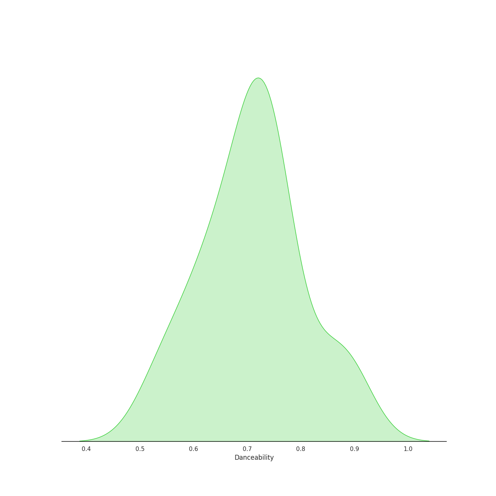
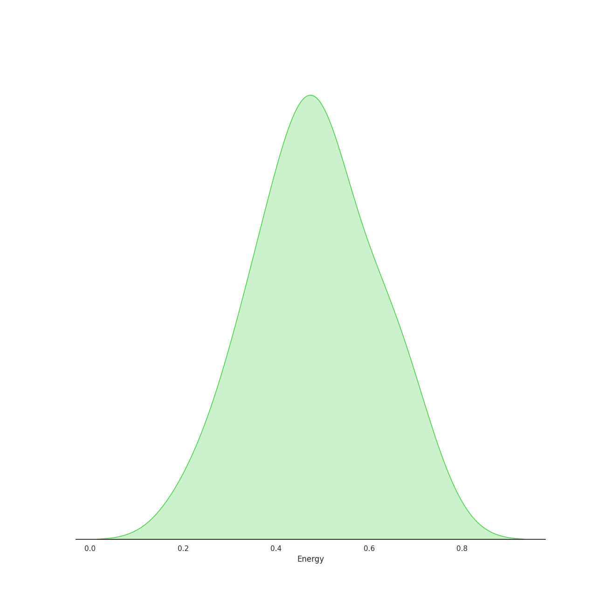
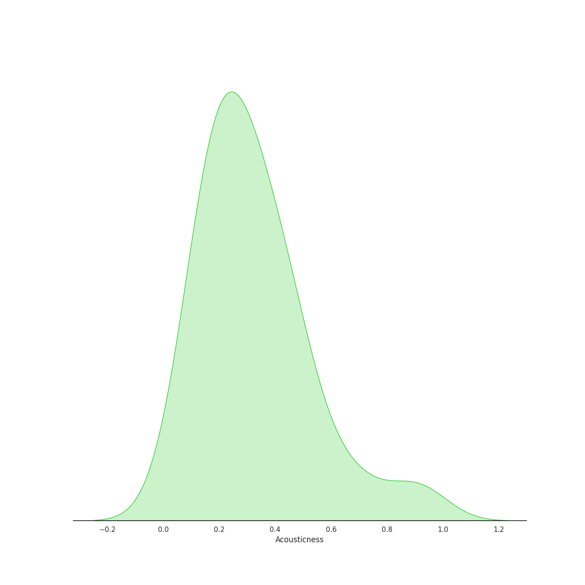
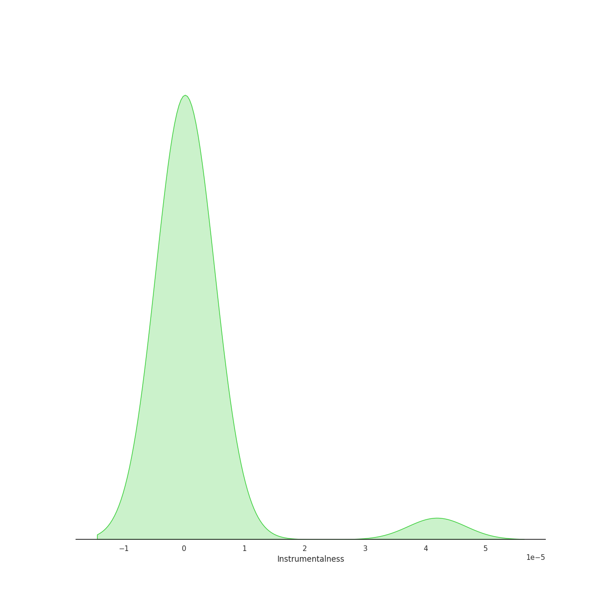
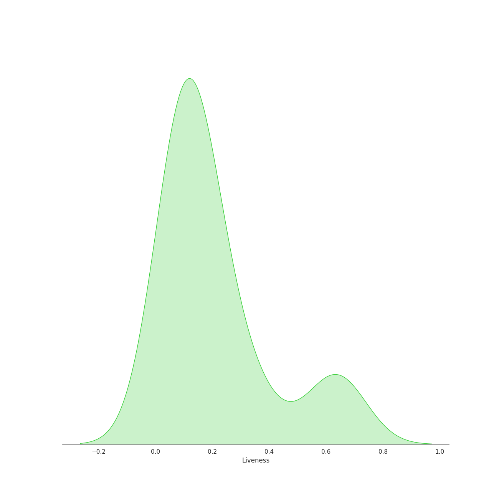
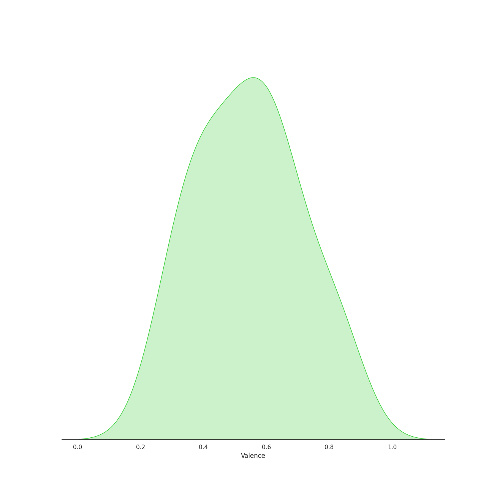
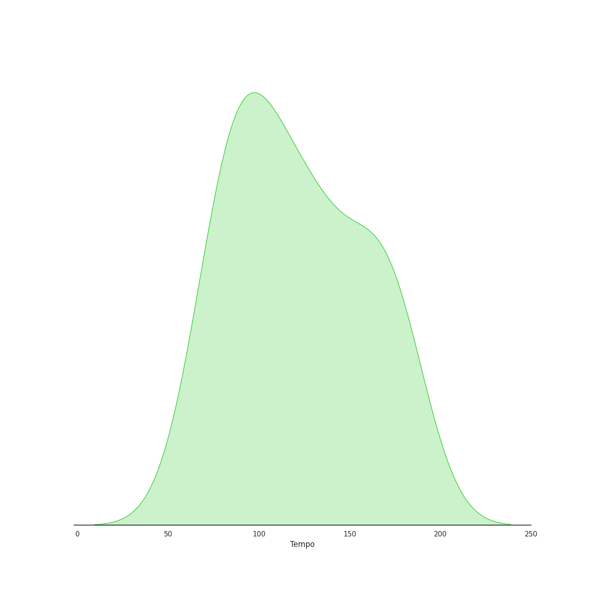

# Audio Features for Leslie Odom Jr.

## Danceability

| 10 most Danceable tracks | 10 least Danceable tracks |
|:---|:---|
| Ten Duel Commandments (0.887) | What'd I Miss (0.539) |
| Washington on Your Side (0.884) | Wait for It (0.543) |
| A Winter's Ball (0.854) | Dear Theodosia (0.598) |
| Non-Stop (0.77) | Alexander Hamilton (0.609) |
| Say No to This (0.754) | The Room Where It Happens (0.638) |
| Schuyler Defeated (0.745) | Aaron Burr, Sir (0.646) |
| The Schuyler Sisters (0.74) | The World Was Wide Enough (0.653) |
| Your Obedient Servant (0.736) | Right Hand Man (0.68) |
| Meet Me Inside (0.732) | My Shot (0.698) |
| The Election of 1800 (0.731) | We Know (0.718) |

## Energy

| 10 most Energetic tracks | 10 least Energetic tracks |
|:---|:---|
| The Schuyler Sisters (0.727) | Dear Theodosia (0.221) |
| Guns and Ships (0.666) | The Story of Tonight - Reprise (0.305) |
| My Shot (0.649) | A Winter's Ball (0.327) |
| Meet Me Inside (0.643) | The World Was Wide Enough (0.351) |
| Schuyler Defeated (0.597) | Your Obedient Servant (0.37) |
| What'd I Miss (0.577) | Right Hand Man (0.413) |
| Say No to This (0.535) | The Election of 1800 (0.42) |
| Washington on Your Side (0.521) | Alexander Hamilton (0.435) |
| Ten Duel Commandments (0.516) | Aaron Burr, Sir (0.439) |
| The Room Where It Happens (0.49) | Wait for It (0.473) |

## Speechiness

| 10 most Speechy tracks | 10 least Speechy tracks |
|:---|:---|
| Aaron Burr, Sir (0.818) | Dear Theodosia (0.0303) |
| Ten Duel Commandments (0.658) | Wait for It (0.157) |
| The World Was Wide Enough (0.648) | Schuyler Defeated (0.257) |
| We Know (0.523) | The Story of Tonight - Reprise (0.257) |
| A Winter's Ball (0.507) | The Schuyler Sisters (0.278) |
| Your Obedient Servant (0.502) | Alexander Hamilton (0.285) |
| Right Hand Man (0.492) | Say No to This (0.305) |
| Meet Me Inside (0.474) | Guns and Ships (0.328) |
| The Election of 1800 (0.462) | Washington on Your Side (0.348) |
| The Room Where It Happens (0.426) | Non-Stop (0.351) |

## Acousticness

| 10 most Acoustic tracks | 10 least Acoustic tracks |
|:---|:---|
| Dear Theodosia (0.907) | Ten Duel Commandments (0.0691) |
| The Story of Tonight - Reprise (0.68) | Wait for It (0.124) |
| Alexander Hamilton (0.522) | My Shot (0.15) |
| The World Was Wide Enough (0.467) | Washington on Your Side (0.165) |
| Say No to This (0.464) | What'd I Miss (0.169) |
| A Winter's Ball (0.41) | Right Hand Man (0.177) |
| Guns and Ships (0.399) | The Schuyler Sisters (0.187) |
| Meet Me Inside (0.378) | Non-Stop (0.211) |
| The Election of 1800 (0.319) | Schuyler Defeated (0.236) |
| We Know (0.312) | The Room Where It Happens (0.271) |

## Instrumentalness

| 10 most Instrumental tracks | 10 least Instrumental tracks |
|:---|:---|
| Dear Theodosia (4.19e-05) | Schuyler Defeated (0.0) |
| Wait for It (4.04e-06) | The Election of 1800 (0.0) |
| Non-Stop (0.0) | The World Was Wide Enough (0.0) |
| Guns and Ships (0.0) | The Story of Tonight - Reprise (0.0) |
| The Schuyler Sisters (0.0) | We Know (0.0) |
| Meet Me Inside (0.0) | Washington on Your Side (0.0) |
| Aaron Burr, Sir (0.0) | The Room Where It Happens (0.0) |
| Your Obedient Servant (0.0) | What'd I Miss (0.0) |
| My Shot (0.0) | A Winter's Ball (0.0) |
| Alexander Hamilton (0.0) | Ten Duel Commandments (0.0) |

## Liveness

| 10 most Live tracks | 10 least Live tracks |
|:---|:---|
| The Room Where It Happens (0.664) | Your Obedient Servant (0.042) |
| The Schuyler Sisters (0.627) | Dear Theodosia (0.0723) |
| Ten Duel Commandments (0.617) | Washington on Your Side (0.0756) |
| Meet Me Inside (0.363) | Guns and Ships (0.0844) |
| The Election of 1800 (0.306) | A Winter's Ball (0.0889) |
| Non-Stop (0.223) | My Shot (0.0903) |
| Right Hand Man (0.205) | Wait for It (0.0922) |
| Say No to This (0.19) | Aaron Burr, Sir (0.0945) |
| Schuyler Defeated (0.157) | The World Was Wide Enough (0.107) |
| What'd I Miss (0.14) | Alexander Hamilton (0.118) |

## Valence

| 10 most Happy tracks | 10 least Happy tracks |
|:---|:---|
| Schuyler Defeated (0.842) | Dear Theodosia (0.274) |
| Ten Duel Commandments (0.828) | The World Was Wide Enough (0.307) |
| The Schuyler Sisters (0.792) | What'd I Miss (0.319) |
| We Know (0.692) | Right Hand Man (0.383) |
| A Winter's Ball (0.688) | Guns and Ships (0.383) |
| The Election of 1800 (0.645) | Say No to This (0.395) |
| Meet Me Inside (0.644) | Washington on Your Side (0.425) |
| Your Obedient Servant (0.619) | Non-Stop (0.441) |
| The Story of Tonight - Reprise (0.594) | The Room Where It Happens (0.511) |
| My Shot (0.568) | Wait for It (0.519) |

## Tempo

| 10 most Fast tracks | 10 least Fast tracks |
|:---|:---|
| My Shot (180.466) | The Election of 1800 (67.426) |
| What'd I Miss (177.787) | Ten Duel Commandments (77.977) |
| The Room Where It Happens (173.552) | Say No to This (81.035) |
| Your Obedient Servant (165.908) | The Story of Tonight - Reprise (81.874) |
| Aaron Burr, Sir (160.387) | Wait for It (86.534) |
| Right Hand Man (158.576) | Meet Me Inside (88.543) |
| Guns and Ships (138.03) | Non-Stop (91.994) |
| Washington on Your Side (134.051) | The Schuyler Sisters (101.409) |
| Alexander Hamilton (131.995) | Schuyler Defeated (102.108) |
| A Winter's Ball (131.352) | Dear Theodosia (106.771) |
