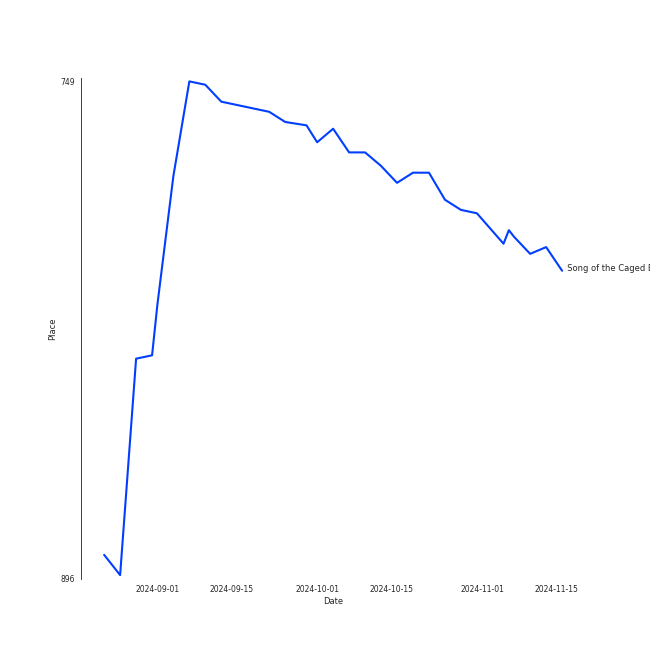

# Lindsey Stirling

## Artist Rank
- The #395 artist overall

## Top Tracks

### Top tracks, aggregated

## Featured on Playlists
| Art | Tracks | Playlist |
|:---|---:|:---|
|  | 4 | [Electronic](../../playlists/electronic/overview.md) |
|  | 3 | [A Cappella](../../playlists/a_cappella/overview.md) |
|  | 1 | [Workout](../../playlists/workout/overview.md) |

## Top Albums

| Art | Tracks | 💚 | Album | Release Date | 🔗 |
|:---|---:|---:|:---|:---|:---|
|  | 2 | 2 | Lindsey Stirling | 2012 | [🔗](https://open.spotify.com/album/3YTWAm90osBvLNWCdF8Nq2) |
|  | 1 | 1 | Shatter Me | 2014-04-29 | [🔗](https://open.spotify.com/album/2spbck4ETZz1aLq5Fi5phC) |
|  | 1 | 1 | PTX, Vol. III | 2014-09-23 | [🔗](https://open.spotify.com/album/32y54TelUHSUDWVOx4h1B4) |
|  | 1 | 1 | PTX | 2014-09-19 | [🔗](https://open.spotify.com/album/77RBn8pRsfXlZdfTQh221D) |
|  | 1 | 0 | Legendary Covers, Vol. 1 | 2019 | [🔗](https://open.spotify.com/album/1tFypxtPJ5A61j97TRhWnP) |
|  | 1 | 0 | Artemis | 2019-09-06 | [🔗](https://open.spotify.com/album/4YAtGpNUwcHesLlyYUIxur) |

## Top Record Labels

| Tracks | 💚 | Label |
|---:|---:|:---|
| 3 | 3 | Lindseystomp Records |
| 2 | 2 | [RCA Records Label](../../labels/rca_records_label/overview.md) |
| 1 | 0 | [Peter Hollens](../../labels/peter_hollens/overview.md) |
| 1 | 0 | BMG Rights Management (US) LLC |

## Genres

- bow pop
- pop violin

## Credits

### Credits by Type

| Credit Type | Tracks |
|:---|---:|
| Instrument | 2 |
| Producer | 2 |
| Songwriter | 3 |

### Production Credits

| Art | Track | Credit Types |
|:---|:---|:---|
|  | Song of the Caged Bird | Producer, Songwriter |
|  | Crystallize | Producer, Songwriter |
|  | Shatter Me Featuring Lzzy Hale | Songwriter |

## Top Producers

| Art | Producer | Tracks | Credit Types |
|:---|:---|---:|:---|
|  | [Lindsey Stirling](overview.md) | 3 | Producer, Songwriter |
| | Marko G | 2 | Producer, Songwriter |
| | Ryan Wyler | 2 | Producer |
| | Alex da Kid | 1 | Songwriter |
| | Josh Mosser | 1 | Songwriter |
| | Mark Maxwell | 1 | Producer, Songwriter |
| | Wayne Sermon | 1 | Songwriter |
|  | Stromae | 1 | Songwriter |
| | Ben McKee | 1 | Songwriter |
| | Dan Reynolds | 1 | Songwriter |

View all

| Art | Producer | Tracks | Credit Types |
|:---|:---|---:|:---|
| | Dia Frampton | 1 | Songwriter |

## Tracks

| Art | Track | Album | Artists | Label | Rank | 💚 | 🔗 |
|:---|:---|:---|:---|:---|---:|:---|:---|
|  | Papaoutai (Stromae Cover) (feat. Lindsey Stirling) | PTX, Vol. III | [Pentatonix](../pentatonix/overview.md), [Lindsey Stirling](overview.md) | [RCA Records Label](../../labels/rca_records_label) | 1793 | 💚 | [🔗](https://open.spotify.com/track/4LeTorR5FyWgxM3zZI7Qii) |
|  | Radioactive | PTX | [Pentatonix](../pentatonix/overview.md), [Lindsey Stirling](overview.md) | [RCA Records Label](../../labels/rca_records_label) | 2523 | 💚 | [🔗](https://open.spotify.com/track/7dJGehjbhJvs3K4fWwYTW1) |
|  | Crystallize | Lindsey Stirling | [Lindsey Stirling](overview.md) | Lindseystomp Records | 2599 | 💚 | [🔗](https://open.spotify.com/track/5JFkuKQsPps2ZaZzaLx63d) |
|  | Song of the Caged Bird | Lindsey Stirling | [Lindsey Stirling](overview.md) | Lindseystomp Records | 2599 | 💚 | [🔗](https://open.spotify.com/track/1rmCtRmkQXWKRhBi91NX3z) |
|  | Shatter Me Featuring Lzzy Hale | Shatter Me | [Lindsey Stirling](overview.md) | Lindseystomp Records | 2599 | 💚 | [🔗](https://open.spotify.com/track/2K7j4xrQENCi5r3Hii4cVe) |
|  | Fields of Gold | Legendary Covers, Vol. 1 | Peter Hollens, Tyler Ward, [Lindsey Stirling](overview.md) | [Peter Hollens](../../labels/peter_hollens) | 2599 | | [🔗](https://open.spotify.com/track/0sLEBadE1MXYXDiugLoEe6) |
|  | Underground | Artemis | [Lindsey Stirling](overview.md) | BMG Rights Management (US) LLC | 2599 | | [🔗](https://open.spotify.com/track/2vcEiEb8cTgyeb0biKChCY) |
