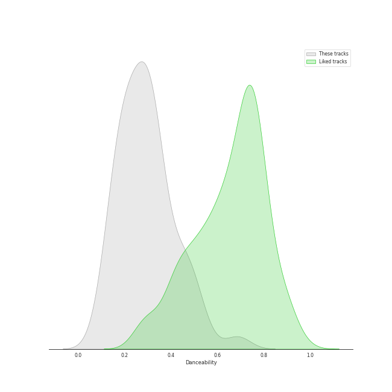
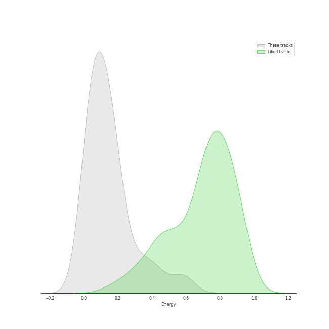
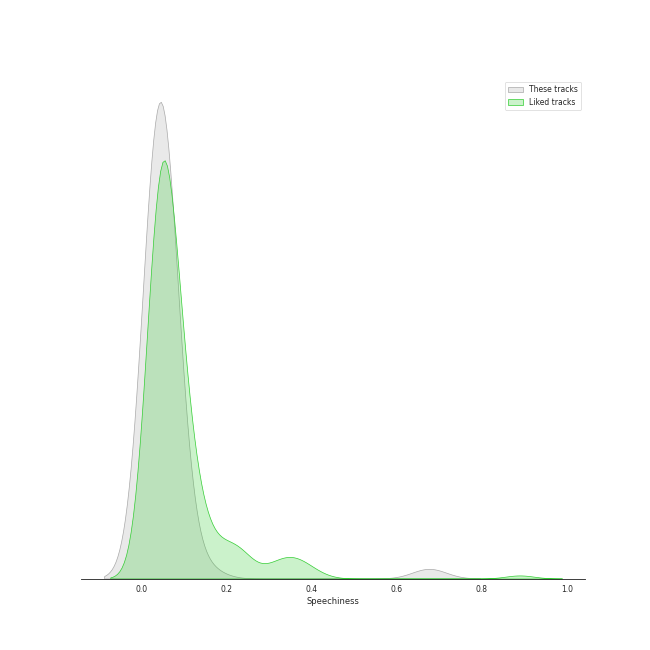
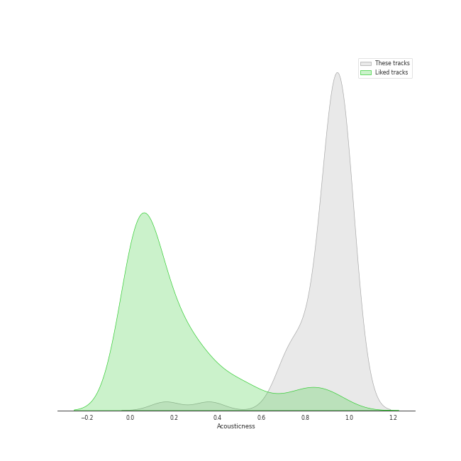
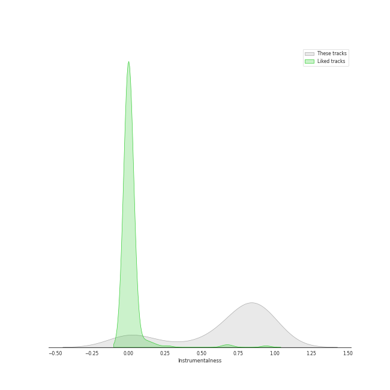
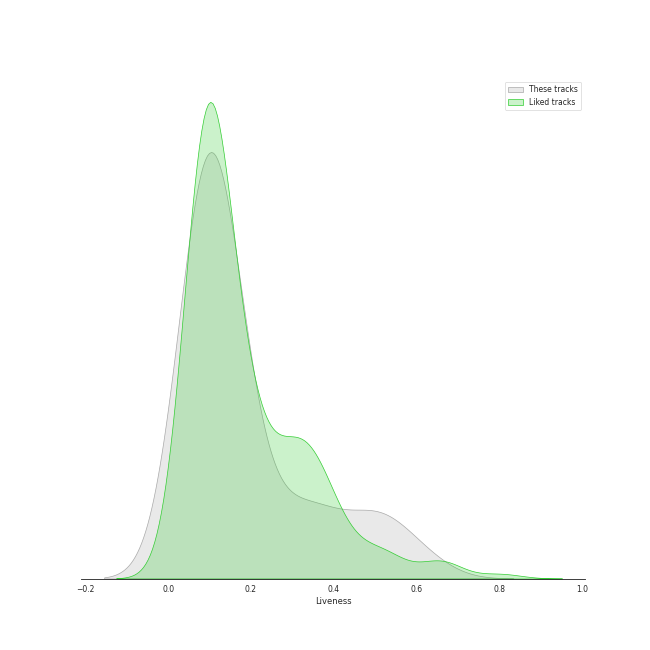
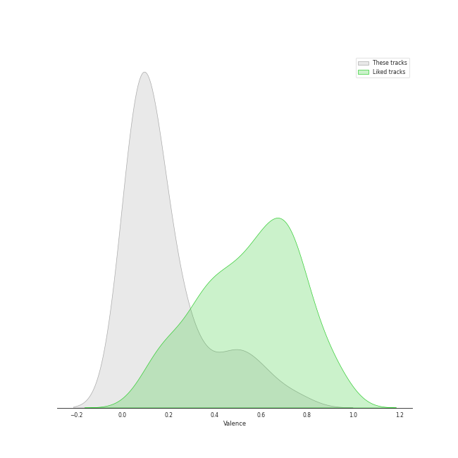
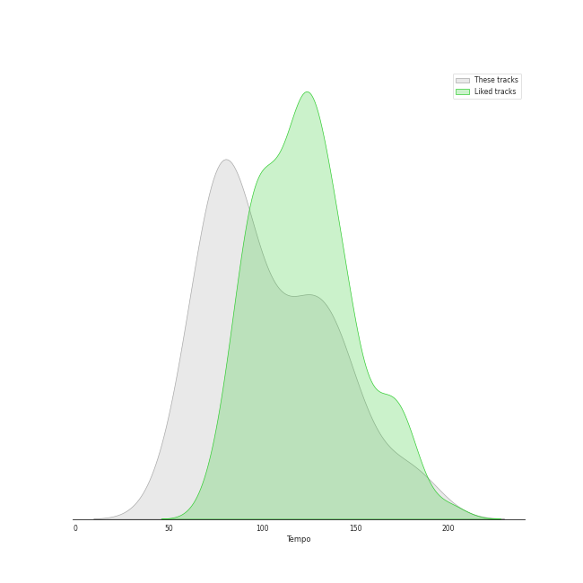

# Track Features for London Symphony Orchestra

## Danceability

| ​ | 10 most Danceable tracks | ​​ | 10 least Danceable tracks |
|:---|:---|:---|:---|
|  | Cantina Band (0.688) |  | Tchaikovsky: Swan Lake, Op. 20, Act 2: No. 14, Scene. Moderato (0.0958) |
|  | Tchaikovsky: Swan Lake, Op. 20, Act 1: No. 8, Dance with Goblets (0.534) |  | Princess Leia's Theme (0.132) |
|  | A Midsummer Night's Dream, Incidental Music, Op. 61: No. 1, Scherzo (0.505) |  | Tchaikovsky: Swan Lake, Op. 20, Act 2: No. 10, Scene. Moderato (0.136) |
|  | A Midsummer Night's Dream, Incidental Music, Op. 61: No. 2, L'istesso tempo (0.485) |  | Tchaikovsky: Swan Lake, Op. 20, Act 2: No. 11, Scene. Allegro moderato - Moderato - Allegro vivo (0.144) |
|  | Tchaikovsky: Swan Lake, Op. 20, Act 4: No. 26, Scene. Allegro ma non troppo (0.472) |  | Piano Concerto No. 2 in C Minor, Op. 18: 1. Moderato (0.144) |
|  | Duel of the Fates (0.471) |  | Tchaikovsky: Swan Lake, Op. 20, Act 4: No. 28, Scene. Allegro agitato (0.165) |
|  | A Midsummer Night's Dream, Incidental Music, Op. 61: No. 4, Andante (0.451) |  | Tchaikovsky: Swan Lake, Op. 20, Act 1: No. 7, Sujet (0.165) |
|  | A Midsummer Night's Dream, Incidental Music, Op. 61: No. 2a, Allegro vivace (0.438) |  | Tchaikovsky: Swan Lake, Op. 20, Act 1: No. 3, Scene. Allegro moderato (0.167) |
|  | Tchaikovsky: Swan Lake, Op. 20, Act 3: No. 15, Scene. March - Allegro giusto (0.404) |  | A Midsummer Night's Dream, Incidental Music, Op. 61: No. 7, Nocturne. Con moto tranquillo (0.173) |
|  | Tchaikovsky: Swan Lake, Op. 20, Act 3: No. 16, Ballabile. Dance of the Guests and the Dwarfs (0.397) |  | Tchaikovsky: Swan Lake, Op. 20, Act 1: No. 9, Finale. Andante (0.188) |

## Energy

| ​ | 10 most Energetic tracks | ​​ | 10 least Energetic tracks |
|:---|:---|:---|:---|
|  | Main Title/Rebel Blockade Runner - Medley (0.593) |  | Tchaikovsky: Swan Lake, Op. 20, Act 4: No. 25, Entr'acte (0.00606) |
|  | Cantina Band (0.582) |  | A Midsummer Night's Dream, Incidental Music, Op. 61: No. 4, Andante (0.0082) |
|  | Tchaikovsky: Swan Lake, Op. 20, Act 3: No. 15, Scene. March - Allegro giusto (0.474) |  | A Midsummer Night's Dream, Incidental Music, Op. 61: No. 8, Andante (0.00913) |
|  | Duel of the Fates (0.411) |  | Tchaikovsky: Swan Lake, Op. 20, Act 1: No. 7, Sujet (0.00979) |
|  | Tchaikovsky: Swan Lake, Op. 20, Act 1: No. 8, Dance with Goblets (0.391) |  | A Midsummer Night's Dream, Incidental Music, Op. 61: No. 7, Nocturne. Con moto tranquillo (0.0115) |
|  | Tchaikovsky: Swan Lake, Op. 20, Act 4: No. 29, Finale (0.35) |  | Tchaikovsky: Swan Lake, Op. 20, Act 4: No. 27, Dance of the Little Swans (0.0174) |
|  | Tchaikovsky: Swan Lake, Op. 20, Act 3: No. 23, Mazurka (0.315) |  | A Midsummer Night's Dream, Incidental Music, Op. 61: Finale. Allegro di molto (0.0246) |
|  | Tchaikovsky: Swan Lake, Op. 20, Act 1: Introduction - No. 1, Scene. Allegro giusto (0.298) |  | Tchaikovsky: Swan Lake, Op. 20, Act 4: No. 26, Scene. Allegro ma non troppo (0.0316) |
|  | Tchaikovsky: Swan Lake, Op. 20, Act 3: No. 16, Ballabile. Dance of the Guests and the Dwarfs (0.219) |  | A Midsummer Night's Dream, Incidental Music, Op. 61: No. 3, Lied mit Chor (0.0349) |
|  | Tchaikovsky: Swan Lake, Op. 20, Act 4: No. 28, Scene. Allegro agitato (0.215) |  | A Midsummer Night's Dream, Incidental Music, Op. 61: No. 5, Allegro appassionato (0.0368) |

## Speechiness

| ​ | 10 most Speechy tracks | ​​ | 10 least Speechy tracks |
|:---|:---|:---|:---|
|  | A Midsummer Night's Dream, Incidental Music, Op. 61: No. 2, L'istesso tempo (0.676) |  | A Midsummer Night's Dream, Incidental Music, Op. 61: No. 1, Scherzo (0.0314) |
|  | Cantina Band (0.149) |  | Piano Concerto No. 2 in C Minor, Op. 18: 3. Allegro scherzando (0.0336) |
|  | A Midsummer Night's Dream, Incidental Music, Op. 61: No. 2a, Allegro vivace (0.0884) |  | Tchaikovsky: Swan Lake, Op. 20, Act 3: No. 18, Scene. Allegro - Allegro giusto (0.034) |
|  | A Midsummer Night's Dream, Incidental Music, Op. 61: No. 4, Andante (0.0791) |  | Tchaikovsky: Swan Lake, Op. 20, Act 1: No. 7, Sujet (0.0343) |
|  | Tchaikovsky: Swan Lake, Op. 20, Act 3: No. 22, Neapolitan Dance (0.0675) |  | Tchaikovsky: Swan Lake, Op. 20, Act 3: No. 21, Spanish Dance (0.0345) |
|  | A Midsummer Night's Dream, Incidental Music, Op. 61: No. 9, Hochzeitmarsch "Wedding March" - No. 12, Allegro vivace come primo (0.0636) |  | Tchaikovsky: Swan Lake, Op. 20, Act 3: No. 17, Entrance of the Guests and Waltz (0.0352) |
|  | Main Theme (From "Jaws") (0.0581) |  | Tchaikovsky: Swan Lake, Op. 20, Act 1: No. 9, Finale. Andante (0.0353) |
|  | A Midsummer Night's Dream, Incidental Music, Op. 61: No. 8, Andante (0.0574) |  | Flying Theme (From "E.T. the Extra-Terrestrial") (0.0355) |
|  | Tchaikovsky: Swan Lake, Op. 20, Act 1: No. 3, Scene. Allegro moderato (0.0573) |  | Tchaikovsky: Swan Lake, Op. 20, Act 2: No. 10, Scene. Moderato (0.0364) |
|  | Tchaikovsky: Swan Lake, Op. 20, Act 1: No. 5, Pas de deux for Two Merry-Makers (0.0555) |  | Piano Concerto No. 2 in C Minor, Op. 18: 2. Adagio sostenuto (0.0366) |

## Acousticness

| ​ | 10 most Acoustic tracks | ​​ | 10 least Acoustic tracks |
|:---|:---|:---|:---|
|  | Tchaikovsky: Swan Lake, Op. 20, Act 4: No. 27, Dance of the Little Swans (0.987) |  | Cantina Band (0.161) |
|  | Piano Concerto No. 2 in C Minor, Op. 18: 2. Adagio sostenuto (0.983) |  | Main Title/Rebel Blockade Runner - Medley (0.361) |
|  | A Midsummer Night's Dream, Incidental Music, Op. 61: No. 7, Nocturne. Con moto tranquillo (0.981) |  | A Midsummer Night's Dream, Incidental Music, Op. 61: No. 2, L'istesso tempo (0.69) |
|  | Piano Concerto No. 2 in C Minor, Op. 18: 3. Allegro scherzando (0.981) |  | A Midsummer Night's Dream, Incidental Music, Op. 61: No. 8, Andante (0.715) |
|  | Piano Concerto No. 2 in C Minor, Op. 18: 1. Moderato (0.978) |  | Duel of the Fates (0.733) |
|  | Tchaikovsky: Swan Lake, Op. 20, Act 1: No. 6, Pas d'action. Andantino, quasi moderato - Allegro (0.974) |  | Main Theme (From "Jaws") (0.742) |
|  | Tchaikovsky: Swan Lake, Op. 20, Act 4: No. 26, Scene. Allegro ma non troppo (0.973) |  | A Midsummer Night's Dream, Incidental Music, Op. 61: No. 2a, Allegro vivace (0.745) |
|  | Tchaikovsky: Swan Lake, Op. 20, Act 3: No. 20, Hungarian Dance "Czárdás" (0.97) |  | A Midsummer Night's Dream, Incidental Music, Op. 61: No. 4, Andante (0.75) |
|  | Tchaikovsky: Swan Lake, Op. 20, Act 3: No. 17, Entrance of the Guests and Waltz (0.97) |  | Flying Theme (From "E.T. the Extra-Terrestrial") (0.772) |
|  | A Midsummer Night's Dream, Incidental Music, Op. 61: No. 3, Lied mit Chor (0.969) |  | Tchaikovsky: Swan Lake, Op. 20, Act 1: No. 8, Dance with Goblets (0.813) |

## Instrumentalness

| ​ | 10 most Instrumental tracks | ​​ | 10 least Instrumental tracks |
|:---|:---|:---|:---|
|  | Tchaikovsky: Swan Lake, Op. 20, Act 4: No. 26, Scene. Allegro ma non troppo (0.978) |  | A Midsummer Night's Dream, Incidental Music, Op. 61: No. 8, Andante (0.0) |
|  | Main Theme (From "Jaws") (0.959) |  | A Midsummer Night's Dream, Incidental Music, Op. 61: No. 4, Andante (0.0) |
|  | A Midsummer Night's Dream, Incidental Music, Op. 61: No. 1, Scherzo (0.952) |  | A Midsummer Night's Dream, Incidental Music, Op. 61: No. 2, L'istesso tempo (0.0) |
|  | Piano Concerto No. 2 in C Minor, Op. 18: 2. Adagio sostenuto (0.945) |  | A Midsummer Night's Dream, Incidental Music, Op. 61: Finale. Allegro di molto (3.2e-06) |
|  | Tchaikovsky: Swan Lake, Op. 20, Act 3: No. 15, Scene. March - Allegro giusto (0.927) |  | A Midsummer Night's Dream, Incidental Music, Op. 61: No. 2a, Allegro vivace (1.33e-05) |
|  | Tchaikovsky: Swan Lake, Op. 20, Act 4: No. 27, Dance of the Little Swans (0.922) |  | A Midsummer Night's Dream, Incidental Music, Op. 61: No. 3, Lied mit Chor (0.00137) |
|  | Tchaikovsky: Swan Lake, Op. 20, Act 2: No. 10, Scene. Moderato (0.916) |  | Cantina Band (0.00147) |
|  | Piano Concerto No. 2 in C Minor, Op. 18: 1. Moderato (0.906) |  | A Midsummer Night's Dream, Incidental Music, Op. 61: No. 5, Allegro appassionato (0.00512) |
|  | Tchaikovsky: Swan Lake, Op. 20, Act 1: No. 6, Pas d'action. Andantino, quasi moderato - Allegro (0.904) |  | A Midsummer Night's Dream, Incidental Music, Op. 61: No. 9, Hochzeitmarsch "Wedding March" - No. 12, Allegro vivace come primo (0.0798) |
|  | Tchaikovsky: Swan Lake, Op. 20, Act 1: Introduction - No. 1, Scene. Allegro giusto (0.904) |  | Tchaikovsky: Swan Lake, Op. 20, Act 3: No. 21, Spanish Dance (0.213) |

## Liveness

| ​ | 10 most Live tracks | ​​ | 10 least Live tracks |
|:---|:---|:---|:---|
|  | A Midsummer Night's Dream, Incidental Music, Op. 61: No. 4, Andante (0.626) |  | Cantina Band (0.0532) |
|  | Tchaikovsky: Swan Lake, Op. 20, Act 3: No. 18, Scene. Allegro - Allegro giusto (0.565) |  | Piano Concerto No. 2 in C Minor, Op. 18: 2. Adagio sostenuto (0.0551) |
|  | A Midsummer Night's Dream, Incidental Music, Op. 61: No. 2a, Allegro vivace (0.539) |  | Tchaikovsky: Swan Lake, Op. 20, Act 1: No. 4, Pas de trois (0.0595) |
|  | Main Theme (From "Jaws") (0.5) |  | A Midsummer Night's Dream, Incidental Music, Op. 61: No. 3, Lied mit Chor (0.0609) |
|  | A Midsummer Night's Dream, Incidental Music, Op. 61: No. 8, Andante (0.488) |  | A Midsummer Night's Dream, Incidental Music, Op. 61: No. 9, Hochzeitmarsch "Wedding March" - No. 12, Allegro vivace come primo (0.0646) |
|  | Tchaikovsky: Swan Lake, Op. 20, Act 2: No. 11, Scene. Allegro moderato - Moderato - Allegro vivo (0.486) |  | Piano Concerto No. 2 in C Minor, Op. 18: 1. Moderato (0.0646) |
|  | Tchaikovsky: Swan Lake, Op. 20, Act 3, Appendix II: No. 20a, Russian Dance (0.421) |  | Overture to "A Midsummer Night's Dream", Op. 21: Tempo primo (0.0675) |
|  | Tchaikovsky: Swan Lake, Op. 20, Act 4: No. 28, Scene. Allegro agitato (0.373) |  | Tchaikovsky: Swan Lake, Op. 20, Act 2: No. 13, Dances of the Swans (0.0769) |
|  | A Midsummer Night's Dream, Incidental Music, Op. 61: No. 2, L'istesso tempo (0.354) |  | Tchaikovsky: Swan Lake, Op. 20, Act 3, Appendix I: Pas de deux (0.077) |
|  | Tchaikovsky: Swan Lake, Op. 20, Act 4: No. 29, Finale (0.35) |  | Piano Concerto No. 2 in C Minor, Op. 18: 3. Allegro scherzando (0.0772) |

## Valence

| ​ | 10 most Happy tracks | ​​ | 10 least Happy tracks |
|:---|:---|:---|:---|
|  | Cantina Band (0.754) |  | Princess Leia's Theme (0.031) |
|  | Tchaikovsky: Swan Lake, Op. 20, Act 3: No. 22, Neapolitan Dance (0.641) |  | A Midsummer Night's Dream, Incidental Music, Op. 61: No. 7, Nocturne. Con moto tranquillo (0.0353) |
|  | A Midsummer Night's Dream, Incidental Music, Op. 61: No. 1, Scherzo (0.584) |  | Piano Concerto No. 2 in C Minor, Op. 18: 2. Adagio sostenuto (0.0385) |
|  | Tchaikovsky: Swan Lake, Op. 20, Act 3: No. 15, Scene. March - Allegro giusto (0.579) |  | Piano Concerto No. 2 in C Minor, Op. 18: 1. Moderato (0.0393) |
|  | Tchaikovsky: Swan Lake, Op. 20, Act 3: No. 21, Spanish Dance (0.498) |  | Tchaikovsky: Swan Lake, Op. 20, Act 4: No. 25, Entr'acte (0.0399) |
|  | Main Title/Rebel Blockade Runner - Medley (0.493) |  | Tchaikovsky: Swan Lake, Op. 20, Act 4: No. 26, Scene. Allegro ma non troppo (0.0414) |
|  | Tchaikovsky: Swan Lake, Op. 20, Act 3: No. 23, Mazurka (0.477) |  | Tchaikovsky: Swan Lake, Op. 20, Act 2: No. 14, Scene. Moderato (0.0416) |
|  | Tchaikovsky: Swan Lake, Op. 20, Act 1: No. 8, Dance with Goblets (0.464) |  | A Midsummer Night's Dream, Incidental Music, Op. 61: Finale. Allegro di molto (0.05) |
|  | Tchaikovsky: Swan Lake, Op. 20, Act 3: No. 18, Scene. Allegro - Allegro giusto (0.369) |  | Overture to "A Midsummer Night's Dream", Op. 21: Tempo primo (0.0519) |
|  | A Midsummer Night's Dream, Incidental Music, Op. 61: No. 2, L'istesso tempo (0.338) |  | Yoda's Theme (0.0571) |

## Tempo

| ​ | 10 most Fast tracks | ​​ | 10 least Fast tracks |
|:---|:---|:---|:---|
|  | Tchaikovsky: Swan Lake, Op. 20, Act 3: No. 23, Mazurka (184.562) |  | Piano Concerto No. 2 in C Minor, Op. 18: 1. Moderato (54.898) |
|  | Tchaikovsky: Swan Lake, Op. 20, Act 1: No. 7, Sujet (181.794) |  | Tchaikovsky: Swan Lake, Op. 20, Act 2: No. 10, Scene. Moderato (58.303) |
|  | A Midsummer Night's Dream, Incidental Music, Op. 61: Finale. Allegro di molto (175.796) |  | Tchaikovsky: Swan Lake, Op. 20, Act 1: No. 6, Pas d'action. Andantino, quasi moderato - Allegro (62.261) |
|  | Tchaikovsky: Swan Lake, Op. 20, Act 3: No. 22, Neapolitan Dance (159.829) |  | Tchaikovsky: Swan Lake, Op. 20, Act 1: No. 3, Scene. Allegro moderato (65.136) |
|  | Tchaikovsky: Swan Lake, Op. 20, Act 3, Appendix I: Pas de deux (152.712) |  | Tchaikovsky: Swan Lake, Op. 20, Act 2: No. 11, Scene. Allegro moderato - Moderato - Allegro vivo (68.297) |
|  | Tchaikovsky: Swan Lake, Op. 20, Act 3: No. 15, Scene. March - Allegro giusto (148.003) |  | A Midsummer Night's Dream, Incidental Music, Op. 61: No. 7, Nocturne. Con moto tranquillo (68.74) |
|  | Piano Concerto No. 2 in C Minor, Op. 18: 2. Adagio sostenuto (140.966) |  | Tchaikovsky: Swan Lake, Op. 20, Act 3: No. 24, Scene. Allegro - Valse - Allegro vivo (69.454) |
|  | Overture to "A Midsummer Night's Dream", Op. 21: Tempo primo (140.454) |  | Tchaikovsky: Swan Lake, Op. 20, Act 3, Appendix II: No. 20a, Russian Dance (74.356) |
|  | Overture to "A Midsummer Night's Dream", Op. 21: Allegro di molto (137.416) |  | Tchaikovsky: Swan Lake, Op. 20, Act 1: Introduction - No. 1, Scene. Allegro giusto (74.546) |
|  | A Midsummer Night's Dream, Incidental Music, Op. 61: No. 2a, Allegro vivace (137.327) |  | Tchaikovsky: Swan Lake, Op. 20, Act 4: No. 28, Scene. Allegro agitato (76.201) |
