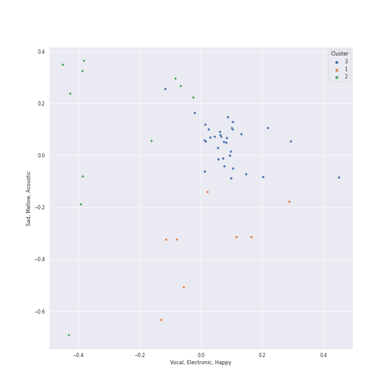

# Clusters in London Symphony Orchestra

## Cluster #1

8 tracks

| Art | Track | Album | Artists | Label | Rank | 💚 | 🔗 |
|:---|:---|:---|:---|:---|---:|:---|:---|
|  | Tchaikovsky: Swan Lake, Op. 20, Act 3: No. 15, Scene. March - Allegro giusto | Tchaikovsky: Swan Lake | [Pyotr Ilyich Tchaikovsky](../../../pyotr_ilyich_tchaikovsky/overview.md), André Previn, [London Symphony Orchestra](../../overview.md) | [Warner Classics](../../../../labels/warner_classics) | 1010 | | [🔗](https://open.spotify.com/track/0x8zPL3DG2zfVSUzZQiCKL) |
|  | Tchaikovsky: Swan Lake, Op. 20, Act 3: No. 18, Scene. Allegro - Allegro giusto | Tchaikovsky: Swan Lake | [Pyotr Ilyich Tchaikovsky](../../../pyotr_ilyich_tchaikovsky/overview.md), André Previn, [London Symphony Orchestra](../../overview.md) | [Warner Classics](../../../../labels/warner_classics) | 1010 | | [🔗](https://open.spotify.com/track/2YzKk2NMadveUJ5gSMmo5W) |
|  | Tchaikovsky: Swan Lake, Op. 20, Act 3: No. 22, Neapolitan Dance | Tchaikovsky: Swan Lake | [Pyotr Ilyich Tchaikovsky](../../../pyotr_ilyich_tchaikovsky/overview.md), André Previn, [London Symphony Orchestra](../../overview.md) | [Warner Classics](../../../../labels/warner_classics) | 1010 | | [🔗](https://open.spotify.com/track/4nj7bhtLH0R1xW0mybToZx) |
|  | Tchaikovsky: Swan Lake, Op. 20, Act 1: No. 8, Dance with Goblets | Tchaikovsky: Swan Lake | [Pyotr Ilyich Tchaikovsky](../../../pyotr_ilyich_tchaikovsky/overview.md), André Previn, [London Symphony Orchestra](../../overview.md) | [Warner Classics](../../../../labels/warner_classics) | 1010 | | [🔗](https://open.spotify.com/track/5k4h8TjWUws1995o3eOW0X) |
|  | Tchaikovsky: Swan Lake, Op. 20, Act 3: No. 16, Ballabile. Dance of the Guests and the Dwarfs | Tchaikovsky: Swan Lake | [Pyotr Ilyich Tchaikovsky](../../../pyotr_ilyich_tchaikovsky/overview.md), André Previn, [London Symphony Orchestra](../../overview.md) | [Warner Classics](../../../../labels/warner_classics) | 1010 | | [🔗](https://open.spotify.com/track/6fvore08Y6schFpAtmapXW) |
|  | Duel of the Fates | Star Wars: The Phantom Menace (Original Motion Picture Soundtrack) | John Williams, [London Symphony Orchestra](../../overview.md) | [Walt Disney Records](../../../../labels/walt_disney_records) | 1010 | | [🔗](https://open.spotify.com/track/1ghlpxVfPbFH2jenrv9vVw) |
|  | Main Title/Rebel Blockade Runner - Medley | Star Wars Episode IV: A New Hope (Original Motion Picture Soundtrack) | John Williams, [London Symphony Orchestra](../../overview.md) | [Sony Classical](../../../../labels/sony_classical) | 1010 | | [🔗](https://open.spotify.com/track/5jMfUVMOGlEkEYc3aSYnWm) |
|  | A Midsummer Night's Dream, Incidental Music, Op. 61: No. 1, Scherzo | Mendelssohn: A Midsummer Night's Dream | Felix Mendelssohn, [London Symphony Orchestra](../../overview.md), Alexander Knox, John Eliot Gardiner | [Lso Live](../../../../labels/lso_live) | 1010 | | [🔗](https://open.spotify.com/track/359jW2zuaHCdC0gCJRcX5o) |
## Cluster #2

11 tracks

| Art | Track | Album | Artists | Label | Rank | 💚 | 🔗 |
|:---|:---|:---|:---|:---|---:|:---|:---|
|  | Tchaikovsky: Swan Lake, Op. 20, Act 3: No. 23, Mazurka | Tchaikovsky: Swan Lake | [Pyotr Ilyich Tchaikovsky](../../../pyotr_ilyich_tchaikovsky/overview.md), André Previn, [London Symphony Orchestra](../../overview.md) | [Warner Classics](../../../../labels/warner_classics) | 1010 | | [🔗](https://open.spotify.com/track/2yf6Hbs6YR3o1iEtOxr91R) |
|  | Tchaikovsky: Swan Lake, Op. 20, Act 3: No. 21, Spanish Dance | Tchaikovsky: Swan Lake | [Pyotr Ilyich Tchaikovsky](../../../pyotr_ilyich_tchaikovsky/overview.md), André Previn, [London Symphony Orchestra](../../overview.md) | [Warner Classics](../../../../labels/warner_classics) | 1010 | | [🔗](https://open.spotify.com/track/3Vulgn0kOld0a561mg7yt4) |
|  | A Midsummer Night's Dream, Incidental Music, Op. 61: No. 3, Lied mit Chor | Mendelssohn: A Midsummer Night's Dream | Felix Mendelssohn, [London Symphony Orchestra](../../overview.md), Ceri-lyn Cissone, John Eliot Gardiner, The Monteverdi Choir | [Lso Live](../../../../labels/lso_live) | 1010 | | [🔗](https://open.spotify.com/track/1dDvLHCOPEVgNhHtVnB2is) |
|  | A Midsummer Night's Dream, Incidental Music, Op. 61: No. 9, Hochzeitmarsch "Wedding March" - No. 12, Allegro vivace come primo | Mendelssohn: A Midsummer Night's Dream | Felix Mendelssohn, [London Symphony Orchestra](../../overview.md), John Eliot Gardiner, Alexander Knox | [Lso Live](../../../../labels/lso_live) | 1010 | | [🔗](https://open.spotify.com/track/1ipR2jLKKgr7X9xJyd54Kx) |
|  | A Midsummer Night's Dream, Incidental Music, Op. 61: No. 8, Andante | Mendelssohn: A Midsummer Night's Dream | Felix Mendelssohn, [London Symphony Orchestra](../../overview.md), John Eliot Gardiner, Frankie Wakefield, Alexander Knox, Ceri-lyn Cissone | [Lso Live](../../../../labels/lso_live) | 1010 | | [🔗](https://open.spotify.com/track/2QYtN5MiVrF7OJFpkJvLrS) |
|  | A Midsummer Night's Dream, Incidental Music, Op. 61: No. 2a, Allegro vivace | Mendelssohn: A Midsummer Night's Dream | Felix Mendelssohn, [London Symphony Orchestra](../../overview.md), Frankie Wakefield, Alexander Knox, John Eliot Gardiner | [Lso Live](../../../../labels/lso_live) | 1010 | | [🔗](https://open.spotify.com/track/58VxRBZ7XFR3vWgNwz5fYT) |
|  | A Midsummer Night's Dream, Incidental Music, Op. 61: No. 5, Allegro appassionato | Mendelssohn: A Midsummer Night's Dream | Felix Mendelssohn, [London Symphony Orchestra](../../overview.md), Ceri-lyn Cissone, John Eliot Gardiner, Alexander Knox | [Lso Live](../../../../labels/lso_live) | 1010 | | [🔗](https://open.spotify.com/track/5XWKRz9i2PQWI3PsW0FmQj) |
|  | A Midsummer Night's Dream, Incidental Music, Op. 61: Finale. Allegro di molto | Mendelssohn: A Midsummer Night's Dream | Felix Mendelssohn, [London Symphony Orchestra](../../overview.md), John Eliot Gardiner, The Monteverdi Choir, Frankie Wakefield, Alexander Knox, Ceri-lyn Cissone | [Lso Live](../../../../labels/lso_live) | 1010 | | [🔗](https://open.spotify.com/track/5iGRKlJcFcSx0PA4OGpiYD) |
|  | A Midsummer Night's Dream, Incidental Music, Op. 61: No. 4, Andante | Mendelssohn: A Midsummer Night's Dream | Felix Mendelssohn, [London Symphony Orchestra](../../overview.md), Frankie Wakefield, John Eliot Gardiner, Ceri-lyn Cissone | [Lso Live](../../../../labels/lso_live) | 1010 | | [🔗](https://open.spotify.com/track/67eEYhol9DXQ65kUFt7jdk) |
|  | A Midsummer Night's Dream, Incidental Music, Op. 61: No. 2, L'istesso tempo | Mendelssohn: A Midsummer Night's Dream | Felix Mendelssohn, [London Symphony Orchestra](../../overview.md), John Eliot Gardiner, Alexander Knox, Ceri-lyn Cissone | [Lso Live](../../../../labels/lso_live) | 1010 | | [🔗](https://open.spotify.com/track/68afyO04jLHCK9Na8cgsGR) |
## Cluster #3

34 tracks

| Art | Track | Album | Artists | Label | Rank | 💚 | 🔗 |
|:---|:---|:---|:---|:---|---:|:---|:---|
|  | Tchaikovsky: Swan Lake, Op. 20, Act 2: No. 13, Dances of the Swans | Tchaikovsky: Swan Lake | [Pyotr Ilyich Tchaikovsky](../../../pyotr_ilyich_tchaikovsky/overview.md), André Previn, [London Symphony Orchestra](../../overview.md) | [Warner Classics](../../../../labels/warner_classics) | 1010 | | [🔗](https://open.spotify.com/track/2LETLpcnlbL2d5IbnNYLf8) |
|  | Tchaikovsky: Swan Lake, Op. 20, Act 1: No. 4, Pas de trois | Tchaikovsky: Swan Lake | [Pyotr Ilyich Tchaikovsky](../../../pyotr_ilyich_tchaikovsky/overview.md), André Previn, [London Symphony Orchestra](../../overview.md) | [Warner Classics](../../../../labels/warner_classics) | 1010 | | [🔗](https://open.spotify.com/track/3lE4dnrzG0FQxg67ZOl9rx) |
|  | Tchaikovsky: Swan Lake, Op. 20, Act 2: No. 12, Scene. Allegro - Moderato assai quasi andante | Tchaikovsky: Swan Lake | [Pyotr Ilyich Tchaikovsky](../../../pyotr_ilyich_tchaikovsky/overview.md), André Previn, [London Symphony Orchestra](../../overview.md) | [Warner Classics](../../../../labels/warner_classics) | 1010 | | [🔗](https://open.spotify.com/track/4MK0IoF2M5oUMvOrguhyYF) |
|  | Tchaikovsky: Swan Lake, Op. 20, Act 3: No. 19, Pas de six | Tchaikovsky: Swan Lake | [Pyotr Ilyich Tchaikovsky](../../../pyotr_ilyich_tchaikovsky/overview.md), André Previn, [London Symphony Orchestra](../../overview.md) | [Warner Classics](../../../../labels/warner_classics) | 1010 | | [🔗](https://open.spotify.com/track/5BgU68GB0DoFSxkwuIsLU2) |
|  | Tchaikovsky: Swan Lake, Op. 20, Act 1: No. 7, Sujet | Tchaikovsky: Swan Lake | [Pyotr Ilyich Tchaikovsky](../../../pyotr_ilyich_tchaikovsky/overview.md), André Previn, [London Symphony Orchestra](../../overview.md) | [Warner Classics](../../../../labels/warner_classics) | 1010 | | [🔗](https://open.spotify.com/track/5vQefc73LyaFwEPPcVspar) |
|  | Tchaikovsky: Swan Lake, Op. 20, Act 3: No. 20, Hungarian Dance "Czárdás" | Tchaikovsky: Swan Lake | [Pyotr Ilyich Tchaikovsky](../../../pyotr_ilyich_tchaikovsky/overview.md), André Previn, [London Symphony Orchestra](../../overview.md) | [Warner Classics](../../../../labels/warner_classics) | 1010 | | [🔗](https://open.spotify.com/track/6YbcqXNj8MEclUKVeicLYU) |
|  | Tchaikovsky: Swan Lake, Op. 20, Act 1: No. 2, Waltz | Tchaikovsky: Swan Lake | [Pyotr Ilyich Tchaikovsky](../../../pyotr_ilyich_tchaikovsky/overview.md), André Previn, [London Symphony Orchestra](../../overview.md) | [Warner Classics](../../../../labels/warner_classics) | 1010 | | [🔗](https://open.spotify.com/track/7gwqbiFgNU1VddAK2XO5Wr) |
|  | Tchaikovsky: Swan Lake, Op. 20, Act 3, Appendix I: Pas de deux | Tchaikovsky: Swan Lake | [Pyotr Ilyich Tchaikovsky](../../../pyotr_ilyich_tchaikovsky/overview.md), André Previn, [London Symphony Orchestra](../../overview.md) | [Warner Classics](../../../../labels/warner_classics) | 1010 | | [🔗](https://open.spotify.com/track/7hh18ES59TNeJnBSVJKtmV) |
|  | Yoda's Theme | Star Wars: The Empire Strikes Back (Original Motion Picture Soundtrack) | John Williams, [London Symphony Orchestra](../../overview.md) | [Walt Disney Records](../../../../labels/walt_disney_records) | 1010 | | [🔗](https://open.spotify.com/track/5fsT9U41OCFlaKA5XTCHtz) |
|  | Overture to "A Midsummer Night's Dream", Op. 21: Allegro di molto | Mendelssohn: A Midsummer Night's Dream | Felix Mendelssohn, [London Symphony Orchestra](../../overview.md), John Eliot Gardiner | [Lso Live](../../../../labels/lso_live) | 1010 | | [🔗](https://open.spotify.com/track/7pz2npttELZeXmDgYfCDlE) |