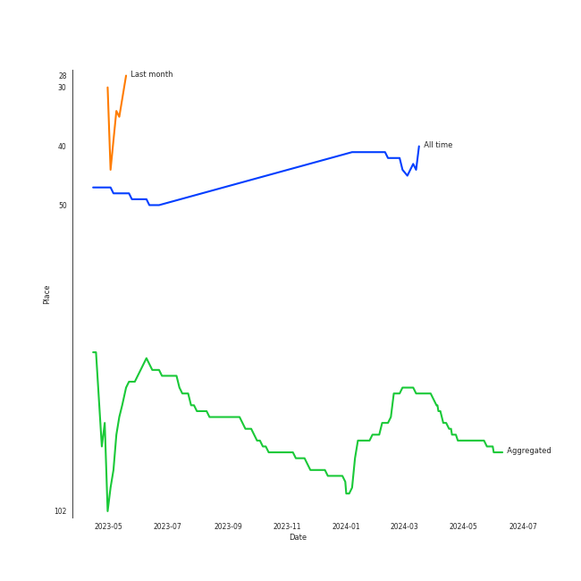
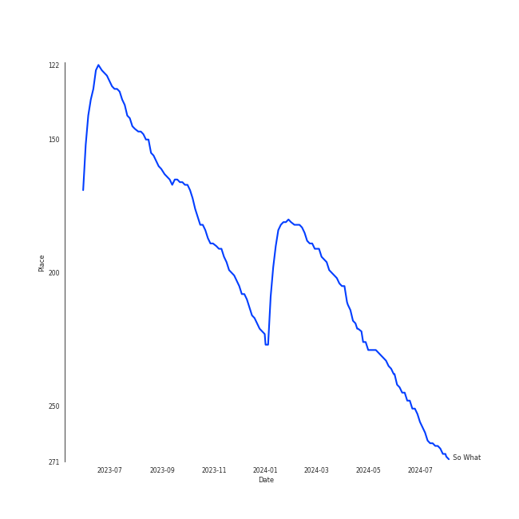
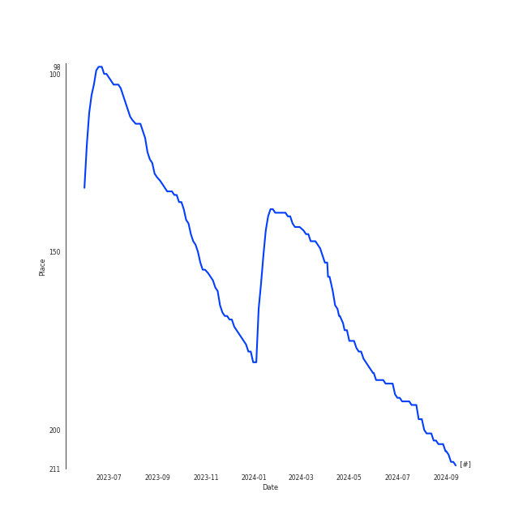
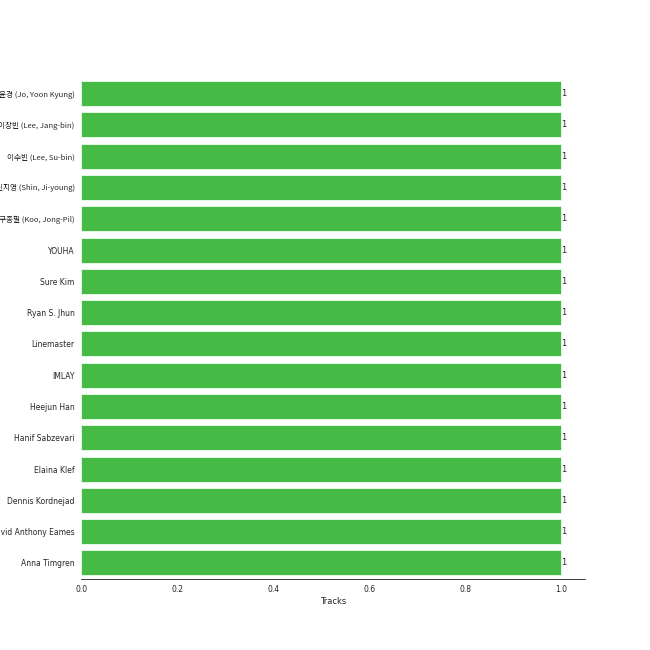

# LOONA

## Relationships

LOONA:
- has member CHUU
- has member Choerry
- has member 고원 (Go Won)
- has member HaSeul
- has member 희진 (Heejin)
- has member 혜주 (Hyeju)
- has member 현진 (Hyunjin)
- has member 진솔 (Jinsoul)
- has member Kim Lip
- has member ViVi
- has member 여진 (Yeojin)
- has member Yves

## Artist Rank
LOONA is currently:
- The #33 artist of the last month
- The #97 artist of all time

## Top Tracks

### Top tracks of all time

## Top Albums

| Art | Rank | Tracks | 💚 | Album | Release Date | 🔗 |
|:---|---:|---:|---:|:---|:---|:---|
|  | 625 | 2 | 1 | [12:00] | 2020-10-19 | [🔗](https://open.spotify.com/album/3obToaukLcPbCLPPmWFzQi) |
|  | 625 | 2 | 1 | Summer Special [Flip That] | 2022-06-20 | [🔗](https://open.spotify.com/album/7odJeHxR62PWP4Cms4GpwB) |
|  | 625 | 1 | 1 | [&] | 2021-06-28 | [🔗](https://open.spotify.com/album/747FhjbZXy5H8frCZ90eDv) |
|  | 204 | 1 | 1 | [#] | 2020-02-05 | [🔗](https://open.spotify.com/album/3OOqAsk58Xv8DHu1gRGtaC) |
|  | 625 | 1 | 1 | YeoJin | 2017-01-16 | [🔗](https://open.spotify.com/album/0AdyZlYZJ852kcSTOhVkyi) |

## Featured on Playlists
| Art | Tracks | Playlist |
|:---|---:|:---|
|  | 7 | [K-Pop](../../playlists/k-pop/overview.md) |
|  | 3 | [Workout](../../playlists/workout/overview.md) |
|  | 1 | [Retro Kpop](../../playlists/retro_kpop/overview.md) |
|  | 1 | [K-Pop Favorites](../../playlists/k-pop_favorites/overview.md) |

## Top Record Labels

| Tracks | 💚 | Label |
|---:|---:|:---|
| 4 | 3 | BlockBerryCreative |
| 2 | 1 | [WM Korea](../../labels/wm_korea/overview.md) |
| 1 | 1 | BlockBerry Creative |

## Genres

- [k-pop](../../genres/k-pop/overview.md)
- [k-pop girl group](../../genres/k-pop_girl_group/overview.md)

## Credits

### Credits by Type

| Credit Type | Tracks |
|:---|---:|
| Vocal | 1 |

### Member Credits

| | HaSeul | ViVi | 고원 (Go Won) | 여진 (Yeojin) | 현진 (Hyunjin) | 혜주 (Hyeju) |
|:---|---:|---:|---:|---:|---:|---:|
| Vocal | 1 | 1 | 1 | 1 | 1 | 1 |
## Top Producers

| Art | Producer | Tracks | Credit Types |
|:---|:---|---:|:---|
| | Elaina Klef | 1 | Lyricist |
| | Heejun Han | 1 | Lyricist |
| | Dennis Kordnejad | 1 | Arranger, Lyricist, Songwriter |
| | Anna Timgren | 1 | Songwriter |
| | 이수빈 (Lee, Su-bin) | 1 | Arranger, Lyricist, Songwriter |
| | David Anthony Eames | 1 | Arranger, Songwriter |
| | 신지영 (Shin, Ji-young) | 1 | Producer |
| | Sure Kim | 1 | Arranger, Lyricist, Songwriter |
|  | YOUHA | 1 | Lyricist, Songwriter |
| | [Ryan S. Jhun](../../producers/ryan_s__jhun/overview.md) | 1 | Arranger, Lyricist, Songwriter |

View all

| Art | Producer | Tracks | Credit Types |
|:---|:---|---:|:---|
| | [조윤경 (Jo, Yoon Kyung)](../../producers/조윤경_(jo,_yoon_kyung)/overview.md) | 1 | Lyricist |
| | [구종필 (Koo, Jong-Pil)](../../producers/구종필_(koo,_jong-pil)/overview.md) | 1 | Producer |
| | Linemaster | 1 | Producer, Songwriter |
| | 이장빈 (Lee, Jang-bin) | 1 | Producer |
| | IMLAY | 1 | Arranger |
| | Hanif Sabzevari | 1 | Arranger, Lyricist, Songwriter |

## Tracks

| Art | Track | Album | Artists | Label | Rank | 💚 | 🔗 |
|:---|:---|:---|:---|:---|---:|:---|:---|
|  | So What | [#] | [LOONA](overview.md) | BlockBerryCreative | 274 | 💚 | [🔗](https://open.spotify.com/track/1ry2mTVmAJHbNLzl5qww5v) |
|  | Kiss Later (YeoJin) | YeoJin | [LOONA](overview.md) | BlockberryCreative | 945 | 💚 | [🔗](https://open.spotify.com/track/6WLfBd2KFL8iuU57qy9HqI) |
|  | Star | [12:00] | [LOONA](overview.md) | BlockBerryCreative | 945 | | [🔗](https://open.spotify.com/track/4wGt2KmqMQ7LC5bqPi51sf) |
|  | Why Not? | [12:00] | [LOONA](overview.md) | BlockBerryCreative | 945 | 💚 | [🔗](https://open.spotify.com/track/6yGQ86UppYULzTCxAWgwVN) |
|  | PTT (Paint The Town) | [&] | [LOONA](overview.md) | BlockBerry Creative | 945 | 💚 | [🔗](https://open.spotify.com/track/5awNIWVrh2ISfvPd5IUZNh) |
|  | Flip That | Summer Special [Flip That] | [LOONA](overview.md) | [WM Korea](../../labels/wm_korea) | 945 | 💚 | [🔗](https://open.spotify.com/track/7cHXwaBnIBFUPuP376z07E) |
|  | POSE | Summer Special [Flip That] | [LOONA](overview.md) | [WM Korea](../../labels/wm_korea) | 945 | | [🔗](https://open.spotify.com/track/2BdGXQ4MjeYCZ9JNte85Q4) |
