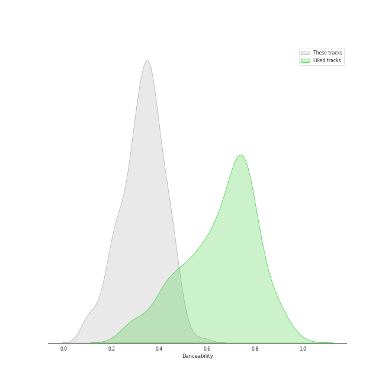
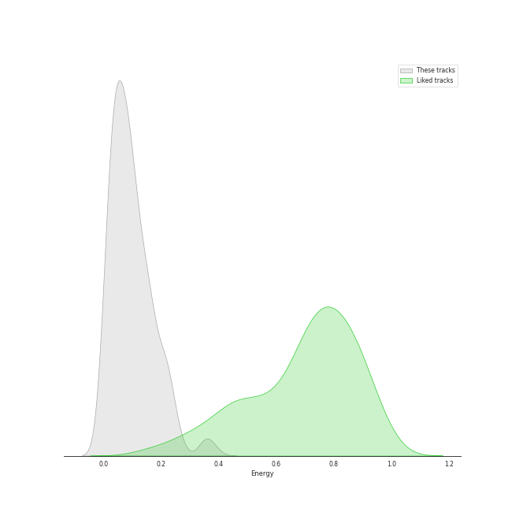
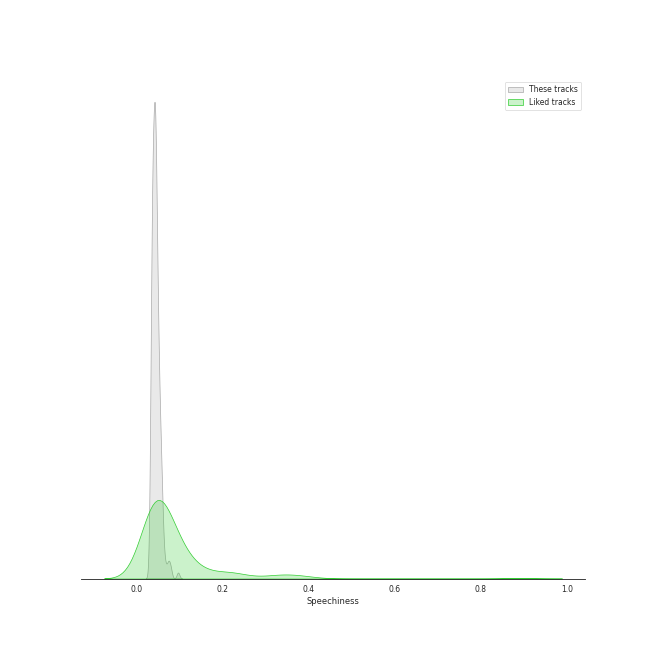
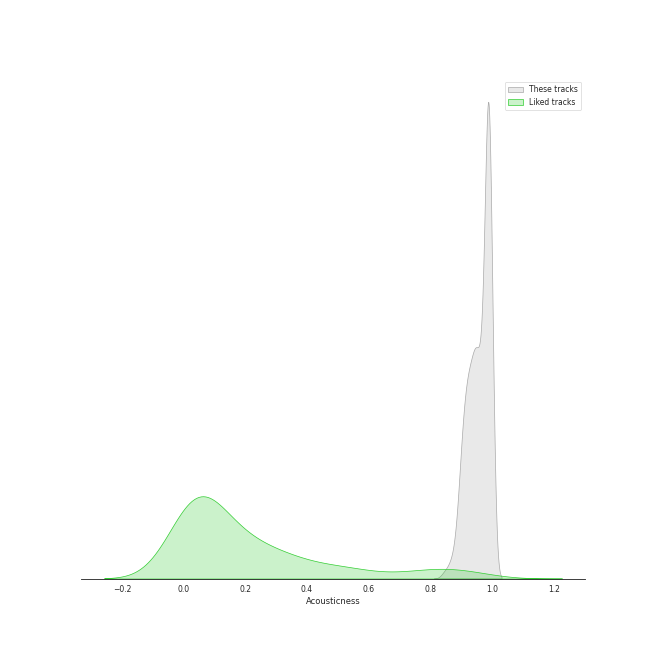
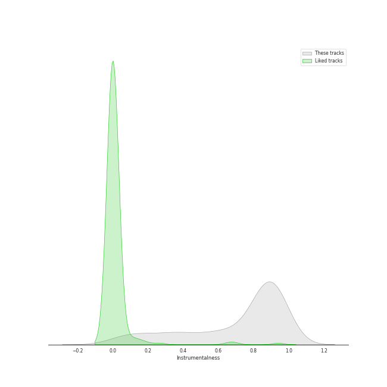
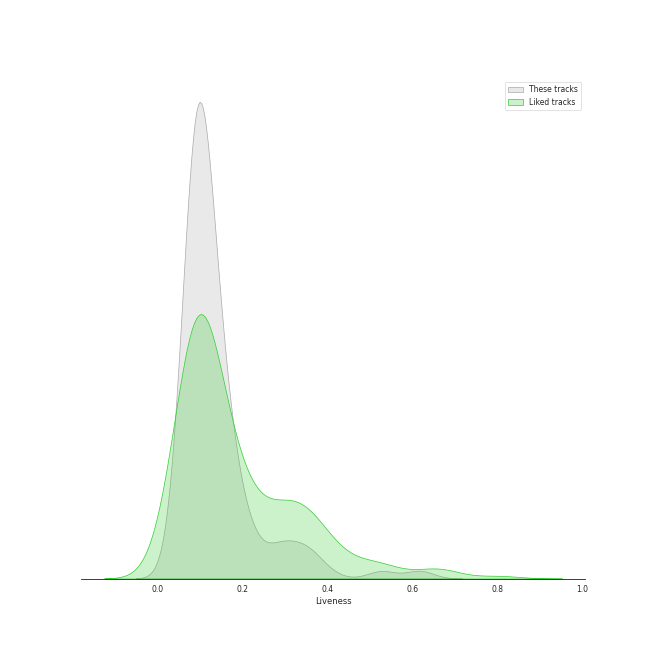
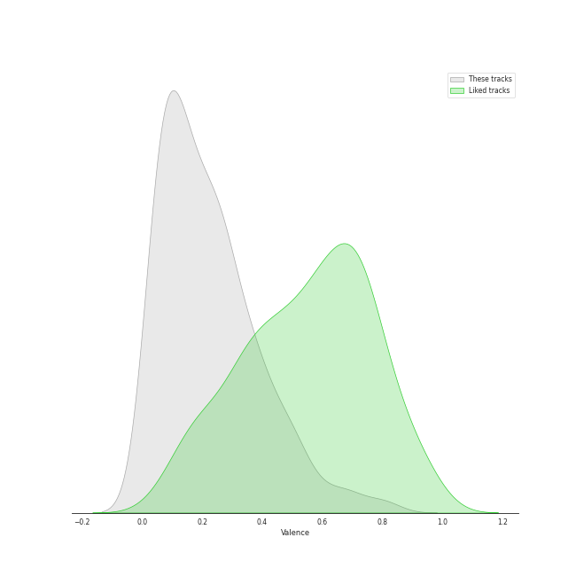
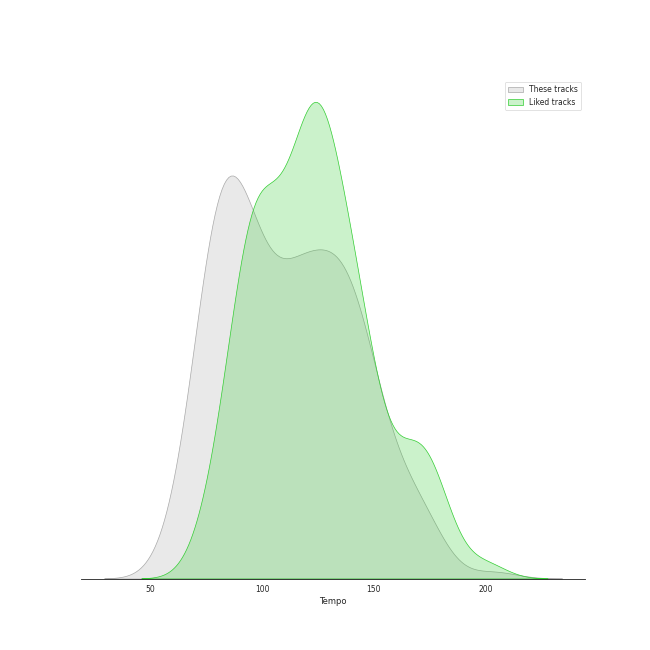

# Track Features for Ludwig van Beethoven

## Danceability

| ​ | 10 most Danceable tracks | ​​ | 10 least Danceable tracks |
|:---|:---|:---|:---|
|  | Piano Sonata No. 12 in A flat, Op. 26: 3. Marcia funebre sulla morte d'un Eroe (0.584) |  | Symphony No. 9 in D Minor, Op. 125 "Choral": 3. Adagio molto e cantabile (0.062) |
|  | String Quartet No. 2 in G Major, Op. 18, No. 2: IV. Allegro molto, quasi presto (0.527) |  | Symphony No. 3 in E Flat Major, Op. 55 "Eroica": 2. Marcia funebre (Adagio assai) (0.0871) |
|  | Piano Sonata No. 2 in A, Op. 2 No. 2: 3. Scherzo (Allegretto) (0.521) |  | String Quartet No. 8 in E Minor, Op. 59 No. 2: II. Molto adagio (0.0914) |
|  | Piano Sonata No. 14 in C-Sharp Minor, Op. 27 No. 2 "Moonlight": II. Allegretto (0.504) |  | Symphony No. 6 in F Major, Op. 68 "Pastoral": 2. Szene am Bach: (Andante molto mosso) (0.103) |
|  | String Quartet No. 4 in C Minor, Op. 18, No. 4: II. Andante scherzoso quasi allegretto (0.496) |  | String Quartet No. 15 in A minor, Op. 132: III. Molto adagio (0.105) |
|  | String Quartet No. 2 in G Major, Op. 18, No. 2: III. Scherzo (Allegro) - Trio (0.493) |  | String Quartet No. 16 in F Major, Op. 135: III. Lento assai, cantate e tranquillo - Più lento (0.111) |
|  | Piano Sonata No. 5 in C minor, Op. 10 No. 1: 2. Adagio molto (0.49) |  | Symphony No. 4 in B Flat Major, Op. 60: 2. Adagio (0.125) |
|  | String Quartet No. 4 in C Minor, Op. 18 No. 4: II. Andante scherzoso quasi allegretto (0.48) |  | String Quartet No. 1 in F Major, Op. 18 No. 1: II. Adagio affettuoso ed appassionato (0.125) |
|  | String Quartet No. 6 in B-Flat Major, Op. 18 No. 6: I. Allegro con brio (0.477) |  | Symphony No. 5 in C Minor, Op. 67: 2. Andante con moto (0.126) |
|  | String Quartet No. 5 in A Major, Op. 18 No. 5: I. Allegro (0.475) |  | String Quartet No. 14 in C-Sharp Minor, Op. 131: I. Adagio ma non troppo e molto espressivo (0.135) |

## Energy

| ​ | 10 most Energetic tracks | ​​ | 10 least Energetic tracks |
|:---|:---|:---|:---|
|  | Symphony No. 7 in A Major, Op. 92: 4. Allegro con brio (0.385) |  | Piano Sonata No. 21 in C Major, Op. 53 "Waldstein": II. Introduzione (Adagio molto) (0.00157) |
|  | Symphony No. 5 in C Minor, Op. 67: 4. Allegro (0.358) |  | Piano Sonata No. 31 in A flat, Op. 110: 3. Adagio ma non troppo (0.00168) |
|  | Symphony No. 9 in D Minor, Op. 125 "Choral": "O Freunde nicht diese Töne" - (0.355) |  | Piano Sonata No. 14 in C-Sharp Minor, Op. 27 No. 2 "Moonlight": I. Adagio sostenuto (0.0025) |
|  | Piano Sonata No. 6 in F, Op. 10 No. 2: 3. Presto (0.351) |  | Piano Sonata No. 31 in A-Flat Major, Op. 110: III. Adagio ma non troppo (0.00293) |
|  | Symphony No. 6 in F Major, Op. 68 "Pastoral": 4. Gewitter, Sturm (Allegro) (0.288) |  | Piano Sonata No. 2 in A, Op. 2 No. 2: 2. Largo appassionato (0.00343) |
|  | Symphony No. 5 in C Minor, Op. 67: 1. Allegro con brio (0.263) |  | Piano Sonata No. 4 in E flat, Op. 7: 2. Largo, con gran espressione (0.00362) |
|  | String Quartet No. 16 in F Major, Op. 135: II. Vivace (0.253) |  | Piano Sonata No. 3 in C Major, Op. 2 No. 3: II. Adagio (0.00389) |
|  | Piano Sonata No. 13 in E flat, Op. 27 No. 1: 4. Allegro vivace - Tempo I - Presto (0.247) |  | Piano Sonata No. 25 in G, Op. 79: 2. Andante (0.00446) |
|  | Piano Sonata No. 23 in F Minor, Op. 57 "Appassionata": III. Allegro ma non troppo (0.245) |  | Piano Sonata No. 3 in C, Op. 2 No. 3: 2. Adagio (0.00451) |
|  | Symphony No. 8 in F Major, Op. 93: IV. Allegro vivace (0.231) |  | Piano Sonata No. 13 in E flat, Op. 27 No. 1: 3. Adagio con espressione (0.00484) |

## Speechiness

| ​ | 10 most Speechy tracks | ​​ | 10 least Speechy tracks |
|:---|:---|:---|:---|
|  | Piano Sonata No. 21 in C Major, Op. 53 "Waldstein": II. Introduzione (Adagio molto) (0.0974) |  | Piano Sonata No. 25 in G, Op. 79: 3. Vivace (0.0322) |
|  | Piano Sonata No. 19 in G minor, Op. 49 No. 1: 2. Rondo (Allegro) (0.0889) |  | Piano Sonata No. 12 in A flat, Op. 26: 4. Allegro (0.0323) |
|  | String Quartet No. 11 in F Minor, Op. 95 "Quartetto serioso": III. Allegro assai - Vivace ma serioso (0.0807) |  | Symphony No. 8 in F Major, Op. 93: III. Tempo di menuetto (0.0332) |
|  | Symphony No. 1 in C Major, Op. 21: 3. Menuetto (Allegro molto e vivace) (0.0779) |  | Piano Sonata No. 22 in F, Op. 54: 2. Allegretto (0.034) |
|  | Piano Sonata No. 12 in A flat, Op. 26: 3. Marcia funebre sulla morte d'un Eroe (0.075) |  | Piano Sonata No. 9 in E, Op. 14 No. 1: 3. Rondo (Allegro comodo) (0.0342) |
|  | Symphony No. 9 in D Minor, Op. 125 "Choral": "O Freunde nicht diese Töne" - (0.0736) |  | Piano Sonata No. 1 in F minor, Op. 2 No. 1: 4. Prestissimo (0.0343) |
|  | String Quartet No. 6 in B-Flat Major, Op. 18 No. 6: III. Scherzo (Allegro) - Trio (0.0689) |  | Piano Sonata No. 1 in F Minor, Op. 2 No. 1: IV. Prestissimo (0.0345) |
|  | String Quartet No. 4 in C Minor, Op. 18, No. 4: II. Andante scherzoso quasi allegretto (0.0682) |  | Symphony No. 8 in F Major, Op. 93: I. Allegro vivace e con brio (0.0347) |
|  | Piano Sonata No. 22 in F, Op. 54: 1. In Tempo d'un Menuetto (0.066) |  | Piano Sonata No. 11 in B flat, Op. 22: 4. Rondo (Allegretto) (0.0348) |
|  | String Quartet No. 1 in F Major, Op. 18 No. 1: I. Allegro con brio (0.0636) |  | Piano Sonata No. 18 in E flat, Op. 31 No. 3 -"The Hunt": 4. Presto con fuoco (0.0348) |

## Acousticness

| ​ | 10 most Acoustic tracks | ​​ | 10 least Acoustic tracks |
|:---|:---|:---|:---|
|  | Piano Sonata No. 25 in G, Op. 79: 2. Andante (0.995) |  | Symphony No. 6 in F Major, Op. 68 "Pastoral": 4. Gewitter, Sturm (Allegro) (0.792) |
|  | Piano Sonata No. 19 in G minor, Op. 49 No. 1: 1. Andante (0.995) |  | Symphony No. 7 in A Major, Op. 92: 4. Allegro con brio (0.847) |
|  | Piano Sonata No. 9 in E, Op. 14 No. 1: 2. Allegretto (0.995) |  | String Quartet No. 15 in A minor, Op. 132: III. Molto adagio (0.865) |
|  | Piano Sonata No. 31 in A-Flat Major, Op. 110: III. Adagio ma non troppo (0.995) |  | String Quartet No. 16 in F Major, Op. 135: III. Lento assai, cantate e tranquillo - Più lento (0.869) |
|  | Piano Sonata No. 19 in G minor, Op. 49 No. 1: 2. Rondo (Allegro) (0.995) |  | String Quartet No. 11 in F Minor, Op. 95 "Serioso": I. Allegro con brio (0.877) |
|  | Piano Sonata No. 1 in F Minor, Op. 2 No. 1: III. Menuetto. Allegretto (0.995) |  | String Quartet No. 2 in G Major, Op. 18, No. 2: IV. Allegro molto, quasi presto (0.879) |
|  | Piano Sonata No. 2 in A Major, Op. 2 No. 2: III. Scherzo & Trio. Allegretto (0.994) |  | String Quartet No. 1 in F Major, Op. 18 No. 1: IV. Allegro (0.887) |
|  | Piano Sonata No. 1 in F minor, Op. 2 No. 1: 3. Menuetto (Allegretto) (0.994) |  | String Quartet No. 14 in C-Sharp Minor, Op. 131: V. Presto (0.887) |
|  | Piano Sonata No. 3 in C Major, Op. 2 No. 3: II. Adagio (0.994) |  | String Quartet No. 3 in D Major, Op. 18: III. Allegro (0.888) |
|  | Piano Sonata No. 20 in G, Op. 49 No. 2: 2. Tempo di Menuetto (0.994) |  | String Quartet No. 3 in D Major, Op. 18: I. Allegro (0.888) |

## Instrumentalness

| ​ | 10 most Instrumental tracks | ​​ | 10 least Instrumental tracks |
|:---|:---|:---|:---|
|  | String Quartet No. 14 in C-Sharp Minor, Op. 131: VI. Adagio quasi un poco andante (0.97) |  | String Quartet No. 6 in B-Flat Major, Op. 18 No. 6: II. Adagio ma non troppo (0.00346) |
|  | Piano Sonata No. 31 in A-Flat Major, Op. 110: II. Allegro molto (0.949) |  | String Quartet No. 2 in G Major, Op. 18, No. 2: I. Allegro (0.0207) |
|  | Piano Sonata No. 30 in E Major, Op. 109: I. Vivace ma non troppo (0.948) |  | String Quartet No. 1 in F Major, Op. 18 No. 1: II. Adagio affettuoso ed appassionato (0.0515) |
|  | Piano Sonata No. 2 in A Major, Op. 2 No. 2: II. Largo appassionato (0.945) |  | String Quartet No. 13 in B-Flat Major, Op. 130: IV. Alla danza tedesca (allegro assai) (0.0559) |
|  | Piano Sonata No. 9 in E, Op. 14 No. 1: 2. Allegretto (0.941) |  | String Quartet No. 14 in C-Sharp Minor, Op. 131: II. Allegro molto vivace (0.059) |
|  | Piano Sonata No. 25 in G, Op. 79: 2. Andante (0.938) |  | Symphony No. 9 in D Minor, Op. 125 "Choral": "O Freunde nicht diese Töne" - (0.0625) |
|  | Piano Sonata No. 26 in E-Flat Major, Op. 81a "Les Adieux": II. Abwesendheit (Andante espressivo) (0.935) |  | String Quartet No. 14 in C-Sharp Minor, Op. 131: IV. Andante ma non troppo e molto cantabile (0.0637) |
|  | Piano Sonata No. 5 in C minor, Op. 10 No. 1: 3. Finale (Prestissimo) (0.935) |  | String Quartet No. 8 in E Minor, Op. 59 No. 2: IV. Finale (Presto) (0.0647) |
|  | Piano Sonata No. 24 in F-Sharp Major, Op. 78 "For Therese": 1. Adagio cantabile - Allegro ma non troppo (0.935) |  | String Quartet No. 1 in F Major, Op. 18 No. 1: IV. Allegro (0.07) |
|  | Piano Sonata No. 15 in D, Op. 28 -"Pastorale": 2. Andante (0.933) |  | String Quartet No. 5 in A Major, Op. 18 No. 5: II. Menuetto - Trio (0.0749) |

## Liveness

| ​ | 10 most Live tracks | ​​ | 10 least Live tracks |
|:---|:---|:---|:---|
|  | String Quartet No. 2 in G Major, Op. 18, No. 2: III. Scherzo (Allegro) - Trio (0.62) |  | String Quartet No. 3 in D Major, Op. 18: I. Allegro (0.045) |
|  | Symphony No. 5 in C Minor, Op. 67: 3. Allegro (0.614) |  | Piano Sonata No. 32 in C minor, Op. 111: 2. Arietta (Adagio molto semplice e cantabile) (0.0511) |
|  | Symphony No. 9 in D Minor, Op. 125 "Choral": 4. Presto (0.535) |  | Symphony No. 1 in C Major, Op. 21: 3. Menuetto (Allegro molto e vivace) (0.0554) |
|  | String Quartet No. 10 in E-Flat Major, Op. 74 "Harp": III. Presto - Più presto quasi prestissimo (0.52) |  | Piano Sonata No. 8 in C Minor, Op. 13 "Pathétique": III. Rondo (Allegro) (0.0575) |
|  | String Quartet No. 13 in B-Flat Major, Op. 130: I. Adagio ma non troppo – Allegro (0.402) |  | Piano Sonata No. 31 in A flat, Op. 110: 1. Moderato cantabile molto espressivo (0.0588) |
|  | String Quartet No. 3 in D Major, Op. 18: III. Allegro (0.386) |  | String Quartet No. 8 in E Minor, Op. 59 No. 2: I. Allegro (0.0611) |
|  | Symphony No. 8 in F Major, Op. 93: I. Allegro vivace e con brio (0.375) |  | Piano Sonata No. 3 in C, Op. 2 No. 3: 4. Allegro assai (0.0615) |
|  | String Quartet No. 5 in A Major, Op. 18 No. 5: IV. Allegro (0.368) |  | Piano Sonata No. 29 in B flat, Op. 106 -"Hammerklavier": 3. Adagio sostenuto (0.0616) |
|  | Piano Sonata No. 30 in E, Op. 109: 1. Vivace, ma non troppo - Adagio espressivo - Tempo I (0.362) |  | String Quartet No. 5 in A Major, Op. 18 No. 5: II. Menuetto - Trio (0.0625) |
|  | Symphony No. 4 in B Flat Major, Op. 60: 4. Allegro ma non troppo (0.359) |  | String Quartet No. 6 in B-Flat Major, Op. 18 No. 6: III. Scherzo (Allegro) - Trio (0.0631) |

## Valence

| ​ | 10 most Happy tracks | ​​ | 10 least Happy tracks |
|:---|:---|:---|:---|
|  | Piano Sonata No. 6 in F, Op. 10 No. 2: 3. Presto (0.814) |  | String Quartet No. 16 in F Major, Op. 135: III. Lento assai, cantate e tranquillo - Più lento (0.0347) |
|  | Piano Sonata No. 25 in G, Op. 79: 3. Vivace (0.791) |  | Piano Sonata No. 31 in A-Flat Major, Op. 110: III. Adagio ma non troppo (0.0355) |
|  | String Quartet No. 6 in B-Flat Major, Op. 18 No. 6: III. Scherzo (Allegro) - Trio (0.705) |  | Piano Sonata No. 29 in B flat, Op. 106 -"Hammerklavier": 3. Adagio sostenuto (0.0356) |
|  | String Quartet No. 6 in B-Flat Major, Op. 18 No. 6: III. Scherzo (Allegro) - Trio (0.694) |  | Symphony No. 3 in E Flat Major, Op. 55 "Eroica": 2. Marcia funebre (Adagio assai) (0.0366) |
|  | Piano Sonata No. 31 in A-Flat Major, Op. 110: II. Allegro molto (0.652) |  | Piano Sonata No. 31 in A flat, Op. 110: 3. Adagio ma non troppo (0.0367) |
|  | Piano Sonata No. 12 in A flat, Op. 26: 4. Allegro (0.652) |  | String Quartet No. 8 in E Minor, Op. 59 No. 2: II. Molto adagio (0.0377) |
|  | String Quartet No. 16 in F Major, Op. 135: II. Vivace (0.581) |  | String Quartet No. 13 in B-Flat Major, Op. 130: V. Cavatina (Adagio molto espressivo) (0.0383) |
|  | Piano Sonata No. 3 in C, Op. 2 No. 3: 3. Scherzo (Allegro) (0.574) |  | String Quartet No. 1 in F Major, Op. 18 No. 1: II. Adagio affettuoso ed appassionato (0.0383) |
|  | Piano Sonata No. 3 in C Major, Op. 2 No. 3: III. Scherzo & Trio. Allegro (0.573) |  | String Quartet No. 10 in E-Flat Major, Op. 74 "Harp": II. Adagio ma non troppo (0.0386) |
|  | String Quartet No. 2 in G Major, Op. 18, No. 2: III. Scherzo (Allegro) - Trio (0.558) |  | String Quartet No. 15 in A minor, Op. 132: III. Molto adagio (0.0386) |

## Tempo

| ​ | 10 most Fast tracks | ​​ | 10 least Fast tracks |
|:---|:---|:---|:---|
|  | Piano Sonata No. 29 in B flat, Op. 106 -"Hammerklavier": 2. Scherzo (Assai vivace - Presto - Prestissimo - Tempo I) (203.867) |  | Symphony No. 7 in A Major, Op. 92: 3. Presto - Assai meno presto (59.821) |
|  | String Quartet No. 11 in F Minor, Op. 95 "Quartetto serioso": III. Allegro assai - Vivace ma serioso (179.045) |  | Piano Sonata No. 13 in E flat, Op. 27 No. 1: 3. Adagio con espressione (60.671) |
|  | String Quartet No. 12 in E-Flat Major, Op. 127: III. Scherzando vivace (174.606) |  | Egmont, Op. 84: Ouverture - Sostenuto, ma non troppo - Allegro (62.227) |
|  | String Quartet No. 6 in B-Flat Major, Op. 18 No. 6: III. Scherzo (Allegro) - Trio (172.548) |  | Symphony No. 3 in E Flat Major, Op. 55 "Eroica": 2. Marcia funebre (Adagio assai) (62.976) |
|  | Piano Sonata No. 9 in E, Op. 14 No. 1: 1. Allegro (172.047) |  | Symphony No. 4 in B Flat Major, Op. 60: 2. Adagio (63.776) |
|  | String Quartet No. 3 in D Major, Op. 18: IV. Presto (171.742) |  | Piano Sonata No. 22 in F, Op. 54: 1. In Tempo d'un Menuetto (64.303) |
|  | String Quartet No. 6 in B-Flat Major, Op. 18 No. 6: III. Scherzo (Allegro) - Trio (171.063) |  | Piano Sonata No. 15 in D, Op. 28 -"Pastorale": 1. Allegro (64.804) |
|  | String Quartet No. 7 In F Major, Op. 59 No. 1: II. Allegretto vivace e sempre scherzando (168.809) |  | Piano Sonata No. 32 in C Minor, Op. 111: II. Arietta. Adagio molto semplice e cantabile (65.297) |
|  | String Quartet No. 15 in A minor, Op. 132: V. Allegro appassionato - Presto (168.282) |  | Piano Sonata No. 13 in E flat, Op. 27 No. 1: 1. Andante - Allegro - Tempo I (65.373) |
|  | String Quartet No. 2 in G Major, Op. 18, No. 2: IV. Allegro molto, quasi presto (167.97) |  | Symphony No. 9 in D Minor, Op. 125 "Choral": 3. Adagio molto e cantabile (66.366) |
