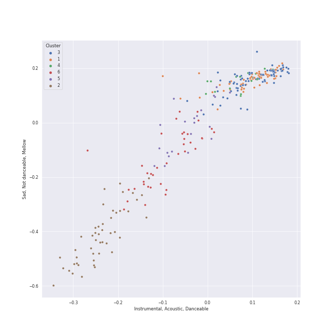

# Clusters in Ludwig van Beethoven

## Cluster #1

59 tracks

| Art | Track | Album | Artists | Label | Rank | 💚 | 🔗 |
|:---|:---|:---|:---|:---|---:|:---|:---|
|  | Piano Sonata No. 11 in B flat, Op. 22: 1. Allegro con brio | Beethoven: The Piano Sonatas | [Ludwig van Beethoven](../../overview.md), [Vladimir Ashkenazy](../../../vladimir_ashkenazy/overview.md) | [Decca Music Group Ltd.](../../../../labels/decca_music_group_ltd_) | 888 | | [🔗](https://open.spotify.com/track/0JGm7LxCumF7nRrUlF5QIt) |
|  | Piano Sonata No. 30 in E, Op. 109: 2. Prestissimo | Beethoven: The Piano Sonatas | [Ludwig van Beethoven](../../overview.md), [Vladimir Ashkenazy](../../../vladimir_ashkenazy/overview.md) | [Decca Music Group Ltd.](../../../../labels/decca_music_group_ltd_) | 888 | | [🔗](https://open.spotify.com/track/0ZIhFlc89d2jvgfcgfKpwN) |
|  | Piano Sonata No. 1 in F minor, Op. 2 No. 1: 4. Prestissimo | Beethoven: The Piano Sonatas | [Ludwig van Beethoven](../../overview.md), [Vladimir Ashkenazy](../../../vladimir_ashkenazy/overview.md) | [Decca Music Group Ltd.](../../../../labels/decca_music_group_ltd_) | 888 | | [🔗](https://open.spotify.com/track/1Wrn95wC9svYqRRPovuW8x) |
|  | Piano Sonata No. 1 in F minor, Op. 2 No. 1: 1. Allegro | Beethoven: The Piano Sonatas | [Ludwig van Beethoven](../../overview.md), [Vladimir Ashkenazy](../../../vladimir_ashkenazy/overview.md) | [Decca Music Group Ltd.](../../../../labels/decca_music_group_ltd_) | 888 | | [🔗](https://open.spotify.com/track/2E0Q7KZ2b6wTMsuDA8lRhz) |
|  | Piano Sonata No. 16 in G, Op. 31 No. 1: 1. Allegro vivace | Beethoven: The Piano Sonatas | [Ludwig van Beethoven](../../overview.md), [Vladimir Ashkenazy](../../../vladimir_ashkenazy/overview.md) | [Decca Music Group Ltd.](../../../../labels/decca_music_group_ltd_) | 888 | | [🔗](https://open.spotify.com/track/5r3qjqRLBS0SsLkuuBVntw) |
|  | Piano Sonata No. 6 in F, Op. 10 No. 2: 1. Allegro | Beethoven: The Piano Sonatas | [Ludwig van Beethoven](../../overview.md), [Vladimir Ashkenazy](../../../vladimir_ashkenazy/overview.md) | [Decca Music Group Ltd.](../../../../labels/decca_music_group_ltd_) | 888 | | [🔗](https://open.spotify.com/track/66Jfdc0nO0rGPxOQN6yfXz) |
|  | Piano Sonata No. 11 in B flat, Op. 22: 3. Menuetto | Beethoven: The Piano Sonatas | [Ludwig van Beethoven](../../overview.md), [Vladimir Ashkenazy](../../../vladimir_ashkenazy/overview.md) | [Decca Music Group Ltd.](../../../../labels/decca_music_group_ltd_) | 888 | | [🔗](https://open.spotify.com/track/6Cf92UVZEP2X4IVG96Rxlx) |
|  | Piano Sonata No. 4 in E flat, Op. 7: 3. Allegro | Beethoven: The Piano Sonatas | [Ludwig van Beethoven](../../overview.md), [Vladimir Ashkenazy](../../../vladimir_ashkenazy/overview.md) | [Decca Music Group Ltd.](../../../../labels/decca_music_group_ltd_) | 888 | | [🔗](https://open.spotify.com/track/7mjP1zIbYt98zXkL5HUIBs) |
|  | Piano Sonata No. 3 in C Major, Op. 2 No. 3: IV. Allegro assai | Beethoven: Piano Sonatas Nos. 1-3 | [Ludwig van Beethoven](../../overview.md), Mari Kodama | [PENTATONE](../../../../labels/pentatone) | 888 | | [🔗](https://open.spotify.com/track/3pZt5RCBnQty2KDduZaBJp) |
|  | Piano Sonata No. 2 in A Major, Op. 2 No. 2: I. Allegro vivace | Beethoven: Piano Sonatas Nos. 1-3 | [Ludwig van Beethoven](../../overview.md), Mari Kodama | [PENTATONE](../../../../labels/pentatone) | 888 | | [🔗](https://open.spotify.com/track/4qcfJuhj4OyVlrbYNmBo2P) |
## Cluster #2

47 tracks

| Art | Track | Album | Artists | Label | Rank | 💚 | 🔗 |
|:---|:---|:---|:---|:---|---:|:---|:---|
|  | Symphony No. 3 In E Flat, Op. 55 -"Eroica": 3. Scherzo (Allegro vivace) | Beethoven: 9 Symphonies; Overtures | [Ludwig van Beethoven](../../overview.md), [Berliner Philharmoniker](../../../berliner_philharmoniker/overview.md), [Herbert von Karajan](../../../herbert_von_karajan/overview.md) | [Deutsche Grammophon (DG)](../../../../labels/deutsche_grammophon_(dg)) | 888 | | [🔗](https://open.spotify.com/track/5b3322i4oAchfQQfcwZcxV) |
|  | String Quartet No. 14 in C-Sharp Minor, Op. 131: III. Allegro moderato - Adagio - Piu vivace | Beethoven: Complete String Quartets | [Ludwig van Beethoven](../../overview.md), [Tokyo String Quartet](../../../tokyo_string_quartet/overview.md) | [harmonia mundi](../../../../labels/harmonia_mundi) | 888 | | [🔗](https://open.spotify.com/track/0qAphY2YKqhNBrYaWucjQu) |
|  | String Quartet No. 12 in E-Flat Major, Op. 127: I. Maestoso - Allegro | Beethoven: Complete String Quartets | [Ludwig van Beethoven](../../overview.md), [Tokyo String Quartet](../../../tokyo_string_quartet/overview.md) | [harmonia mundi](../../../../labels/harmonia_mundi) | 888 | | [🔗](https://open.spotify.com/track/1Oj4z7SesvJsdi52adQHkG) |
|  | String Quartet No. 7 In F Major, Op. 59 No. 1: II. Allegretto vivace e sempre scherzando | Beethoven: Complete String Quartets | [Ludwig van Beethoven](../../overview.md), [Tokyo String Quartet](../../../tokyo_string_quartet/overview.md) | [harmonia mundi](../../../../labels/harmonia_mundi) | 888 | | [🔗](https://open.spotify.com/track/2T4zPGpKePodbDlA9LHMDj) |
|  | String Quartet No. 3 in D Major, Op. 18: I. Allegro | Beethoven: Complete String Quartets | [Ludwig van Beethoven](../../overview.md), [Tokyo String Quartet](../../../tokyo_string_quartet/overview.md) | [harmonia mundi](../../../../labels/harmonia_mundi) | 888 | | [🔗](https://open.spotify.com/track/4UbcuUdeuzNJDajkn0ger7) |
|  | String Quartet No. 5 in A Major, Op. 18 No. 5: III. Andante cantabile | Beethoven: Complete String Quartets | [Ludwig van Beethoven](../../overview.md), [Tokyo String Quartet](../../../tokyo_string_quartet/overview.md) | [harmonia mundi](../../../../labels/harmonia_mundi) | 888 | | [🔗](https://open.spotify.com/track/4WOEg6BxJIlMVx3mz8gJSw) |
|  | String Quartet No. 3 in D Major, Op. 18: III. Allegro | Beethoven: Complete String Quartets | [Ludwig van Beethoven](../../overview.md), [Tokyo String Quartet](../../../tokyo_string_quartet/overview.md) | [harmonia mundi](../../../../labels/harmonia_mundi) | 888 | | [🔗](https://open.spotify.com/track/5G6akNf0PvWHz7vtgEmPzn) |
|  | String Quartet No. 13 in B-Flat Major, Op. 130: III. Andante con moto ma non troppo | Beethoven: Complete String Quartets | [Ludwig van Beethoven](../../overview.md), [Tokyo String Quartet](../../../tokyo_string_quartet/overview.md) | [harmonia mundi](../../../../labels/harmonia_mundi) | 888 | | [🔗](https://open.spotify.com/track/5ZDsIt23kqzWVzusGej26t) |
|  | String Quartet No. 1 in F Major, Op. 18 No. 1: I. Allegro con brio | Beethoven: Complete String Quartets | [Ludwig van Beethoven](../../overview.md), [Tokyo String Quartet](../../../tokyo_string_quartet/overview.md) | [harmonia mundi](../../../../labels/harmonia_mundi) | 888 | | [🔗](https://open.spotify.com/track/77ZbS58RGMl0RE3S9TLSXx) |
|  | String Quartet No. 14 in C-Sharp Minor, Op. 131: VII. Allegro | Beethoven: Complete String Quartets | [Ludwig van Beethoven](../../overview.md), [Tokyo String Quartet](../../../tokyo_string_quartet/overview.md) | [harmonia mundi](../../../../labels/harmonia_mundi) | 888 | | [🔗](https://open.spotify.com/track/78BbLe00QHPhPvMoPgiqu7) |
## Cluster #3

80 tracks

| Art | Track | Album | Artists | Label | Rank | 💚 | 🔗 |
|:---|:---|:---|:---|:---|---:|:---|:---|
|  | Piano Sonata No. 29 in B flat, Op. 106 -"Hammerklavier": 2. Scherzo (Assai vivace - Presto - Prestissimo - Tempo I) | Beethoven: The Piano Sonatas | [Ludwig van Beethoven](../../overview.md), [Vladimir Ashkenazy](../../../vladimir_ashkenazy/overview.md) | [Decca Music Group Ltd.](../../../../labels/decca_music_group_ltd_) | 888 | | [🔗](https://open.spotify.com/track/0p7MucNl42X928zuT1iZCX) |
|  | Piano Sonata No. 24 in F-Sharp Major, Op. 78 "For Therese": 1. Adagio cantabile - Allegro ma non troppo | Beethoven: The Piano Sonatas | [Ludwig van Beethoven](../../overview.md), [Vladimir Ashkenazy](../../../vladimir_ashkenazy/overview.md) | [Decca Music Group Ltd.](../../../../labels/decca_music_group_ltd_) | 888 | | [🔗](https://open.spotify.com/track/26CdQ7JMFDD8kSjpebz2eu) |
|  | Piano Sonata No. 15 in D, Op. 28 -"Pastorale": 1. Allegro | Beethoven: The Piano Sonatas | [Ludwig van Beethoven](../../overview.md), [Vladimir Ashkenazy](../../../vladimir_ashkenazy/overview.md) | [Decca Music Group Ltd.](../../../../labels/decca_music_group_ltd_) | 888 | | [🔗](https://open.spotify.com/track/3eiAUStWjc93DBuEPlEBSP) |
|  | Piano Sonata No. 16 in G, Op. 31 No. 1: 3. Rondo (Allegretto) | Beethoven: The Piano Sonatas | [Ludwig van Beethoven](../../overview.md), [Vladimir Ashkenazy](../../../vladimir_ashkenazy/overview.md) | [Decca Music Group Ltd.](../../../../labels/decca_music_group_ltd_) | 888 | | [🔗](https://open.spotify.com/track/4QpCaoTElARQj31WH2lPAx) |
|  | Piano Sonata No. 6 in F, Op. 10 No. 2: 2. Allegretto | Beethoven: The Piano Sonatas | [Ludwig van Beethoven](../../overview.md), [Vladimir Ashkenazy](../../../vladimir_ashkenazy/overview.md) | [Decca Music Group Ltd.](../../../../labels/decca_music_group_ltd_) | 888 | | [🔗](https://open.spotify.com/track/4gThvgaLCcABLJIFFKTlig) |
|  | Piano Sonata No. 16 in G, Op. 31 No. 1: 2. Adagio grazioso | Beethoven: The Piano Sonatas | [Ludwig van Beethoven](../../overview.md), [Vladimir Ashkenazy](../../../vladimir_ashkenazy/overview.md) | [Decca Music Group Ltd.](../../../../labels/decca_music_group_ltd_) | 888 | | [🔗](https://open.spotify.com/track/55X24BGkDWD7lsHNsmGSY3) |
|  | Piano Sonata No. 26 in E-Flat Major, Op. 81a "Les Adieux": I. Das Lebewohl (Adagio - Allegro) | Beethoven: The Piano Sonatas | [Ludwig van Beethoven](../../overview.md), [Vladimir Ashkenazy](../../../vladimir_ashkenazy/overview.md) | [Decca Music Group Ltd.](../../../../labels/decca_music_group_ltd_) | 888 | | [🔗](https://open.spotify.com/track/76915vyJFSFWrz8AYVMN2p) |
|  | Piano Sonata No. 8 in C Minor, Op. 13 "Pathétique": I. Grave - Allegro di molto e con brio | Beethoven: Piano Sonatas "Moonlight"; "Appassionata"; "Pathétique" | [Ludwig van Beethoven](../../overview.md), [Vladimir Ashkenazy](../../../vladimir_ashkenazy/overview.md) | [Decca Music Group Ltd.](../../../../labels/decca_music_group_ltd_) | 888 | | [🔗](https://open.spotify.com/track/1BBoow3jdOQDYqUUSVHcqt) |
|  | Piano Sonata No. 8 in C Minor, Op. 13 "Pathétique": II. Adagio cantabile | Beethoven: Piano Sonatas "Moonlight"; "Appassionata"; "Pathétique" | [Ludwig van Beethoven](../../overview.md), [Vladimir Ashkenazy](../../../vladimir_ashkenazy/overview.md) | [Decca Music Group Ltd.](../../../../labels/decca_music_group_ltd_) | 888 | | [🔗](https://open.spotify.com/track/29lgND5UlmYysapjjplX1k) |
|  | Piano Sonata No. 14 in C-Sharp Minor, Op. 27 No. 2 "Moonlight": III. Presto agitato | Beethoven: Piano Sonatas "Moonlight"; "Appassionata"; "Pathétique" | [Ludwig van Beethoven](../../overview.md), [Vladimir Ashkenazy](../../../vladimir_ashkenazy/overview.md) | [Decca Music Group Ltd.](../../../../labels/decca_music_group_ltd_) | 888 | | [🔗](https://open.spotify.com/track/65EtDy80IN2jnroVPhiOtx) |
## Cluster #4

17 tracks

| Art | Track | Album | Artists | Label | Rank | 💚 | 🔗 |
|:---|:---|:---|:---|:---|---:|:---|:---|
|  | Piano Sonata No. 10 in G Major, Op. 14 No. 2: 3. Scherzo. Allegro assai | Beethoven: The Piano Sonatas | [Ludwig van Beethoven](../../overview.md), [Vladimir Ashkenazy](../../../vladimir_ashkenazy/overview.md) | [Decca Music Group Ltd.](../../../../labels/decca_music_group_ltd_) | 888 | | [🔗](https://open.spotify.com/track/0VEufDhQQQvz863wJ7unXm) |
|  | Piano Sonata No. 3 in C, Op. 2 No. 3: 3. Scherzo (Allegro) | Beethoven: The Piano Sonatas | [Ludwig van Beethoven](../../overview.md), [Vladimir Ashkenazy](../../../vladimir_ashkenazy/overview.md) | [Decca Music Group Ltd.](../../../../labels/decca_music_group_ltd_) | 888 | | [🔗](https://open.spotify.com/track/0cG1eHAxX9qgBoHkmJMEhl) |
|  | Piano Sonata No. 12 in A flat, Op. 26: 2. Scherzo (Allegro molto) | Beethoven: The Piano Sonatas | [Ludwig van Beethoven](../../overview.md), [Vladimir Ashkenazy](../../../vladimir_ashkenazy/overview.md) | [Decca Music Group Ltd.](../../../../labels/decca_music_group_ltd_) | 888 | | [🔗](https://open.spotify.com/track/1ceRZjxysooUhNqjsvetIF) |
|  | Piano Sonata No. 19 in G minor, Op. 49 No. 1: 2. Rondo (Allegro) | Beethoven: The Piano Sonatas | [Ludwig van Beethoven](../../overview.md), [Vladimir Ashkenazy](../../../vladimir_ashkenazy/overview.md) | [Decca Music Group Ltd.](../../../../labels/decca_music_group_ltd_) | 888 | | [🔗](https://open.spotify.com/track/2yYoMpdah6zLxZakpCFs9I) |
|  | Piano Sonata No. 12 in A flat, Op. 26: 4. Allegro | Beethoven: The Piano Sonatas | [Ludwig van Beethoven](../../overview.md), [Vladimir Ashkenazy](../../../vladimir_ashkenazy/overview.md) | [Decca Music Group Ltd.](../../../../labels/decca_music_group_ltd_) | 888 | | [🔗](https://open.spotify.com/track/31AZdDNdlQCUezidrDWH47) |
|  | Piano Sonata No. 25 in G, Op. 79: 1. Presto alla tedesca | Beethoven: The Piano Sonatas | [Ludwig van Beethoven](../../overview.md), [Vladimir Ashkenazy](../../../vladimir_ashkenazy/overview.md) | [Decca Music Group Ltd.](../../../../labels/decca_music_group_ltd_) | 888 | | [🔗](https://open.spotify.com/track/51etNICsNf6ltMHZ4I0i2q) |
|  | Symphony No. 2 In D, Op. 36: 3. Scherzo (Allegro) | Beethoven: 9 Symphonies; Overtures | [Ludwig van Beethoven](../../overview.md), [Berliner Philharmoniker](../../../berliner_philharmoniker/overview.md), [Herbert von Karajan](../../../herbert_von_karajan/overview.md) | [Deutsche Grammophon (DG)](../../../../labels/deutsche_grammophon_(dg)) | 888 | | [🔗](https://open.spotify.com/track/64v8YQdGgHATztGNTmtAP8) |
|  | Piano Sonata No. 3 in C Major, Op. 2 No. 3: III. Scherzo & Trio. Allegro | Beethoven: Piano Sonatas Nos. 1-3 | [Ludwig van Beethoven](../../overview.md), Mari Kodama | [PENTATONE](../../../../labels/pentatone) | 888 | | [🔗](https://open.spotify.com/track/5Sm6qqdwaG8VbduSsEVyM6) |
|  | Piano Sonata No. 31 in A-Flat Major, Op. 110: II. Allegro molto | Beethoven: Piano Sonatas Nos. 30, 31 & 32 | [Ludwig van Beethoven](../../overview.md), Mari Kodama | [PENTATONE](../../../../labels/pentatone) | 888 | | [🔗](https://open.spotify.com/track/6jnf2ZNoakb0h7GDa0GV18) |
|  | String Quartet No. 16 in F Major, Op. 135: II. Vivace | Beethoven: Complete String Quartets | [Ludwig van Beethoven](../../overview.md), [Tokyo String Quartet](../../../tokyo_string_quartet/overview.md) | [harmonia mundi](../../../../labels/harmonia_mundi) | 888 | | [🔗](https://open.spotify.com/track/6MLcMKBVoM7iPeTTkGwWlg) |
## Cluster #5

21 tracks

| Art | Track | Album | Artists | Label | Rank | 💚 | 🔗 |
|:---|:---|:---|:---|:---|---:|:---|:---|
|  | Symphony No. 1 In C, Op. 21: 4. Finale (Adagio - Allegro molto e vivace) | Beethoven: 9 Symphonies; Overtures | [Ludwig van Beethoven](../../overview.md), [Berliner Philharmoniker](../../../berliner_philharmoniker/overview.md), [Herbert von Karajan](../../../herbert_von_karajan/overview.md) | [Deutsche Grammophon (DG)](../../../../labels/deutsche_grammophon_(dg)) | 888 | | [🔗](https://open.spotify.com/track/1p1AWD40l0YPpMQbHcncPX) |
|  | Symphony No. 2 In D, Op. 36: 4. Allegro molto | Beethoven: 9 Symphonies; Overtures | [Ludwig van Beethoven](../../overview.md), [Berliner Philharmoniker](../../../berliner_philharmoniker/overview.md), [Herbert von Karajan](../../../herbert_von_karajan/overview.md) | [Deutsche Grammophon (DG)](../../../../labels/deutsche_grammophon_(dg)) | 888 | | [🔗](https://open.spotify.com/track/4MH1pSRa3UjoubxDXDU8zc) |
|  | String Quartet No. 4 in C Minor, Op. 18 No. 4: III. Menuetto (Allegro) - Trio | Beethoven: String Quartets, Op. 18 | [Ludwig van Beethoven](../../overview.md), [Jerusalem Quartet](../../../jerusalem_quartet/overview.md) | [harmonia mundi](../../../../labels/harmonia_mundi) | 888 | | [🔗](https://open.spotify.com/track/2dQGXr6v2FXXPeBvqrTZW2) |
|  | String Quartet No. 1 in F Major, Op. 18 No. 1: IV. Allegro | Beethoven: String Quartets, Op. 18 | [Ludwig van Beethoven](../../overview.md), [Jerusalem Quartet](../../../jerusalem_quartet/overview.md) | [harmonia mundi](../../../../labels/harmonia_mundi) | 888 | | [🔗](https://open.spotify.com/track/37ygTHqOZWYgHuBSEZ8M3V) |
|  | String Quartet No. 3 in D Major, Op. 18: III. Allegro | Beethoven: String Quartets, Op. 18 | [Ludwig van Beethoven](../../overview.md), [Jerusalem Quartet](../../../jerusalem_quartet/overview.md) | [harmonia mundi](../../../../labels/harmonia_mundi) | 888 | | [🔗](https://open.spotify.com/track/3YHXYUEz37g5r42bPc73bB) |
|  | String Quartet No. 5 in A Major, Op. 18 No. 5: IV. Allegro | Beethoven: String Quartets, Op. 18 | [Ludwig van Beethoven](../../overview.md), [Jerusalem Quartet](../../../jerusalem_quartet/overview.md) | [harmonia mundi](../../../../labels/harmonia_mundi) | 888 | | [🔗](https://open.spotify.com/track/5AByXPX7vW0d89Du16H7U6) |
|  | String Quartet No. 3 in D Major, Op. 18: IV. Presto | Beethoven: String Quartets, Op. 18 | [Ludwig van Beethoven](../../overview.md), [Jerusalem Quartet](../../../jerusalem_quartet/overview.md) | [harmonia mundi](../../../../labels/harmonia_mundi) | 888 | | [🔗](https://open.spotify.com/track/6c3exNicyaeLcebTT2VaMQ) |
|  | String Quartet No. 4 in C Minor, Op. 18 No. 4: I. Allegro ma non tanto | Beethoven: String Quartets, Op. 18 | [Ludwig van Beethoven](../../overview.md), [Jerusalem Quartet](../../../jerusalem_quartet/overview.md) | [harmonia mundi](../../../../labels/harmonia_mundi) | 888 | | [🔗](https://open.spotify.com/track/7yoDNO5NZYx8VwDWkYDLBr) |
|  | String Quartet No. 5 in A Major, Op. 18 No. 5: IV. Allegro | Beethoven: Complete String Quartets | [Ludwig van Beethoven](../../overview.md), [Tokyo String Quartet](../../../tokyo_string_quartet/overview.md) | [harmonia mundi](../../../../labels/harmonia_mundi) | 888 | | [🔗](https://open.spotify.com/track/1xooWRi29x4214VEUWnhlV) |
|  | String Quartet No. 3 in D Major, Op. 18: IV. Presto | Beethoven: Complete String Quartets | [Ludwig van Beethoven](../../overview.md), [Tokyo String Quartet](../../../tokyo_string_quartet/overview.md) | [harmonia mundi](../../../../labels/harmonia_mundi) | 888 | | [🔗](https://open.spotify.com/track/4v3aIB4HSAHNBVXlsa1J7l) |
## Cluster #6

37 tracks

| Art | Track | Album | Artists | Label | Rank | 💚 | 🔗 |
|:---|:---|:---|:---|:---|---:|:---|:---|
|  | Overture "Leonore No. 3", Op. 72b | Beethoven: 9 Symphonies; Overtures | [Ludwig van Beethoven](../../overview.md), [Berliner Philharmoniker](../../../berliner_philharmoniker/overview.md), [Herbert von Karajan](../../../herbert_von_karajan/overview.md) | [Deutsche Grammophon (DG)](../../../../labels/deutsche_grammophon_(dg)) | 888 | | [🔗](https://open.spotify.com/track/1qP4L90ZORZad6pqdLMyci) |
|  | Overture "Coriolan", Op. 62 | Beethoven: 9 Symphonies; Overtures | [Ludwig van Beethoven](../../overview.md), [Berliner Philharmoniker](../../../berliner_philharmoniker/overview.md), [Herbert von Karajan](../../../herbert_von_karajan/overview.md) | [Deutsche Grammophon (DG)](../../../../labels/deutsche_grammophon_(dg)) | 888 | | [🔗](https://open.spotify.com/track/3JMmtvBklNEhWY9TfhKTw9) |
|  | Symphony No. 4 In B Flat, Op. 60: 1. Adagio - Allegro vivace | Beethoven: 9 Symphonies; Overtures | [Ludwig van Beethoven](../../overview.md), [Berliner Philharmoniker](../../../berliner_philharmoniker/overview.md), [Herbert von Karajan](../../../herbert_von_karajan/overview.md) | [Deutsche Grammophon (DG)](../../../../labels/deutsche_grammophon_(dg)) | 888 | | [🔗](https://open.spotify.com/track/7h3gKAftaUcgjzQbprBaUq) |
|  | Symphony No. 5 In C Minor, Op. 67: 2. Andante con moto | Beethoven: 9 Symphonies; Overtures | [Ludwig van Beethoven](../../overview.md), [Berliner Philharmoniker](../../../berliner_philharmoniker/overview.md), [Herbert von Karajan](../../../herbert_von_karajan/overview.md) | [Deutsche Grammophon (DG)](../../../../labels/deutsche_grammophon_(dg)) | 888 | | [🔗](https://open.spotify.com/track/7lNSupuMY9kaW8j9zrJ9TG) |
|  | String Quartet No. 1 in F Major, Op. 18 No. 1: I. Allegro con brio | Beethoven: String Quartets, Op. 18 | [Ludwig van Beethoven](../../overview.md), [Jerusalem Quartet](../../../jerusalem_quartet/overview.md) | [harmonia mundi](../../../../labels/harmonia_mundi) | 888 | | [🔗](https://open.spotify.com/track/0bLf8GdqFZ3rK8GwWhcjH8) |
|  | String Quartet No. 1 in F Major, Op. 18 No. 1: II. Adagio affettuoso ed appassionato | Beethoven: String Quartets, Op. 18 | [Ludwig van Beethoven](../../overview.md), [Jerusalem Quartet](../../../jerusalem_quartet/overview.md) | [harmonia mundi](../../../../labels/harmonia_mundi) | 888 | | [🔗](https://open.spotify.com/track/74Din3wPGdlksjg6kz68Mw) |
|  | String Quartet No. 11 in F Minor, Op. 95 "Quartetto serioso": II. Allegretto ma non troppo | Beethoven: Complete String Quartets | [Ludwig van Beethoven](../../overview.md), [Tokyo String Quartet](../../../tokyo_string_quartet/overview.md) | [harmonia mundi](../../../../labels/harmonia_mundi) | 888 | | [🔗](https://open.spotify.com/track/226cSHopDmYFnLbzeGi5HV) |
|  | String Quartet No. 11 in F Minor, Op. 95 "Quartetto serioso": IV. Larghetto espressivo – Allegretto agitato – Allegro | Beethoven: Complete String Quartets | [Ludwig van Beethoven](../../overview.md), [Tokyo String Quartet](../../../tokyo_string_quartet/overview.md) | [harmonia mundi](../../../../labels/harmonia_mundi) | 888 | | [🔗](https://open.spotify.com/track/51TlHN7aV2jUH1wNIJvgKS) |
|  | String Quartet No. 15 in A minor, Op. 132: II. Allegro ma non tanto | Beethoven: Complete String Quartets | [Ludwig van Beethoven](../../overview.md), [Tokyo String Quartet](../../../tokyo_string_quartet/overview.md) | [harmonia mundi](../../../../labels/harmonia_mundi) | 888 | | [🔗](https://open.spotify.com/track/52afsywDcOS3ApCQET7k5J) |
|  | String Quartet No. 9 in C Major, Op. 59 No. 3: I. Introduzione (Andante con moto - Allegro vivace) | Beethoven: Complete String Quartets | [Ludwig van Beethoven](../../overview.md), [Tokyo String Quartet](../../../tokyo_string_quartet/overview.md) | [harmonia mundi](../../../../labels/harmonia_mundi) | 888 | | [🔗](https://open.spotify.com/track/5bUQPchwRlyhMMNP7OYrcW) |