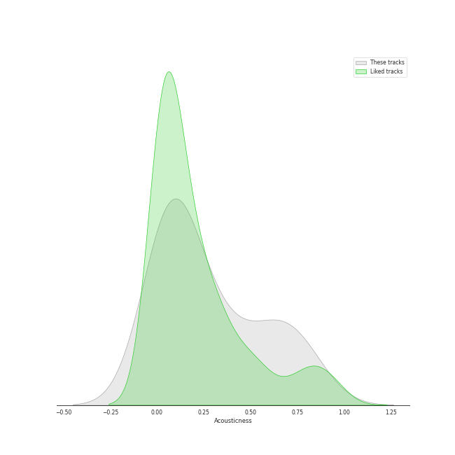
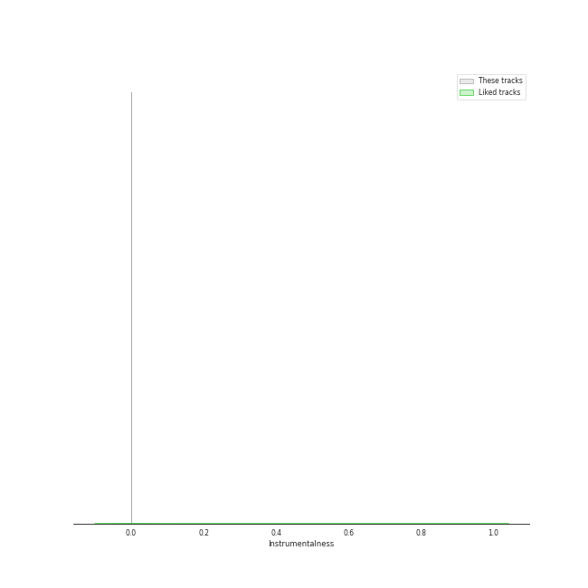
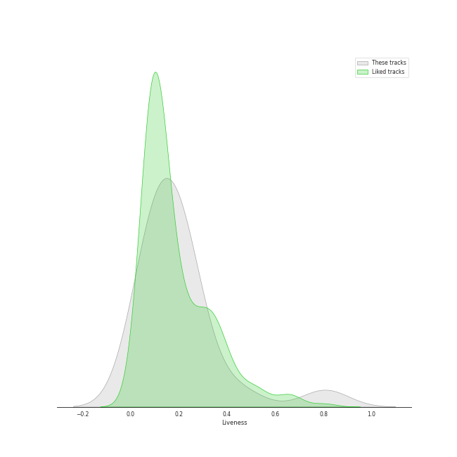

# Track Features for MAMAMOO

## Danceability

| ​ | 10 most Danceable tracks | ​​ | 10 least Danceable tracks |
|:---|:---|:---|:---|
|  | 1,2,3 Eoi! (0.862) |  | Where Are We Now (0.407) |
|  | AHH OOP! (0.79) |  | ILLELLA (0.523) |
|  | Piano Man (0.783) |  | Starry Night (0.58) |
|  | HIP (0.782) |  | Egotistic (0.616) |
|  | Dingga (0.772) |  | Egotistic (0.617) |
|  | Mr-Ambiguous (0.752) |  | AYA (0.634) |
|  | Yes I Am (0.737) |  | Décalcomanie (0.648) |
|  | Wind flower (0.735) |  | Rainy Season (0.677) |
|  | Um Oh Ah Yeh (0.729) |  | You’re the Best (0.683) |
|  | WANNA BE MYSELF (0.713) |  | gogobebe (0.704) |

## Energy

| ​ | 10 most Energetic tracks | ​​ | 10 least Energetic tracks |
|:---|:---|:---|:---|
|  | Dingga (0.925) |  | Where Are We Now (0.494) |
|  | Yes I Am (0.894) |  | Rainy Season (0.6) |
|  | Um Oh Ah Yeh (0.893) |  | HIP (0.731) |
|  | 1,2,3 Eoi! (0.875) |  | Starry Night (0.773) |
|  | WANNA BE MYSELF (0.867) |  | gogobebe (0.787) |
|  | You’re the Best (0.86) |  | Wind flower (0.795) |
|  | Décalcomanie (0.859) |  | ILLELLA (0.83) |
|  | AYA (0.858) |  | Egotistic (0.83) |
|  | AHH OOP! (0.857) |  | Egotistic (0.833) |
|  | Piano Man (0.853) |  | Mr-Ambiguous (0.852) |

## Speechiness

| ​ | 10 most Speechy tracks | ​​ | 10 least Speechy tracks |
|:---|:---|:---|:---|
|  | Yes I Am (0.254) |  | Where Are We Now (0.0343) |
|  | ILLELLA (0.167) |  | You’re the Best (0.0471) |
|  | 1,2,3 Eoi! (0.149) |  | Décalcomanie (0.0472) |
|  | HIP (0.143) |  | Um Oh Ah Yeh (0.0476) |
|  | AHH OOP! (0.121) |  | Starry Night (0.05) |
|  | Dingga (0.108) |  | Wind flower (0.0518) |
|  | gogobebe (0.082) |  | Rainy Season (0.0543) |
|  | AYA (0.0809) |  | Piano Man (0.0564) |
|  | Mr-Ambiguous (0.0806) |  | Egotistic (0.067) |
|  | WANNA BE MYSELF (0.079) |  | Egotistic (0.0689) |

## Acousticness

| ​ | 10 most Acoustic tracks | ​​ | 10 least Acoustic tracks |
|:---|:---|:---|:---|
|  | Rainy Season (0.806) |  | ILLELLA (0.00359) |
|  | Where Are We Now (0.744) |  | HIP (0.0376) |
|  | Starry Night (0.656) |  | You’re the Best (0.0395) |
|  | Wind flower (0.656) |  | Dingga (0.0549) |
|  | AHH OOP! (0.541) |  | 1,2,3 Eoi! (0.0664) |
|  | Mr-Ambiguous (0.415) |  | WANNA BE MYSELF (0.0747) |
|  | Piano Man (0.324) |  | AYA (0.101) |
|  | Egotistic (0.318) |  | Décalcomanie (0.113) |
|  | Egotistic (0.315) |  | gogobebe (0.114) |
|  | Yes I Am (0.14) |  | Um Oh Ah Yeh (0.128) |

## Instrumentalness

| ​ | 10 most Instrumental tracks | ​​ | 10 least Instrumental tracks |
|:---|:---|:---|:---|
|  | HIP (3.15e-05) |  | Dingga (0.0) |
|  | Where Are We Now (1.62e-05) |  | Um Oh Ah Yeh (0.0) |
|  | 1,2,3 Eoi! (9.97e-06) |  | ILLELLA (0.0) |
|  | AYA (8.56e-06) |  | Piano Man (0.0) |
|  | WANNA BE MYSELF (8.25e-06) |  | Wind flower (0.0) |
|  | Rainy Season (0.0) |  | You’re the Best (0.0) |
|  | gogobebe (0.0) |  | Yes I Am (0.0) |
|  | AHH OOP! (0.0) |  | Egotistic (0.0) |
|  | Egotistic (0.0) |  | Mr-Ambiguous (0.0) |
|  | Décalcomanie (0.0) |  | Starry Night (0.0) |

## Liveness

| ​ | 10 most Live tracks | ​​ | 10 least Live tracks |
|:---|:---|:---|:---|
|  | Piano Man (0.807) |  | Yes I Am (0.0523) |
|  | Décalcomanie (0.448) |  | Wind flower (0.0665) |
|  | AYA (0.258) |  | AHH OOP! (0.0748) |
|  | You’re the Best (0.239) |  | 1,2,3 Eoi! (0.0778) |
|  | Mr-Ambiguous (0.233) |  | ILLELLA (0.0806) |
|  | gogobebe (0.228) |  | HIP (0.0956) |
|  | Rainy Season (0.219) |  | Starry Night (0.112) |
|  | Dingga (0.201) |  | WANNA BE MYSELF (0.127) |
|  | Egotistic (0.176) |  | Where Are We Now (0.157) |
|  | Egotistic (0.175) |  | Um Oh Ah Yeh (0.167) |

## Valence

| ​ | 10 most Happy tracks | ​​ | 10 least Happy tracks |
|:---|:---|:---|:---|
|  | AHH OOP! (0.924) |  | Where Are We Now (0.325) |
|  | Wind flower (0.825) |  | Um Oh Ah Yeh (0.453) |
|  | HIP (0.824) |  | Starry Night (0.506) |
|  | 1,2,3 Eoi! (0.822) |  | Décalcomanie (0.541) |
|  | ILLELLA (0.812) |  | Egotistic (0.595) |
|  | Piano Man (0.805) |  | Egotistic (0.614) |
|  | WANNA BE MYSELF (0.801) |  | Rainy Season (0.614) |
|  | Dingga (0.795) |  | AYA (0.637) |
|  | Mr-Ambiguous (0.784) |  | Yes I Am (0.648) |
|  | gogobebe (0.707) |  | You’re the Best (0.703) |

## Tempo

| ​ | 10 most Fast tracks | ​​ | 10 least Fast tracks |
|:---|:---|:---|:---|
|  | ILLELLA (173.931) |  | Rainy Season (91.058) |
|  | HIP (138.032) |  | AYA (91.688) |
|  | AHH OOP! (129.939) |  | gogobebe (96.929) |
|  | Mr-Ambiguous (124.942) |  | Egotistic (97.898) |
|  | Starry Night (124.148) |  | Egotistic (97.912) |
|  | WANNA BE MYSELF (124.058) |  | Um Oh Ah Yeh (104.977) |
|  | You’re the Best (122.03) |  | Piano Man (111.042) |
|  | Yes I Am (120.115) |  | Wind flower (113.988) |
|  | 1,2,3 Eoi! (120.084) |  | Décalcomanie (115.434) |
|  | Dingga (119.963) |  | Where Are We Now (117.55) |
