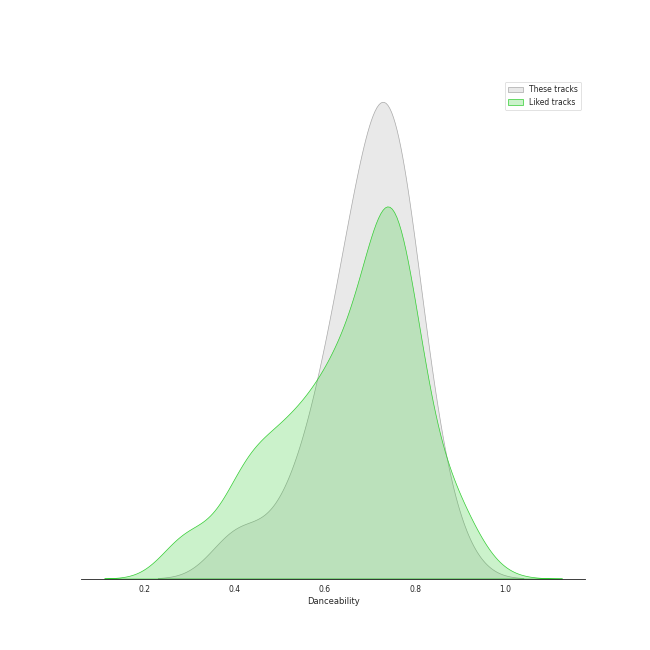
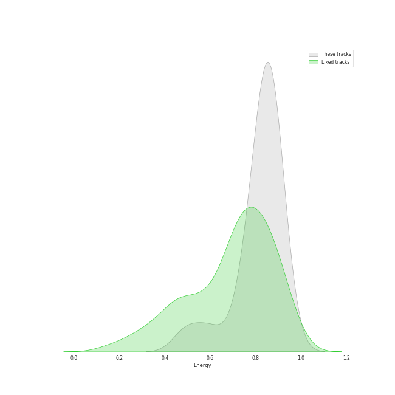
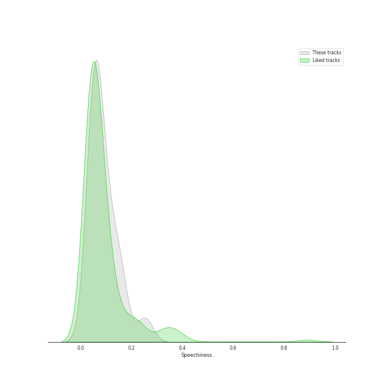
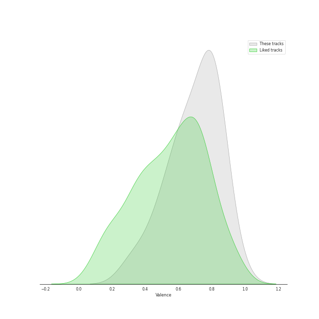
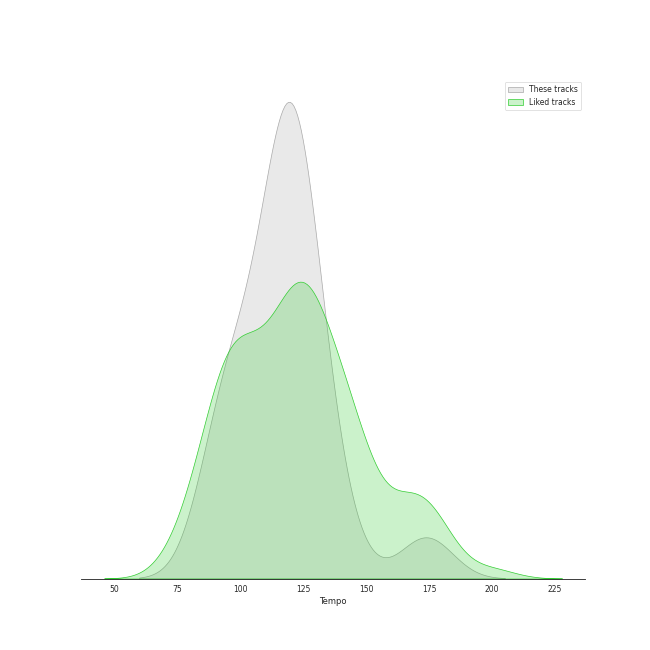

# Audio Features for MAMAMOO

## Danceability

| 10 most Danceable tracks | 10 least Danceable tracks |
|:---|:---|
| 1,2,3 Eoi! (0.862) | Where Are We Now (0.407) |
| AHH OOP! (0.79) | ILLELLA (0.523) |
| Piano Man (0.783) | Starry Night (0.58) |
| HIP (0.782) | Egotistic (0.616) |
| Dingga (0.772) | AYA (0.634) |
| Mr-Ambiguous (0.752) | Décalcomanie (0.648) |
| Yes I Am (0.737) | Rainy Season (0.677) |
| Wind flower (0.735) | You’re the Best (0.683) |
| Um Oh Ah Yeh (0.729) | gogobebe (0.704) |
| WANNA BE MYSELF (0.713) | WANNA BE MYSELF (0.713) |

## Energy

| 10 most Energetic tracks | 10 least Energetic tracks |
|:---|:---|
| Dingga (0.925) | Where Are We Now (0.494) |
| Yes I Am (0.894) | Rainy Season (0.6) |
| Um Oh Ah Yeh (0.893) | HIP (0.731) |
| 1,2,3 Eoi! (0.875) | Starry Night (0.773) |
| WANNA BE MYSELF (0.867) | gogobebe (0.787) |
| You’re the Best (0.86) | Wind flower (0.795) |
| Décalcomanie (0.859) | ILLELLA (0.83) |
| AYA (0.858) | Egotistic (0.833) |
| AHH OOP! (0.857) | Mr-Ambiguous (0.852) |
| Piano Man (0.853) | Piano Man (0.853) |

## Speechiness

| 10 most Speechy tracks | 10 least Speechy tracks |
|:---|:---|
| Yes I Am (0.254) | Where Are We Now (0.0343) |
| ILLELLA (0.167) | You’re the Best (0.0471) |
| 1,2,3 Eoi! (0.149) | Décalcomanie (0.0472) |
| HIP (0.143) | Um Oh Ah Yeh (0.0476) |
| AHH OOP! (0.121) | Starry Night (0.05) |
| Dingga (0.108) | Wind flower (0.0518) |
| gogobebe (0.082) | Rainy Season (0.0543) |
| AYA (0.0809) | Piano Man (0.0564) |
| Mr-Ambiguous (0.0806) | Egotistic (0.067) |
| WANNA BE MYSELF (0.079) | WANNA BE MYSELF (0.079) |

## Acousticness

| 10 most Acoustic tracks | 10 least Acoustic tracks |
|:---|:---|
| Rainy Season (0.806) | ILLELLA (0.00359) |
| Where Are We Now (0.744) | HIP (0.0376) |
| Starry Night (0.656) | You’re the Best (0.0395) |
| Wind flower (0.656) | Dingga (0.0549) |
| AHH OOP! (0.541) | 1,2,3 Eoi! (0.0664) |
| Mr-Ambiguous (0.415) | WANNA BE MYSELF (0.0747) |
| Piano Man (0.324) | AYA (0.101) |
| Egotistic (0.315) | Décalcomanie (0.113) |
| Yes I Am (0.14) | gogobebe (0.114) |
| Um Oh Ah Yeh (0.128) | Um Oh Ah Yeh (0.128) |

## Instrumentalness

| 10 most Instrumental tracks | 10 least Instrumental tracks |
|:---|:---|
| HIP (3.15e-05) | Dingga (0.0) |
| Where Are We Now (1.62e-05) | Um Oh Ah Yeh (0.0) |
| 1,2,3 Eoi! (9.97e-06) | ILLELLA (0.0) |
| AYA (8.56e-06) | Piano Man (0.0) |
| WANNA BE MYSELF (8.25e-06) | Wind flower (0.0) |
| Rainy Season (0.0) | You’re the Best (0.0) |
| gogobebe (0.0) | Yes I Am (0.0) |
| AHH OOP! (0.0) | Mr-Ambiguous (0.0) |
| Egotistic (0.0) | Starry Night (0.0) |
| Décalcomanie (0.0) | Décalcomanie (0.0) |

## Liveness

| 10 most Live tracks | 10 least Live tracks |
|:---|:---|
| Piano Man (0.807) | Yes I Am (0.0523) |
| Décalcomanie (0.448) | Wind flower (0.0665) |
| AYA (0.258) | AHH OOP! (0.0748) |
| You’re the Best (0.239) | 1,2,3 Eoi! (0.0778) |
| Mr-Ambiguous (0.233) | ILLELLA (0.0806) |
| gogobebe (0.228) | HIP (0.0956) |
| Rainy Season (0.219) | Starry Night (0.112) |
| Dingga (0.201) | WANNA BE MYSELF (0.127) |
| Egotistic (0.175) | Where Are We Now (0.157) |
| Um Oh Ah Yeh (0.167) | Um Oh Ah Yeh (0.167) |

## Valence

| 10 most Happy tracks | 10 least Happy tracks |
|:---|:---|
| AHH OOP! (0.924) | Where Are We Now (0.325) |
| Wind flower (0.825) | Um Oh Ah Yeh (0.453) |
| HIP (0.824) | Starry Night (0.506) |
| 1,2,3 Eoi! (0.822) | Décalcomanie (0.541) |
| ILLELLA (0.812) | Egotistic (0.595) |
| Piano Man (0.805) | Rainy Season (0.614) |
| WANNA BE MYSELF (0.801) | AYA (0.637) |
| Dingga (0.795) | Yes I Am (0.648) |
| Mr-Ambiguous (0.784) | You’re the Best (0.703) |
| gogobebe (0.707) | gogobebe (0.707) |

## Tempo

| 10 most Fast tracks | 10 least Fast tracks |
|:---|:---|
| ILLELLA (173.931) | Rainy Season (91.058) |
| HIP (138.032) | AYA (91.688) |
| AHH OOP! (129.939) | gogobebe (96.929) |
| Mr-Ambiguous (124.942) | Egotistic (97.898) |
| Starry Night (124.148) | Um Oh Ah Yeh (104.977) |
| WANNA BE MYSELF (124.058) | Piano Man (111.042) |
| You’re the Best (122.03) | Wind flower (113.988) |
| Yes I Am (120.115) | Décalcomanie (115.434) |
| 1,2,3 Eoi! (120.084) | Where Are We Now (117.55) |
| Dingga (119.963) | Dingga (119.963) |
