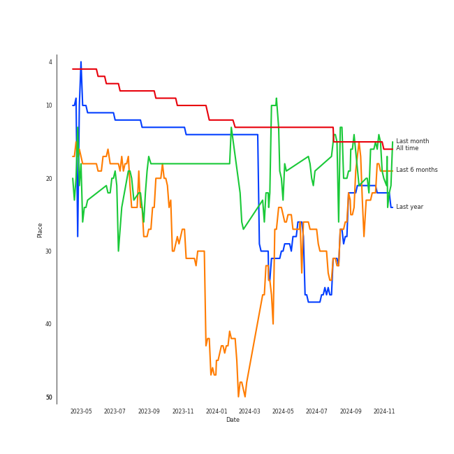
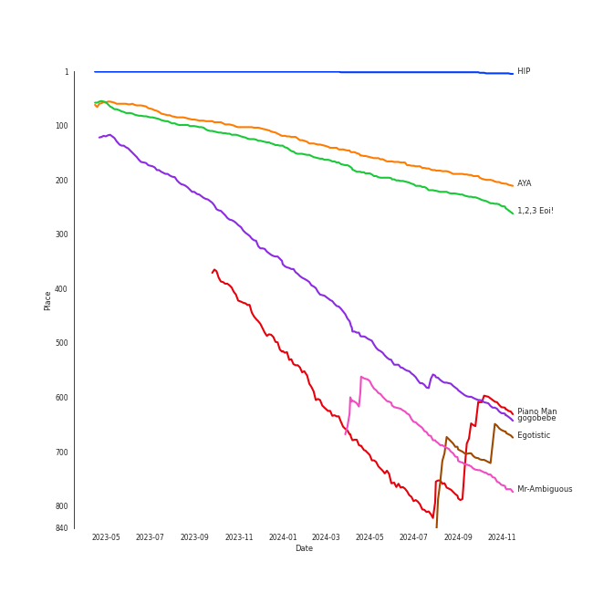
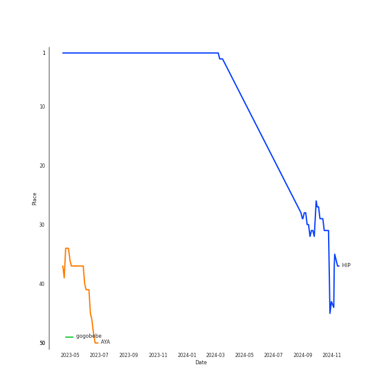
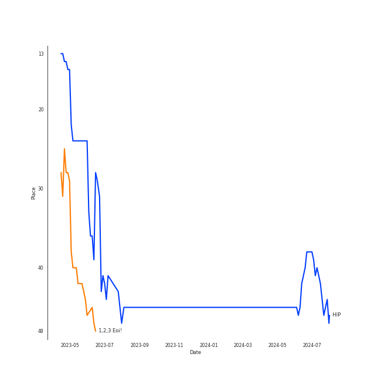

# MAMAMOO

[See Track Features](audio_features.md)

[See Clusters](clusters/overview.md)

## Relationships

MAMAMOO:
- has member [HWASA](../hwasa/overview.md)
- has member Moon Byul
- has member Solar
- has member Whee In
- has the subgroup MAMAMOO+

## Artist Rank
MAMAMOO is currently:
- The #23 artist of the last month
- The #34 artist of the last 6 months
- The #34 artist of all time

## Top Tracks

- HIP is the #31 track of the last month

### Top tracks, aggregated

### Top tracks of all time over time

### Top tracks of the last 6 months over time

## Featured on Playlists
| Art | Tracks | Playlist |
|:---|---:|:---|
|  | 19 | [K-Pop](../../playlists/k-pop/overview.md) |
|  | 6 | [K-Pop Favorites](../../playlists/k-pop_favorites/overview.md) |
|  | 4 | [Summer](../../playlists/summer/overview.md) |
|  | 4 | [Your Top Songs 2022](../../playlists/your_top_songs_2022/overview.md) |
|  | 3 | [Retro Kpop](../../playlists/retro_kpop/overview.md) |
|  | 1 | [K-Pop 101](../../playlists/k-pop_101/overview.md) |
|  | 1 | [Workout](../../playlists/workout/overview.md) |
|  | 1 | [Relax](../../playlists/relax/overview.md) |
|  | 1 | [Recommendations for Jeff](../../playlists/recommendations_for_jeff/overview.md) |
|  | 1 | [Chill](../../playlists/chill/overview.md) |

## Top Albums

| Art | Tracks | 💚 | Album | Release Date | 🔗 |
|:---|---:|---:|:---|:---|:---|
|  | 2 | 2 | MIC ON | 2022-10-11 | [🔗](https://open.spotify.com/album/6TOnqVuglIk6Db2TdUwTcZ) |
|  | 2 | 1 | RED MOON | 2018-07-16 | [🔗](https://open.spotify.com/album/6GhELYbXRo1LOqRPOCsQrF) |
|  | 2 | 1 | Pink Funky | 2015-06-19 | [🔗](https://open.spotify.com/album/5Fy5PyBWqMNK7xvXO9Q32f) |
|  | 1 | 1 | reality in BLACK | 2019-11-14 | [🔗](https://open.spotify.com/album/7CucpzwxAZ6kHmctI9eo4X) |
|  | 1 | 1 | Yellow Flower | 2018-03-07 | [🔗](https://open.spotify.com/album/4G9qMxS9c4W5PPNdPrTaLn) |
|  | 1 | 1 | White Wind | 2019-03-14 | [🔗](https://open.spotify.com/album/60m09rutmwj5ewOJoFIAVY) |
|  | 1 | 1 | WAW | 2021-06-02 | [🔗](https://open.spotify.com/album/0gt7dy4ONFo6uc8D5w2WNi) |
|  | 1 | 1 | TRAVEL | 2020-11-03 | [🔗](https://open.spotify.com/album/3xje7wSW2xwQx2GNJ5cfNu) |
|  | 1 | 1 | Purple | 2017-06-22 | [🔗](https://open.spotify.com/album/7lqVInQc3l7SbnbZa2cpFJ) |
|  | 1 | 1 | Piano Man | 2014-11-21 | [🔗](https://open.spotify.com/album/1kdURRaOTpDCQqsVIU5CiT) |

See all albums

| Art | Tracks | 💚 | Album | Release Date | 🔗 |
|:---|---:|---:|:---|:---|:---|
|  | 1 | 1 | Melting | 2016-02-26 | [🔗](https://open.spotify.com/album/11hjJntrvmauDoga4Krr0U) |
|  | 1 | 1 | MEMORY | 2016-11-07 | [🔗](https://open.spotify.com/album/3Q34hV5fBbMpRpADmlptr7) |
|  | 1 | 1 | HELLO | 2014-06-18 | [🔗](https://open.spotify.com/album/3Z9cZon6ukg4rvGYu7i4NA) |
|  | 1 | 1 | Dingga | 2020-10-20 | [🔗](https://open.spotify.com/album/4xzsBcZaK04c8IE5iVyMNK) |
|  | 1 | 0 | WANNA BE MYSELF | 2020-09-10 | [🔗](https://open.spotify.com/album/0n62copUsWrST9M6AsYfZI) |
|  | 1 | 0 | BLUE;S | 2018-11-29 | [🔗](https://open.spotify.com/album/59QELOU685J1AMB2paryAx) |

## Top Record Labels

| Tracks | 💚 | Label |
|---:|---:|:---|
| 12 | 9 | [RBW Inc.](../../labels/rbw_inc_/overview.md) |
| 6 | 5 | [Stone Music Entertainment](../../labels/stone_music_entertainment/overview.md) |
| 6 | 5 | [Genie Music Corporation](../../labels/genie_music_corporation/overview.md) |
| 1 | 1 | RADCOMM |

## Genres

- [k-pop](../../genres/k-pop/overview.md)
- [k-pop girl group](../../genres/k-pop_girl_group/overview.md)

## Credits

### Credits by Type

| Credit Type | Tracks |
|:---|---:|
| Performer | 1 |

### Member Credits

| | Moon Byul | Solar | Whee In | [HWASA](../hwasa/overview.md) |
|:---|---:|---:|---:|---:|
| Lyricist | 4 | 3 | 0 | 4 |
| Songwriter | 1 | 0 | 0 | 1 |
| Vocal | 1 | 1 | 1 | 3 |
### Production Credits

| Art | Track | Members | Credit Types |
|:---|:---|:---|:---|
|  | You’re the Best | Moon Byul, Solar | Lyricist |
|  | Décalcomanie | Moon Byul, Solar, [HWASA](../../hwasa/overview.md) | Lyricist |
|  | Yes I Am | Moon Byul, Solar, [HWASA](../../hwasa/overview.md) | Lyricist |
|  | Maria | [HWASA](../../hwasa/overview.md) | Lyricist, Songwriter |
|  | I`m a B | [HWASA](../../hwasa/overview.md) | Lyricist |
|  | Save Me | Moon Byul | Lyricist, Songwriter |

## Top Producers

| Art | Producer | Tracks | Credit Types |
|:---|:---|---:|:---|
| | [김도훈 (Kim, Do-hoon)](../../producers/김도훈_(kim,_do-hoon)/overview.md) | 5 | Arranger, Lyricist, Songwriter |
|  | Moon Byul | 3 | Lyricist |
|  | Solar | 3 | Lyricist |
| | 에스나 (Esna) | 2 | Songwriter, Lyricist |
|  | [HWASA](../hwasa/overview.md) | 2 | Lyricist |
| | [김이나 (Kim, Eana)](../../producers/김이나_(kim,_eana)/overview.md) | 1 | Lyricist |
| | 민연재 (Min, Yun-jae) | 1 | Lyricist |
| | 박우상 (Park, Woo-sang) | 1 | Arranger |
| | 이단옆차기 (Duble Sidekick) | 1 | Songwriter |
| | 최용찬 (Choi, Young Chan) | 1 | Arranger |

## Tracks

| Art | Track | Album | Artists | Label | Rank | 💚 | 🔗 |
|:---|:---|:---|:---|:---|---:|:---|:---|
|  | HIP | reality in BLACK | [MAMAMOO](overview.md) | [RBW, Inc](../../labels/rbw_inc_) | 2 | 💚 | [🔗](https://open.spotify.com/track/24nK8tW7Pt3Inh2utttuoG) |
|  | Egotistic | RED MOON | [MAMAMOO](overview.md) | [RBW, Inc.](../../labels/rbw_inc_) | 37 | 💚 | [🔗](https://open.spotify.com/track/5Z4aqpT39KpY8gbHoJWdou) |
|  | AYA | TRAVEL | [MAMAMOO](overview.md) | [RBW Inc.](../../labels/rbw_inc_) | 148 | 💚 | [🔗](https://open.spotify.com/track/4BZXVFYCb76Q0Klojq4piV) |
|  | 1,2,3 Eoi! | MIC ON | [MAMAMOO](overview.md) | [RBW Inc.](../../labels/rbw_inc_) | 177 | 💚 | [🔗](https://open.spotify.com/track/1uYgNXNnBTQnboOwlYBLd1) |
|  | gogobebe | White Wind | [MAMAMOO](overview.md) | [RBW, Inc](../../labels/rbw_inc_) | 419 | 💚 | [🔗](https://open.spotify.com/track/6E7jAJN2e3znSHyPCdQqx8) |
|  | Mr-Ambiguous | HELLO | [MAMAMOO](overview.md) | [Genie Music Corporation](../../labels/genie_music_corporation), [Stone Music Entertainment](../../labels/stone_music_entertainment) | 609 | 💚 | [🔗](https://open.spotify.com/track/4VOZzJeoNhvvTaGTztogVt) |
|  | Piano Man | Piano Man | [MAMAMOO](overview.md) | [Genie Music Corporation](../../labels/genie_music_corporation), [Stone Music Entertainment](../../labels/stone_music_entertainment) | 678 | 💚 | [🔗](https://open.spotify.com/track/2CC7fLFEcJBrO82NUwi9Op) |
|  | AHH OOP! | Pink Funky | [MAMAMOO](overview.md) | [Genie Music Corporation](../../labels/genie_music_corporation), [Stone Music Entertainment](../../labels/stone_music_entertainment) | nan | 💚 | [🔗](https://open.spotify.com/track/5bhPsVZrng5VjNKh822yJH) |
|  | Um Oh Ah Yeh | Pink Funky | [MAMAMOO](overview.md) | [Genie Music Corporation](../../labels/genie_music_corporation), [Stone Music Entertainment](../../labels/stone_music_entertainment) | nan | | [🔗](https://open.spotify.com/track/0icGgAiUx5b0amQLycmGUr) |
|  | You’re the Best | Melting | [MAMAMOO](overview.md) | [Genie Music Corporation](../../labels/genie_music_corporation), [Stone Music Entertainment](../../labels/stone_music_entertainment) | nan | 💚 | [🔗](https://open.spotify.com/track/3BUZUCu1uHaTvroizwqLHt) |

See all tracks

| Art | Track | Album | Artists | Label | Rank | 💚 | 🔗 |
|:---|:---|:---|:---|:---|---:|:---|:---|
|  | Décalcomanie | MEMORY | [MAMAMOO](overview.md) | [Genie Music Corporation](../../labels/genie_music_corporation), [Stone Music Entertainment](../../labels/stone_music_entertainment) | nan | 💚 | [🔗](https://open.spotify.com/track/5WitNasXEIRptoLIQUcXMx) |
|  | Yes I Am | Purple | [MAMAMOO](overview.md) | RADCOMM | nan | 💚 | [🔗](https://open.spotify.com/track/3RqUX4U46H6TPdH30gPy4k) |
|  | Starry Night | Yellow Flower | [MAMAMOO](overview.md) | [RBW, Inc.](../../labels/rbw_inc_) | nan | 💚 | [🔗](https://open.spotify.com/track/5MaDeMdqsPsZTxNWdEZPVH) |
|  | Rainy Season | RED MOON | [MAMAMOO](overview.md) | [RBW, Inc.](../../labels/rbw_inc_) | nan | | [🔗](https://open.spotify.com/track/7u0ErMhA3PliMLkph2jlCM) |
|  | Wind flower | BLUE;S | [MAMAMOO](overview.md) | [RBW, Inc](../../labels/rbw_inc_) | nan | | [🔗](https://open.spotify.com/track/2qwyjoSsSr3M7HTt611Q5O) |
|  | WANNA BE MYSELF | WANNA BE MYSELF | [MAMAMOO](overview.md) | [RBW, Inc](../../labels/rbw_inc_) | nan | | [🔗](https://open.spotify.com/track/0VPBuXtEG16NtN5ZGYJ7lV) |
|  | Dingga | Dingga | [MAMAMOO](overview.md) | [RBW, Inc](../../labels/rbw_inc_) | nan | 💚 | [🔗](https://open.spotify.com/track/0bDYceyQd1jnJO4sK47YxU) |
|  | Where Are We Now | WAW | [MAMAMOO](overview.md) | [RBW Inc.](../../labels/rbw_inc_) | nan | 💚 | [🔗](https://open.spotify.com/track/0cLXk75Pan3mhRlWqHiynh) |
|  | ILLELLA | MIC ON | [MAMAMOO](overview.md) | [RBW Inc.](../../labels/rbw_inc_) | nan | 💚 | [🔗](https://open.spotify.com/track/0oeVHAgY8Q7Mdce5Quj2G4) |

