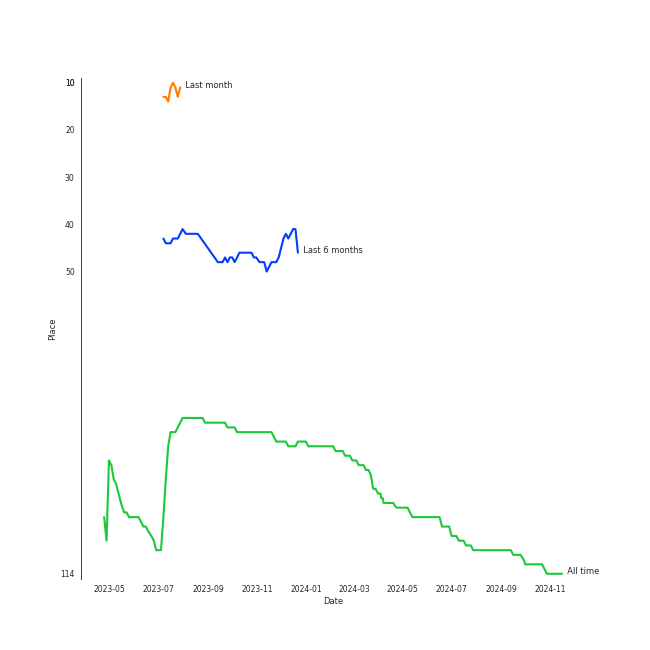

# Maroon 5

## Relationships

Maroon 5:
- was formerly known as Kara's Flowers
- has member Jesse Carmichael
- has member Ryan Dusick
- has member Matt Flynn
- has member Adam Levine
- has member Mickey Madden
- has member PJ Morton
- has member James Valentine

## Artist Rank

## Featured on Playlists
| Art | Tracks | Playlist |
|:---|---:|:---|
|  | 8 | [Pop](../../playlists/pop/overview.md) |
|  | 6 | [Modern Rock](../../playlists/modern_rock/overview.md) |
|  | 2 | [A-Pop Favorites](../../playlists/a-pop_favorites/overview.md) |
|  | 1 | [Karaoke](../../playlists/karaoke/overview.md) |
|  | 1 | [Tarps](../../playlists/tarps/overview.md) |

## Top Albums

| Art | Tracks | 💚 | Album | Release Date | 🔗 |
|:---|---:|---:|:---|:---|:---|
|  | 3 | 3 | Songs About Jane | 2002-06-25 | [🔗](https://open.spotify.com/album/1Rv9WRKyYhFaGbuYDaQunN) |
|  | 2 | 1 | V | 2014-09-02 | [🔗](https://open.spotify.com/album/2Auw0pTT6EcQdvHNimhLQI) |
|  | 1 | 1 | Hands All Over (Deluxe) | 2010 | [🔗](https://open.spotify.com/album/2H4DCvJiZknLngsD2Yqf6k) |
|  | 1 | 0 | Overexposed (Deluxe) | 2012-01-01 | [🔗](https://open.spotify.com/album/2pjfMmH52fryXVQuWTWOgP) |
|  | 1 | 0 | Hands All Over | 2010 | [🔗](https://open.spotify.com/album/7strNUlU6xZqlVWBNUdOYv) |

## Top Record Labels

| Tracks | 💚 | Label |
|---:|---:|:---|
| 8 | 5 | [Interscope Records](../../labels/interscope_records/overview.md) |

## Genres

- [pop](../../genres/pop/overview.md)

## Credits

### Credits by Type

| Credit Type | Tracks |
|:---|---:|
| Performer | 1 |
| Producer | 1 |

### Member Credits

| | Adam Levine | James Valentine | Jesse Carmichael | Matt Flynn | Mickey Madden | PJ Morton | Ryan Dusick |
|:---|---:|---:|---:|---:|---:|---:|---:|
| Instrument | 0 | 1 | 1 | 1 | 1 | 1 | 0 |
| Lyricist | 4 | 2 | 3 | 0 | 1 | 0 | 1 |
| Songwriter | 5 | 3 | 3 | 0 | 2 | 0 | 2 |
| Vocal | 1 | 0 | 0 | 0 | 0 | 0 | 0 |
### Production Credits

| Art | Track | Members | Credit Types |
|:---|:---|:---|:---|
|  | Sunday Morning | Mickey Madden, Jesse Carmichael, Adam Levine, Ryan Dusick, James Valentine | Songwriter, Lyricist |
|  | This Love | Mickey Madden, Jesse Carmichael, Adam Levine, Ryan Dusick, James Valentine | Lyricist, Songwriter |
|  | She Will Be Loved | Adam Levine, James Valentine | Lyricist, Songwriter |
|  | Misery | Jesse Carmichael, Adam Levine | Lyricist, Songwriter |
|  | Sugar | [Maroon 5](.), Adam Levine | Producer, Songwriter |

## Top Producers

| Art | Producer | Tracks | Credit Types |
|:---|:---|---:|:---|
| | Adam Levine | 5 | Lyricist, Songwriter |
| | Jesse Carmichael | 3 | Lyricist, Songwriter |
| | James Valentine | 3 | Lyricist, Songwriter |
| | Ryan Dusick | 2 | Lyricist, Songwriter |
| | Mickey Madden | 2 | Lyricist, Songwriter |
| | Noah Passovoy | 1 | Producer |
| | Jacob Kasher | 1 | Songwriter |
| | [Serban Ghenea](../../producers/serban_ghenea/overview.md) | 1 | Producer |
| | Doug McKean | 1 | Producer |
| | [Łukasz Gottwald (Gottwald, Łukasz)](../../producers/łukasz_gottwald_(gottwald,_łukasz)/overview.md) | 1 | Songwriter |

View all

| Art | Producer | Tracks | Credit Types |
|:---|:---|---:|:---|
|  | [Maroon 5](overview.md) | 1 | Producer |
| | [Cirkut](../../producers/cirkut/overview.md) | 1 | Producer, Songwriter |
| | Ammo | 1 | Producer, Songwriter |
| | [John Hanes](../../producers/john_hanes/overview.md) | 1 | Producer |
| | Mike Posner | 1 | Songwriter |
| | Clint Gibbs | 1 | Producer |
| | Dr. Luke | 1 | Producer |
| | Jonathan Sher | 1 | Producer |
| | Sam Farrar | 1 | Lyricist, Songwriter |

## Tracks

| Art | Track | Album | Artists | Label | Rank | 💚 | 🔗 |
|:---|:---|:---|:---|:---|---:|:---|:---|
|  | She Will Be Loved | Songs About Jane | [Maroon 5](overview.md) | [Interscope Records*](../../labels/interscope_records) | nan | 💚 | [🔗](https://open.spotify.com/track/7sapKrjDij2fpDVj0GxP66) |
|  | Sunday Morning | Songs About Jane | [Maroon 5](overview.md) | [Interscope Records*](../../labels/interscope_records) | nan | 💚 | [🔗](https://open.spotify.com/track/1YI0uK36eupTmw9F8kHysr) |
|  | This Love | Songs About Jane | [Maroon 5](overview.md) | [Interscope Records*](../../labels/interscope_records) | nan | 💚 | [🔗](https://open.spotify.com/track/6YgV0EF8xJMZz0Zm6BTaT4) |
|  | Moves Like Jagger - Studio Recording From "The Voice" Performance | Hands All Over | [Maroon 5](overview.md), Christina Aguilera | [Interscope Records*](../../labels/interscope_records) | nan | | [🔗](https://open.spotify.com/track/7LcfRTgAVTs5pQGEQgUEzN) |
|  | Misery | Hands All Over (Deluxe) | [Maroon 5](overview.md) | [Interscope Records*](../../labels/interscope_records) | nan | 💚 | [🔗](https://open.spotify.com/track/6KBYk8OFtod7brGuZ3Y67q) |
|  | Payphone | Overexposed (Deluxe) | [Maroon 5](overview.md), Wiz Khalifa | [Interscope Records*](../../labels/interscope_records) | nan | | [🔗](https://open.spotify.com/track/4P0osvTXoSYZZC2n8IFH3c) |
|  | Maps | V | [Maroon 5](overview.md) | [Interscope Records*](../../labels/interscope_records) | nan | | [🔗](https://open.spotify.com/track/4gbVRS8gloEluzf0GzDOFc) |
|  | Sugar | V | [Maroon 5](overview.md) | [Interscope Records*](../../labels/interscope_records) | nan | 💚 | [🔗](https://open.spotify.com/track/2iuZJX9X9P0GKaE93xcPjk) |
