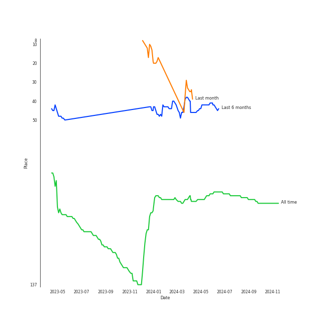

# Michael Bublé

[See Track Features](audio_features.md)

[See Clusters](clusters/overview.md)

## Artist Rank
- The #93 artist of all time

## Top Tracks

### Top tracks of all time

## Top Albums

| Art | Rank | Tracks | 💚 | Album | Release Date | 🔗 |
|:---|---:|---:|---:|:---|:---|:---|
|  | 476 | 4 | 0 | Christmas (Deluxe Special Edition) | 2012-11-09 | [🔗](https://open.spotify.com/album/7uVimUILdzSZG4KKKWToq0) |
|  | 612 | 3 | 1 | Call Me Irresponsible | 2007-04-27 | [🔗](https://open.spotify.com/album/3h4pyWRJIB9ZyRKXChbX22) |
|  | 525 | 2 | 2 | It's Time | 2005-02-08 | [🔗](https://open.spotify.com/album/457fktVFXVwjQTl9wOLlfg) |
|  | 606 | 2 | 1 | Michael Bublé | 2003 | [🔗](https://open.spotify.com/album/3rpSksJSFdNFqk5vne8at2) |
|  | 612 | 2 | 1 | Crazy Love | 2009-10-06 | [🔗](https://open.spotify.com/album/3MXDonOIzrIrCh0HvlACyj) |
|  | 612 | 1 | 0 | love (Deluxe Edition) | 2018-11-16 | [🔗](https://open.spotify.com/album/68xKnVblFsSQ48CtgZT0oY) |
|  | 612 | 1 | 0 | Nobody but Me | 2016-10-21 | [🔗](https://open.spotify.com/album/5wN1OizIFEHDUkRwzIK3wL) |
|  | 430 | 1 | 0 | Holiday Wishes | 2014-10-10 | [🔗](https://open.spotify.com/album/0EGX5qfw6VEPOMoCUFJFHl) |
|  | 612 | 1 | 0 | Come Fly with Me | 2004-03-30 | [🔗](https://open.spotify.com/album/0UhvDeKmtgegXeELEVgGRh) |

## Featured on Playlists
| Art | Tracks | Playlist |
|:---|---:|:---|
|  | 12 | [Jazz](../../playlists/jazz/overview.md) |
|  | 5 | [Christmas](../../playlists/christmas/overview.md) |
|  | 2 | [Pop](../../playlists/pop/overview.md) |
|  | 2 | [Karaoke](../../playlists/karaoke/overview.md) |

## Top Record Labels

| Tracks | 💚 | Label |
|---:|---:|:---|
| 16 | 5 | [Reprise](../../labels/reprise/overview.md) |
| 14 | 5 | [143](../../labels/143/overview.md) |
| 1 | 0 | [Warner Records](../../labels/warner_records/overview.md) |

## Genres

- [adult standards](../../genres/adult_standards/overview.md)
- [canadian pop](../../genres/canadian_pop/overview.md)
- jazz pop
- [lounge](../../genres/lounge/overview.md)

## Credits

### Credits by Type

| Credit Type | Tracks |
|:---|---:|
| Arranger | 1 |
| Songwriter | 3 |
| Vocal | 3 |

### Production Credits

| Art | Track | Credit Types |
|:---|:---|:---|
|  | Home | Songwriter |
|  | Everything | Songwriter |
|  | Haven't Met You Yet | Arranger, Songwriter |

## Top Producers

| Art | Producer | Tracks | Credit Types |
|:---|:---|---:|:---|
| | David Foster | 3 | Producer, Arranger |
| | Amy Foster-Gillies | 3 | Songwriter |
|  | [Michael Bublé](overview.md) | 3 | Songwriter, Arranger |
| | Humberto Gatica | 3 | Producer |
| | Alan Chang | 3 | Songwriter, Arranger |
| | Bob Rock | 2 | Producer, Arranger |
| | Alejandro Rodríguez (Rodríguez, Alejandro) | 2 | Producer |
| | Jochem van der Saag | 2 | Producer |
| | Neil Devor | 2 | Producer |
| | Leslie Bricusse | 1 | Songwriter |

View all

| Art | Producer | Tracks | Credit Types |
|:---|:---|---:|:---|
| | Don Sebesky | 1 | Arranger |
| | William Ross | 1 | Arranger |
| | Lou Pomanti | 1 | Arranger |
| | Anthony Newley | 1 | Songwriter |
|  | Van Morrison | 1 | Lyricist, Songwriter |

## Tracks

| Art | Track | Album | Artists | Label | Rank | 💚 | 🔗 |
|:---|:---|:---|:---|:---|---:|:---|:---|
|  | Baby It's Cold Outside (with Michael Bublé) | Holiday Wishes | Idina Menzel, [Michael Bublé](overview.md) | [Warner Records](../../labels/warner_records) | 637 | | [🔗](https://open.spotify.com/track/0Ie5uiv54KgCr7P4sYDTHl) |
|  | Frosty the Snowman (feat. The Puppini Sisters) | Christmas (Deluxe Special Edition) | [Michael Bublé](overview.md), The Puppini Sisters | [143](../../labels/143), [Reprise](../../labels/reprise) | 721 | | [🔗](https://open.spotify.com/track/27TJMHguLnuW3y2UPqXeC2) |
|  | Feeling Good | It's Time | [Michael Bublé](overview.md) | [143](../../labels/143), [Reprise](../../labels/reprise) | 784 | 💚 | [🔗](https://open.spotify.com/track/72PwtNhRrZXNnYeRg5xQ46) |
|  | It's Beginning to Look a Lot like Christmas | Christmas (Deluxe Special Edition) | [Michael Bublé](overview.md) | [143](../../labels/143), [Reprise](../../labels/reprise) | 881 | | [🔗](https://open.spotify.com/track/5a1iz510sv2W9Dt1MvFd5R) |
|  | Moondance | Michael Bublé | [Michael Bublé](overview.md) | [143](../../labels/143), [Reprise](../../labels/reprise) | 911 | 💚 | [🔗](https://open.spotify.com/track/25Yzff59UGjz7wNWmjM39h) |
|  | The Way You Look Tonight | Michael Bublé | [Michael Bublé](overview.md) | [143](../../labels/143), [Reprise](../../labels/reprise) | 922 | | [🔗](https://open.spotify.com/track/4YGlRLe6TeBRiXFByBqldf) |
|  | Can't Help Falling in Love | Come Fly with Me | [Michael Bublé](overview.md) | [143](../../labels/143), [Reprise](../../labels/reprise) | 922 | | [🔗](https://open.spotify.com/track/7igk58Vs9uM2B0aaTUwv6F) |
|  | Home | It's Time | [Michael Bublé](overview.md) | [143](../../labels/143), [Reprise](../../labels/reprise) | 922 | 💚 | [🔗](https://open.spotify.com/track/3ISaSNZCxIzTGwQuBq6Xrr) |
|  | Call Me Irresponsible | Call Me Irresponsible | [Michael Bublé](overview.md) | [143](../../labels/143), [Reprise](../../labels/reprise) | 922 | | [🔗](https://open.spotify.com/track/25RxZw46RfYpVWMIrIeZDS) |
|  | Everything | Call Me Irresponsible | [Michael Bublé](overview.md) | [143](../../labels/143), [Reprise](../../labels/reprise) | 922 | 💚 | [🔗](https://open.spotify.com/track/4T6HLdP6OcAtqC6tGnQelG) |

See all tracks

| Art | Track | Album | Artists | Label | Rank | 💚 | 🔗 |
|:---|:---|:---|:---|:---|---:|:---|:---|
|  | The Best Is yet to Come | Call Me Irresponsible | [Michael Bublé](overview.md) | [143](../../labels/143), [Reprise](../../labels/reprise) | 922 | | [🔗](https://open.spotify.com/track/56t3m0lqE6zU1EfgFOPqst) |
|  | Cry Me a River | Crazy Love | [Michael Bublé](overview.md) | [143](../../labels/143), [Reprise](../../labels/reprise) | 922 | | [🔗](https://open.spotify.com/track/5i04Jy87RLxoZszJqY3QAN) |
|  | Haven't Met You Yet | Crazy Love | [Michael Bublé](overview.md) | [143](../../labels/143), [Reprise](../../labels/reprise) | 922 | 💚 | [🔗](https://open.spotify.com/track/4fIWvT19w9PR0VVBuPYpWA) |
|  | Santa Baby | Christmas (Deluxe Special Edition) | [Michael Bublé](overview.md) | [143](../../labels/143), [Reprise](../../labels/reprise) | 922 | | [🔗](https://open.spotify.com/track/3m2gfwcxl77ojJTWH3wZkb) |
|  | The Christmas Song | Christmas (Deluxe Special Edition) | [Michael Bublé](overview.md) | [143](../../labels/143), [Reprise](../../labels/reprise) | 922 | | [🔗](https://open.spotify.com/track/4SWAozNLRfZXF25ghKqm2q) |
|  | Someday (feat. Meghan Trainor) | Nobody but Me | [Michael Bublé](overview.md), Meghan Trainor | [Reprise](../../labels/reprise) | 922 | | [🔗](https://open.spotify.com/track/0nsF6B4avArxVgAwgMg4ag) |
|  | La vie en rose (feat. Cécile McLorin Salvant) | love (Deluxe Edition) | [Michael Bublé](overview.md), Cécile McLorin Salvant | [Reprise](../../labels/reprise) | 922 | | [🔗](https://open.spotify.com/track/1QELw50Dl95LusF6uOkDqk) |

