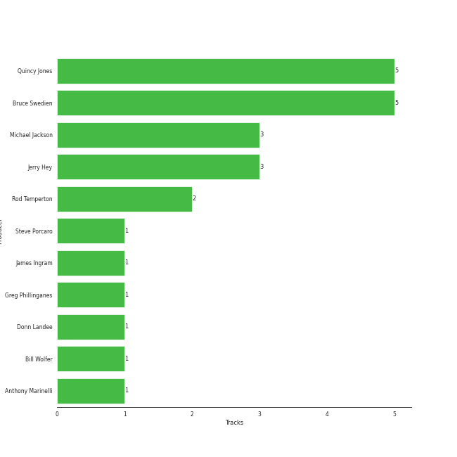

# Michael Jackson

## Relationships

Michael Jackson:
- is also known as W.A. Mozart
- is a member of The Jackson 5

## Artist Rank

## Featured on Playlists
| Art | Tracks | Playlist |
|:---|---:|:---|
|  | 9 | [Classic Pop](../../playlists/classic_pop/overview.md) |
|  | 1 | [Funk](../../playlists/funk/overview.md) |

## Top Albums

| Art | Tracks | 💚 | Album | Release Date | 🔗 |
|:---|---:|---:|:---|:---|:---|
|  | 5 | 4 | Thriller | 1982-11-30 | [🔗](https://open.spotify.com/album/2ANVost0y2y52ema1E9xAZ) |
|  | 2 | 1 | Bad (Remastered) | 1987-08-31 | [🔗](https://open.spotify.com/album/3Us57CjssWnHjTUIXBuIeH) |
|  | 1 | 1 | HIStory - PAST, PRESENT AND FUTURE - BOOK I | 1995-06-16 | [🔗](https://open.spotify.com/album/3OBhnTLrvkoEEETjFA3Qfk) |
|  | 1 | 0 | Off the Wall | 1979-08-10 | [🔗](https://open.spotify.com/album/2ZytN2cY4Zjrr9ukb2rqTP) |

## Top Record Labels

| Tracks | 💚 | Label |
|---:|---:|:---|
| 9 | 6 | [Epic](../../labels/epic/overview.md) |
| 2 | 1 | [Legacy](../../labels/legacy/overview.md) |

## Genres

- [r&b](../../genres/r_b/overview.md)
- [soul](../../genres/soul/overview.md)

## Credits

### Credits by Type

| Credit Type | Tracks |
|:---|---:|
| Arranger | 3 |
| Instrument | 1 |
| Lyricist | 4 |
| Producer | 4 |
| Songwriter | 5 |
| Vocal | 7 |

### Production Credits

| Art | Track | Credit Types |
|:---|:---|:---|
|  | Beat It | Arranger, Lyricist, Producer, Songwriter |
|  | Billie Jean | Arranger, Lyricist, Producer, Songwriter |
|  | Smooth Criminal - 2012 Remaster | Lyricist, Producer, Songwriter |
|  | Don't Stop The Music | Songwriter |

## Top Producers

| Art | Producer | Tracks | Credit Types |
|:---|:---|---:|:---|
| | Quincy Jones | 5 | Producer, Arranger, Songwriter |
| | Bruce Swedien | 5 | Producer |
| | Jerry Hey | 3 | Arranger |
|  | [Michael Jackson](overview.md) | 3 | Lyricist, Producer, Songwriter, Arranger |
| | Rod Temperton | 2 | Arranger, Lyricist, Songwriter |
| | Anthony Marinelli | 1 | Producer |
| | James Ingram | 1 | Arranger, Songwriter |
| | Steve Porcaro | 1 | Producer |
| | Donn Landee | 1 | Producer |
| | Greg Phillinganes | 1 | Producer |

View all

| Art | Producer | Tracks | Credit Types |
|:---|:---|---:|:---|
| | Bill Wolfer | 1 | Producer |

## Tracks

| Art | Track | Album | Artists | Label | Score | 💚 | 🔗 |
|:---|:---|:---|:---|:---|---:|:---|:---|
|  | Don't Stop 'Til You Get Enough | Off the Wall | [Michael Jackson](overview.md) | [Epic](../../labels/epic) | 0 | | [🔗](https://open.spotify.com/track/46eu3SBuFCXWsPT39Yg3tJ) |
|  | Beat It | Thriller | [Michael Jackson](overview.md) | [Epic](../../labels/epic) | 0 | 💚 | [🔗](https://open.spotify.com/track/3BovdzfaX4jb5KFQwoPfAw) |
|  | Billie Jean | Thriller | [Michael Jackson](overview.md) | [Epic](../../labels/epic) | 0 | 💚 | [🔗](https://open.spotify.com/track/7J1uxwnxfQLu4APicE5Rnj) |
|  | P.Y.T. (Pretty Young Thing) | Thriller | [Michael Jackson](overview.md) | [Epic](../../labels/epic) | 0 | 💚 | [🔗](https://open.spotify.com/track/1CgmY8fVN7kstVDZmsdM5k) |
|  | Thriller | Thriller | [Michael Jackson](overview.md) | [Epic](../../labels/epic) | 0 | 💚 | [🔗](https://open.spotify.com/track/2LlQb7Uoj1kKyGhlkBf9aC) |
|  | Wanna Be Startin' Somethin' | Thriller | [Michael Jackson](overview.md) | [Epic](../../labels/epic) | 0 | | [🔗](https://open.spotify.com/track/1hu2s7qkm5bo03eODpRQO3) |
|  | Man in the Mirror - 2012 Remaster | Bad (Remastered) | [Michael Jackson](overview.md) | [Epic](../../labels/epic), [Legacy](../../labels/legacy) | 0 | | [🔗](https://open.spotify.com/track/3c7Ctlw9MKlIQPxRH3fOTt) |
|  | Smooth Criminal - 2012 Remaster | Bad (Remastered) | [Michael Jackson](overview.md) | [Epic](../../labels/epic), [Legacy](../../labels/legacy) | 0 | 💚 | [🔗](https://open.spotify.com/track/5T7ywazdGIydr6JCW6t02j) |
|  | Beat It | HIStory - PAST, PRESENT AND FUTURE - BOOK I | [Michael Jackson](overview.md) | [Epic](../../labels/epic) | 0 | 💚 | [🔗](https://open.spotify.com/track/52xaypL0Kjzk0ngwv3oBPR) |
