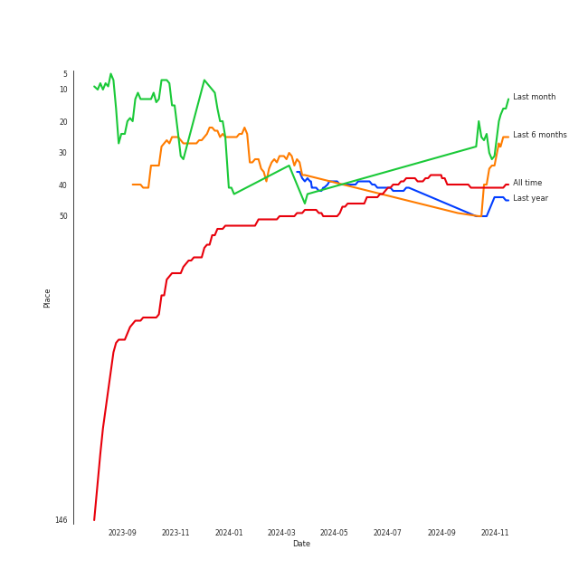
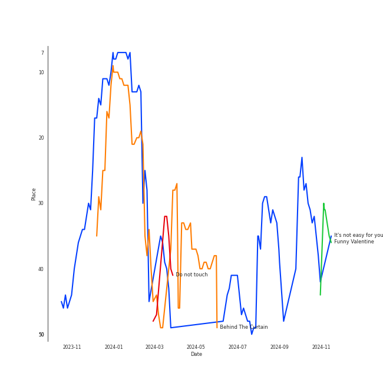
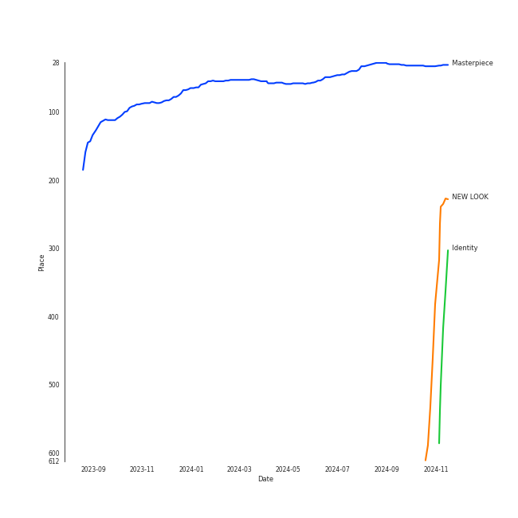

# MISAMO

## Relationships

MISAMO:
- has member 平井もも (Hirai, Momo)
- has member 名井南 (Myoui, Mina)
- has member SANA
- is a subgroup of [TWICE](../twice/overview.md)

## Artist Rank
MISAMO is currently:
- The #18 artist of the last month
- The #28 artist of the last 6 months
- The #44 artist of the last year
- The #41 artist of all time

## Top Tracks

### Top tracks of all time

Top tracks of the last year over time

Top tracks of the last 6 months over time

## Top Albums

| Art | Rank | Tracks | 💚 | Album | Release Date | 🔗 |
|:---|---:|---:|---:|:---|:---|:---|
|  | 32 | 4 | 4 | Masterpiece | 2023-07-26 | [🔗](https://open.spotify.com/album/3qmO83vO1SsdmP1Y0ljhSQ) |
|  | 240 | 1 | 1 | NEW LOOK | 2024-10-09 | [🔗](https://open.spotify.com/album/0nIHweIUCe2nVy5stte3GY) |
|  | 503 | 1 | 1 | Identity | 2024-10-28 | [🔗](https://open.spotify.com/album/7xzn12f7FNR7ZaZ5RB7afD) |

## Featured on Playlists
| Art | Tracks | Playlist |
|:---|---:|:---|
|  | 6 | [K-Pop](../../playlists/k-pop/overview.md) |
|  | 2 | [Retro Kpop](../../playlists/retro_kpop/overview.md) |
|  | 2 | [K-Pop Favorites](../../playlists/k-pop_favorites/overview.md) |
|  | 2 | [Recent Comebacks](../../playlists/recent_comebacks/overview.md) |
|  | 2 | [On Repeat](../../playlists/on_repeat/overview.md) |
|  | 1 | [Your Top Songs 2023](../../playlists/your_top_songs_2023/overview.md) |
|  | 1 | [Halloween](../../playlists/halloween/overview.md) |
|  | 1 | [애교！](../../playlists/애교！/overview.md) |

## Top Record Labels

| Tracks | 💚 | Label |
|---:|---:|:---|
| 6 | 6 | [WM Japan](../../labels/wm_japan/overview.md) |

## Genres

- [k-pop girl group](../../genres/k-pop_girl_group/overview.md)

## Credits

### Member Credits

| | SANA | 名井南 (Myoui, Mina) | 平井もも (Hirai, Momo) |
|:---|---:|---:|---:|
| Vocal | 13 | 14 | 13 |
## Top Producers

| Art | Producer | Tracks | Credit Types |
|:---|:---|---:|:---|
| | Eddie Holland | 1 | Songwriter |
| | Lamont Dozier | 1 | Songwriter |
| | Brian Holland | 1 | Songwriter |
| | MICHICO | 1 | Lyricist |
| | T-Kura | 1 | Songwriter |

## Tracks

| Art | Track | Album | Artists | Label | Rank | 💚 | 🔗 |
|:---|:---|:---|:---|:---|---:|:---|:---|
|  | It's not easy for you | Masterpiece | [MISAMO](overview.md) | [WM Japan](../../labels/wm_japan) | 66 | 💚 | [🔗](https://open.spotify.com/track/1qNk7XPTbyuO4bsDl0T6nN) |
|  | Behind The Curtain | Masterpiece | [MISAMO](overview.md) | [WM Japan](../../labels/wm_japan) | 86 | 💚 | [🔗](https://open.spotify.com/track/14nturKxV48wR3lbknehiu) |
|  | Funny Valentine | Masterpiece | [MISAMO](overview.md) | [WM Japan](../../labels/wm_japan) | 279 | 💚 | [🔗](https://open.spotify.com/track/4xtgQGbQnII1buKgl5fguT) |
|  | NEW LOOK | NEW LOOK | [MISAMO](overview.md) | [WM Japan](../../labels/wm_japan) | 334 | 💚 | [🔗](https://open.spotify.com/track/451U7NEyfqtVefeIgSoJF0) |
|  | Do not touch | Masterpiece | [MISAMO](overview.md) | [WM Japan](../../labels/wm_japan) | 336 | 💚 | [🔗](https://open.spotify.com/track/5gq7xM6eI16osBO2U581NL) |
|  | Identity | Identity | [MISAMO](overview.md) | [WM Japan](../../labels/wm_japan) | 757 | 💚 | [🔗](https://open.spotify.com/track/5vL4zyP6X132arv4VhySLT) |
