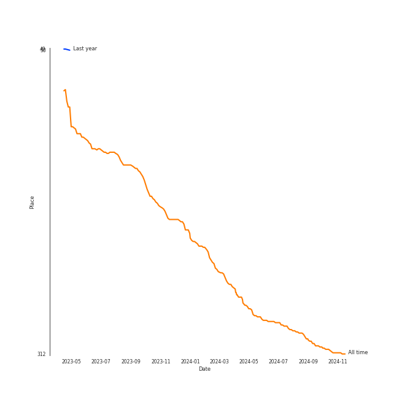

# MOMOLAND

## Relationships

MOMOLAND:
- has member 아인 (A-in)
- has member 데이지 (Daisy)
- has member 혜빈 (Hye-bin)
- has member 제인 (Jane)
- has member 주이 (Ju-i)
- has member 나윤 (Na-yoon)
- has member Nancy
- has member Taeha
- has member 연우 (Yeon-woo)

## Artist Rank
- The #283 artist of all time

## Top Albums

| Art | Rank | Tracks | 💚 | Album | Release Date | 🔗 |
|:---|---:|---:|---:|:---|:---|:---|
|  | 637 | 1 | 1 | Yummy Yummy Love | 2022-01-14 | [🔗](https://open.spotify.com/album/2r35RHvEtBjgKiONdItRR5) |
|  | 637 | 1 | 1 | Wrap Me In Plastic | 2021-02-05 | [🔗](https://open.spotify.com/album/58VYPx8GBYTf3Sz2RyPApB) |
|  | 637 | 1 | 1 | Show Me | 2019-03-20 | [🔗](https://open.spotify.com/album/2olU5yGGjXxgOt9GrFEtLo) |
|  | 637 | 1 | 1 | GREAT! | 2018-01-03 | [🔗](https://open.spotify.com/album/5vt2sEP5J0VNbYXoA7h2k4) |
|  | 637 | 1 | 1 | Fun to The World | 2018-06-26 | [🔗](https://open.spotify.com/album/75dkh8s39e7txjNe9cODH3) |
|  | 637 | 1 | 0 | BANANA CHACHA | 2019-04-03 | [🔗](https://open.spotify.com/album/7ddX2r1TPT08eiSMUlCx8H) |

## Featured on Playlists
| Art | Tracks | Playlist |
|:---|---:|:---|
|  | 5 | [K-Pop](../../playlists/k-pop/overview.md) |
|  | 4 | [Summer](../../playlists/summer/overview.md) |
|  | 4 | [애교！](../../playlists/애교！/overview.md) |
|  | 1 | [Your Top Songs 2022](../../playlists/your_top_songs_2022/overview.md) |

## Top Record Labels

| Tracks | 💚 | Label |
|---:|---:|:---|
| 3 | 3 | MLD ENTERTAINMENT |
| 2 | 2 | [Kakao Entertainment](../../labels/kakao_entertainment/overview.md) |
| 1 | 1 | Kakao M Corp. |
| 1 | 1 | DUBLEKICK COMPANY |
| 1 | 1 | [Columbia](../../labels/columbia/overview.md) |
| 1 | 1 | B1 Recordings |
| 1 | 0 | ICONIX |

## Genres

- [k-pop](../../genres/k-pop/overview.md)
- [k-pop girl group](../../genres/k-pop_girl_group/overview.md)

## Tracks

| Art | Track | Album | Artists | Label | Rank | 💚 | 🔗 |
|:---|:---|:---|:---|:---|---:|:---|:---|
|  | BBoom BBoom | GREAT! | [MOMOLAND](overview.md) | [DUBLEKICK COMPANY, Kakao Entertainment](../../labels/kakao_entertainment) | 964 | 💚 | [🔗](https://open.spotify.com/track/3BPoSr2pO34Aan6alFfVto) |
|  | BAAM | Fun to The World | [MOMOLAND](overview.md) | [MLD ENTERTAINMENT, Kakao Entertainment](../../labels/kakao_entertainment) | 964 | 💚 | [🔗](https://open.spotify.com/track/4Is1b37KJY9XVCgzp81FBW) |
|  | I’m So Hot | Show Me | [MOMOLAND](overview.md) | MLD ENTERTAINMENT, Kakao M Corp. | 964 | 💚 | [🔗](https://open.spotify.com/track/5unCIQfJLMtcsiU6MP5zmB) |
|  | BANANA CHACHA | BANANA CHACHA | [MOMOLAND](overview.md) | ICONIX | 964 | | [🔗](https://open.spotify.com/track/5rEkbyBhnuVXLfe6yp8f3b) |
|  | Wrap Me In Plastic | Wrap Me In Plastic | [MOMOLAND](overview.md), CHROMANCE | [Columbia/B1 Recordings](../../labels/columbia) | 964 | 💚 | [🔗](https://open.spotify.com/track/5mpWGq83n0sIgGRopGk5QZ) |
|  | Yummy Yummy Love | Yummy Yummy Love | [MOMOLAND](overview.md), NATTI NATASHA | MLD entertainment | 964 | 💚 | [🔗](https://open.spotify.com/track/4yTvTZ68CSpqV1T6AuGikB) |
