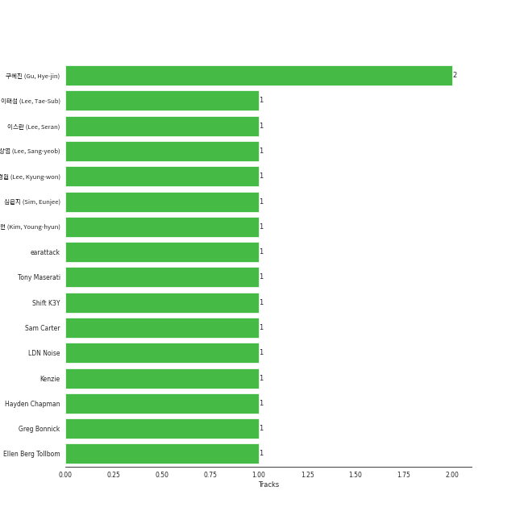

# NAYEON

## Relationships

NAYEON:
- is a member of [TWICE](../twice/overview.md)

## Artist Rank
- The #399 artist overall

## Featured on Playlists
| Art | Tracks | Playlist |
|:---|---:|:---|
|  | 8 | [K-Pop](../../playlists/k-pop/overview.md) |
|  | 5 | [Recent Comebacks](../../playlists/recent_comebacks/overview.md) |
|  | 1 | [Summer](../../playlists/summer/overview.md) |

## Top Albums

| Art | Tracks | 💚 | Album | Release Date | 🔗 |
|:---|---:|---:|:---|:---|:---|
|  | 5 | 3 | NA | 2024-06-14 | [🔗](https://open.spotify.com/album/5zQI9dFbS9TrhvC9clgjz7) |
|  | 3 | 2 | IM NAYEON | 2022-06-24 | [🔗](https://open.spotify.com/album/0wqjfojWuTcbEvwaizvTMw) |

## Top Record Labels

| Tracks | 💚 | Label |
|---:|---:|:---|
| 8 | 5 | Republic Records – NAYEON (TWICE) |

## Genres

- [k-pop](../../genres/k-pop/overview.md)

## Credits

### Credits by Type

| Credit Type | Tracks |
|:---|---:|
| Vocal | 15 |

## Top Producers

| Art | Producer | Tracks | Credit Types |
|:---|:---|---:|:---|
| | [구혜진 (Gu, Hye-jin)](../../producers/구혜진_(gu,_hye-jin)/overview.md) | 2 | Producer |
| | [Kenzie](../../producers/kenzie/overview.md) | 1 | Songwriter |
| | 이스란 (Lee, Seran) | 1 | Lyricist |
| | [earattack](../../producers/earattack/overview.md) | 1 | Arranger |
| | 이상엽 (Lee, Sang-yeob) | 1 | Producer |
| | Hayden Chapman | 1 | Songwriter |
| | [Tony Maserati](../../producers/tony_maserati/overview.md) | 1 | Producer |
| | Shift K3Y | 1 | Arranger, Lyricist, Songwriter |
| | [이태섭 (Lee, Tae-Sub)](../../producers/이태섭_(lee,_tae-sub)/overview.md) | 1 | Producer |
| | [심은지 (Sim, Eunjee)](../../producers/심은지_(sim,_eunjee)/overview.md) | 1 | Arranger, Producer |

View all

| Art | Producer | Tracks | Credit Types |
|:---|:---|---:|:---|
| | [LDN Noise](../../producers/ldn_noise/overview.md) | 1 | Arranger |
| | Sam Carter | 1 | Arranger |
| | Greg Bonnick | 1 | Songwriter |
| | Ellen Berg Tollbom | 1 | Songwriter |
| | 김영현 (Kim, Young-hyun) | 1 | Producer |
| | 이경원 (Lee, Kyung-won) | 1 | Producer |

## Tracks

| Art | Track | Album | Artists | Label | Rank | 💚 | 🔗 |
|:---|:---|:---|:---|:---|---:|:---|:---|
|  | CANDYFLOSS | IM NAYEON | [NAYEON](overview.md) | Republic Records – NAYEON (TWICE) | 847 | | [🔗](https://open.spotify.com/track/3r6v6awkmqrHLj9yKaYZmZ) |
|  | NO PROBLEM (Feat. Felix of Stray Kids) | IM NAYEON | [NAYEON](overview.md), Felix (Stray Kids) | Republic Records – NAYEON (TWICE) | 847 | 💚 | [🔗](https://open.spotify.com/track/4zHvWi4iFAG45lgiN7smLC) |
|  | POP! | IM NAYEON | [NAYEON](overview.md) | Republic Records – NAYEON (TWICE) | 847 | 💚 | [🔗](https://open.spotify.com/track/3lOMJTQTd6J34faYwASc33) |
|  | ABCD | NA | [NAYEON](overview.md) | Republic Records – NAYEON (TWICE) | 847 | 💚 | [🔗](https://open.spotify.com/track/0V2passWyAXnON67kfAj7y) |
|  | Butterflies | NA | [NAYEON](overview.md) | Republic Records – NAYEON (TWICE) | 847 | 💚 | [🔗](https://open.spotify.com/track/07W0lOkOUhVhdJQ9wVepWr) |
|  | HalliGalli (Prod. by LEE CHANHYUK of AKMU) | NA | [NAYEON](overview.md) | Republic Records – NAYEON (TWICE) | 847 | | [🔗](https://open.spotify.com/track/5kPpwkItcgv549fMOnqfJc) |
|  | Magic (Feat. JULIE of KISS OF LIFE) | NA | [NAYEON](overview.md), JULIE | Republic Records – NAYEON (TWICE) | 847 | 💚 | [🔗](https://open.spotify.com/track/6pLYWcPnBdFJShuUARDIwj) |
|  | Something | NA | [NAYEON](overview.md) | Republic Records – NAYEON (TWICE) | 847 | | [🔗](https://open.spotify.com/track/2oaUUdELrrWV1BKtVQvXAh) |
