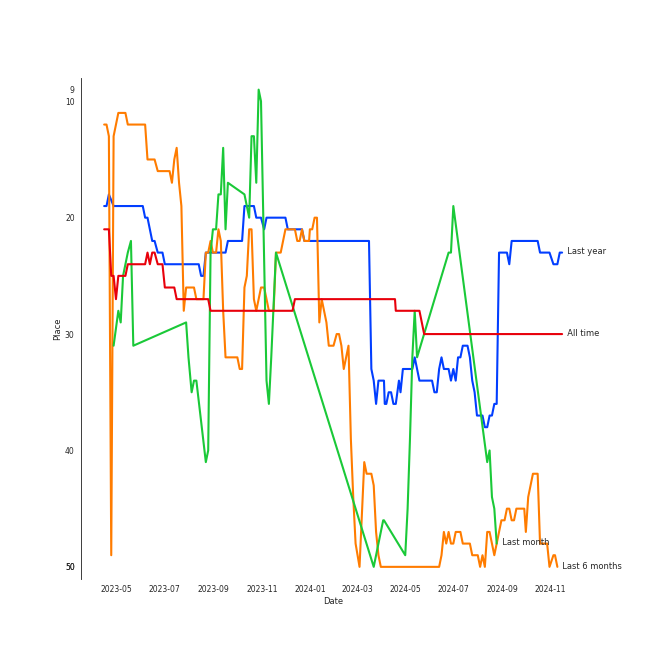
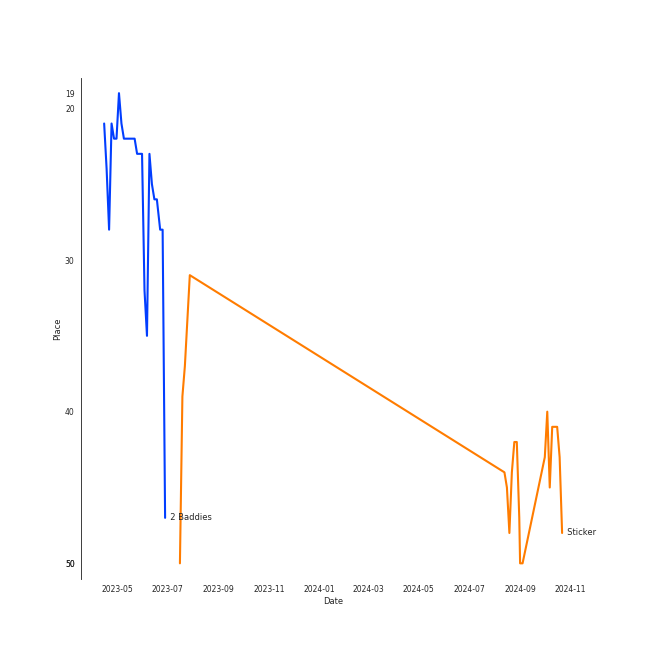

# NCT 127

[See Track Features](audio_features.md)

[See Clusters](clusters/overview.md)

## Relationships

NCT 127:
- has member 도영 (DOYOUNG)
- has member 董寺丞 (Dong, Sicheng)
- has member 해찬 (Hae Chan)
- has member JAEHYUN
- has member JOHNNY
- has member 정우 (JUNGWOO)
- has member MARK
- has member 中本悠太 (Nakamoto, Yuta)
- has member TAEIL
- has member TAEYONG
- is a subgroup of NCT

## Artist Rank
NCT 127 is currently:
- The #20 artist of all time
- The #28 artist of the last 6 months
- The #32 artist of the last month

## Top Tracks

### Top tracks of the last 6 months over time

### Top tracks of the last month over time

## Featured on Playlists
| Art | Tracks | Playlist |
|:---|---:|:---|
|  | 11 | [K-Pop](../../playlists/k_pop/overview.md) |
|  | 3 | [Workout](../../playlists/workout/overview.md) |
|  | 2 | [Summer](../../playlists/summer/overview.md) |
|  | 2 | [K-Pop Favorites](../../playlists/k_pop_favorites/overview.md) |
|  | 2 | [Recent Comebacks](../../playlists/recent_comebacks/overview.md) |
|  | 2 | [Cursed English](../../playlists/cursed_english/overview.md) |
|  | 2 | [K-Memes](../../playlists/k_memes/overview.md) |
|  | 1 | [K-Pop 101](../../playlists/k_pop_101/overview.md) |
|  | 1 | [Sharon RPD](../../playlists/sharon_rpd/overview.md) |
|  | 1 | [Halloween](../../playlists/halloween/overview.md) |
|  | 1 | [Chill](../../playlists/chill/overview.md) |

## Top Albums

| Art | Tracks | 💚 | Album | Release Date | 🔗 |
|:---|---:|---:|:---|:---|:---|
|  | 3 | 2 | 2 Baddies - The 4th Album | 2022-09-16 | [🔗](https://open.spotify.com/album/6p80QT3z7kOHpYdnsItQTQ) |
|  | 2 | 2 | Sticker - The 3rd Album | 2021-09-17 | [🔗](https://open.spotify.com/album/6nYbIKGcTmKM5BAlJPPcad) |
|  | 2 | 0 | Fact Check - The 5th Album | 2023-10-06 | [🔗](https://open.spotify.com/album/0BJU07UQiBbB2bLLJg2ktr) |
|  | 1 | 1 | NCT #127 Neo Zone - The 2nd Album | 2020-03-06 | [🔗](https://open.spotify.com/album/5YOvg682zFOleCiSndLnZr) |
|  | 1 | 1 | NCT #127 - The 1st Mini Album | 2016-07-10 | [🔗](https://open.spotify.com/album/7xmqXxPAmkgn5HK9FcyBxR) |
|  | 1 | 1 | Favorite - The 3rd Album Repackage | 2021-10-25 | [🔗](https://open.spotify.com/album/5LbnQtyHBfJUCigA08llHX) |
|  | 1 | 0 | NCT#127 LIMITLESS - The 2nd Mini Album | 2017-01-06 | [🔗](https://open.spotify.com/album/4EEfpF1qcPAl1J4Z770A2U) |
|  | 1 | 0 | NCT #127 Regular-Irregular - The 1st Album | 2018-10-12 | [🔗](https://open.spotify.com/album/4oU5Tp952fPL7z2Bax4JmU) |
|  | 1 | 0 | NCT #127 CHERRY BOMB– The 3rd Mini Album | 2017-06-14 | [🔗](https://open.spotify.com/album/7H5FkCA6cTDBX3wtvIbN8s) |
|  | 1 | 0 | Highway to Heaven (English Version) | 2019-07-18 | [🔗](https://open.spotify.com/album/4et1GgNRTOx3xpK81Z0iOn) |

See all albums

| Art | Tracks | 💚 | Album | Release Date | 🔗 |
|:---|---:|---:|:---|:---|:---|
|  | 1 | 0 | Ay-Yo - The 4th Album Repackage | 2023-01-30 | [🔗](https://open.spotify.com/album/3VjW3uIc8WG4tXF2wKW9BJ) |

## Top Record Labels

| Tracks | 💚 | Label |
|---:|---:|:---|
| 15 | 7 | [SM Entertainment](../../labels/sm_entertainment/overview.md) |

## Genres

- [k-pop](../../genres/k_pop/overview.md)
- [k-pop boy group](../../genres/k_pop_boy_group/overview.md)

## Credits

### Member Credits

| | JAEHYUN | MARK | TAEYONG | 董寺丞 (Dong, Sicheng) | 도영 (DOYOUNG) | 정우 (JUNGWOO) |
|:---|---:|---:|---:|---:|---:|---:|
| Lyricist | 0 | 1 | 1 | 0 | 0 | 0 |
| Performer | 0 | 0 | 1 | 0 | 0 | 0 |
| Songwriter | 0 | 1 | 1 | 0 | 0 | 0 |
| Vocal | 3 | 2 | 5 | 1 | 3 | 1 |
### Production Credits

| Art | Track | Members | Credit Types |
|:---|:---|:---|:---|
|  | BOSS | MARK, TAEYONG | Lyricist |
|  | The 7th Sense | MARK, TAEYONG | Songwriter |

## Tracks

| Art | Track | Album | Artists | Label | 💚 | 🔗 |
|:---|:---|:---|:---|:---|:---|:---|
|  | 소방차 Fire Truck | NCT #127 - The 1st Mini Album | [NCT 127](overview.md) | [SM Entertainment](../../labels/sm_entertainment) | 💚 | [🔗](https://open.spotify.com/track/5hHlmrSV6d9LFMsDA1lamE) |
|  | Back 2 U (AM 01:27) | NCT#127 LIMITLESS - The 2nd Mini Album | [NCT 127](overview.md) | [SM Entertainment](../../labels/sm_entertainment) | | [🔗](https://open.spotify.com/track/37SqctQhMp3MjvGDXKhnJ3) |
|  | Cherry Bomb | NCT #127 CHERRY BOMB– The 3rd Mini Album | [NCT 127](overview.md) | [SM Entertainment](../../labels/sm_entertainment) | | [🔗](https://open.spotify.com/track/3o8QzWsiiqTUVgBZfHgF58) |
|  | Regular - English Version | NCT #127 Regular-Irregular - The 1st Album | [NCT 127](overview.md) | [SM Entertainment](../../labels/sm_entertainment) | | [🔗](https://open.spotify.com/track/4KqPuyZdcjXuRqXSARnt6r) |
|  | Highway to Heaven - English Version | Highway to Heaven (English Version) | [NCT 127](overview.md) | [SM Entertainment](../../labels/sm_entertainment) | | [🔗](https://open.spotify.com/track/3WNuXdBxk8tQ2VI020dqvE) |
|  | Kick It | NCT #127 Neo Zone - The 2nd Album | [NCT 127](overview.md) | [SM Entertainment](../../labels/sm_entertainment) | 💚 | [🔗](https://open.spotify.com/track/1ayaOin9hxCtyhg4UsBTpg) |
|  | Lemonade | Sticker - The 3rd Album | [NCT 127](overview.md) | [SM Entertainment](../../labels/sm_entertainment) | 💚 | [🔗](https://open.spotify.com/track/6txVOdSbg928oeGhlVUrdK) |
|  | Sticker | Sticker - The 3rd Album | [NCT 127](overview.md) | [SM Entertainment](../../labels/sm_entertainment) | 💚 | [🔗](https://open.spotify.com/track/1iGQpclvzonFNzy7Ko89V7) |
|  | Favorite (Vampire) | Favorite - The 3rd Album Repackage | [NCT 127](overview.md) | [SM Entertainment](../../labels/sm_entertainment) | 💚 | [🔗](https://open.spotify.com/track/2R8MZR1RCP4cIJITHDPRbY) |
|  | 2 Baddies | 2 Baddies - The 4th Album | [NCT 127](overview.md) | [SM Entertainment](../../labels/sm_entertainment) | 💚 | [🔗](https://open.spotify.com/track/1WKLxJpDqkQ9x1qEDNutoX) |

See all tracks

| Art | Track | Album | Artists | Label | 💚 | 🔗 |
|:---|:---|:---|:---|:---|:---|:---|
|  | Gold Dust | 2 Baddies - The 4th Album | [NCT 127](overview.md) | [SM Entertainment](../../labels/sm_entertainment) | 💚 | [🔗](https://open.spotify.com/track/0Hj4YtlD0Q5O0srdZxJUtl) |
|  | Vitamin | 2 Baddies - The 4th Album | [NCT 127](overview.md) | [SM Entertainment](../../labels/sm_entertainment) | | [🔗](https://open.spotify.com/track/71mbhY822FlcBmxMgeuUgA) |
|  | Ay-Yo | Ay-Yo - The 4th Album Repackage | [NCT 127](overview.md) | [SM Entertainment](../../labels/sm_entertainment) | | [🔗](https://open.spotify.com/track/2KwOuFfwQyT9mZqjvchd81) |
|  | Fact Check | Fact Check - The 5th Album | [NCT 127](overview.md) | [SM Entertainment](../../labels/sm_entertainment) | | [🔗](https://open.spotify.com/track/5EtiQveQFQy0R05hLVDyKv) |
|  | Je Ne Sais Quoi | Fact Check - The 5th Album | [NCT 127](overview.md) | [SM Entertainment](../../labels/sm_entertainment) | | [🔗](https://open.spotify.com/track/0RRulrevan6sxj7KfMBi6k) |

