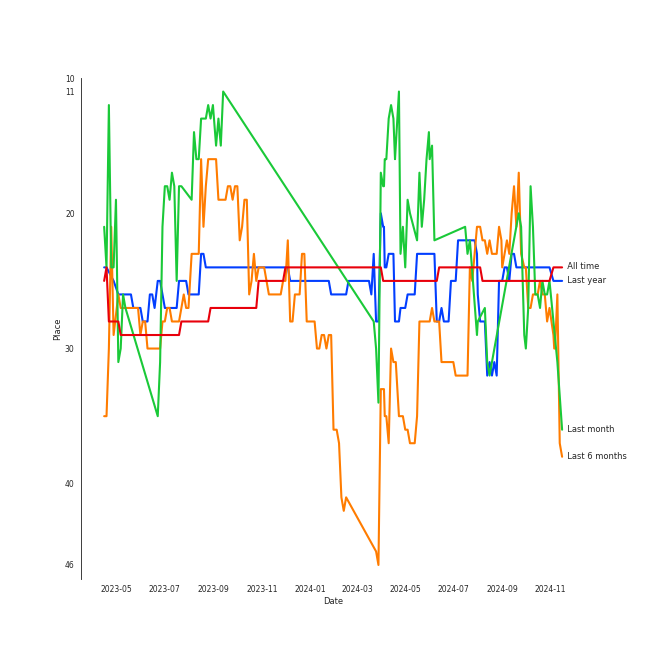
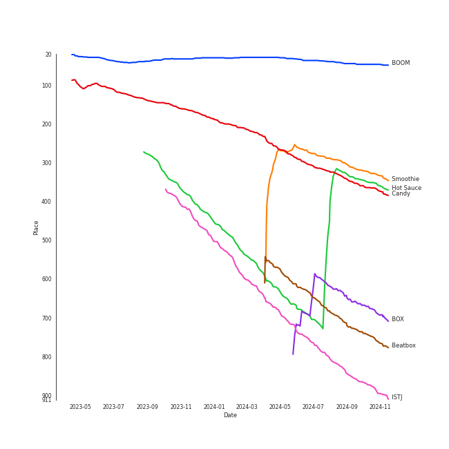
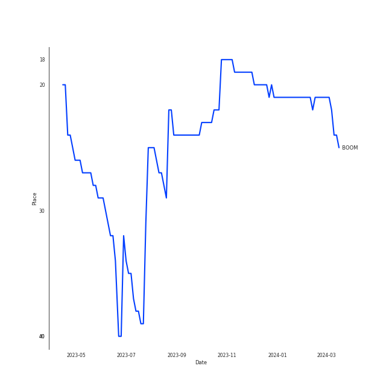
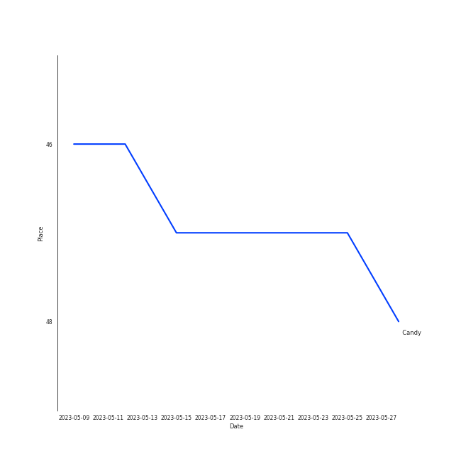
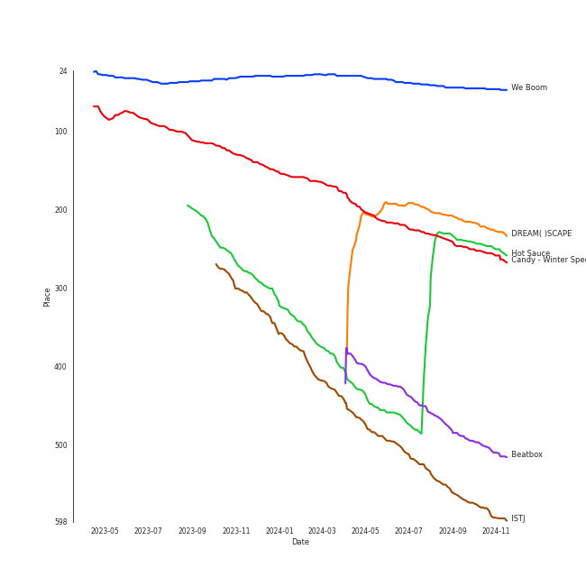

# NCT DREAM

[See Track Features](audio_features.md)

[See Clusters](clusters/overview.md)

## Relationships

NCT DREAM:
- has member 해찬 (Hae Chan)
- has member 黄仁俊 (Huang, Ren Jun)
- has member JENO
- has member JAEMIN
- has member JISUNG
- has member MARK
- has member 钟辰乐 (Zhong, Chen Le)
- is a subgroup of NCT

## Artist Rank
NCT DREAM is currently:
- The #27 artist of the last month
- The #22 artist of the last 6 months
- The #28 artist of the last year
- The #24 artist of all time

## Top Tracks

### Top tracks of all time

Top tracks of the last year over time

Top tracks of the last 6 months over time

## Top Albums

| Art | Rank | Tracks | 💚 | Album | Release Date | 🔗 |
|:---|---:|---:|---:|:---|:---|:---|
|  | 612 | 2 | 2 | Glitch Mode - The 2nd Album | 2022-03-28 | [🔗](https://open.spotify.com/album/4cAcTMGFjTBufC7Eu0FizU) |
|  | 546 | 2 | 1 | ISTJ - The 3rd Album | 2023-07-17 | [🔗](https://open.spotify.com/album/6RJlrKu60DPF6BMXVdotY7) |
|  | 208 | 2 | 1 | DREAM( )SCAPE | 2024-03-25 | [🔗](https://open.spotify.com/album/2urIpiAu1CySTyyNuQQxcz) |
|  | 42 | 1 | 1 | We Boom - The 3rd Mini Album | 2019-07-26 | [🔗](https://open.spotify.com/album/31ln9LpD1WyhFlOvDp9YJc) |
|  | 612 | 1 | 1 | Reload | 2020-04-29 | [🔗](https://open.spotify.com/album/1V5ilz8ghPl1PZJA1hbw3r) |
|  | 237 | 1 | 1 | Hot Sauce - The 1st Album | 2021-05-10 | [🔗](https://open.spotify.com/album/1miTgxRTUje9Jqml1aOSUi) |
|  | 612 | 1 | 1 | Hello Future - The 1st Album Repackage | 2021-06-28 | [🔗](https://open.spotify.com/album/1fRqXYwoLDxG3EwP70qnjM) |
|  | 225 | 1 | 1 | Candy - Winter Special Mini Album | 2022-12-16 | [🔗](https://open.spotify.com/album/6lqazNXadymQLwUh41qW2K) |
|  | 466 | 1 | 1 | Beatbox - The 2nd Album Repackage | 2022-05-30 | [🔗](https://open.spotify.com/album/4sM1qNxjzxOvoH6jeFHx3W) |
|  | 612 | 1 | 0 | JOY - SM STATION | 2017-12-15 | [🔗](https://open.spotify.com/album/5UkUr57L6X1gopnzG1dyBa) |

See all albums

| Art | Rank | Tracks | 💚 | Album | Release Date | 🔗 |
|:---|---:|---:|---:|:---|:---|:---|
|  | 612 | 1 | 0 | Best Friend Ever | 2023-02-08 | [🔗](https://open.spotify.com/album/4cT6f8tGzBtybpBNYPEQoX) |

## Featured on Playlists
| Art | Tracks | Playlist |
|:---|---:|:---|
|  | 13 | [K-Pop](../../playlists/k-pop/overview.md) |
|  | 5 | [K-Pop Favorites](../../playlists/k-pop_favorites/overview.md) |
|  | 2 | [Summer](../../playlists/summer/overview.md) |
|  | 2 | [Your Top Songs 2022](../../playlists/your_top_songs_2022/overview.md) |
|  | 2 | [Workout](../../playlists/workout/overview.md) |
|  | 2 | [Christmas](../../playlists/christmas/overview.md) |
|  | 1 | [K-Pop 101](../../playlists/k-pop_101/overview.md) |

## Top Record Labels

| Tracks | 💚 | Label |
|---:|---:|:---|
| 13 | 10 | [SM Entertainment](../../labels/sm_entertainment/overview.md) |
| 1 | 0 | [avex trax](../../labels/avex_trax/overview.md) |

## Genres

- [k-pop boy group](../../genres/k-pop_boy_group/overview.md)

## Credits

### Member Credits

| | JAEMIN | MARK |
|:---|---:|---:|
| Lyricist | 0 | 1 |
| Songwriter | 0 | 1 |
| Vocal | 1 | 2 |
### Production Credits

| Art | Track | Members | Credit Types |
|:---|:---|:---|:---|
|  | BOSS | MARK | Lyricist |
|  | The 7th Sense | MARK | Songwriter |

## Tracks

| Art | Track | Album | Artists | Label | Rank | 💚 | 🔗 |
|:---|:---|:---|:---|:---|---:|:---|:---|
|  | BOOM | We Boom - The 3rd Mini Album | [NCT DREAM](overview.md) | [SM Entertainment](../../labels/sm_entertainment) | 39 | 💚 | [🔗](https://open.spotify.com/track/6rcn967QN5JtkPOBDwYIuT) |
|  | Smoothie | DREAM( )SCAPE | [NCT DREAM](overview.md) | [SM Entertainment](../../labels/sm_entertainment) | 297 | 💚 | [🔗](https://open.spotify.com/track/2jaapqz7L9MpMf7vpkqU9I) |
|  | Candy | Candy - Winter Special Mini Album | [NCT DREAM](overview.md) | [SM Entertainment](../../labels/sm_entertainment) | 306 | 💚 | [🔗](https://open.spotify.com/track/27bIik73QCu8Xzt3xpG1bI) |
|  | Hot Sauce | Hot Sauce - The 1st Album | [NCT DREAM](overview.md) | [SM Entertainment](../../labels/sm_entertainment) | 326 | 💚 | [🔗](https://open.spotify.com/track/6B8MM3PVQtUbZLay7tP7er) |
|  | BOX | DREAM( )SCAPE | [NCT DREAM](overview.md) | [SM Entertainment](../../labels/sm_entertainment) | 631 | | [🔗](https://open.spotify.com/track/4I95uQMtIwg7779WEDy8Mc) |
|  | Beatbox | Beatbox - The 2nd Album Repackage | [NCT DREAM](overview.md) | [SM Entertainment](../../labels/sm_entertainment) | 697 | 💚 | [🔗](https://open.spotify.com/track/0CatzXH85XWyBqqdB6qPMB) |
|  | ISTJ | ISTJ - The 3rd Album | [NCT DREAM](overview.md) | [SM Entertainment](../../labels/sm_entertainment) | 820 | 💚 | [🔗](https://open.spotify.com/track/43Pmqpiw4zFY77pT5QdxQ8) |
|  | JOY | JOY - SM STATION | [NCT DREAM](overview.md) | [SM Entertainment](../../labels/sm_entertainment) | 921 | | [🔗](https://open.spotify.com/track/3I4pgDhMKp6Sww3lTxyg8X) |
|  | Ridin' | Reload | [NCT DREAM](overview.md) | [SM Entertainment](../../labels/sm_entertainment) | 921 | 💚 | [🔗](https://open.spotify.com/track/0EMD15EVNwDlgGH2CH6ZEL) |
|  | Hello Future | Hello Future - The 1st Album Repackage | [NCT DREAM](overview.md) | [SM Entertainment](../../labels/sm_entertainment) | 921 | 💚 | [🔗](https://open.spotify.com/track/332GJ8ykVuEt3jOT1sy7j6) |

See all tracks

| Art | Track | Album | Artists | Label | Rank | 💚 | 🔗 |
|:---|:---|:---|:---|:---|---:|:---|:---|
|  | Glitch Mode | Glitch Mode - The 2nd Album | [NCT DREAM](overview.md) | [SM Entertainment](../../labels/sm_entertainment) | 921 | 💚 | [🔗](https://open.spotify.com/track/5b1PngLlxc7hj3fJXrE2Zm) |
|  | Saturday Drip | Glitch Mode - The 2nd Album | [NCT DREAM](overview.md) | [SM Entertainment](../../labels/sm_entertainment) | 921 | 💚 | [🔗](https://open.spotify.com/track/2ohOA4P55RsoU1bOanNGyB) |
|  | Best Friend Ever | Best Friend Ever | [NCT DREAM](overview.md) | [avex trax](../../labels/avex_trax) | 921 | | [🔗](https://open.spotify.com/track/1Z5Dmg7Dvu0X4oSdqLZ3Lu) |
|  | Broken Melodies | ISTJ - The 3rd Album | [NCT DREAM](overview.md) | [SM Entertainment](../../labels/sm_entertainment) | 921 | | [🔗](https://open.spotify.com/track/63Czf03uph6EyJDL1z3x3z) |

