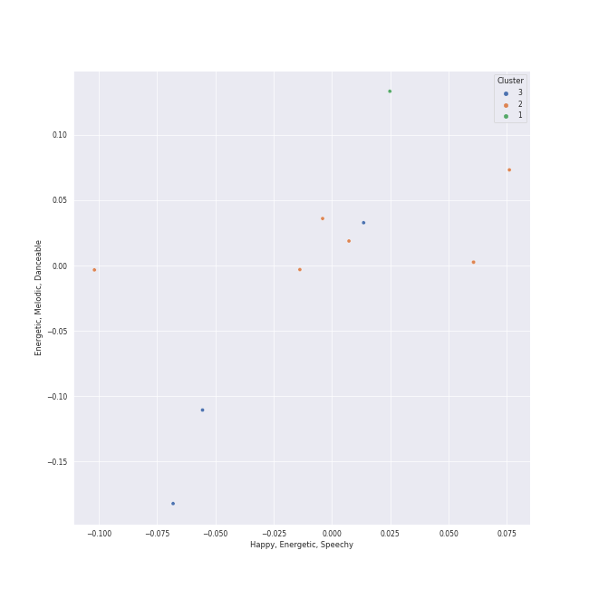

# Clusters in NCT U

## Cluster #1

1 tracks

| Art | Track | Album | Artists | Label | Rank | 💚 | 🔗 |
|:---|:---|:---|:---|:---|---:|:---|:---|
|  | Misfit | NCT RESONANCE Pt. 1 - The 2nd Album | [NCT U](../../overview.md) | [SM Entertainment](../../../../labels/sm_entertainment) | nan | | [🔗](https://open.spotify.com/track/4W8cwOcrcDzbWQSWqtKG3g) |
## Cluster #2

7 tracks

| Art | Track | Album | Artists | Label | Rank | 💚 | 🔗 |
|:---|:---|:---|:---|:---|---:|:---|:---|
|  | Universe (Let's Play Ball) | Universe - The 3rd Album | [NCT U](../../overview.md) | [SM Entertainment](../../../../labels/sm_entertainment) | nan | 💚 | [🔗](https://open.spotify.com/track/0S38pb0gNLNpOeyV3w9gXb) |
|  | Make A Wish (Birthday Song) - English Version | NCT RESONANCE Pt. 1 - The 2nd Album | [NCT U](../../overview.md) | [SM Entertainment](../../../../labels/sm_entertainment) | nan | | [🔗](https://open.spotify.com/track/1iPmAMVMqoT2ZromLzo305) |
|  | Make A Wish (Birthday Song) | NCT RESONANCE Pt. 1 - The 2nd Album | [NCT U](../../overview.md) | [SM Entertainment](../../../../labels/sm_entertainment) | 389 | 💚 | [🔗](https://open.spotify.com/track/6FdShjf7nA2cqEnpv1tIia) |
|  | Baggy Jeans | Golden Age - The 4th Album | [NCT U](../../overview.md) | [SM Entertainment](../../../../labels/sm_entertainment) | nan | 💚 | [🔗](https://open.spotify.com/track/2pozUjd7AVIPwSNDqoU3ek) |
|  | PADO | Golden Age - The 4th Album | [NCT U](../../overview.md) | [SM Entertainment](../../../../labels/sm_entertainment) | nan | 💚 | [🔗](https://open.spotify.com/track/7mLHba9b39oYWxxGVbPBXX) |
|  | 90's Love | NCT RESONANCE Pt. 2 - The 2nd Album | [NCT U](../../overview.md) | [SM Entertainment](../../../../labels/sm_entertainment) | nan | 💚 | [🔗](https://open.spotify.com/track/64EDGnUytmCV7TfOo67810) |
|  | Universe (Let's Play Ball) | Universe (Let's Play Ball) | [NCT U](../../overview.md) | [SM Entertainment](../../../../labels/sm_entertainment) | nan | 💚 | [🔗](https://open.spotify.com/track/6hHrPwQYGp9kPL7xLZviBS) |
## Cluster #3

3 tracks

| Art | Track | Album | Artists | Label | Rank | 💚 | 🔗 |
|:---|:---|:---|:---|:---|---:|:---|:---|
|  | BOSS | NCT 2018 EMPATHY | NCT, [NCT U](../../overview.md) | [SM Entertainment](../../../../labels/sm_entertainment) | 593 | 💚 | [🔗](https://open.spotify.com/track/0ErzcmZ2gIwX7X0xSMQPix) |
|  | Baby Don’t Stop | NCT 2018 EMPATHY | NCT, [NCT U](../../overview.md) | [SM Entertainment](../../../../labels/sm_entertainment) | nan | 💚 | [🔗](https://open.spotify.com/track/1EYSS9Lp7a9f20C3FaOVgI) |
|  | The 7th Sense | NCT 2018 EMPATHY | NCT, [NCT U](../../overview.md) | [SM Entertainment](../../../../labels/sm_entertainment) | nan | 💚 | [🔗](https://open.spotify.com/track/6BdchFAP4TUZUceAsAEb5U) |