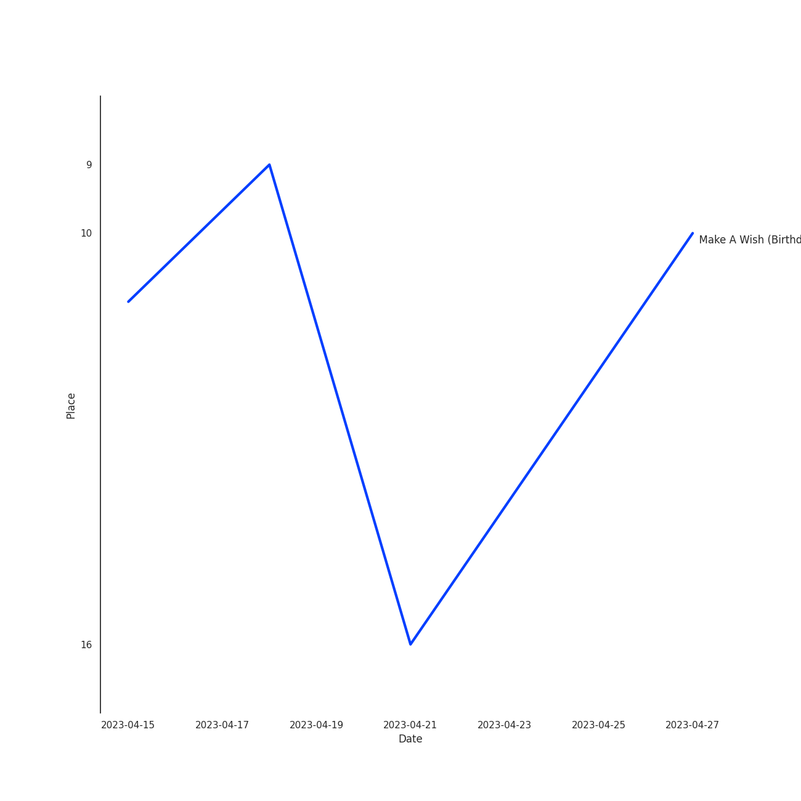

# NCT U

## Artist Rank

## Top Tracks

### Top tracks of the last month over time

## Featured on Playlists
| Art | Tracks | Playlist |
|:---|---:|:---|
|  | 9 | [K-Pop](../../playlists/k_pop/overview.md) |
|  | 2 | [K-Pop Favorites](../../playlists/k_pop_favorites/overview.md) |
|  | 2 | [Recent Comebacks](../../playlists/recent_comebacks/overview.md) |
|  | 1 | [K-Pop 101](../../playlists/k_pop_101/overview.md) |
|  | 1 | [Sharon RPD](../../playlists/sharon_rpd/overview.md) |
|  | 1 | [Cursed English](../../playlists/cursed_english/overview.md) |
|  | 1 | [Workout](../../playlists/workout/overview.md) |
## Top Albums

| Art | Tracks | 💚 | Album | Release Date | 🔗 |
|:---|---:|---:|:---|:---|:---|
|  | 3 | 3 | NCT 2018 EMPATHY | 2018-03-14 | [🔗](https://open.spotify.com/album/3KAJvo62RNQEtXwIyB5rzX) |
|  | 3 | 1 | NCT RESONANCE Pt. 1 - The 2nd Album | 2020-10-12 | [🔗](https://open.spotify.com/album/6kudlOyCqSQfsBVSdPZEu4) |
|  | 2 | 2 | Golden Age - The 4th Album | 2023-08-28 | [🔗](https://open.spotify.com/album/5mUo2e4QpUA7NJl2t51uFu) |
|  | 1 | 1 | Universe (Let's Play Ball) | 2021-12-10 | [🔗](https://open.spotify.com/album/31BJasH9nLradtMdJEIDXk) |
|  | 1 | 1 | NCT RESONANCE Pt. 2 - The 2nd Album | 2020-11-23 | [🔗](https://open.spotify.com/album/5Dq6jkYO5H7KzxXSazhLxs) |

## Top Record Labels

| Tracks | 💚 | Label |
|---:|---:|:---|
| 10 | 8 | [SM Entertainment](../../labels/sm_entertainment/overview.md) |

## Genres

- [k-pop](../../genres/k_pop)
- [k-pop boy group](../../genres/k_pop_boy_group)

## Tracks

| Art | Track | Album | Artists | Label | 💚 | 🔗 |
|:---|:---|:---|:---|:---|:---|:---|
|  | BOSS | NCT 2018 EMPATHY | NCT, [NCT U](overview.md) | [SM Entertainment](../../labels/sm_entertainment) | 💚 | [🔗](https://open.spotify.com/track/0ErzcmZ2gIwX7X0xSMQPix) |
|  | Baby Don’t Stop | NCT 2018 EMPATHY | NCT, [NCT U](overview.md) | [SM Entertainment](../../labels/sm_entertainment) | 💚 | [🔗](https://open.spotify.com/track/1EYSS9Lp7a9f20C3FaOVgI) |
|  | The 7th Sense | NCT 2018 EMPATHY | NCT, [NCT U](overview.md) | [SM Entertainment](../../labels/sm_entertainment) | 💚 | [🔗](https://open.spotify.com/track/6BdchFAP4TUZUceAsAEb5U) |
|  | Make A Wish (Birthday Song) | NCT RESONANCE Pt. 1 - The 2nd Album | [NCT U](overview.md) | [SM Entertainment](../../labels/sm_entertainment) | 💚 | [🔗](https://open.spotify.com/track/6FdShjf7nA2cqEnpv1tIia) |
|  | Make A Wish (Birthday Song) - English Version | NCT RESONANCE Pt. 1 - The 2nd Album | [NCT U](overview.md) | [SM Entertainment](../../labels/sm_entertainment) | | [🔗](https://open.spotify.com/track/1iPmAMVMqoT2ZromLzo305) |
|  | Misfit | NCT RESONANCE Pt. 1 - The 2nd Album | [NCT U](overview.md) | [SM Entertainment](../../labels/sm_entertainment) | | [🔗](https://open.spotify.com/track/4W8cwOcrcDzbWQSWqtKG3g) |
|  | 90's Love | NCT RESONANCE Pt. 2 - The 2nd Album | [NCT U](overview.md) | [SM Entertainment](../../labels/sm_entertainment) | 💚 | [🔗](https://open.spotify.com/track/64EDGnUytmCV7TfOo67810) |
|  | Universe (Let's Play Ball) | Universe (Let's Play Ball) | [NCT U](overview.md) | [SM Entertainment](../../labels/sm_entertainment) | 💚 | [🔗](https://open.spotify.com/track/6hHrPwQYGp9kPL7xLZviBS) |
|  | Baggy Jeans | Golden Age - The 4th Album | [NCT U](overview.md) | [SM Entertainment](../../labels/sm_entertainment) | 💚 | [🔗](https://open.spotify.com/track/2pozUjd7AVIPwSNDqoU3ek) |
|  | PADO | Golden Age - The 4th Album | [NCT U](overview.md) | [SM Entertainment](../../labels/sm_entertainment) | 💚 | [🔗](https://open.spotify.com/track/7mLHba9b39oYWxxGVbPBXX) |