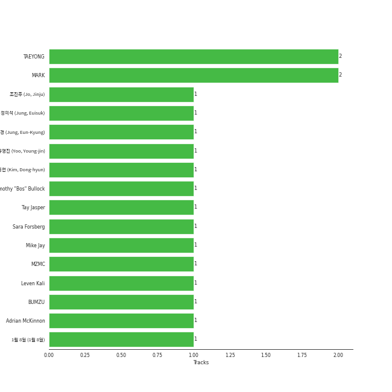

# NCT U

## Relationships

NCT U:
- has member 도영 (DOYOUNG)
- has member 董寺丞 (Dong, Sicheng)
- has member JAEHYUN
- has member 정우 (JUNGWOO)
- has member JAEMIN
- has member LUCAS
- has member MARK
- has member 大崎将太郎 (Osaki, Shotaro)
- has member TAEIL
- has member TAEYONG
- has member [TEN](../ten/overview.md)
- has member 肖德俊 (Xiao Dejun)
- is a subgroup of NCT

## Artist Rank

## Featured on Playlists
| Art | Tracks | Playlist |
|:---|---:|:---|
|  | 9 | [K-Pop](../../playlists/k-pop/overview.md) |
|  | 4 | [K-Pop Favorites](../../playlists/k-pop_favorites/overview.md) |
|  | 2 | [Workout](../../playlists/workout/overview.md) |
|  | 1 | [K-Pop 101](../../playlists/k-pop_101/overview.md) |
|  | 1 | [Sharon RPD](../../playlists/sharon_rpd/overview.md) |
|  | 1 | [Cursed English](../../playlists/cursed_english/overview.md) |

## Top Albums

| Art | Tracks | 💚 | Album | Release Date | 🔗 |
|:---|---:|---:|:---|:---|:---|
|  | 3 | 3 | NCT 2018 EMPATHY | 2018-03-14 | [🔗](https://open.spotify.com/album/3KAJvo62RNQEtXwIyB5rzX) |
|  | 3 | 1 | NCT RESONANCE Pt. 1 - The 2nd Album | 2020-10-12 | [🔗](https://open.spotify.com/album/6kudlOyCqSQfsBVSdPZEu4) |
|  | 2 | 2 | Golden Age - The 4th Album | 2023-08-28 | [🔗](https://open.spotify.com/album/5mUo2e4QpUA7NJl2t51uFu) |
|  | 1 | 1 | Universe (Let's Play Ball) | 2021-12-10 | [🔗](https://open.spotify.com/album/31BJasH9nLradtMdJEIDXk) |
|  | 1 | 1 | NCT RESONANCE Pt. 2 - The 2nd Album | 2020-11-23 | [🔗](https://open.spotify.com/album/5Dq6jkYO5H7KzxXSazhLxs) |

## Top Record Labels

| Tracks | 💚 | Label |
|---:|---:|:---|
| 10 | 8 | [SM Entertainment](../../labels/sm_entertainment/overview.md) |

## Genres

- [k-pop](../../genres/k-pop/overview.md)
- [k-pop boy group](../../genres/k-pop_boy_group/overview.md)

## Credits

### Credits by Type

| Credit Type | Tracks |
|:---|---:|
| Performer | 1 |

### Member Credits

| | JAEHYUN | JAEMIN | LUCAS | MARK | TAEYONG | [TEN](../ten/overview.md) | 大崎将太郎 (Osaki, Shotaro) | 肖德俊 (Xiao Dejun) | 董寺丞 (Dong, Sicheng) | 도영 (DOYOUNG) | 정우 (JUNGWOO) |
|:---|---:|---:|---:|---:|---:|---:|---:|---:|---:|---:|---:|
| Lyricist | 0 | 0 | 0 | 1 | 1 | 0 | 0 | 0 | 0 | 0 | 0 |
| Performer | 0 | 0 | 0 | 0 | 1 | 0 | 0 | 0 | 0 | 0 | 0 |
| Songwriter | 0 | 0 | 0 | 1 | 1 | 0 | 0 | 0 | 0 | 0 | 0 |
| Vocal | 3 | 1 | 2 | 2 | 5 | 2 | 1 | 1 | 1 | 3 | 1 |
### Production Credits

| Art | Track | Members | Credit Types |
|:---|:---|:---|:---|
|  | BOSS | MARK, TAEYONG | Lyricist |
|  | The 7th Sense | MARK, TAEYONG | Songwriter |

## Top Producers

| Art | Producer | Tracks | Credit Types |
|:---|:---|---:|:---|
|  | MARK | 2 | Lyricist, Songwriter |
|  | TAEYONG | 2 | Lyricist, Songwriter |
| | MZMC | 1 | Songwriter |
| | BUMZU | 1 | Arranger |
| | Timothy "Bos" Bullock | 1 | Songwriter |
| | Adrian McKinnon | 1 | Songwriter |
| | Leven Kali | 1 | Songwriter |
| | Sara Forsberg | 1 | Songwriter |
| | 1월 8일 (1월 8일) | 1 | Songwriter |
| | 유영진 (Yoo, Young-jin) | 1 | Producer |

View all

| Art | Producer | Tracks | Credit Types |
|:---|:---|---:|:---|
| | 김동현 (Kim, Dong-hyun) | 1 | Songwriter |
| | 정은경 (Jung, Eun-Kyung) | 1 | Arranger, Producer |
| | Tay Jasper | 1 | Songwriter |
| | 조진주 (Jo, Jinju) | 1 | Songwriter |
| | Mike Jay | 1 | Songwriter |
| | 정의석 (Jung, Euisuk) | 1 | Producer |

## Tracks

| Art | Track | Album | Artists | Label | Score | 💚 | 🔗 |
|:---|:---|:---|:---|:---|---:|:---|:---|
|  | Make A Wish (Birthday Song) | NCT RESONANCE Pt. 1 - The 2nd Album | [NCT U](overview.md) | [SM Entertainment](../../labels/sm_entertainment) | 196 | 💚 | [🔗](https://open.spotify.com/track/6FdShjf7nA2cqEnpv1tIia) |
|  | BOSS | NCT 2018 EMPATHY | NCT, [NCT U](overview.md) | [SM Entertainment](../../labels/sm_entertainment) | 45 | 💚 | [🔗](https://open.spotify.com/track/0ErzcmZ2gIwX7X0xSMQPix) |
|  | Baby Don’t Stop | NCT 2018 EMPATHY | NCT, [NCT U](overview.md) | [SM Entertainment](../../labels/sm_entertainment) | 0 | 💚 | [🔗](https://open.spotify.com/track/1EYSS9Lp7a9f20C3FaOVgI) |
|  | The 7th Sense | NCT 2018 EMPATHY | NCT, [NCT U](overview.md) | [SM Entertainment](../../labels/sm_entertainment) | 0 | 💚 | [🔗](https://open.spotify.com/track/6BdchFAP4TUZUceAsAEb5U) |
|  | Make A Wish (Birthday Song) - English Version | NCT RESONANCE Pt. 1 - The 2nd Album | [NCT U](overview.md) | [SM Entertainment](../../labels/sm_entertainment) | 0 | | [🔗](https://open.spotify.com/track/1iPmAMVMqoT2ZromLzo305) |
|  | Misfit | NCT RESONANCE Pt. 1 - The 2nd Album | [NCT U](overview.md) | [SM Entertainment](../../labels/sm_entertainment) | 0 | | [🔗](https://open.spotify.com/track/4W8cwOcrcDzbWQSWqtKG3g) |
|  | 90's Love | NCT RESONANCE Pt. 2 - The 2nd Album | [NCT U](overview.md) | [SM Entertainment](../../labels/sm_entertainment) | 0 | 💚 | [🔗](https://open.spotify.com/track/64EDGnUytmCV7TfOo67810) |
|  | Universe (Let's Play Ball) | Universe (Let's Play Ball) | [NCT U](overview.md) | [SM Entertainment](../../labels/sm_entertainment) | 0 | 💚 | [🔗](https://open.spotify.com/track/6hHrPwQYGp9kPL7xLZviBS) |
|  | Baggy Jeans | Golden Age - The 4th Album | [NCT U](overview.md) | [SM Entertainment](../../labels/sm_entertainment) | 0 | 💚 | [🔗](https://open.spotify.com/track/2pozUjd7AVIPwSNDqoU3ek) |
|  | PADO | Golden Age - The 4th Album | [NCT U](overview.md) | [SM Entertainment](../../labels/sm_entertainment) | 0 | 💚 | [🔗](https://open.spotify.com/track/7mLHba9b39oYWxxGVbPBXX) |
