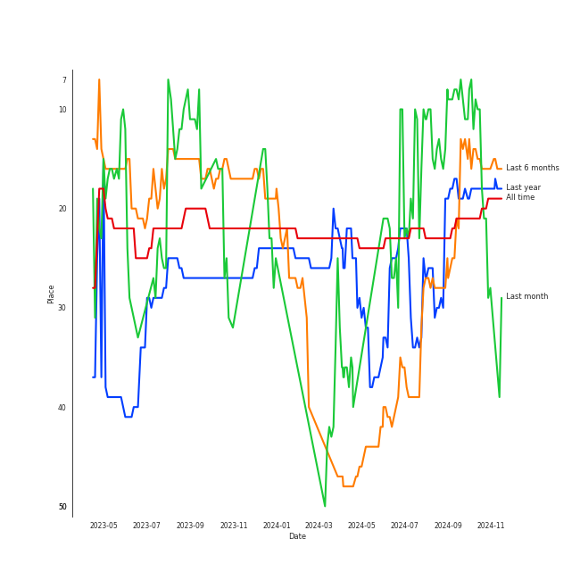
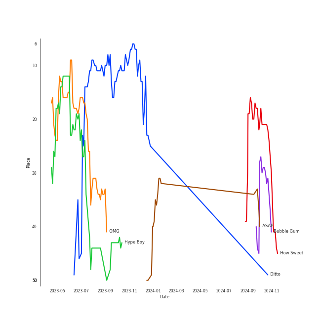

# NewJeans

[See Track Features](audio_features.md)

[See Clusters](clusters/overview.md)

## Relationships

NewJeans:
- has member Phạm Ngọc Hân (Hân, Phạm Ngọc)
- has member 강해린 (Kang, Hae-rin)
- has member 김민지 (Kim, Min-ji)
- has member 이혜인 (Lee, Hy-ein)
- has member Danielle Marsh

## Artist Rank
NewJeans is currently:
- The #24 artist of all time
- The #16 artist of the last 6 months
- The #14 artist of the last month

## Top Tracks

- Ditto is:
    - the #12 track of the last 6 months

### Top tracks of the last 6 months over time

### Top tracks of the last month over time

## Featured on Playlists
| Art | Tracks | Playlist |
|:---|---:|:---|
|  | 12 | [K-Pop](../../playlists/k_pop/overview.md) |
|  | 4 | [K-Pop Favorites](../../playlists/k_pop_favorites/overview.md) |
|  | 4 | [Sharon RPD](../../playlists/sharon_rpd/overview.md) |
|  | 4 | [Chill](../../playlists/chill/overview.md) |
|  | 1 | [Summer](../../playlists/summer/overview.md) |
|  | 1 | [K-Pop 101](../../playlists/k_pop_101/overview.md) |
|  | 1 | [Workout](../../playlists/workout/overview.md) |

## Top Albums

| Art | Tracks | 💚 | Album | Release Date | 🔗 |
|:---|---:|---:|:---|:---|:---|
|  | 5 | 3 | NewJeans 2nd EP 'Get Up' | 2023-07-21 | [🔗](https://open.spotify.com/album/4N1fROq2oeyLGAlQ1C1j18) |
|  | 4 | 3 | NewJeans 1st EP 'New Jeans' | 2022-08-01 | [🔗](https://open.spotify.com/album/1HMLpmZAnNyl9pxvOnTovV) |
|  | 1 | 1 | Zero | 2023-04-03 | [🔗](https://open.spotify.com/album/2zYcjcNUzcgMntymoukwZR) |
|  | 1 | 1 | NewJeans 'OMG' | 2023-01-02 | [🔗](https://open.spotify.com/album/45ozep8uHHnj5CCittuyXj) |
|  | 1 | 1 | Ditto | 2022-12-19 | [🔗](https://open.spotify.com/album/7bnqo1fdJU9nSfXQd3bSMe) |

## Top Record Labels

| Tracks | 💚 | Label |
|---:|---:|:---|
| 12 | 9 | [ADOR](../../labels/ador/overview.md) |

## Genres

- [k-pop](../../genres/k_pop/overview.md)
- [k-pop girl group](../../genres/k_pop_girl_group/overview.md)

## Credits

### Credits by Type

| Credit Type | Tracks |
|:---|---:|
| Vocal | 5 |

### Member Credits

| | Danielle Marsh | 강해린 (Kang, Hae-rin) |
|:---|---:|---:|
| Lyricist | 3 | 1 |
### Production Credits

| Art | Track | Members | Credit Types |
|:---|:---|:---|:---|
|  | Cool With You | Danielle Marsh | Lyricist |
|  | Super Shy | Danielle Marsh | Lyricist |
|  | ASAP | Danielle Marsh | Lyricist |
|  | New Jeans | 강해린 (Kang, Hae-rin) | Lyricist |

## Top Producers

| Art | Producer | Tracks | Credit Types |
|:---|:---|---:|:---|
| | Bokyeong Wang | 5 | Producer |
| | Gigi | 5 | Lyricist |
| | Pyungwook Lee | 5 | Producer |
| | Erika de Casier | 4 | Lyricist, Songwriter |
| | Frankie Scoca | 3 | Producer, Songwriter |
| | Fine Glindvad Jensen | 3 | Lyricist, Songwriter |
| | Danielle Marsh | 3 | Lyricist |
| | Yeji Cha | 2 | Producer |
| | 250 | 2 | Producer, Songwriter |
| | Kim Ximya | 2 | Songwriter, Lyricist |

View all

| Art | Producer | Tracks | Credit Types |
|:---|:---|---:|:---|
| | Phil Tan | 2 | Producer |
| | FRNK | 2 | Producer, Songwriter |
| | Bill Zimmerman | 2 | Producer |
| | 강해린 (Kang, Hae-rin) | 1 | Lyricist |
| | Kristine Bogan | 1 | Lyricist, Songwriter |
| | 김영현 (Kim, Young-hyun) | 1 | Producer |
| | Tony Maserati | 1 | Producer |
| | Ylva Dimberg | 1 | Lyricist, Songwriter |
| | Henriette Motzfeldt | 1 | Lyricist, Producer, Songwriter |
| | Nathan Boddy | 1 | Producer |
| | Jonny Breakwell | 1 | Producer |
| | Catharina Stoltenberg | 1 | Lyricist, Producer, Songwriter |
| | Beenzino | 1 | Lyricist |

## Tracks

| Art | Track | Album | Artists | Label | 💚 | 🔗 |
|:---|:---|:---|:---|:---|:---|:---|
|  | Attention | NewJeans 1st EP 'New Jeans' | [NewJeans](overview.md) | [ADOR](../../labels/ador) | 💚 | [🔗](https://open.spotify.com/track/2pIUpMhHL6L9Z5lnKxJJr9) |
|  | Cookie | NewJeans 1st EP 'New Jeans' | [NewJeans](overview.md) | [ADOR](../../labels/ador) | | [🔗](https://open.spotify.com/track/2DwUdMJ5uxv20EhAildreg) |
|  | Hurt | NewJeans 1st EP 'New Jeans' | [NewJeans](overview.md) | [ADOR](../../labels/ador) | 💚 | [🔗](https://open.spotify.com/track/5expoVGQPvXuwBBFuNGqBd) |
|  | Hype Boy | NewJeans 1st EP 'New Jeans' | [NewJeans](overview.md) | [ADOR](../../labels/ador) | 💚 | [🔗](https://open.spotify.com/track/0a4MMyCrzT0En247IhqZbD) |
|  | Ditto | Ditto | [NewJeans](overview.md) | [ADOR](../../labels/ador) | 💚 | [🔗](https://open.spotify.com/track/3r8RuvgbX9s7ammBn07D3W) |
|  | OMG | NewJeans 'OMG' | [NewJeans](overview.md) | [ADOR](../../labels/ador) | 💚 | [🔗](https://open.spotify.com/track/65FftemJ1DbbZ45DUfHJXE) |
|  | Zero | Zero | [NewJeans](overview.md) | [ADOR](../../labels/ador) | 💚 | [🔗](https://open.spotify.com/track/5LMoKDVzW2kDneNu2UbspP) |
|  | ASAP | NewJeans 2nd EP 'Get Up' | [NewJeans](overview.md) | [ADOR](../../labels/ador) | 💚 | [🔗](https://open.spotify.com/track/5fpyAakgFOm4YTXkgfPzvV) |
|  | Cool With You | NewJeans 2nd EP 'Get Up' | [NewJeans](overview.md) | [ADOR](../../labels/ador) | | [🔗](https://open.spotify.com/track/02wk5BttM0QL38ERjLPQJB) |
|  | ETA | NewJeans 2nd EP 'Get Up' | [NewJeans](overview.md) | [ADOR](../../labels/ador) | 💚 | [🔗](https://open.spotify.com/track/56v8WEnGzLByGsDAXDiv4d) |

See all tracks

| Art | Track | Album | Artists | Label | 💚 | 🔗 |
|:---|:---|:---|:---|:---|:---|:---|
|  | New Jeans | NewJeans 2nd EP 'Get Up' | [NewJeans](overview.md) | [ADOR](../../labels/ador) | 💚 | [🔗](https://open.spotify.com/track/7woEDtme8YkFiWeyiinIjy) |
|  | Super Shy | NewJeans 2nd EP 'Get Up' | [NewJeans](overview.md) | [ADOR](../../labels/ador) | | [🔗](https://open.spotify.com/track/0kwrPQkiGVE8KTHalH1uMo) |

