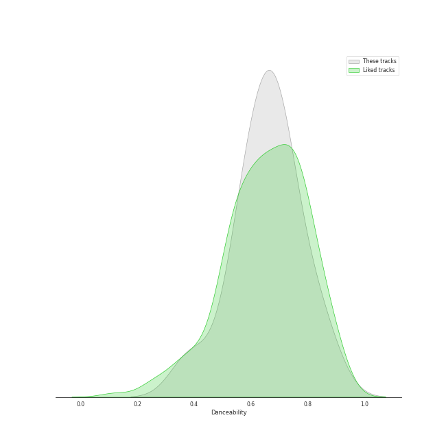
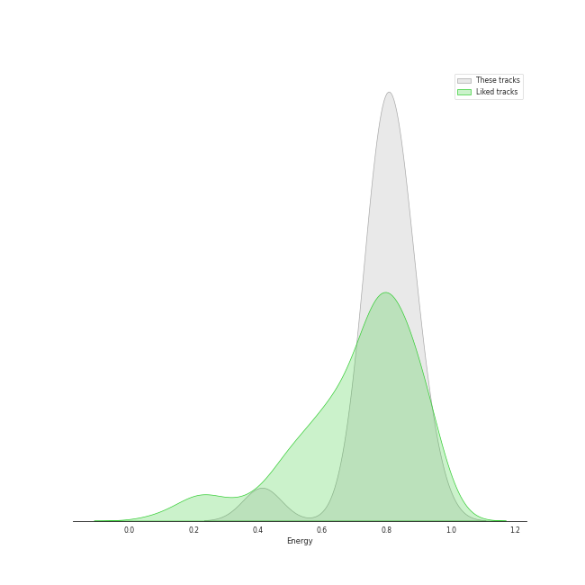
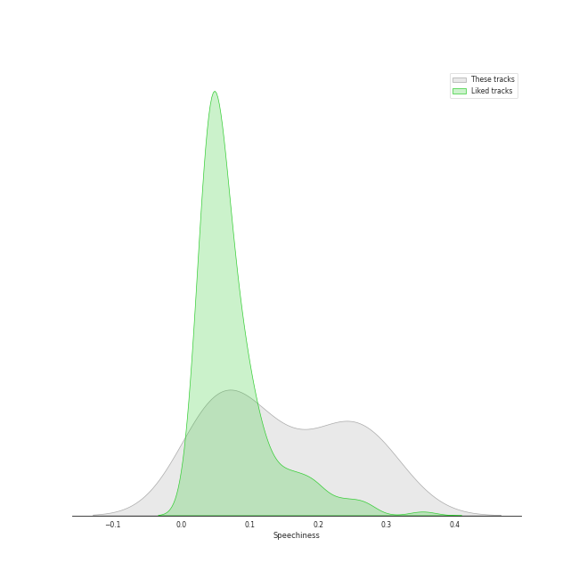
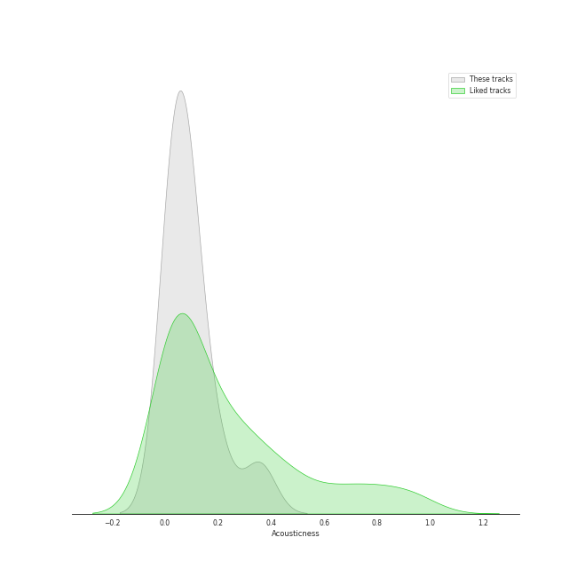
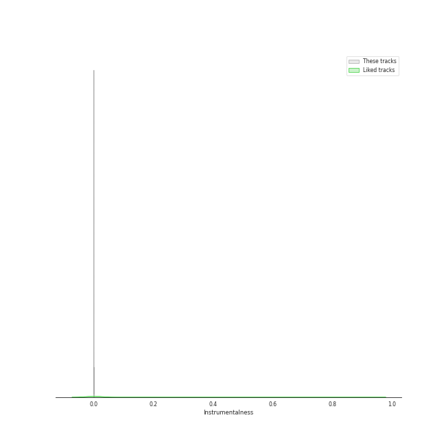
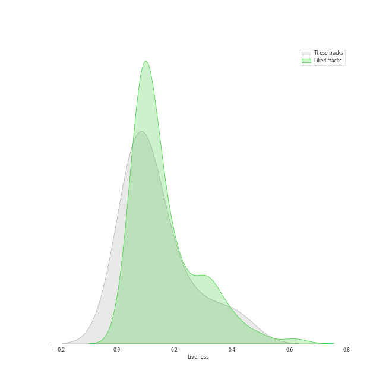
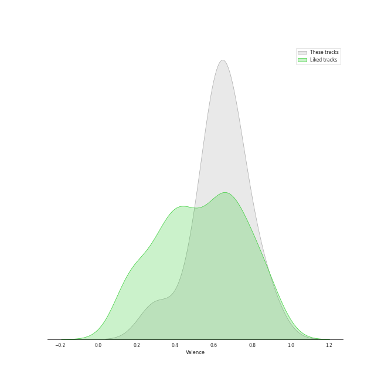
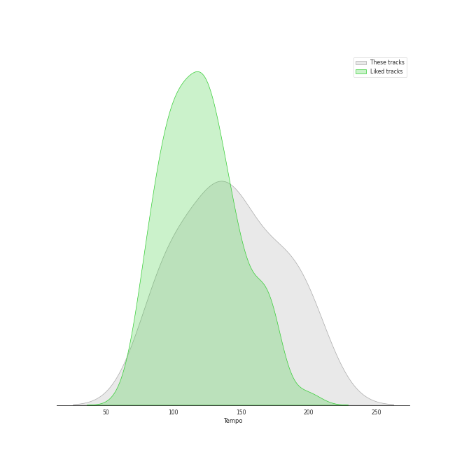

# Track Features for NMIXX

## Danceability

| ​ | 10 most Danceable tracks | ​​ | 10 least Danceable tracks |
|:---|:---|:---|:---|
|  | Soñar (Breaker) (0.86) |  | O.O (0.389) |
|  | Soñar (Breaker) (0.86) |  | DICE (0.557) |
|  | BOOM (0.836) |  | PAXXWORD (0.569) |
|  | Love Me Like This (0.801) |  | TANK (0.634) |
|  | Just Did It (0.731) |  | DASH (0.645) |
|  | Young, Dumb, Stupid (0.705) |  | Run For Roses (0.671) |
|  | HOME (0.705) |  | Funky Glitter Christmas (0.681) |
|  | Funky Glitter Christmas (0.681) |  | HOME (0.705) |
|  | Run For Roses (0.671) |  | Young, Dumb, Stupid (0.705) |
|  | DASH (0.645) |  | Just Did It (0.731) |

## Energy

| ​ | 10 most Energetic tracks | ​​ | 10 least Energetic tracks |
|:---|:---|:---|:---|
|  | TANK (0.928) |  | BOOM (0.697) |
|  | HOME (0.889) |  | PAXXWORD (0.756) |
|  | Just Did It (0.873) |  | Soñar (Breaker) (0.762) |
|  | DASH (0.83) |  | Soñar (Breaker) (0.762) |
|  | Funky Glitter Christmas (0.824) |  | Run For Roses (0.764) |
|  | Love Me Like This (0.805) |  | O.O (0.77) |
|  | DICE (0.798) |  | Young, Dumb, Stupid (0.791) |
|  | Young, Dumb, Stupid (0.791) |  | DICE (0.798) |
|  | O.O (0.77) |  | Love Me Like This (0.805) |
|  | Run For Roses (0.764) |  | Funky Glitter Christmas (0.824) |

## Speechiness

| ​ | 10 most Speechy tracks | ​​ | 10 least Speechy tracks |
|:---|:---|:---|:---|
|  | O.O (0.297) |  | Run For Roses (0.0408) |
|  | PAXXWORD (0.29) |  | Just Did It (0.0415) |
|  | DICE (0.253) |  | Funky Glitter Christmas (0.0477) |
|  | TANK (0.241) |  | BOOM (0.0588) |
|  | Young, Dumb, Stupid (0.24) |  | Love Me Like This (0.0641) |
|  | HOME (0.213) |  | Soñar (Breaker) (0.123) |
|  | DASH (0.138) |  | Soñar (Breaker) (0.123) |
|  | Soñar (Breaker) (0.123) |  | DASH (0.138) |
|  | Soñar (Breaker) (0.123) |  | HOME (0.213) |
|  | Love Me Like This (0.0641) |  | Young, Dumb, Stupid (0.24) |

## Acousticness

| ​ | 10 most Acoustic tracks | ​​ | 10 least Acoustic tracks |
|:---|:---|:---|:---|
|  | Run For Roses (0.356) |  | Love Me Like This (0.00775) |
|  | Soñar (Breaker) (0.201) |  | BOOM (0.0155) |
|  | Soñar (Breaker) (0.201) |  | PAXXWORD (0.0189) |
|  | Funky Glitter Christmas (0.115) |  | TANK (0.0288) |
|  | Just Did It (0.114) |  | O.O (0.0368) |
|  | DASH (0.0843) |  | HOME (0.0462) |
|  | DICE (0.0839) |  | Young, Dumb, Stupid (0.0519) |
|  | Young, Dumb, Stupid (0.0519) |  | DICE (0.0839) |
|  | HOME (0.0462) |  | DASH (0.0843) |
|  | O.O (0.0368) |  | Just Did It (0.114) |

## Instrumentalness

| ​ | 10 most Instrumental tracks | ​​ | 10 least Instrumental tracks |
|:---|:---|:---|:---|
|  | TANK (0.000492) |  | Soñar (Breaker) (0.0) |
|  | O.O (3.79e-06) |  | HOME (0.0) |
|  | Funky Glitter Christmas (0.0) |  | DASH (0.0) |
|  | Soñar (Breaker) (0.0) |  | BOOM (0.0) |
|  | Love Me Like This (0.0) |  | Run For Roses (0.0) |
|  | Young, Dumb, Stupid (0.0) |  | PAXXWORD (0.0) |
|  | DICE (0.0) |  | Just Did It (0.0) |
|  | Just Did It (0.0) |  | DICE (0.0) |
|  | PAXXWORD (0.0) |  | Young, Dumb, Stupid (0.0) |
|  | Run For Roses (0.0) |  | Love Me Like This (0.0) |

## Liveness

| ​ | 10 most Live tracks | ​​ | 10 least Live tracks |
|:---|:---|:---|:---|
|  | TANK (0.418) |  | Funky Glitter Christmas (0.0221) |
|  | DICE (0.302) |  | Love Me Like This (0.0588) |
|  | Just Did It (0.208) |  | O.O (0.0598) |
|  | Run For Roses (0.154) |  | DASH (0.0605) |
|  | Young, Dumb, Stupid (0.117) |  | PAXXWORD (0.073) |
|  | HOME (0.107) |  | BOOM (0.0805) |
|  | Soñar (Breaker) (0.082) |  | Soñar (Breaker) (0.082) |
|  | Soñar (Breaker) (0.082) |  | Soñar (Breaker) (0.082) |
|  | BOOM (0.0805) |  | HOME (0.107) |
|  | PAXXWORD (0.073) |  | Young, Dumb, Stupid (0.117) |

## Valence

| ​ | 10 most Happy tracks | ​​ | 10 least Happy tracks |
|:---|:---|:---|:---|
|  | Funky Glitter Christmas (0.881) |  | O.O (0.295) |
|  | Soñar (Breaker) (0.787) |  | TANK (0.487) |
|  | Soñar (Breaker) (0.787) |  | PAXXWORD (0.6) |
|  | DASH (0.725) |  | Run For Roses (0.604) |
|  | Young, Dumb, Stupid (0.722) |  | Just Did It (0.624) |
|  | HOME (0.678) |  | DICE (0.63) |
|  | Love Me Like This (0.664) |  | BOOM (0.658) |
|  | BOOM (0.658) |  | Love Me Like This (0.664) |
|  | DICE (0.63) |  | HOME (0.678) |
|  | Just Did It (0.624) |  | Young, Dumb, Stupid (0.722) |

## Tempo

| ​ | 10 most Fast tracks | ​​ | 10 least Fast tracks |
|:---|:---|:---|:---|
|  | PAXXWORD (200.646) |  | Run For Roses (91.994) |
|  | O.O (200.263) |  | Just Did It (95.503) |
|  | Young, Dumb, Stupid (188.035) |  | Love Me Like This (97.021) |
|  | DASH (179.977) |  | BOOM (110.09) |
|  | TANK (179.928) |  | Funky Glitter Christmas (113.956) |
|  | HOME (157.923) |  | Soñar (Breaker) (125.074) |
|  | DICE (131.085) |  | Soñar (Breaker) (125.074) |
|  | Soñar (Breaker) (125.074) |  | DICE (131.085) |
|  | Soñar (Breaker) (125.074) |  | HOME (157.923) |
|  | Funky Glitter Christmas (113.956) |  | TANK (179.928) |
