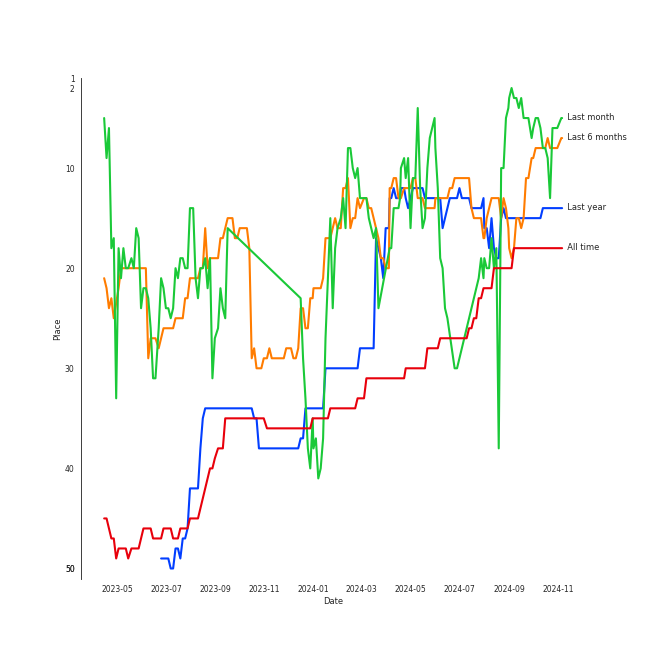
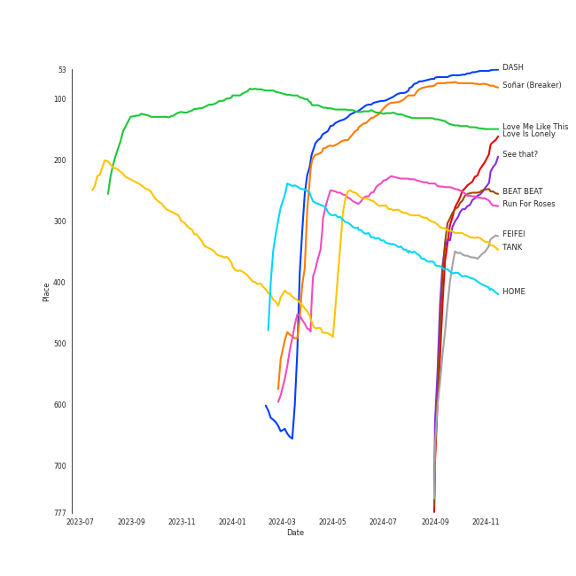
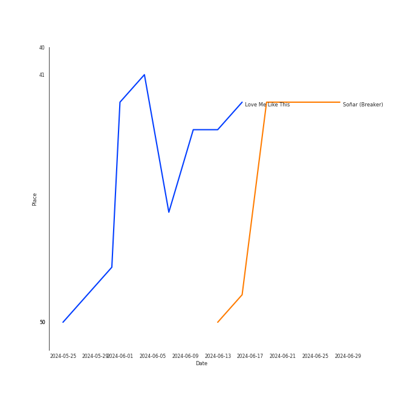
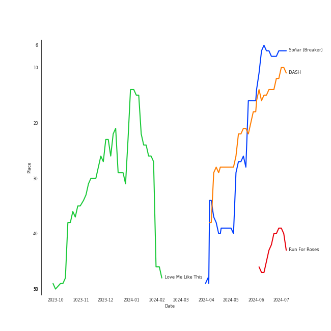
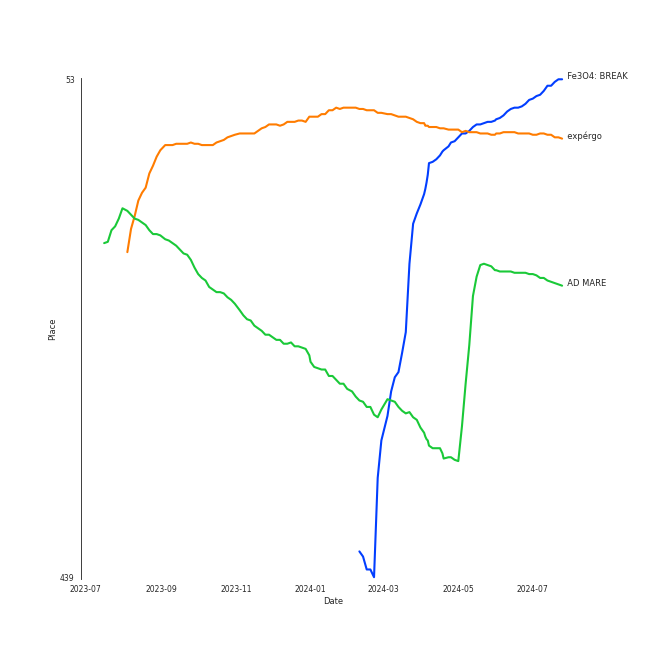
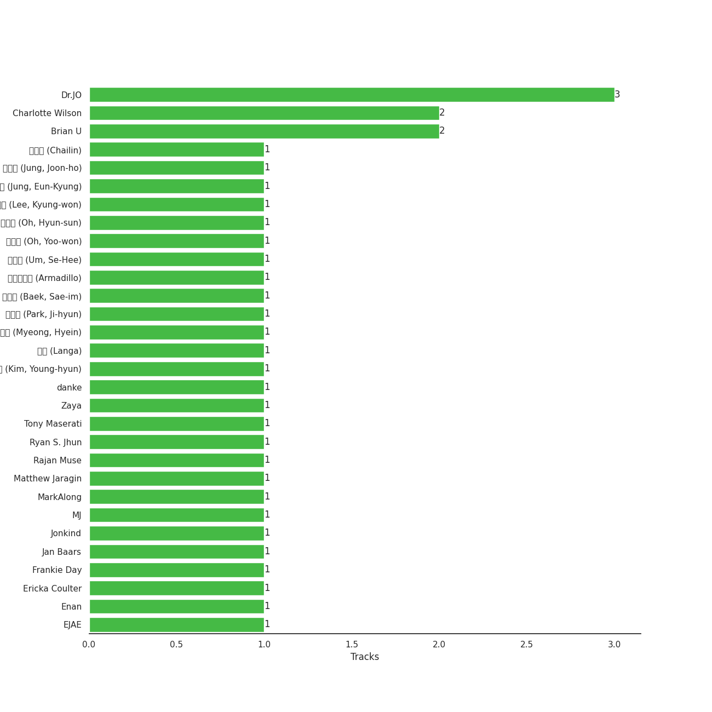

# NMIXX

[See Track Features](audio_features.md)

[See Clusters](clusters/overview.md)

## Relationships

NMIXX:
- has member 배진솔 (Bae, Jin-sol)
- has member JINI
- has member 장규진 (Jang, Kyu-jin)
- has member 김지우 (Kim, Ji-woo)
- has member Lily Jin Morrow
- has member 오해원 (Oh, Hae-won)
- has member 설윤아 (Seol, Yoo-nah)

## Artist Rank
NMIXX is currently:
- The #6 artist of the last month
- The #9 artist of the last 6 months
- The #15 artist of the last year
- The #18 artist of all time

## Top Tracks

### Top tracks of all time

Top tracks of the last year over time

Top tracks of the last 6 months over time

## Top Albums

| Art | Rank | Tracks | 💚 | Album | Release Date | 🔗 |
|:---|---:|---:|---:|:---|:---|:---|
|  | 109 | 5 | 3 | expérgo | 2023-03-20 | [🔗](https://open.spotify.com/album/6GbCvETnCVvkpvK6qCqTYS) |
|  | 154 | 5 | 3 | Fe3O4: STICK OUT | 2024-08-19 | [🔗](https://open.spotify.com/album/2pb2RscdByJ8pc7dPT1SY2) |
|  | 32 | 3 | 3 | Fe3O4: BREAK | 2024-01-15 | [🔗](https://open.spotify.com/album/5CCxLQgcI7cVwmgFDlicbP) |
|  | 644 | 2 | 2 | ENTWURF | 2022-09-19 | [🔗](https://open.spotify.com/album/3wMlxC4t3dN70e1OF8wUfz) |
|  | 232 | 2 | 2 | AD MARE | 2022-02-22 | [🔗](https://open.spotify.com/album/2QbA97qjlAs81t6kVS6zBk) |
|  | 250 | 1 | 1 | FEIFEI | 2024-07-31 | [🔗](https://open.spotify.com/album/3iM9IcCKlZrTtvjgKvbtBW) |
|  | 644 | 1 | 0 | 1st Intermixxion Single <Funky Glitter Christmas> | 2022-11-23 | [🔗](https://open.spotify.com/album/6cuwtxgP5dcbc87iAgSc25) |

## Featured on Playlists
| Art | Tracks | Playlist |
|:---|---:|:---|
|  | 18 | [K-Pop](../../playlists/k-pop/overview.md) |
|  | 6 | [Recent Comebacks](../../playlists/recent_comebacks/overview.md) |
|  | 5 | [K-Pop Favorites](../../playlists/k-pop_favorites/overview.md) |
|  | 4 | [Beat Drop!](../../playlists/beat_drop!/overview.md) |
|  | 4 | [On Repeat](../../playlists/on_repeat/overview.md) |
|  | 2 | [Your Top Songs 2023](../../playlists/your_top_songs_2023/overview.md) |
|  | 2 | [Workout](../../playlists/workout/overview.md) |
|  | 2 | [K-Memes](../../playlists/k-memes/overview.md) |
|  | 2 | [Recommendations for Chris](../../playlists/recommendations_for_chris/overview.md) |
|  | 1 | [Summer](../../playlists/summer/overview.md) |
|  | 1 | [K-Pop 101](../../playlists/k-pop_101/overview.md) |
|  | 1 | [International Pop](../../playlists/international_pop/overview.md) |
|  | 1 | [Your Top Songs 2022](../../playlists/your_top_songs_2022/overview.md) |
|  | 1 | [Chill](../../playlists/chill/overview.md) |
|  | 1 | [Christmas](../../playlists/christmas/overview.md) |

## Top Record Labels

| Tracks | 💚 | Label |
|---:|---:|:---|
| 17 | 13 | [Republic Records](../../labels/republic_records/overview.md) |
| 1 | 1 | I ONE Entertainment |
| 1 | 0 | [JYP Entertainment](../../labels/jyp_entertainment/overview.md) |

## Genres

- [k-pop](../../genres/k-pop/overview.md)
- [k-pop girl group](../../genres/k-pop_girl_group/overview.md)

## Credits

### Credits by Type

| Credit Type | Tracks |
|:---|---:|
| Performer | 7 |

### Member Credits

| | JINI | Lily Jin Morrow | 김지우 (Kim, Ji-woo) | 배진솔 (Bae, Jin-sol) | 설윤아 (Seol, Yoo-nah) | 오해원 (Oh, Hae-won) | 장규진 (Jang, Kyu-jin) |
|:---|---:|---:|---:|---:|---:|---:|---:|
| Vocal | 3 | 7 | 7 | 7 | 7 | 7 | 7 |
## Top Producers

| Art | Producer | Tracks | Credit Types |
|:---|:---|---:|:---|
| | Frankie Day | 3 | Songwriter, Lyricist |
| | [엄세희 (Um, Se-Hee)](../../producers/엄세희_(um,_se-hee)/overview.md) | 3 | Producer |
| | 오현선 (Oh, Hyun-sun) | 3 | Lyricist |
| | Dr.JO | 3 | Lyricist, Arranger |
| | [구혜진 (Gu, Hye-jin)](../../producers/구혜진_(gu,_hye-jin)/overview.md) | 3 | Producer |
| | 임찬미 (Kim, Chan-mi) | 3 | Producer |
| | Brian U | 3 | Songwriter, Arranger |
| | Ayushy | 3 | Songwriter, Arranger |
| | Charlotte Wilson | 2 | Songwriter, Arranger |
| | 김영현 (Kim, Young-hyun) | 2 | Producer |

View all

| Art | Producer | Tracks | Credit Types |
|:---|:---|---:|:---|
| | 백새임 (Baek, Sae-im) | 2 | Lyricist |
| | 아르마딜로 (Armadillo) | 2 | Arranger, Songwriter |
| | [Tony Maserati](../../producers/tony_maserati/overview.md) | 2 | Producer |
| | [이태섭 (Lee, Tae-Sub)](../../producers/이태섭_(lee,_tae-sub)/overview.md) | 2 | Producer |
| | [정은경 (Jung, Eun-Kyung)](../../producers/정은경_(jung,_eun-kyung)/overview.md) | 2 | Producer |
| | Zaya | 1 | Lyricist |
| | [구종필 (Koo, Jong-Pil)](../../producers/구종필_(koo,_jong-pil)/overview.md) | 1 | Producer |
| | MJ | 1 | Producer |
| | Joseph K | 1 | Arranger, Songwriter |
| | Dem Jointz | 1 | Arranger, Songwriter |
| | won. | 1 | Songwriter |
| | Call Me Loop | 1 | Lyricist, Songwriter |
| | MarkAlong | 1 | Songwriter |
| | Chanti | 1 | Songwriter |
| | HOJI | 1 | Songwriter |
| | Hannah Robinson | 1 | Lyricist, Songwriter |
| | [LDN Noise](../../producers/ldn_noise/overview.md) | 1 | Arranger |
| | 차이린 (Chailin) | 1 | Lyricist |
| | Deanna | 1 | Songwriter |
| | Greg Bonnick | 1 | Songwriter |
| | 박지현 (Park, Ji-hyun) | 1 | Lyricist |
| | 강영현 (Kang, Young-hyun) | 1 | Lyricist |
| | Enan | 1 | Songwriter |
| | Brown Panda | 1 | Arranger, Songwriter |
| | 서은일 (Seo, Eun-il) | 1 | Producer |
| | Taet Chesterton | 1 | Songwriter |
| | 성유진 (Sung, Yoojin) | 1 | Lyricist |
| | 조유리 (Jo, Yuri) | 1 | Lyricist |
| | Awry | 1 | Songwriter |
| | Deza | 1 | Lyricist |
| | 오유원 (Oh, Yoo-won) | 1 | Lyricist |
| | 김승현 (Kim, Seung-Hyeon) | 1 | Arranger |
| | 이경원 (Lee, Kyung-won) | 1 | Producer |
| | 김인 (Kim, In) | 1 | Lyricist |
| | NVR know | 1 | Arranger, Songwriter |
| | Jonkind | 1 | Songwriter |
| | HONEY NOISE | 1 | Arranger, Producer, Songwriter |
| | 강선영 (강선영) | 1 | Producer |
| | 정준호 (Jung, Joon-ho) | 1 | Lyricist |
| | LSY | 1 | Arranger, Songwriter |
| | Strong Dragon | 1 | Arranger, Songwriter |
| | 랑가 (Langa) | 1 | Arranger, Songwriter |
| | 박랑 (박랑) | 1 | Lyricist |
| | [Kriz](../../producers/kriz/overview.md) | 1 | Arranger |
| | 이스란 (Lee, Seran) | 1 | Lyricist |
| | Rajan Muse | 1 | Songwriter |
| | 이나일 (E, Na-Il) | 1 | Songwriter |
| | EJAE | 1 | Songwriter |
| | WKLY | 1 | Lyricist |
| | 복주영 (Bok, Ju Young) | 1 | Lyricist |
| | PUFF | 1 | Arranger, Songwriter |
| | Alawn | 1 | Producer |
| | Jan Baars | 1 | Songwriter |
| | 원지애 (Won, Jiae) | 1 | Lyricist |
| | C'SA | 1 | Arranger, Producer, Songwriter |
| | 정다연 (Jeong, Dayeon) | 1 | Lyricist |
| | [Ryan S. Jhun](../../producers/ryan_s__jhun/overview.md) | 1 | Arranger, Songwriter |
| | Ericka Coulter | 1 | Songwriter |
| | 명혜인 (Myeong, Hyein) | 1 | Lyricist |
| | Awrii | 1 | Arranger, Songwriter |
| | Jacob Aaron | 1 | Songwriter |
| | Hayden Chapman | 1 | Songwriter |
| | AFTRSHOK | 1 | Arranger, Songwriter |
| | Danny Shah | 1 | Songwriter |
| | 신지영 (Shin, Ji-young) | 1 | Producer |
| | [danke](../../producers/danke/overview.md) | 1 | Lyricist |
| | [이상엽 (Lee, Sang-yeob)](../../producers/이상엽_(lee,_sang-yeob)/overview.md) | 1 | Producer |
| | 형근 (Hyeongeun) | 1 | Lyricist |
| | Matthew Jaragin | 1 | Songwriter |
| | Rick Bridges | 1 | Lyricist |

## Tracks

| Art | Track | Album | Artists | Label | Rank | 💚 | 🔗 |
|:---|:---|:---|:---|:---|---:|:---|:---|
|  | DASH | Fe3O4: BREAK | [NMIXX](overview.md) | [Republic Records](../../labels/republic_records) | 67 | 💚 | [🔗](https://open.spotify.com/track/2RoYgkPzUY0vY7lhUuyus1) |
|  | Soñar (Breaker) | Fe3O4: BREAK | [NMIXX](overview.md) | [Republic Records](../../labels/republic_records) | 75 | 💚 | [🔗](https://open.spotify.com/track/6UwrPxRaR5HPNLDDl7RcT9) |
|  | Love Me Like This | expérgo | [NMIXX](overview.md) | [Republic Records](../../labels/republic_records) | 143 | 💚 | [🔗](https://open.spotify.com/track/6P3CtlzTKLxcNYGOS3es8m) |
|  | Run For Roses | Fe3O4: BREAK | [NMIXX](overview.md) | [Republic Records](../../labels/republic_records) | 245 | 💚 | [🔗](https://open.spotify.com/track/4byr9TsXs4qtm8rG2FfwRW) |
|  | Love Is Lonely | Fe3O4: STICK OUT | [NMIXX](overview.md) | [Republic Records](../../labels/republic_records) | 276 | 💚 | [🔗](https://open.spotify.com/track/4IAjCbrxOPyfMqbVasSjwc) |
|  | BEAT BEAT | Fe3O4: STICK OUT | [NMIXX](overview.md) | [Republic Records](../../labels/republic_records) | 278 | 💚 | [🔗](https://open.spotify.com/track/3P8l7sbL5dxKlS4gcJ1qJI) |
|  | See that? | Fe3O4: STICK OUT | [NMIXX](overview.md) | [Republic Records](../../labels/republic_records) | 293 | 💚 | [🔗](https://open.spotify.com/track/3Zice5cXhiPVLwrdBJlyHc) |
|  | TANK | AD MARE | [NMIXX](overview.md) | [Republic Records](../../labels/republic_records) | 325 | 💚 | [🔗](https://open.spotify.com/track/4ZbXs9DzvdWlsQfA9ZUkCV) |
|  | FEIFEI | FEIFEI | [NMIXX](overview.md) | I ONE Entertainment | 356 | 💚 | [🔗](https://open.spotify.com/track/3xHoqEgh1tknyT2h7mKZnB) |
|  | HOME | expérgo | [NMIXX](overview.md) | [Republic Records](../../labels/republic_records) | 391 | 💚 | [🔗](https://open.spotify.com/track/0nYtg6MqCDmolLI5vsSAy1) |

See all tracks

| Art | Track | Album | Artists | Label | Rank | 💚 | 🔗 |
|:---|:---|:---|:---|:---|---:|:---|:---|
|  | SICKUHH (Feat. Kid Milli) | Fe3O4: STICK OUT | [NMIXX](overview.md), Kid Milli | [Republic Records](../../labels/republic_records) | 538 | | [🔗](https://open.spotify.com/track/0Mwj2BjoZwV6ZsYlqj6vB0) |
|  | O.O | AD MARE | [NMIXX](overview.md) | [Republic Records](../../labels/republic_records) | 976 | 💚 | [🔗](https://open.spotify.com/track/44zfpg3ndtGESsgpTbWeyE) |
|  | COOL (Your rainbow) | ENTWURF | [NMIXX](overview.md) | [Republic Records](../../labels/republic_records) | 976 | 💚 | [🔗](https://open.spotify.com/track/3D5t7S7W8BABJvA1SAIAHb) |
|  | DICE | ENTWURF | [NMIXX](overview.md) | [Republic Records](../../labels/republic_records) | 976 | 💚 | [🔗](https://open.spotify.com/track/5aaE27JUylnG7aPtGJPrrC) |
|  | Funky Glitter Christmas | 1st Intermixxion Single <Funky Glitter Christmas> | [NMIXX](overview.md) | [JYP Entertainment](../../labels/jyp_entertainment) | 976 | | [🔗](https://open.spotify.com/track/7ra9FZOGKDhiodoH5fuYsy) |
|  | Just Did It | expérgo | [NMIXX](overview.md) | [Republic Records](../../labels/republic_records) | 976 | 💚 | [🔗](https://open.spotify.com/track/5AgwBbICmOVLhl95tBiOg0) |
|  | PAXXWORD | expérgo | [NMIXX](overview.md) | [Republic Records](../../labels/republic_records) | 976 | | [🔗](https://open.spotify.com/track/57IfwDNINXVRAWbmmaBcP9) |
|  | Young, Dumb, Stupid | expérgo | [NMIXX](overview.md) | [Republic Records](../../labels/republic_records) | 976 | | [🔗](https://open.spotify.com/track/5eD83TX5ERuyJ7chfed3MQ) |
|  | Red light sign, but we go | Fe3O4: STICK OUT | [NMIXX](overview.md) | [Republic Records](../../labels/republic_records) | 976 | | [🔗](https://open.spotify.com/track/7h6zQBXlsrUb9990J8x0vr) |

