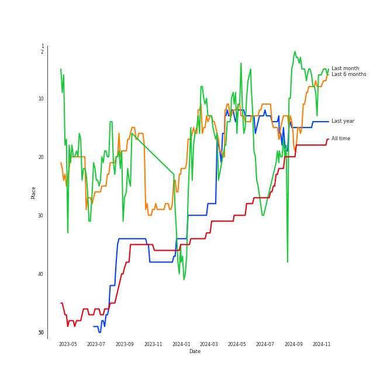

# NMIXX

## Artist Rank
NMIXX is currently:
- The #50 artist of all time
- The #26 artist of the last 6 months
- The #24 artist of the last month

## Top Tracks

### Top tracks of the last month over time

## Featured on Playlists
| Art | Tracks | Playlist |
|:---|---:|:---|
|  | 8 | [K-Pop](../../playlists/k_pop/overview.md) |
|  | 4 | [Recent Comebacks](../../playlists/recent_comebacks/overview.md) |
|  | 3 | [Workout](../../playlists/workout/overview.md) |
|  | 2 | [Summer](../../playlists/summer/overview.md) |
|  | 2 | [K-Pop Favorites](../../playlists/k_pop_favorites/overview.md) |
|  | 1 | [K-Pop 101](../../playlists/k_pop_101/overview.md) |
|  | 1 | [Aegyo](../../playlists/aegyo/overview.md) |
|  | 1 | [Chill](../../playlists/chill/overview.md) |
## Top Albums

| Art | Tracks | 💚 | Album | Release Date | 🔗 |
|:---|---:|---:|:---|:---|:---|
|  | 4 | 3 | expérgo | 2023-03-20 | [🔗](https://open.spotify.com/album/6PjYm8BNtMDDsflyAQUcDx) |
|  | 2 | 2 | AD MARE | 2022-02-22 | [🔗](https://open.spotify.com/album/3AUtpZi3kqsEYDyQ0CCNiH) |
|  | 2 | 1 | ENTWURF | 2022-09-19 | [🔗](https://open.spotify.com/album/2WraNaeFiJAOFEozKoAtC6) |

## Top Record Labels

| Tracks | 💚 | Label |
|---:|---:|:---|
| 8 | 6 | [JYP Entertainment](../../labels/jyp_entertainment/overview.md) |

## Genres

- [k-pop girl group](../../genres/k_pop_girl_group)

## Tracks

| Art | Track | Album | Artists | Label | 💚 | 🔗 |
|:---|:---|:---|:---|:---|:---|:---|
|  | O.O | AD MARE | [NMIXX](overview.md) | [JYP Entertainment](../../labels/jyp_entertainment) | 💚 | [🔗](https://open.spotify.com/track/3lrNsPdn98i6rxO142pLT6) |
|  | TANK | AD MARE | [NMIXX](overview.md) | [JYP Entertainment](../../labels/jyp_entertainment) | 💚 | [🔗](https://open.spotify.com/track/3ucx0k0IosRjrsmQc34zUW) |
|  | COOL (Your rainbow) | ENTWURF | [NMIXX](overview.md) | [JYP Entertainment](../../labels/jyp_entertainment) | | [🔗](https://open.spotify.com/track/6SYVnDzwzMmTGqW13DSiZA) |
|  | DICE | ENTWURF | [NMIXX](overview.md) | [JYP Entertainment](../../labels/jyp_entertainment) | 💚 | [🔗](https://open.spotify.com/track/1QpwvWMQGdOgA8MXXfgs4H) |
|  | HOME | expérgo | [NMIXX](overview.md) | [JYP Entertainment](../../labels/jyp_entertainment) | 💚 | [🔗](https://open.spotify.com/track/5HtWf8hNpeg0endHaNFM17) |
|  | Just Did It | expérgo | [NMIXX](overview.md) | [JYP Entertainment](../../labels/jyp_entertainment) | 💚 | [🔗](https://open.spotify.com/track/4gUSHUCZgCj2X46uwIIOyU) |
|  | Love Me Like This | expérgo | [NMIXX](overview.md) | [JYP Entertainment](../../labels/jyp_entertainment) | 💚 | [🔗](https://open.spotify.com/track/3o3bRIOKDwGOdqL9HBUNrO) |
|  | Young, Dumb, Stupid | expérgo | [NMIXX](overview.md) | [JYP Entertainment](../../labels/jyp_entertainment) | | [🔗](https://open.spotify.com/track/52I1DbbQsmiAQBhaf4uCbW) |