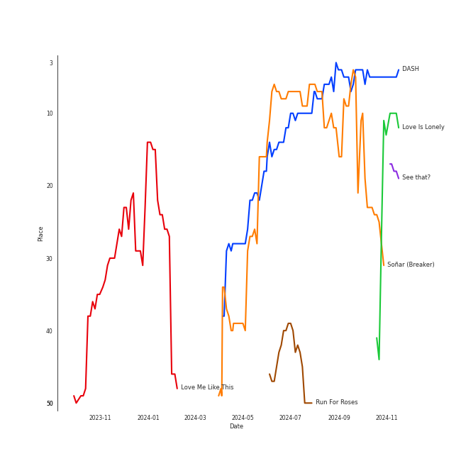
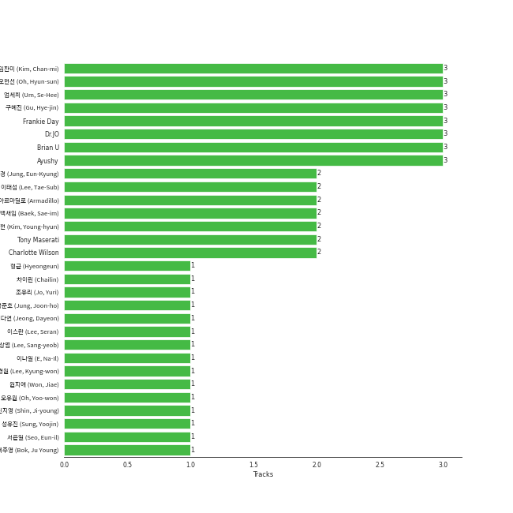

# NMIXX

## Relationships

NMIXX:
- has member 배진솔 (Bae, Jin-sol)
- has member JINI
- has member 장규진 (Jang, Kyu-jin)
- has member 김지우 (Kim, Ji-woo)
- has member Lily Jin Morrow
- has member 오해원 (Oh, Hae-won)
- has member 설윤아 (Seol, Yoo-nah)

## Artist Rank
NMIXX is currently:
- The #38 artist of all time
- The #29 artist of the last 6 months

## Top Tracks

- Love Me Like This is:
    - the #35 track of the last 6 months

### Top tracks of the last 6 months over time

### Top tracks of the last month over time

## Featured on Playlists
| Art | Tracks | Playlist |
|:---|---:|:---|
|  | 8 | [K-Pop](../../playlists/k_pop/overview.md) |
|  | 3 | [K-Memes](../../playlists/k_memes/overview.md) |
|  | 2 | [K-Pop Favorites](../../playlists/k_pop_favorites/overview.md) |
|  | 1 | [Summer](../../playlists/summer/overview.md) |
|  | 1 | [K-Pop 101](../../playlists/k_pop_101/overview.md) |
|  | 1 | [Christmas](../../playlists/christmas/overview.md) |

## Top Albums

| Art | Tracks | 💚 | Album | Release Date | 🔗 |
|:---|---:|---:|:---|:---|:---|
|  | 5 | 3 | expérgo | 2023-03-20 | [🔗](https://open.spotify.com/album/6GbCvETnCVvkpvK6qCqTYS) |
|  | 2 | 2 | AD MARE | 2022-02-22 | [🔗](https://open.spotify.com/album/2QbA97qjlAs81t6kVS6zBk) |
|  | 1 | 1 | ENTWURF | 2022-09-19 | [🔗](https://open.spotify.com/album/3wMlxC4t3dN70e1OF8wUfz) |
|  | 1 | 0 | 1st Intermixxion Single <Funky Glitter Christmas> | 2022-11-23 | [🔗](https://open.spotify.com/album/6cuwtxgP5dcbc87iAgSc25) |

## Top Record Labels

| Tracks | 💚 | Label |
|---:|---:|:---|
| 8 | 6 | [Republic Records](../../labels/republic_records/overview.md) |
| 1 | 0 | [JYP Entertainment](../../labels/jyp_entertainment/overview.md) |

## Genres

- [k-pop](../../genres/k_pop/overview.md)
- [k-pop girl group](../../genres/k_pop_girl_group/overview.md)

## Credits

### Credits by Type

| Credit Type | Tracks |
|:---|---:|
| Performer | 2 |

### Member Credits

| | JINI | Lily Jin Morrow | 김지우 (Kim, Ji-woo) | 배진솔 (Bae, Jin-sol) | 설윤아 (Seol, Yoo-nah) | 오해원 (Oh, Hae-won) | 장규진 (Jang, Kyu-jin) |
|:---|---:|---:|---:|---:|---:|---:|---:|
| Vocal | 2 | 2 | 2 | 2 | 2 | 2 | 2 |
## Top Producers

| Art | Producer | Tracks | Credit Types |
|:---|:---|---:|:---|
| | Dr.JO | 3 | Lyricist, Arranger |
| | Brian U | 2 | Songwriter, Arranger |
| | Charlotte Wilson | 2 | Songwriter, Arranger |
| | 차이린 (Chailin) | 1 | Lyricist |
| | 정은경 (Jung, Eun-Kyung) | 1 | Producer |
| | Chanti | 1 | Songwriter |
| | Zaya | 1 | Lyricist |
| | Dem Jointz | 1 | Arranger, Songwriter |
| | MarkAlong | 1 | Songwriter |
| | MJ | 1 | Producer |

View all

| Art | Producer | Tracks | Credit Types |
|:---|:---|---:|:---|
| | 오현선 (Oh, Hyun-sun) | 1 | Lyricist |
| | Jonkind | 1 | Songwriter |
| | 박지현 (Park, Ji-hyun) | 1 | Lyricist |
| | 김영현 (Kim, Young-hyun) | 1 | Producer |
| | Enan | 1 | Songwriter |
| | Frankie Day | 1 | Songwriter |
| | Awry | 1 | Songwriter |
| | 오유원 (Oh, Yoo-won) | 1 | Lyricist |
| | Deanna | 1 | Songwriter |
| | Tony Maserati | 1 | Producer |
| | Ayushy | 1 | Songwriter |
| | Ryan S. Jhun | 1 | Arranger, Songwriter |
| | Ericka Coulter | 1 | Songwriter |
| | 명혜인 (Myeong, Hyein) | 1 | Lyricist |
| | danke | 1 | Lyricist |
| | Matthew Jaragin | 1 | Songwriter |
| | 백새임 (Baek, Sae-im) | 1 | Lyricist |
| | 아르마딜로 (Armadillo) | 1 | Arranger, Songwriter |
| | Jan Baars | 1 | Songwriter |
| | Alawn | 1 | Producer |
| | 정준호 (Jung, Joon-ho) | 1 | Lyricist |
| | 랑가 (Langa) | 1 | Arranger, Songwriter |
| | Rajan Muse | 1 | Songwriter |
| | 엄세희 (Um, Se-Hee) | 1 | Producer |
| | EJAE | 1 | Songwriter |
| | 이경원 (Lee, Kyung-won) | 1 | Producer |

## Tracks

| Art | Track | Album | Artists | Label | 💚 | 🔗 |
|:---|:---|:---|:---|:---|:---|:---|
|  | O.O | AD MARE | [NMIXX](overview.md) | [Republic Records](../../labels/republic_records) | 💚 | [🔗](https://open.spotify.com/track/44zfpg3ndtGESsgpTbWeyE) |
|  | TANK | AD MARE | [NMIXX](overview.md) | [Republic Records](../../labels/republic_records) | 💚 | [🔗](https://open.spotify.com/track/4ZbXs9DzvdWlsQfA9ZUkCV) |
|  | DICE | ENTWURF | [NMIXX](overview.md) | [Republic Records](../../labels/republic_records) | 💚 | [🔗](https://open.spotify.com/track/5aaE27JUylnG7aPtGJPrrC) |
|  | Funky Glitter Christmas | 1st Intermixxion Single <Funky Glitter Christmas> | [NMIXX](overview.md) | [JYP Entertainment](../../labels/jyp_entertainment) | | [🔗](https://open.spotify.com/track/7ra9FZOGKDhiodoH5fuYsy) |
|  | HOME | expérgo | [NMIXX](overview.md) | [Republic Records](../../labels/republic_records) | 💚 | [🔗](https://open.spotify.com/track/0nYtg6MqCDmolLI5vsSAy1) |
|  | Just Did It | expérgo | [NMIXX](overview.md) | [Republic Records](../../labels/republic_records) | 💚 | [🔗](https://open.spotify.com/track/5AgwBbICmOVLhl95tBiOg0) |
|  | Love Me Like This | expérgo | [NMIXX](overview.md) | [Republic Records](../../labels/republic_records) | 💚 | [🔗](https://open.spotify.com/track/6P3CtlzTKLxcNYGOS3es8m) |
|  | PAXXWORD | expérgo | [NMIXX](overview.md) | [Republic Records](../../labels/republic_records) | | [🔗](https://open.spotify.com/track/57IfwDNINXVRAWbmmaBcP9) |
|  | Young, Dumb, Stupid | expérgo | [NMIXX](overview.md) | [Republic Records](../../labels/republic_records) | | [🔗](https://open.spotify.com/track/5eD83TX5ERuyJ7chfed3MQ) |
