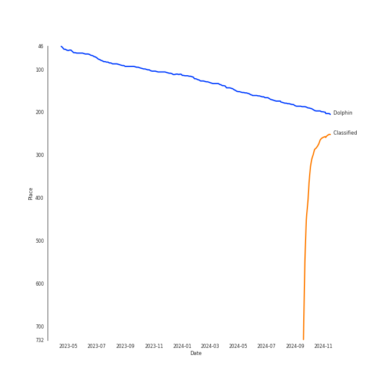
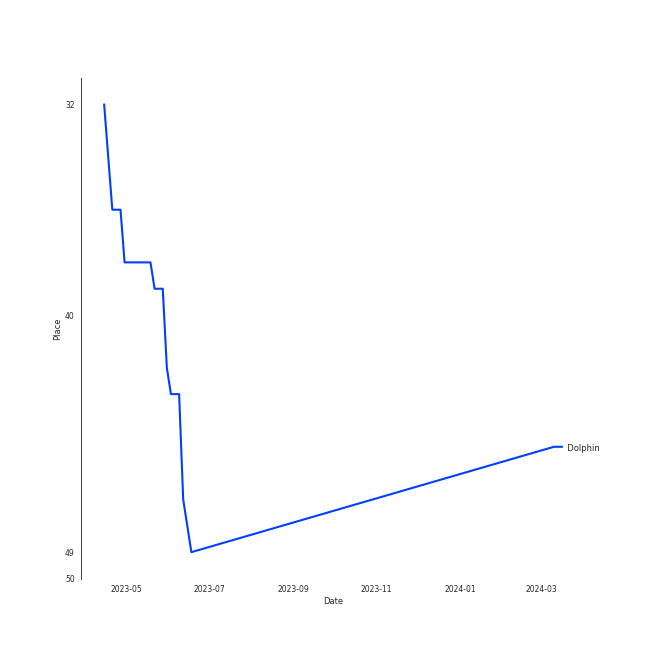
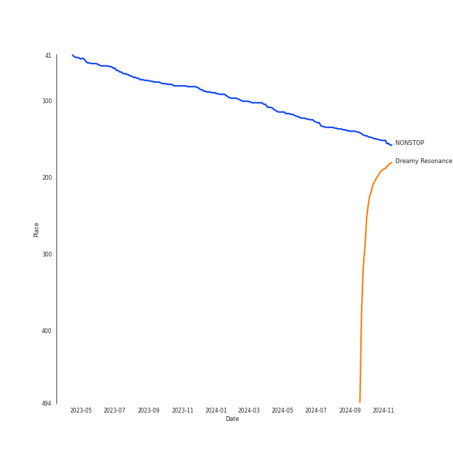
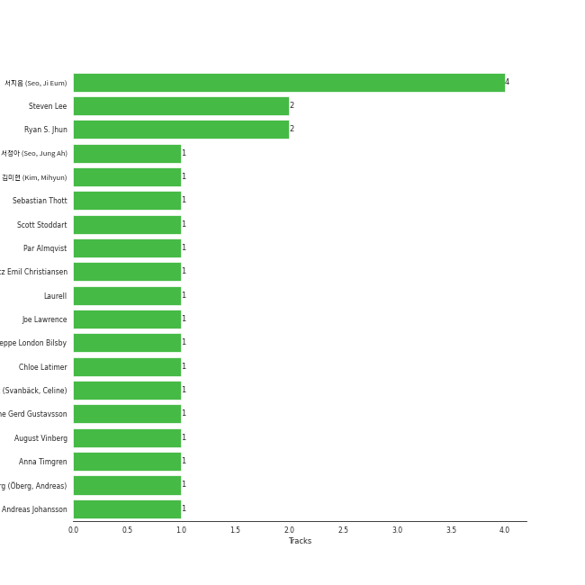

# OH MY GIRL

## Relationships

OH MY GIRL:
- has member 배유빈 (Bae, Yubin)
- has member 최효정 (Choi, Hyojung)
- has member 최예원 (Choi, Yewon)
- has member 현승희 (Hyun, Seunghee)
- has member 김지호 (Kim, Jiho)
- has member 김미현 (Kim, Mihyun)
- has member 신혜진 (Shin, Hyejin)
- has member YooA
- has the subgroup OH MY GIRL BANHANA

## Artist Rank
- The #88 artist overall

## Top Tracks

### Top tracks, aggregated

Top tracks of all time over time

## Top Albums

| Art | Tracks | 💚 | Album | Release Date | 🔗 |
|:---|---:|---:|:---|:---|:---|
|  | 2 | 2 | NONSTOP | 2020-04-27 | [🔗](https://open.spotify.com/album/7J8Kp48L7RdLkpjSVrO5PY) |
|  | 2 | 2 | Dear OHMYGIRL | 2021-05-10 | [🔗](https://open.spotify.com/album/2xfmLni05CCgygcNdtPvuN) |
|  | 1 | 1 | THE FIFTH SEASON | 2019-05-08 | [🔗](https://open.spotify.com/album/7nRRZFQgQKQsXG7mQIuQPA) |
|  | 1 | 1 | CLOSER | 2015-10-08 | [🔗](https://open.spotify.com/album/08iyrLkLFP2ByBkqVhBls7) |
|  | 1 | 0 | WINDY DAY | 2016 | [🔗](https://open.spotify.com/album/7coV2krimvobeWltmNvYeC) |

## Featured on Playlists
| Art | Tracks | Playlist |
|:---|---:|:---|
|  | 7 | [K-Pop](../../playlists/k-pop/overview.md) |
|  | 3 | [Summer](../../playlists/summer/overview.md) |
|  | 3 | [K-Pop Favorites](../../playlists/k-pop_favorites/overview.md) |
|  | 2 | [애교！](../../playlists/애교！/overview.md) |
|  | 1 | [Your Top Songs 2022](../../playlists/your_top_songs_2022/overview.md) |

## Top Record Labels

| Tracks | 💚 | Label |
|---:|---:|:---|
| 7 | 6 | [WM Entertainment](../../labels/wm_entertainment/overview.md) |

## Genres

- [k-pop](../../genres/k-pop/overview.md)
- [k-pop girl group](../../genres/k-pop_girl_group/overview.md)

## Credits

### Credits by Type

| Credit Type | Tracks |
|:---|---:|
| Performer | 1 |

### Member Credits

| | YooA | 김미현 (Kim, Mihyun) | 김지호 (Kim, Jiho) | 배유빈 (Bae, Yubin) | 신혜진 (Shin, Hyejin) | 최예원 (Choi, Yewon) | 최효정 (Choi, Hyojung) | 현승희 (Hyun, Seunghee) |
|:---|---:|---:|---:|---:|---:|---:|---:|---:|
| Lyricist | 0 | 1 | 0 | 0 | 0 | 0 | 0 | 0 |
| Vocal | 1 | 1 | 1 | 1 | 1 | 1 | 1 | 1 |
### Production Credits

| Art | Track | Members | Credit Types |
|:---|:---|:---|:---|
|  | Nonstop | 김미현 (Kim, Mihyun) | Lyricist |

## Top Producers

| Art | Producer | Tracks | Credit Types |
|:---|:---|---:|:---|
| | [서지음 (Seo, Ji Eum)](../../producers/서지음_(seo,_ji_eum)/overview.md) | 4 | Lyricist |
| | Steven Lee | 2 | Arranger, Songwriter |
| | [Ryan S. Jhun](../../producers/ryan_s__jhun/overview.md) | 2 | Arranger, Lyricist, Songwriter |
| | Jeppe London Bilsby | 1 | Arranger, Songwriter |
| | 김미현 (Kim, Mihyun) | 1 | Lyricist |
| | Andreas Johansson | 1 | Songwriter |
| | Celine Svanbäck (Svanbäck, Celine) | 1 | Arranger, Songwriter |
| | Caroline Gerd Gustavsson | 1 | Songwriter |
| | Lauritz Emil Christiansen | 1 | Arranger, Songwriter |
| | Joe Lawrence | 1 | Arranger, Songwriter |

View all

| Art | Producer | Tracks | Credit Types |
|:---|:---|---:|:---|
| | Scott Stoddart | 1 | Arranger, Lyricist, Songwriter |
| | Laurell | 1 | Songwriter |
| | August Vinberg | 1 | Songwriter |
| | Anna Timgren | 1 | Lyricist, Songwriter |
| | Andreas Öberg (Öberg, Andreas) | 1 | Songwriter |
| | Par Almqvist | 1 | Arranger, Songwriter |
| | Chloe Latimer | 1 | Arranger, Songwriter |
| | 서정아 (Seo, Jung Ah) | 1 | Lyricist |
| | Sebastian Thott | 1 | Arranger, Songwriter |

## Tracks

| Art | Track | Album | Artists | Label | Rank | 💚 | 🔗 |
|:---|:---|:---|:---|:---|---:|:---|:---|
|  | Dolphin | NONSTOP | [OH MY GIRL](overview.md) | [WM Entertainment](../../labels/wm_entertainment) | 165 | 💚 | [🔗](https://open.spotify.com/track/3NfgdU9mbIVhcJF3XvC0c9) |
|  | SAY NO MORE | CLOSER | [OH MY GIRL](overview.md) | [WM Entertainment](../../labels/wm_entertainment) | 868 | 💚 | [🔗](https://open.spotify.com/track/3vFAa5RYxyZmxTuV0YE9Em) |
|  | WINDY DAY | WINDY DAY | [OH MY GIRL](overview.md) | [WM Entertainment](../../labels/wm_entertainment) | 868 | | [🔗](https://open.spotify.com/track/7prrcyZc48tO9hGzdnU9aD) |
|  | 5th Season (SSFWL) | THE FIFTH SEASON | [OH MY GIRL](overview.md) | [WM Entertainment](../../labels/wm_entertainment) | 868 | 💚 | [🔗](https://open.spotify.com/track/2o0H0o6gWgnegtqkuOhtZk) |
|  | Nonstop | NONSTOP | [OH MY GIRL](overview.md) | [WM Entertainment](../../labels/wm_entertainment) | 868 | 💚 | [🔗](https://open.spotify.com/track/5joNJn9LUvYcamWwa2iYCL) |
|  | Dun Dun Dance | Dear OHMYGIRL | [OH MY GIRL](overview.md) | [WM Entertainment](../../labels/wm_entertainment) | 868 | 💚 | [🔗](https://open.spotify.com/track/54HsCR7lJJdwxmEnTY1JfF) |
|  | My doll | Dear OHMYGIRL | [OH MY GIRL](overview.md) | [WM Entertainment](../../labels/wm_entertainment) | 868 | 💚 | [🔗](https://open.spotify.com/track/46aqH0mV4yiwWggx0ynrbw) |
