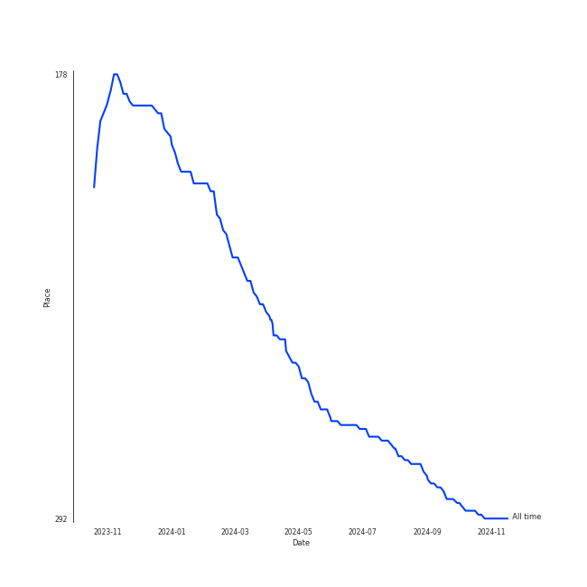
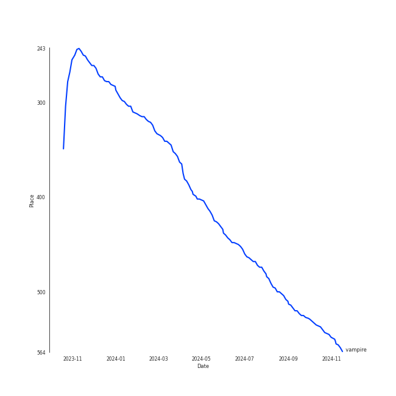
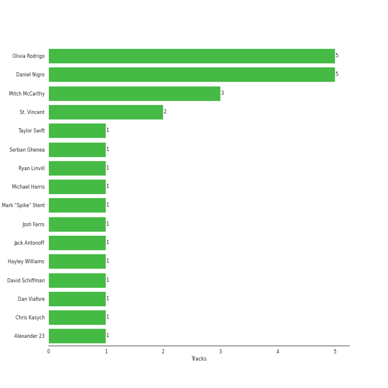

# Olivia Rodrigo

## Artist Rank
- The #271 artist overall

## Top Tracks

### Top tracks, aggregated

## Featured on Playlists
| Art | Tracks | Playlist |
|:---|---:|:---|
|  | 5 | [Pop](../../playlists/pop/overview.md) |
|  | 1 | [Halloween](../../playlists/halloween/overview.md) |
|  | 1 | [A-Pop Favorites](../../playlists/a-pop_favorites/overview.md) |

## Top Albums

| Art | Tracks | 💚 | Album | Release Date | 🔗 |
|:---|---:|---:|:---|:---|:---|
|  | 1 | 1 | good 4 u | 2021-05-14 | [🔗](https://open.spotify.com/album/3rMjL8NA5Wh2hbMNk2fSlY) |
|  | 1 | 1 | drivers license | 2021-01-08 | [🔗](https://open.spotify.com/album/66FPnVL9G4CMKy3wvaGTcr) |
|  | 1 | 1 | deja vu | 2021-04-01 | [🔗](https://open.spotify.com/album/3lwHyR4joA1xB7Nun21EP6) |
|  | 1 | 1 | GUTS (spilled) | 2024-03-22 | [🔗](https://open.spotify.com/album/1D06fz3cuob62ysTS8k6gu) |
|  | 1 | 1 | GUTS | 2023-09-08 | [🔗](https://open.spotify.com/album/1xJHno7SmdVtZAtXbdbDZp) |

## Top Record Labels

| Tracks | 💚 | Label |
|---:|---:|:---|
| 5 | 5 | Olivia Rodrigo PS |

## Genres

- [pop](../../genres/pop/overview.md)

## Credits

### Credits by Type

| Credit Type | Tracks |
|:---|---:|
| Lyricist | 3 |
| Songwriter | 5 |
| Vocal | 5 |

### Production Credits

| Art | Track | Credit Types |
|:---|:---|:---|
|  | drivers license | Lyricist, Songwriter |
|  | deja vu | Lyricist, Songwriter |
|  | good 4 u | Lyricist, Songwriter |
|  | vampire | Songwriter |
|  | obsessed | Songwriter |

## Top Producers

| Art | Producer | Tracks | Credit Types |
|:---|:---|---:|:---|
|  | [Olivia Rodrigo](overview.md) | 5 | Songwriter, Lyricist |
| | [Daniel Nigro](../../producers/daniel_nigro/overview.md) | 5 | Producer, Songwriter, Lyricist |
| | Mitch McCarthy | 3 | Producer |
| | St. Vincent | 2 | Songwriter |
| | [Jack Antonoff](../../producers/jack_antonoff/overview.md) | 1 | Songwriter |
| | [Mark "Spike" Stent](../../producers/mark__spike__stent/overview.md) | 1 | Producer |
|  | [Taylor Swift](../taylor_swift/overview.md) | 1 | Songwriter |
| | Alexander 23 | 1 | Producer |
| | Josh Farro | 1 | Songwriter |
| | Ryan Linvill | 1 | Producer |

View all

| Art | Producer | Tracks | Credit Types |
|:---|:---|---:|:---|
| | Chris Kasych | 1 | Producer |
| | Michael Harris | 1 | Producer |
| | Hayley Williams | 1 | Songwriter |
| | [Serban Ghenea](../../producers/serban_ghenea/overview.md) | 1 | Producer |
| | David Schiffman | 1 | Producer |
| | Dan Viafore | 1 | Producer |

## Tracks

| Art | Track | Album | Artists | Label | Rank | 💚 | 🔗 |
|:---|:---|:---|:---|:---|---:|:---|:---|
|  | vampire | GUTS | [Olivia Rodrigo](overview.md) | Olivia Rodrigo PS | 445 | 💚 | [🔗](https://open.spotify.com/track/1kuGVB7EU95pJObxwvfwKS) |
|  | drivers license | drivers license | [Olivia Rodrigo](overview.md) | Olivia Rodrigo PS | 840 | 💚 | [🔗](https://open.spotify.com/track/7lPN2DXiMsVn7XUKtOW1CS) |
|  | deja vu | deja vu | [Olivia Rodrigo](overview.md) | Olivia Rodrigo PS | 840 | 💚 | [🔗](https://open.spotify.com/track/61KpQadow081I2AsbeLcsb) |
|  | good 4 u | good 4 u | [Olivia Rodrigo](overview.md) | Olivia Rodrigo PS | 840 | 💚 | [🔗](https://open.spotify.com/track/6PERP62TejQjgHu81OHxgM) |
|  | obsessed | GUTS (spilled) | [Olivia Rodrigo](overview.md) | Olivia Rodrigo PS | 840 | 💚 | [🔗](https://open.spotify.com/track/6tNgRQ0K2NYZ0Rb9l9DzL8) |
