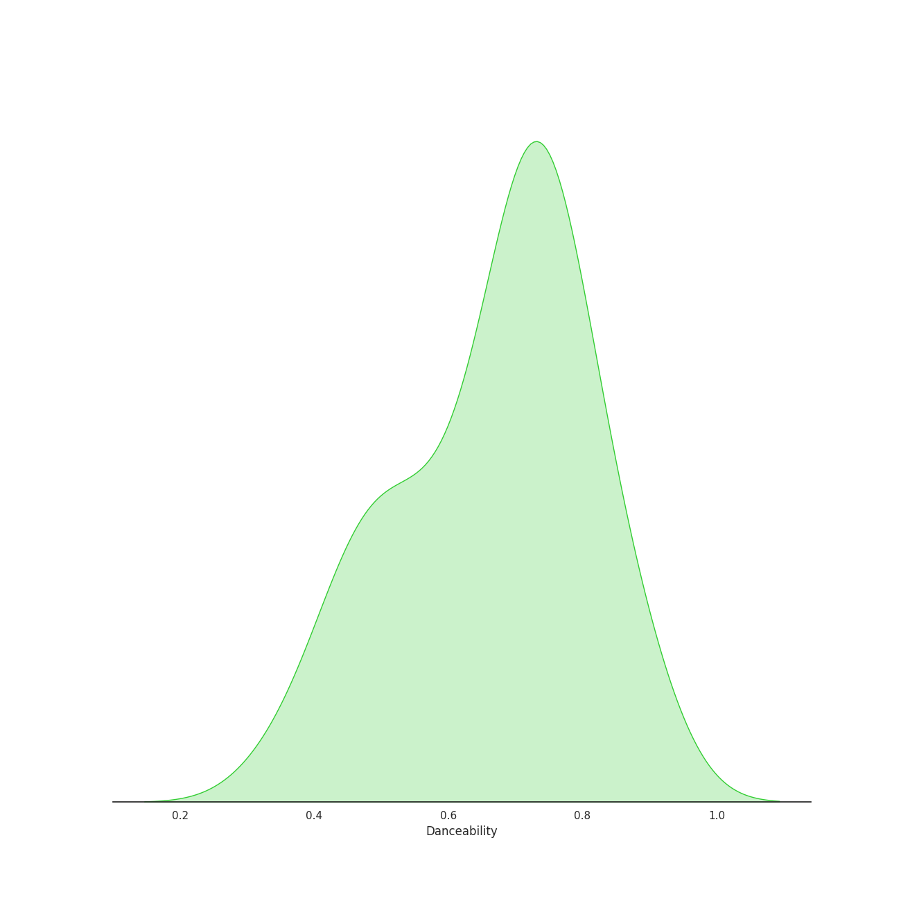
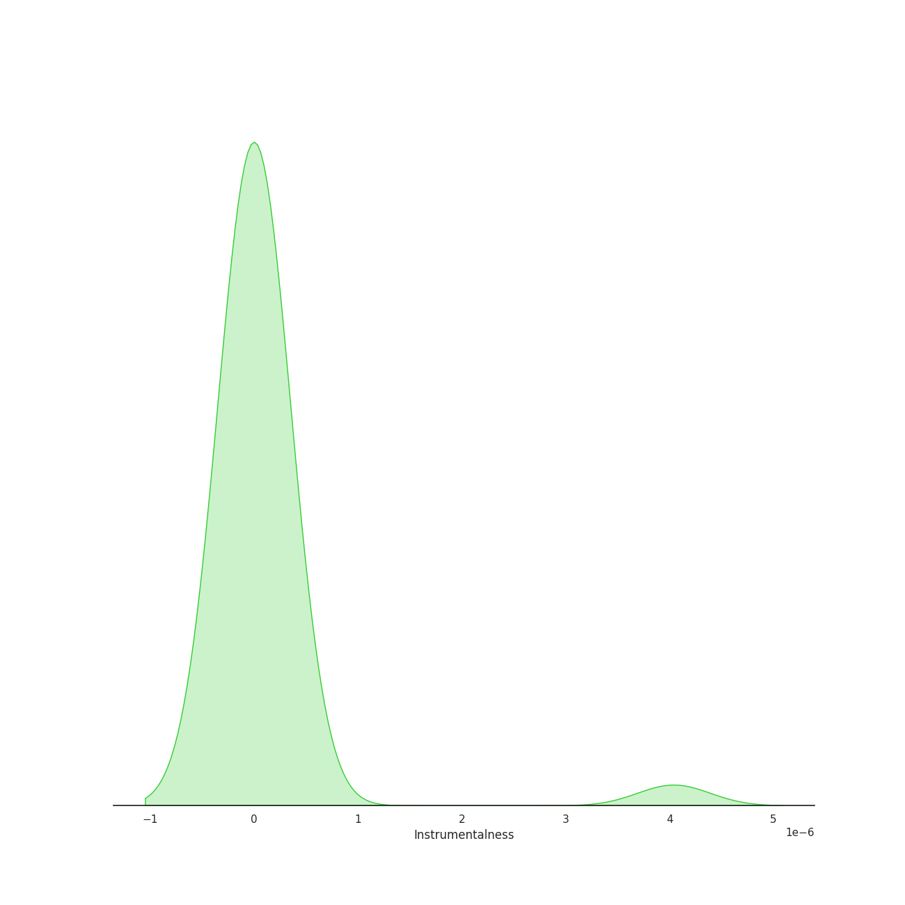
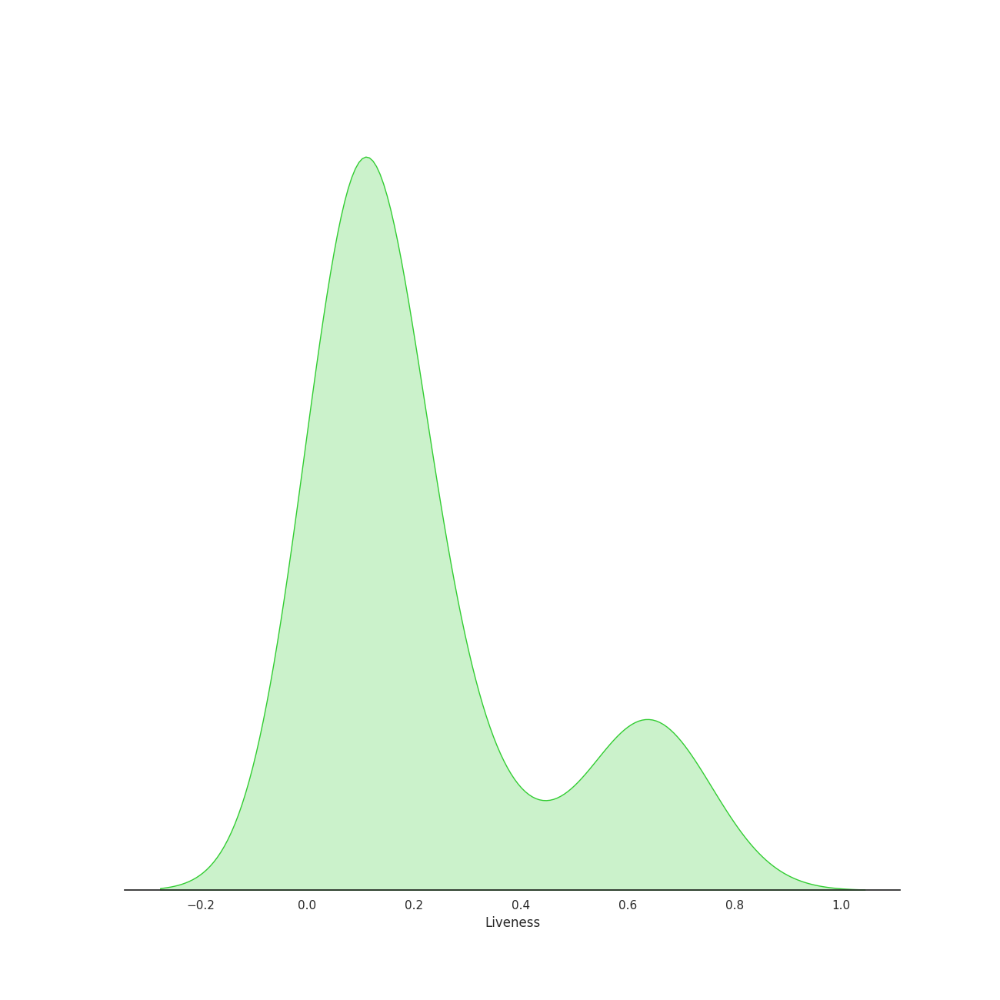
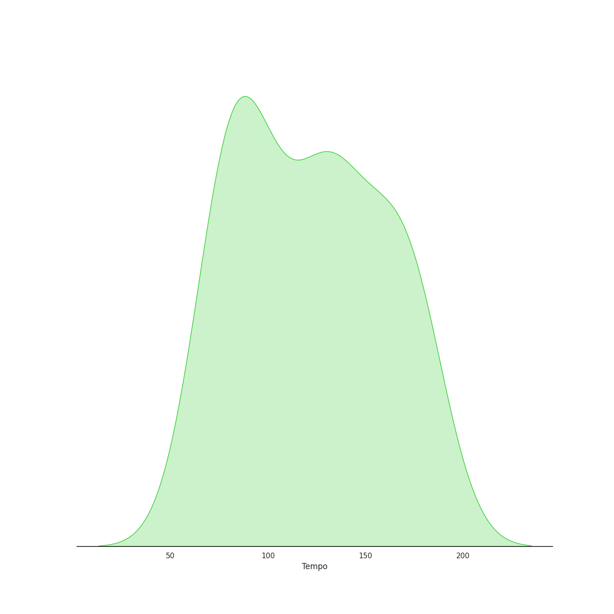

# Audio Features for Original Broadway Cast of Hamilton

## Danceability

| 10 most Danceable tracks | 10 least Danceable tracks |
|:---|:---|
| Ten Duel Commandments (0.887) | Who Lives, Who Dies, Who Tells Your Story (0.353) |
| Washington on Your Side (0.884) | History Has Its Eyes on You (0.438) |
| A Winter's Ball (0.854) | One Last Time (0.449) |
| Blow Us All Away (0.82) | Hurricane (0.453) |
| The Adams Administration (0.8) | It's Quiet Uptown (0.484) |
| Farmer Refuted (0.795) | The Story of Tonight (0.494) |
| Non-Stop (0.77) | What'd I Miss (0.539) |
| Yorktown (The World Turned Upside Down) (0.76) | Wait for It (0.543) |
| Say No to This (0.754) | Stay Alive - Reprise (0.546) |
| The Reynolds Pamphlet (0.751) | You'll Be Back (0.607) |

## Energy

| 10 most Energetic tracks | 10 least Energetic tracks |
|:---|:---|
| Yorktown (The World Turned Upside Down) (0.883) | It's Quiet Uptown (0.187) |
| The Schuyler Sisters (0.727) | The Story of Tonight (0.237) |
| Guns and Ships (0.666) | Stay Alive - Reprise (0.246) |
| My Shot (0.649) | Who Lives, Who Dies, Who Tells Your Story (0.326) |
| Meet Me Inside (0.643) | A Winter's Ball (0.327) |
| Satisfied (0.593) | The World Was Wide Enough (0.351) |
| What'd I Miss (0.577) | The Adams Administration (0.362) |
| The Reynolds Pamphlet (0.573) | Your Obedient Servant (0.37) |
| Hurricane (0.546) | History Has Its Eyes on You (0.373) |
| Say No to This (0.535) | Farmer Refuted (0.409) |

## Speechiness

| 10 most Speechy tracks | 10 least Speechy tracks |
|:---|:---|
| Ten Duel Commandments (0.658) | History Has Its Eyes on You (0.0291) |
| The World Was Wide Enough (0.648) | It's Quiet Uptown (0.0423) |
| The Adams Administration (0.544) | The Story of Tonight (0.0517) |
| A Winter's Ball (0.507) | You'll Be Back (0.0578) |
| Your Obedient Servant (0.502) | Who Lives, Who Dies, Who Tells Your Story (0.0901) |
| Right Hand Man (0.492) | Satisfied (0.0949) |
| Meet Me Inside (0.474) | Wait for It (0.157) |
| The Election of 1800 (0.462) | The Reynolds Pamphlet (0.226) |
| Blow Us All Away (0.461) | Yorktown (The World Turned Upside Down) (0.25) |
| The Room Where It Happens (0.426) | Stay Alive - Reprise (0.26) |

## Acousticness

| 10 most Acoustic tracks | 10 least Acoustic tracks |
|:---|:---|
| The Story of Tonight (0.835) | The Reynolds Pamphlet (0.0277) |
| History Has Its Eyes on You (0.803) | Ten Duel Commandments (0.0691) |
| It's Quiet Uptown (0.796) | Wait for It (0.124) |
| Who Lives, Who Dies, Who Tells Your Story (0.777) | My Shot (0.15) |
| Hurricane (0.762) | Washington on Your Side (0.165) |
| Farmer Refuted (0.684) | What'd I Miss (0.169) |
| One Last Time (0.631) | Right Hand Man (0.177) |
| Stay Alive - Reprise (0.535) | The Schuyler Sisters (0.187) |
| Alexander Hamilton (0.522) | Non-Stop (0.211) |
| The Adams Administration (0.505) | The Room Where It Happens (0.271) |

## Instrumentalness

| 10 most Instrumental tracks | 10 least Instrumental tracks |
|:---|:---|
| Wait for It (4.04e-06) | One Last Time (0.0) |
| Non-Stop (0.0) | The Election of 1800 (0.0) |
| Guns and Ships (0.0) | The Story of Tonight (0.0) |
| Who Lives, Who Dies, Who Tells Your Story (0.0) | The World Was Wide Enough (0.0) |
| The Reynolds Pamphlet (0.0) | Hurricane (0.0) |
| Yorktown (The World Turned Upside Down) (0.0) | Washington on Your Side (0.0) |
| The Schuyler Sisters (0.0) | History Has Its Eyes on You (0.0) |
| Meet Me Inside (0.0) | Stay Alive (0.0) |
| Blow Us All Away (0.0) | Farmer Refuted (0.0) |
| Your Obedient Servant (0.0) | The Room Where It Happens (0.0) |

## Liveness

| 10 most Live tracks | 10 least Live tracks |
|:---|:---|
| Yorktown (The World Turned Upside Down) (0.727) | Your Obedient Servant (0.042) |
| The Room Where It Happens (0.664) | Farmer Refuted (0.0548) |
| The Story of Tonight (0.648) | Washington on Your Side (0.0756) |
| The Schuyler Sisters (0.627) | It's Quiet Uptown (0.0785) |
| Ten Duel Commandments (0.617) | Stay Alive - Reprise (0.0801) |
| Blow Us All Away (0.563) | One Last Time (0.0805) |
| Meet Me Inside (0.363) | Guns and Ships (0.0844) |
| The Election of 1800 (0.306) | A Winter's Ball (0.0889) |
| Non-Stop (0.223) | My Shot (0.0903) |
| Right Hand Man (0.205) | Who Lives, Who Dies, Who Tells Your Story (0.0904) |

## Valence

| 10 most Happy tracks | 10 least Happy tracks |
|:---|:---|
| Ten Duel Commandments (0.828) | Who Lives, Who Dies, Who Tells Your Story (0.156) |
| The Schuyler Sisters (0.792) | It's Quiet Uptown (0.227) |
| The Adams Administration (0.792) | History Has Its Eyes on You (0.274) |
| Helpless (0.737) | The World Was Wide Enough (0.307) |
| A Winter's Ball (0.688) | What'd I Miss (0.319) |
| Blow Us All Away (0.665) | Right Hand Man (0.383) |
| The Election of 1800 (0.645) | Guns and Ships (0.383) |
| Meet Me Inside (0.644) | Say No to This (0.395) |
| The Story of Tonight (0.625) | Hurricane (0.398) |
| Your Obedient Servant (0.619) | One Last Time (0.41) |

## Tempo

| 10 most Fast tracks | 10 least Fast tracks |
|:---|:---|
| My Shot (180.466) | The Election of 1800 (67.426) |
| What'd I Miss (177.787) | Who Lives, Who Dies, Who Tells Your Story (75.5) |
| One Last Time (176.989) | History Has Its Eyes on You (77.415) |
| The Room Where It Happens (173.552) | Farmer Refuted (77.879) |
| Hurricane (171.289) | Ten Duel Commandments (77.977) |
| Your Obedient Servant (165.908) | Helpless (79.009) |
| Stay Alive - Reprise (160.031) | Say No to This (81.035) |
| Stay Alive (159.65) | Wait for It (86.534) |
| Right Hand Man (158.576) | Meet Me Inside (88.543) |
| The Reynolds Pamphlet (141.999) | Blow Us All Away (88.566) |
