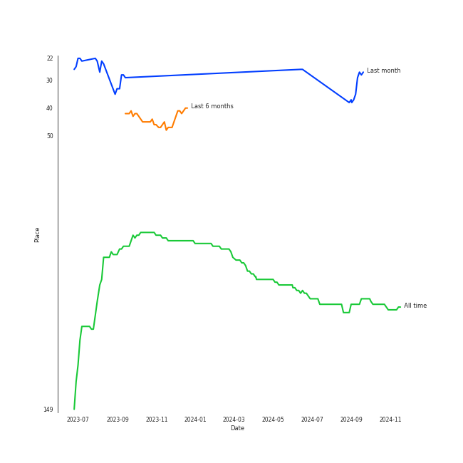

# P1Harmony

## Artist Rank
P1Harmony is currently:
- The #22 artist of the last month

## Featured on Playlists
| Art | Tracks | Playlist |
|:---|---:|:---|
|  | 6 | [K-Pop](../../playlists/k_pop/overview.md) |
|  | 1 | [Summer](../../playlists/summer/overview.md) |
|  | 1 | [K-Pop 101](../../playlists/k_pop_101/overview.md) |
|  | 1 | [K-Pop Favorites](../../playlists/k_pop_favorites/overview.md) |
|  | 1 | [Recent Comebacks](../../playlists/recent_comebacks/overview.md) |
|  | 1 | [Sharon RPD](../../playlists/sharon_rpd/overview.md) |
|  | 1 | [Cursed English](../../playlists/cursed_english/overview.md) |
## Top Albums

| Art | Tracks | 💚 | Album | Release Date | 🔗 |
|:---|---:|---:|:---|:---|:---|
|  | 3 | 2 | HARMONY : SET IN | 2022-11-30 | [🔗](https://open.spotify.com/album/1JDHisMjuJ1QkhcXiiLnnX) |
|  | 1 | 1 | HARMONY : ZERO IN | 2022-07-20 | [🔗](https://open.spotify.com/album/73CTPjApMDvFsycjbbROji) |
|  | 1 | 1 | HARMONY : ALL IN | 2023-06-08 | [🔗](https://open.spotify.com/album/67nhgkEfNwdqQt7QFYHw0B) |
|  | 1 | 1 | DISHARMONY : FIND OUT | 2022-01-03 | [🔗](https://open.spotify.com/album/13kHQp4zyK5jBpsFZmTvHz) |
|  | 1 | 0 | Do It Like This (English Version) | 2022-03-10 | [🔗](https://open.spotify.com/album/4L12vI7rtyBFmYOWZYtOi6) |

## Top Record Labels

| Tracks | 💚 | Label |
|---:|---:|:---|
| 6 | 5 | [FNC ENTERTAINMENT](../../labels/fnc_entertainment/overview.md) |
| 1 | 0 | ADA Korea |

## Genres

- [k-pop](../../genres/k_pop)
- [k-pop boy group](../../genres/k_pop_boy_group)

## Tracks

| Art | Track | Album | Artists | Label | 💚 | 🔗 |
|:---|:---|:---|:---|:---|:---|:---|
|  | Do It Like This | DISHARMONY : FIND OUT | [P1Harmony](overview.md) | [FNC ENTERTAINMENT](../../labels/fnc_entertainment) | 💚 | [🔗](https://open.spotify.com/track/0aW4RWeGekBfU2NhREc5kL) |
|  | Do It Like This - English Version | Do It Like This (English Version) | [P1Harmony](overview.md) | ADA Korea | | [🔗](https://open.spotify.com/track/5Z0k8KRK0Xy0metItGplGo) |
|  | Doom Du Doom | HARMONY : ZERO IN | [P1Harmony](overview.md) | [FNC ENTERTAINMENT](../../labels/fnc_entertainment) | 💚 | [🔗](https://open.spotify.com/track/41tvdK0UNp3oNKWDPkg7FO) |
|  | BFF (Best Friends Forever) | HARMONY : SET IN | [P1Harmony](overview.md) | [FNC ENTERTAINMENT](../../labels/fnc_entertainment) | 💚 | [🔗](https://open.spotify.com/track/4sJqthsQcuyjhYbJS1JExL) |
|  | Back Down | HARMONY : SET IN | [P1Harmony](overview.md) | [FNC ENTERTAINMENT](../../labels/fnc_entertainment) | 💚 | [🔗](https://open.spotify.com/track/7EP9G7AIKrywWGdYsYZzGv) |
|  | Secret Sauce | HARMONY : SET IN | [P1Harmony](overview.md) | [FNC ENTERTAINMENT](../../labels/fnc_entertainment) | | [🔗](https://open.spotify.com/track/31wuLarPgLZJSlohr7OCjj) |
|  | JUMP | HARMONY : ALL IN | [P1Harmony](overview.md) | [FNC ENTERTAINMENT](../../labels/fnc_entertainment) | 💚 | [🔗](https://open.spotify.com/track/4vTXBC7QOjEbi8DcJvCNE2) |