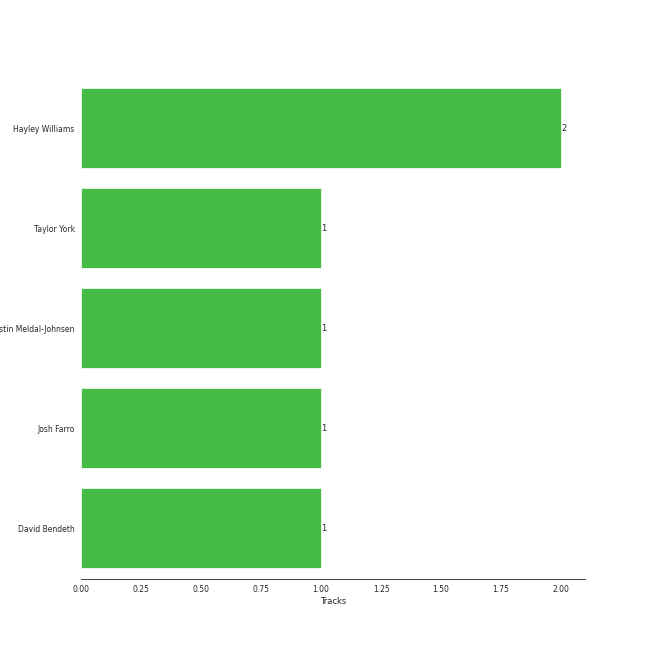

# Paramore

[See Track Features](audio_features.md)

[See Clusters](clusters/overview.md)

## Relationships

Paramore:
- has member Jason Bynum
- has member Jeremy Davis
- has member Josh Farro
- has member Zac Farro
- has member John Hembree
- has member Hunter Lamb
- has member Hayley Williams
- has member Taylor York

## Artist Rank

## Featured on Playlists
| Art | Tracks | Playlist |
|:---|---:|:---|
|  | 10 | [Check Out Later](../../playlists/check_out_later/overview.md) |
|  | 3 | [Modern Rock](../../playlists/modern_rock/overview.md) |
|  | 2 | [Alt-Pop](../../playlists/alt-pop/overview.md) |

## Top Albums

| Art | Tracks | 💚 | Album | Release Date | 🔗 |
|:---|---:|---:|:---|:---|:---|
|  | 10 | 0 | This Is Why | 2023-02-10 | [🔗](https://open.spotify.com/album/6tG8sCK4htJOLjlWwb7gZB) |
|  | 2 | 1 | Riot! | 2007-06-11 | [🔗](https://open.spotify.com/album/71rziY9eLo1tA2dBMxrwhc) |
|  | 2 | 1 | Paramore | 2013-04-05 | [🔗](https://open.spotify.com/album/4sgYpkIASM1jVlNC8Wp9oF) |
|  | 1 | 0 | Brand New Eyes | 2009-09-28 | [🔗](https://open.spotify.com/album/27UqZoE1kV6sIV6uQcI28A) |

## Top Record Labels

| Tracks | 💚 | Label |
|---:|---:|:---|
| 5 | 2 | [Fueled By Ramen](../../labels/fueled_by_ramen/overview.md) |
| 10 | 0 | [Atlantic Records](../../labels/atlantic_records/overview.md) |

## Genres

- candy pop
- [modern rock](../../genres/modern_rock/overview.md)
- pixie
- [pop](../../genres/pop/overview.md)
- pop emo
- pop punk
- [rock](../../genres/rock/overview.md)

## Credits

### Credits by Type

| Credit Type | Tracks |
|:---|---:|
| Performer | 1 |

### Member Credits

| | Hayley Williams | Josh Farro | Taylor York |
|:---|---:|---:|---:|
| Producer | 0 | 0 | 1 |
| Songwriter | 3 | 2 | 1 |
| Vocal | 1 | 0 | 0 |
### Production Credits

| Art | Track | Members | Credit Types |
|:---|:---|:---|:---|
|  | Misery Business | Josh Farro, Hayley Williams | Songwriter |
|  | Ain't It Fun | Hayley Williams, Taylor York | Songwriter, Producer |
|  | good 4 u | Josh Farro, Hayley Williams | Songwriter |

## Top Producers

| Art | Producer | Tracks | Credit Types |
|:---|:---|---:|:---|
| | Hayley Williams | 2 | Songwriter |
| | David Bendeth | 1 | Producer |
| | Justin Meldal-Johnsen | 1 | Producer |
| | Josh Farro | 1 | Songwriter |
| | Taylor York | 1 | Producer, Songwriter |

## Tracks

| Art | Track | Album | Artists | Label | 💚 | 🔗 |
|:---|:---|:---|:---|:---|:---|:---|
|  | Misery Business | Riot! | [Paramore](overview.md) | [Fueled By Ramen](../../labels/fueled_by_ramen) | 💚 | [🔗](https://open.spotify.com/track/6SpLc7EXZIPpy0sVko0aoU) |
|  | That's What You Get | Riot! | [Paramore](overview.md) | [Fueled By Ramen](../../labels/fueled_by_ramen) | | [🔗](https://open.spotify.com/track/1JdKrFyoU05abww0Zv0ayQ) |
|  | The Only Exception | Brand New Eyes | [Paramore](overview.md) | [Fueled By Ramen](../../labels/fueled_by_ramen) | | [🔗](https://open.spotify.com/track/7JIuqL4ZqkpfGKQhYlrirs) |
|  | Ain't It Fun | Paramore | [Paramore](overview.md) | [Fueled By Ramen](../../labels/fueled_by_ramen) | 💚 | [🔗](https://open.spotify.com/track/1j8z4TTjJ1YOdoFEDwJTQa) |
|  | Still into You | Paramore | [Paramore](overview.md) | [Fueled By Ramen](../../labels/fueled_by_ramen) | | [🔗](https://open.spotify.com/track/1yjY7rpaAQvKwpdUliHx0d) |
|  | Big Man, Little Dignity | This Is Why | [Paramore](overview.md) | [Atlantic Records](../../labels/atlantic_records) | | [🔗](https://open.spotify.com/track/2bfOeIn8bQkRr02NNX29tR) |
|  | Crave | This Is Why | [Paramore](overview.md) | [Atlantic Records](../../labels/atlantic_records) | | [🔗](https://open.spotify.com/track/7wYCva1bI1AkHRQoVXhy8F) |
|  | C’est Comme Ça | This Is Why | [Paramore](overview.md) | [Atlantic Records](../../labels/atlantic_records) | | [🔗](https://open.spotify.com/track/1Nx7KvCw6D3O0W2HwYg9tq) |
|  | Figure 8 | This Is Why | [Paramore](overview.md) | [Atlantic Records](../../labels/atlantic_records) | | [🔗](https://open.spotify.com/track/2Jb3hVkRFoiiwXYcELiBfC) |
|  | Liar | This Is Why | [Paramore](overview.md) | [Atlantic Records](../../labels/atlantic_records) | | [🔗](https://open.spotify.com/track/7EUhSxz4srS8pqh1cENbLB) |

See all tracks

| Art | Track | Album | Artists | Label | 💚 | 🔗 |
|:---|:---|:---|:---|:---|:---|:---|
|  | Running Out Of Time | This Is Why | [Paramore](overview.md) | [Atlantic Records](../../labels/atlantic_records) | | [🔗](https://open.spotify.com/track/5NRtdsFFlmyE8qDMgS08PE) |
|  | The News | This Is Why | [Paramore](overview.md) | [Atlantic Records](../../labels/atlantic_records) | | [🔗](https://open.spotify.com/track/59RjIhWIpthNpwrlChUvXm) |
|  | Thick Skull | This Is Why | [Paramore](overview.md) | [Atlantic Records](../../labels/atlantic_records) | | [🔗](https://open.spotify.com/track/0M2SX26YicKMOAxqtWGPUh) |
|  | This Is Why | This Is Why | [Paramore](overview.md) | [Atlantic Records](../../labels/atlantic_records) | | [🔗](https://open.spotify.com/track/7HdXRMw14roDx2a0COWk3M) |
|  | You First | This Is Why | [Paramore](overview.md) | [Atlantic Records](../../labels/atlantic_records) | | [🔗](https://open.spotify.com/track/2ZMkAWKrNDXrQuF0N9Q9Xj) |

