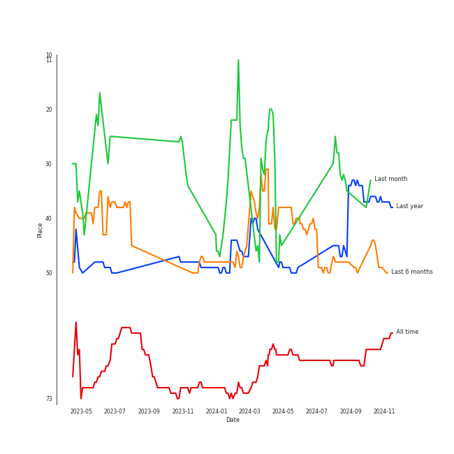

# PENTAGON

## Artist Rank

## Featured on Playlists
| Art | Tracks | Playlist |
|:---|---:|:---|
|  | 7 | [K-Pop](../../playlists/k_pop/overview.md) |
|  | 4 | [Summer](../../playlists/summer/overview.md) |
|  | 4 | [K-Pop Favorites](../../playlists/k_pop_favorites/overview.md) |
|  | 2 | [Chill](../../playlists/chill/overview.md) |
|  | 1 | [K-Pop 101](../../playlists/k_pop_101/overview.md) |
|  | 1 | [Workout](../../playlists/workout/overview.md) |
|  | 1 | [Aegyo](../../playlists/aegyo/overview.md) |
## Top Albums

| Art | Tracks | 💚 | Album | Release Date | 🔗 |
|:---|---:|---:|:---|:---|:---|
|  | 2 | 2 | LOVE or TAKE | 2021-03-15 | [🔗](https://open.spotify.com/album/5iu1d69dqEo9UaKpZDYoIV) |
|  | 2 | 2 | IN:VITE U | 2022-01-24 | [🔗](https://open.spotify.com/album/5vxZM8rFJiNvjtAThYnwek) |
|  | 1 | 1 | WE:TH | 2020-10-12 | [🔗](https://open.spotify.com/album/1ASYbBYBwV6Rcfc2ycqmlK) |
|  | 1 | 1 | Positive | 2018-04-02 | [🔗](https://open.spotify.com/album/1ZRmLzZWvOkSqWePzFeekO) |
|  | 1 | 0 | Shh | 2023-05-10 | [🔗](https://open.spotify.com/album/2IFIiCZ8FgprUn7yhqYG49) |
|  | 1 | 0 | SUM(ME:R) | 2019-07-17 | [🔗](https://open.spotify.com/album/4hlhRlDPvdfc7hQoD8gxZ1) |

## Top Record Labels

| Tracks | 💚 | Label |
|---:|---:|:---|
| 4 | 3 | [Universal Music LLC](../../labels/universal_music_llc/overview.md) |
| 3 | 3 | [CUBE ENTERTAINMENT](../../labels/cube_entertainment/overview.md) |
| 1 | 0 | [WM Korea](../../labels/wm_korea/overview.md) |

## Genres

- [k-pop](../../genres/k_pop)
- [k-pop boy group](../../genres/k_pop_boy_group)

## Tracks

| Art | Track | Album | Artists | Label | 💚 | 🔗 |
|:---|:---|:---|:---|:---|:---|:---|
|  | Shine | Positive | [PENTAGON](overview.md) | [CUBE ENTERTAINMENT](../../labels/cube_entertainment) | 💚 | [🔗](https://open.spotify.com/track/7nkp1uuSbKkoxMvEs8cSw0) |
|  | Humph! | SUM(ME:R) | [PENTAGON](overview.md) | [Universal Music LLC](../../labels/universal_music_llc) | | [🔗](https://open.spotify.com/track/0m3W71Oliiv3gQWXi2YAmJ) |
|  | Daisy | WE:TH | [PENTAGON](overview.md) | [Universal Music LLC](../../labels/universal_music_llc) | 💚 | [🔗](https://open.spotify.com/track/14pjnaIqkpReO5D0tHofAS) |
|  | Boy in time - HUI Solo | LOVE or TAKE | [PENTAGON](overview.md) | [Universal Music LLC](../../labels/universal_music_llc) | 💚 | [🔗](https://open.spotify.com/track/6RQ7IDXf8kKcSYYugGoJZf) |
|  | DO or NOT | LOVE or TAKE | [PENTAGON](overview.md) | [Universal Music LLC](../../labels/universal_music_llc) | 💚 | [🔗](https://open.spotify.com/track/6AE0npeqcZIebU2EN7jMtL) |
|  | Feelin' Like | IN:VITE U | [PENTAGON](overview.md) | [Cube Entertainment](../../labels/cube_entertainment) | 💚 | [🔗](https://open.spotify.com/track/5Wll1i0Y8GGjyePcP83L3x) |
|  | Sparkling Night | IN:VITE U | [PENTAGON](overview.md) | [Cube Entertainment](../../labels/cube_entertainment) | 💚 | [🔗](https://open.spotify.com/track/5muXLxcyjv5RY2sGwl68TL) |
|  | Shh | Shh | [PENTAGON](overview.md) | [WM Korea](../../labels/wm_korea) | | [🔗](https://open.spotify.com/track/0qu6gCG90KB4vp6H7JpAZy) |