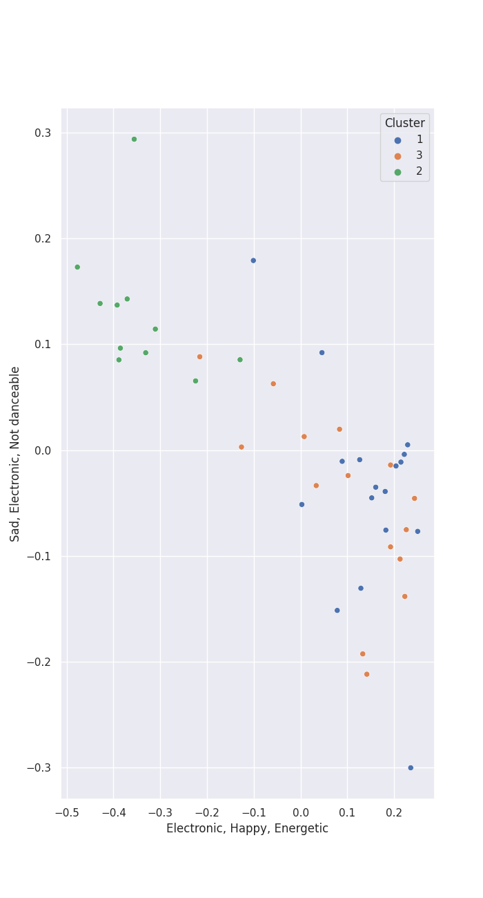

# Clusters in Pentatonix

## Cluster #1

17 tracks

| Art | Track | Album | Artists | Label | Score | 💚 | 🔗 |
|:---|:---|:---|:---|:---|---:|:---|:---|
|  | Natural Disaster | PTX, Vol. 2 | [Pentatonix](../../overview.md) | [RCA Records Label](../../../../labels/rca_records_label) | 0 | | [🔗](https://open.spotify.com/track/04nemEju86ULMJ1iy6EAsF) |
|  | Love Again | PTX, Vol. 2 | [Pentatonix](../../overview.md) | [RCA Records Label](../../../../labels/rca_records_label) | 0 | | [🔗](https://open.spotify.com/track/0vcyzDe6aoYTg6jM0U0T9r) |
|  | Daft Punk | PTX, Vol. 2 | [Pentatonix](../../overview.md) | [RCA Records Label](../../../../labels/rca_records_label) | 0 | 💚 | [🔗](https://open.spotify.com/track/6ukvsBzq4d1vBsAUmz7ZVt) |
|  | It's the Most Wonderful Time of the Year | That's Christmas To Me (Deluxe Edition) | [Pentatonix](../../overview.md) | [RCA Records Label](../../../../labels/rca_records_label) | 0 | | [🔗](https://open.spotify.com/track/4DXJt41B9ZPh3UmxiPkBT0) |
|  | Attention | PTX Presents: Top Pop, Vol. I | [Pentatonix](../../overview.md) | [RCA Records Label](../../../../labels/rca_records_label) | 0 | | [🔗](https://open.spotify.com/track/5P40YyCrdZRsoj2vTbSyVI) |
|  | Can't Sleep Love (feat. Tink) | Pentatonix (Deluxe Version) | [Pentatonix](../../overview.md), Tink | [RCA Records Label](../../../../labels/rca_records_label) | 0 | 💚 | [🔗](https://open.spotify.com/track/1GXFYdKM6MNrogE2PacpKe) |
|  | Na Na Na | Pentatonix (Deluxe Version) | [Pentatonix](../../overview.md) | [RCA Records Label](../../../../labels/rca_records_label) | 0 | | [🔗](https://open.spotify.com/track/6v08G3CGcoyiODIWZoOxR4) |
|  | Problem (Ariana Grande Cover) | PTX, Vol. III | [Pentatonix](../../overview.md) | [RCA Records Label](../../../../labels/rca_records_label) | 150 | 💚 | [🔗](https://open.spotify.com/track/45h4cCw7ccsRXb0Orle2an) |
|  | Rather Be (Clean Bandit Cover) | PTX, Vol. III | [Pentatonix](../../overview.md) | [RCA Records Label](../../../../labels/rca_records_label) | 0 | 💚 | [🔗](https://open.spotify.com/track/4hxemf0pE0mSzubgsfRLWu) |
|  | Rockin' Around the Christmas Tree | Christmas Is Here! | [Pentatonix](../../overview.md) | [RCA Records Label](../../../../labels/rca_records_label) | 0 | | [🔗](https://open.spotify.com/track/3Fu6XvAT5yjzO8GMcvuM1s) |
## Cluster #2

11 tracks

| Art | Track | Album | Artists | Label | Score | 💚 | 🔗 |
|:---|:---|:---|:---|:---|---:|:---|:---|
|  | Run to You | PTX, Vol. 2 | [Pentatonix](../../overview.md) | [RCA Records Label](../../../../labels/rca_records_label) | 0 | 💚 | [🔗](https://open.spotify.com/track/1bukNCD9JEwNp235Ov0iZH) |
|  | Hallelujah | A Pentatonix Christmas Deluxe | [Pentatonix](../../overview.md) | [RCA Records Label](../../../../labels/rca_records_label) | 0 | | [🔗](https://open.spotify.com/track/0HZk0QsXPhMNAWNDR3rYE8) |
|  | If I Ever Fall In Love (feat. Jason Derulo) | Pentatonix (Deluxe Version) | [Pentatonix](../../overview.md), [Jason Derulo](../../../jason_derulo/overview.md) | [RCA Records Label](../../../../labels/rca_records_label) | 0 | 💚 | [🔗](https://open.spotify.com/track/3vaWsG3oKZt0bSra2p5c5R) |
|  | Imagine | PTX Vol. IV - Classics | [Pentatonix](../../overview.md) | [RCA Records Label](../../../../labels/rca_records_label) | 5 | 💚 | [🔗](https://open.spotify.com/track/1UaTmLT3nB1sNBfv1hkqU1) |
|  | Can't Help Falling In Love | PTX Vol. IV - Classics | [Pentatonix](../../overview.md) | [RCA Records Label](../../../../labels/rca_records_label) | 0 | 💚 | [🔗](https://open.spotify.com/track/1xKScU3i8ho0OIhNoC5YW9) |
|  | Over The Rainbow | PTX Vol. IV - Classics | [Pentatonix](../../overview.md) | [RCA Records Label](../../../../labels/rca_records_label) | 0 | | [🔗](https://open.spotify.com/track/7MefjVBQqdV6XRXBlWejTQ) |
|  | Say Something | PTX | [Pentatonix](../../overview.md) | [RCA Records Label](../../../../labels/rca_records_label) | 0 | | [🔗](https://open.spotify.com/track/2SrJ0Iw6GobiRGyh2XKZhV) |
|  | Standing By | PTX, Vol. III | [Pentatonix](../../overview.md) | [RCA Records Label](../../../../labels/rca_records_label) | 0 | | [🔗](https://open.spotify.com/track/2ZtMNYog671T0UFfp0hhWq) |
|  | The Christmas Song (Chestnuts Roasting on an Open Fire) | PTXmas (Deluxe Edition) | [Pentatonix](../../overview.md) | [RCA Records Label](../../../../labels/rca_records_label) | 0 | | [🔗](https://open.spotify.com/track/3M2xVmqG5GgthkaRJBntBk) |
|  | O Come, O Come Emmanuel | PTXmas (Deluxe Edition) | [Pentatonix](../../overview.md) | [RCA Records Label](../../../../labels/rca_records_label) | 0 | | [🔗](https://open.spotify.com/track/4eKD9QhFqvwA4ilUAkQAbI) |
## Cluster #3

15 tracks

| Art | Track | Album | Artists | Label | Score | 💚 | 🔗 |
|:---|:---|:---|:---|:---|---:|:---|:---|
|  | I Need Your Love | PTX, Vol. 2 | [Pentatonix](../../overview.md) | [RCA Records Label](../../../../labels/rca_records_label) | 0 | | [🔗](https://open.spotify.com/track/11tQS3cthRT6guY7WkTypx) |
|  | The Sound of Silence | The Sound of Silence | [Pentatonix](../../overview.md) | [RCA Records Label](../../../../labels/rca_records_label) | 0 | | [🔗](https://open.spotify.com/track/0ZFeVCKCMCXUQ1TKVd2azW) |
|  | Show You How to Love | PTX, Vol. 1 | [Pentatonix](../../overview.md) | [RCA Records Label](../../../../labels/rca_records_label) | 0 | | [🔗](https://open.spotify.com/track/0jExzGwfnZ1vTuCVB7w3vM) |
|  | The Baddest Girl | PTX, Vol. 1 | [Pentatonix](../../overview.md) | [RCA Records Label](../../../../labels/rca_records_label) | 0 | 💚 | [🔗](https://open.spotify.com/track/3tKAuyZm1eLdmkZekqezic) |
|  | Somebody That I Used to Know | PTX, Vol. 1 | [Pentatonix](../../overview.md) | [RCA Records Label](../../../../labels/rca_records_label) | 0 | | [🔗](https://open.spotify.com/track/5XPSElbh3y0S1Jl0ggpwQr) |
|  | We Are Young | PTX, Vol. 1 | [Pentatonix](../../overview.md) | [RCA Records Label](../../../../labels/rca_records_label) | 0 | 💚 | [🔗](https://open.spotify.com/track/5mMoySkxdUWlTw6X2l4egi) |
|  | Papaoutai (Stromae Cover) (feat. Lindsey Stirling) | PTX, Vol. III | [Pentatonix](../../overview.md), [Lindsey Stirling](../../../lindsey_stirling/overview.md) | [RCA Records Label](../../../../labels/rca_records_label) | 0 | 💚 | [🔗](https://open.spotify.com/track/4LeTorR5FyWgxM3zZI7Qii) |
|  | See Through | PTX, Vol. III | [Pentatonix](../../overview.md) | [RCA Records Label](../../../../labels/rca_records_label) | 0 | | [🔗](https://open.spotify.com/track/6UNqsxeupIqwNds2oSDYnY) |
|  | La La Latch (Sam Smith/Disclosure/Naughty Boy Mashup) | PTX, Vol. III | [Pentatonix](../../overview.md) | [RCA Records Label](../../../../labels/rca_records_label) | 0 | 💚 | [🔗](https://open.spotify.com/track/6fOqEAXCwboCO4BdzbZG1K) |
|  | Sweater Weather | Christmas Is Here! | [Pentatonix](../../overview.md) | [RCA Records Label](../../../../labels/rca_records_label) | 0 | | [🔗](https://open.spotify.com/track/50YYe94G19kWVyhzdEXxki) |