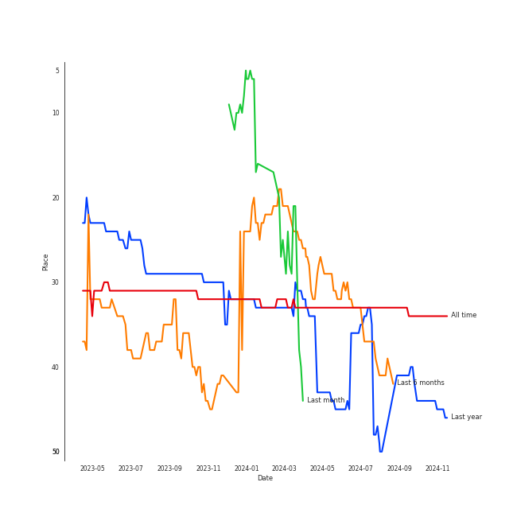

# Pentatonix

[See Track Features](audio_features.md)

[See Clusters](clusters/overview.md)

## Relationships

Pentatonix:
- has member Mitch Grassi
- has member Scott Hoying
- has member Avi Kaplan
- has member Kirstin
- has member Kevin Olusola
- has member Matt Sallee

## Artist Rank
Pentatonix is currently:
- The #17 artist of the last month
- The #23 artist of the last 6 months
- The #33 artist of all time

## Featured on Playlists
| Art | Tracks | Playlist |
|:---|---:|:---|
|  | 36 | [A Cappella](../../playlists/a_cappella/overview.md) |
|  | 9 | [Christmas](../../playlists/christmas/overview.md) |

## Top Albums

| Art | Tracks | 💚 | Album | Release Date | 🔗 |
|:---|---:|---:|:---|:---|:---|
|  | 7 | 3 | PTX, Vol. 2 | 2013-11-05 | [🔗](https://open.spotify.com/album/12dPqNFIdjiVFSHvtsDmzJ) |
|  | 6 | 4 | PTX, Vol. III | 2014-09-23 | [🔗](https://open.spotify.com/album/32y54TelUHSUDWVOx4h1B4) |
|  | 6 | 3 | PTX, Vol. 1 | 2012-06-26 | [🔗](https://open.spotify.com/album/5wGlP6EqF7akh6N3UGfKVZ) |
|  | 5 | 0 | That's Christmas To Me (Deluxe Edition) | 2015-10-30 | [🔗](https://open.spotify.com/album/082VlX7cBth0o8xqDGclNn) |
|  | 4 | 2 | Pentatonix (Deluxe Version) | 2015-10-16 | [🔗](https://open.spotify.com/album/6qf9tE8pNRW0kX1Cucrixr) |
|  | 3 | 2 | PTX Vol. IV - Classics | 2017-04-07 | [🔗](https://open.spotify.com/album/00JpoY0ZaQRXTNJUruibfX) |
|  | 3 | 1 | PTX Presents: Top Pop, Vol. I | 2018-04-13 | [🔗](https://open.spotify.com/album/2viOlnLfhPLDgx7hvBqLwW) |
|  | 3 | 0 | PTXmas (Deluxe Edition) | 2012-11-12 | [🔗](https://open.spotify.com/album/5ZwH7KH8Zw0m76hYwANMos) |
|  | 2 | 1 | PTX | 2014-09-19 | [🔗](https://open.spotify.com/album/77RBn8pRsfXlZdfTQh221D) |
|  | 2 | 0 | Christmas Is Here! | 2018-10-19 | [🔗](https://open.spotify.com/album/6thZNGX8hUVSjUrqJgPB9b) |

See all albums

| Art | Tracks | 💚 | Album | Release Date | 🔗 |
|:---|---:|---:|:---|:---|:---|
|  | 1 | 0 | The Sound of Silence | 2019-02-15 | [🔗](https://open.spotify.com/album/2d5CHsmyOYGqfjDaPrdEzc) |
|  | 1 | 0 | A Pentatonix Christmas Deluxe | 2017-12-06 | [🔗](https://open.spotify.com/album/3sId8sOH47yqOWopzbEtJn) |

## Top Record Labels

| Tracks | 💚 | Label |
|---:|---:|:---|
| 43 | 16 | [RCA Records Label](../../labels/rca_records_label/overview.md) |

## Genres

- [a cappella](../../genres/a_cappella/overview.md)
- [viral pop](../../genres/viral_pop/overview.md)

## Credits

### Credits by Type

| Credit Type | Tracks |
|:---|---:|
| Arranger | 2 |

### Member Credits

| | Avi Kaplan | Kevin Olusola | Kirstin | Mitch Grassi | Scott Hoying |
|:---|---:|---:|---:|---:|---:|
| Songwriter | 3 | 3 | 3 | 3 | 3 |
### Production Credits

| Art | Track | Members | Credit Types |
|:---|:---|:---|:---|
|  | The Baddest Girl | Avi Kaplan, Kevin Olusola, Kirstin, Scott Hoying, Mitch Grassi | Songwriter |
|  | Run to You | Avi Kaplan, Kevin Olusola, Kirstin, Scott Hoying, Mitch Grassi | Songwriter |
|  | Can't Sleep Love (feat. Tink) | [Pentatonix](overview.md), Avi Kaplan, Kevin Olusola, Kirstin, Scott Hoying, Mitch Grassi | Arranger, Songwriter |
|  | If I Ever Fall In Love (feat. Jason Derulo) | [Pentatonix](overview.md) | Arranger |

## Top Producers

| Art | Producer | Tracks | Credit Types |
|:---|:---|---:|:---|
| | Ben Bram | 4 | Songwriter, Arranger |
| | Kevin Olusola | 3 | Songwriter |
| | Avi Kaplan | 3 | Songwriter |
| | Kirstin | 3 | Songwriter |
| | Scott Hoying | 3 | Songwriter |
| | Mitch Grassi | 3 | Songwriter |
| | Jimmy Napes | 2 | Songwriter |
|  | [Pentatonix](overview.md) | 2 | Arranger |
| | Savan Kotecha | 1 | Songwriter |
| | Ben McKee | 1 | Songwriter |

View all

| Art | Producer | Tracks | Credit Types |
|:---|:---|---:|:---|
|  | Young Thug | 1 | Songwriter |
|  | [Ariana Grande](../ariana_grande/overview.md) | 1 | Songwriter |
| | Nikki Cislyn | 1 | Songwriter |
| | Wayne Sermon | 1 | Songwriter |
| | ILYA | 1 | Songwriter |
| | George David Weiss | 1 | Songwriter |
| | Luigi Creatore | 1 | Songwriter |
| | Elof Loelv | 1 | Songwriter |
| | Kaan Gunesberk | 1 | Songwriter |
|  | Nate Ruess | 1 | Songwriter |
| | Jeff Bhasker | 1 | Songwriter |
|  | Stromae | 1 | Songwriter |
| | Brian Lee | 1 | Songwriter |
| | Yoko Ono | 1 | Lyricist |
| | Starrah | 1 | Songwriter |
| | Dan Reynolds | 1 | Songwriter |
| | Louis Bell | 1 | Songwriter |
| | Andrew Watt | 1 | Songwriter |
| | Howard Lawrence | 1 | Songwriter |
|  | [Camila Cabello](../camila_cabello/overview.md) | 1 | Songwriter |
| | Kevin Figueiredo | 1 | Songwriter |
| | Ali Tamposi | 1 | Songwriter |
| | Alex da Kid | 1 | Songwriter |
| | Jack Antonoff | 1 | Songwriter |
| | Sampha | 1 | Songwriter |
|  | Pharrell Williams | 1 | Songwriter |
| | Teddy Peña (Peña, Teddy) | 1 | Songwriter |
| | Hugo Peretti | 1 | Songwriter |
| | Guy Lawrence | 1 | Songwriter |
|  | [Imogen Heap](../imogen_heap/overview.md) | 1 | Lyricist, Songwriter |
| | Andrew Dost | 1 | Songwriter |
|  | Iggy Azalea | 1 | Songwriter |
| | Jack Patterson | 1 | Songwriter |
| | John Lennon | 1 | Lyricist, Songwriter |
| | Josh Mosser | 1 | Songwriter |
|  | Sam Smith | 1 | Songwriter |
| | Max Martin | 1 | Songwriter |
| | Grace Chatto | 1 | Songwriter |
| | Timmaz Zolleyn | 1 | Songwriter |
| | William Wells | 1 | Songwriter |
| | Jessie Ware | 1 | Songwriter |
| | Carl Martin | 1 | Songwriter |
| | Frank Dukes | 1 | Songwriter |

## Tracks

| Art | Track | Album | Artists | Label | 💚 | 🔗 |
|:---|:---|:---|:---|:---|:---|:---|
|  | Aha! | PTX, Vol. 1 | [Pentatonix](overview.md) | [RCA Records Label](../../labels/rca_records_label) | 💚 | [🔗](https://open.spotify.com/track/5AspukpHyZuTciR17YPSrS) |
|  | Show You How to Love | PTX, Vol. 1 | [Pentatonix](overview.md) | [RCA Records Label](../../labels/rca_records_label) | | [🔗](https://open.spotify.com/track/0jExzGwfnZ1vTuCVB7w3vM) |
|  | Somebody That I Used to Know | PTX, Vol. 1 | [Pentatonix](overview.md) | [RCA Records Label](../../labels/rca_records_label) | | [🔗](https://open.spotify.com/track/5XPSElbh3y0S1Jl0ggpwQr) |
|  | Starships | PTX, Vol. 1 | [Pentatonix](overview.md) | [RCA Records Label](../../labels/rca_records_label) | | [🔗](https://open.spotify.com/track/28KAxjOTAnnGjGpC2Qx8gn) |
|  | The Baddest Girl | PTX, Vol. 1 | [Pentatonix](overview.md) | [RCA Records Label](../../labels/rca_records_label) | 💚 | [🔗](https://open.spotify.com/track/3tKAuyZm1eLdmkZekqezic) |
|  | We Are Young | PTX, Vol. 1 | [Pentatonix](overview.md) | [RCA Records Label](../../labels/rca_records_label) | 💚 | [🔗](https://open.spotify.com/track/5mMoySkxdUWlTw6X2l4egi) |
|  | Carol of the Bells | PTXmas (Deluxe Edition) | [Pentatonix](overview.md) | [RCA Records Label](../../labels/rca_records_label) | | [🔗](https://open.spotify.com/track/4cJhiux4xzrdgSHUeAjP48) |
|  | O Come, O Come Emmanuel | PTXmas (Deluxe Edition) | [Pentatonix](overview.md) | [RCA Records Label](../../labels/rca_records_label) | | [🔗](https://open.spotify.com/track/4eKD9QhFqvwA4ilUAkQAbI) |
|  | The Christmas Song (Chestnuts Roasting on an Open Fire) | PTXmas (Deluxe Edition) | [Pentatonix](overview.md) | [RCA Records Label](../../labels/rca_records_label) | | [🔗](https://open.spotify.com/track/3M2xVmqG5GgthkaRJBntBk) |
|  | Daft Punk | PTX, Vol. 2 | [Pentatonix](overview.md) | [RCA Records Label](../../labels/rca_records_label) | 💚 | [🔗](https://open.spotify.com/track/6ukvsBzq4d1vBsAUmz7ZVt) |

See all tracks

| Art | Track | Album | Artists | Label | 💚 | 🔗 |
|:---|:---|:---|:---|:---|:---|:---|
|  | Hey Momma / Hit the Road Jack | PTX, Vol. 2 | [Pentatonix](overview.md) | [RCA Records Label](../../labels/rca_records_label) | | [🔗](https://open.spotify.com/track/2wUZek0zWyw5mGKoT8mRcG) |
|  | I Need Your Love | PTX, Vol. 2 | [Pentatonix](overview.md) | [RCA Records Label](../../labels/rca_records_label) | | [🔗](https://open.spotify.com/track/11tQS3cthRT6guY7WkTypx) |
|  | Love Again | PTX, Vol. 2 | [Pentatonix](overview.md) | [RCA Records Label](../../labels/rca_records_label) | | [🔗](https://open.spotify.com/track/0vcyzDe6aoYTg6jM0U0T9r) |
|  | Natural Disaster | PTX, Vol. 2 | [Pentatonix](overview.md) | [RCA Records Label](../../labels/rca_records_label) | | [🔗](https://open.spotify.com/track/04nemEju86ULMJ1iy6EAsF) |
|  | Run to You | PTX, Vol. 2 | [Pentatonix](overview.md) | [RCA Records Label](../../labels/rca_records_label) | 💚 | [🔗](https://open.spotify.com/track/1bukNCD9JEwNp235Ov0iZH) |
|  | Valentine | PTX, Vol. 2 | [Pentatonix](overview.md) | [RCA Records Label](../../labels/rca_records_label) | 💚 | [🔗](https://open.spotify.com/track/5djjmpqAOlne6d5RSHQmvu) |
|  | Radioactive | PTX | [Pentatonix](overview.md), [Lindsey Stirling](../lindsey_stirling/overview.md) | [RCA Records Label](../../labels/rca_records_label) | 💚 | [🔗](https://open.spotify.com/track/7dJGehjbhJvs3K4fWwYTW1) |
|  | Say Something | PTX | [Pentatonix](overview.md) | [RCA Records Label](../../labels/rca_records_label) | | [🔗](https://open.spotify.com/track/2SrJ0Iw6GobiRGyh2XKZhV) |
|  | La La Latch (Sam Smith/Disclosure/Naughty Boy Mashup) | PTX, Vol. III | [Pentatonix](overview.md) | [RCA Records Label](../../labels/rca_records_label) | 💚 | [🔗](https://open.spotify.com/track/6fOqEAXCwboCO4BdzbZG1K) |
|  | Papaoutai (Stromae Cover) (feat. Lindsey Stirling) | PTX, Vol. III | [Pentatonix](overview.md), [Lindsey Stirling](../lindsey_stirling/overview.md) | [RCA Records Label](../../labels/rca_records_label) | 💚 | [🔗](https://open.spotify.com/track/4LeTorR5FyWgxM3zZI7Qii) |
|  | Problem (Ariana Grande Cover) | PTX, Vol. III | [Pentatonix](overview.md) | [RCA Records Label](../../labels/rca_records_label) | 💚 | [🔗](https://open.spotify.com/track/45h4cCw7ccsRXb0Orle2an) |
|  | Rather Be (Clean Bandit Cover) | PTX, Vol. III | [Pentatonix](overview.md) | [RCA Records Label](../../labels/rca_records_label) | 💚 | [🔗](https://open.spotify.com/track/4hxemf0pE0mSzubgsfRLWu) |
|  | See Through | PTX, Vol. III | [Pentatonix](overview.md) | [RCA Records Label](../../labels/rca_records_label) | | [🔗](https://open.spotify.com/track/6UNqsxeupIqwNds2oSDYnY) |
|  | Standing By | PTX, Vol. III | [Pentatonix](overview.md) | [RCA Records Label](../../labels/rca_records_label) | | [🔗](https://open.spotify.com/track/2ZtMNYog671T0UFfp0hhWq) |
|  | Can't Sleep Love | Pentatonix (Deluxe Version) | [Pentatonix](overview.md) | [RCA Records Label](../../labels/rca_records_label) | | [🔗](https://open.spotify.com/track/1klGbW5a9qTBFUjFfddbmU) |
|  | Can't Sleep Love (feat. Tink) | Pentatonix (Deluxe Version) | [Pentatonix](overview.md), Tink | [RCA Records Label](../../labels/rca_records_label) | 💚 | [🔗](https://open.spotify.com/track/1GXFYdKM6MNrogE2PacpKe) |
|  | If I Ever Fall In Love (feat. Jason Derulo) | Pentatonix (Deluxe Version) | [Pentatonix](overview.md), [Jason Derulo](../jason_derulo/overview.md) | [RCA Records Label](../../labels/rca_records_label) | 💚 | [🔗](https://open.spotify.com/track/3vaWsG3oKZt0bSra2p5c5R) |
|  | Na Na Na | Pentatonix (Deluxe Version) | [Pentatonix](overview.md) | [RCA Records Label](../../labels/rca_records_label) | | [🔗](https://open.spotify.com/track/6v08G3CGcoyiODIWZoOxR4) |
|  | Dance of the Sugar Plum Fairy | That's Christmas To Me (Deluxe Edition) | [Pentatonix](overview.md) | [RCA Records Label](../../labels/rca_records_label) | | [🔗](https://open.spotify.com/track/0u0TlASkQWH2bGIZRu0HLh) |
|  | It's the Most Wonderful Time of the Year | That's Christmas To Me (Deluxe Edition) | [Pentatonix](overview.md) | [RCA Records Label](../../labels/rca_records_label) | | [🔗](https://open.spotify.com/track/4DXJt41B9ZPh3UmxiPkBT0) |
|  | Let It Go | That's Christmas To Me (Deluxe Edition) | [Pentatonix](overview.md) | [RCA Records Label](../../labels/rca_records_label) | | [🔗](https://open.spotify.com/track/2G7K3Op9y3HhqrF2TdHP95) |
|  | Mary, Did You Know? | That's Christmas To Me (Deluxe Edition) | [Pentatonix](overview.md) | [RCA Records Label](../../labels/rca_records_label) | | [🔗](https://open.spotify.com/track/4z8sz6E4YyFuEkv5o7IJni) |
|  | Sleigh Ride | That's Christmas To Me (Deluxe Edition) | [Pentatonix](overview.md) | [RCA Records Label](../../labels/rca_records_label) | | [🔗](https://open.spotify.com/track/0ErjxyZ4qHQVs5umCBIClk) |
|  | Can't Help Falling In Love | PTX Vol. IV - Classics | [Pentatonix](overview.md) | [RCA Records Label](../../labels/rca_records_label) | 💚 | [🔗](https://open.spotify.com/track/1xKScU3i8ho0OIhNoC5YW9) |
|  | Imagine | PTX Vol. IV - Classics | [Pentatonix](overview.md) | [RCA Records Label](../../labels/rca_records_label) | 💚 | [🔗](https://open.spotify.com/track/1UaTmLT3nB1sNBfv1hkqU1) |
|  | Over The Rainbow | PTX Vol. IV - Classics | [Pentatonix](overview.md) | [RCA Records Label](../../labels/rca_records_label) | | [🔗](https://open.spotify.com/track/7MefjVBQqdV6XRXBlWejTQ) |
|  | Hallelujah | A Pentatonix Christmas Deluxe | [Pentatonix](overview.md) | [RCA Records Label](../../labels/rca_records_label) | | [🔗](https://open.spotify.com/track/0HZk0QsXPhMNAWNDR3rYE8) |
|  | Attention | PTX Presents: Top Pop, Vol. I | [Pentatonix](overview.md) | [RCA Records Label](../../labels/rca_records_label) | | [🔗](https://open.spotify.com/track/5P40YyCrdZRsoj2vTbSyVI) |
|  | Finesse | PTX Presents: Top Pop, Vol. I | [Pentatonix](overview.md) | [RCA Records Label](../../labels/rca_records_label) | | [🔗](https://open.spotify.com/track/4GfCvy3t1u4lMAFldhB7EF) |
|  | Havana | PTX Presents: Top Pop, Vol. I | [Pentatonix](overview.md) | [RCA Records Label](../../labels/rca_records_label) | 💚 | [🔗](https://open.spotify.com/track/0wkiCJqCtI8keITfZ642jg) |
|  | Rockin' Around the Christmas Tree | Christmas Is Here! | [Pentatonix](overview.md) | [RCA Records Label](../../labels/rca_records_label) | | [🔗](https://open.spotify.com/track/3Fu6XvAT5yjzO8GMcvuM1s) |
|  | Sweater Weather | Christmas Is Here! | [Pentatonix](overview.md) | [RCA Records Label](../../labels/rca_records_label) | | [🔗](https://open.spotify.com/track/50YYe94G19kWVyhzdEXxki) |
|  | The Sound of Silence | The Sound of Silence | [Pentatonix](overview.md) | [RCA Records Label](../../labels/rca_records_label) | | [🔗](https://open.spotify.com/track/0ZFeVCKCMCXUQ1TKVd2azW) |

