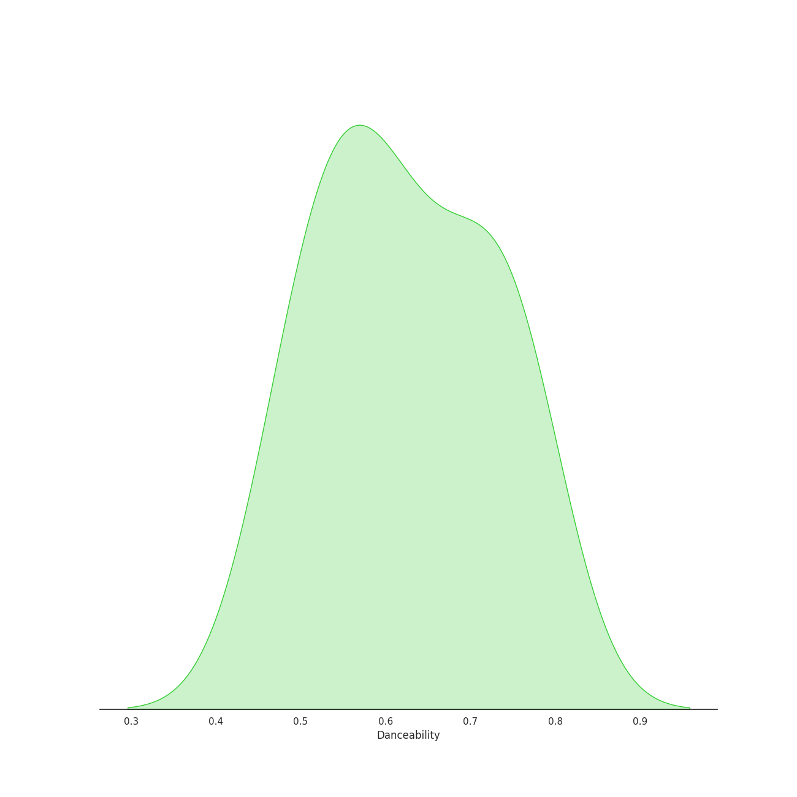
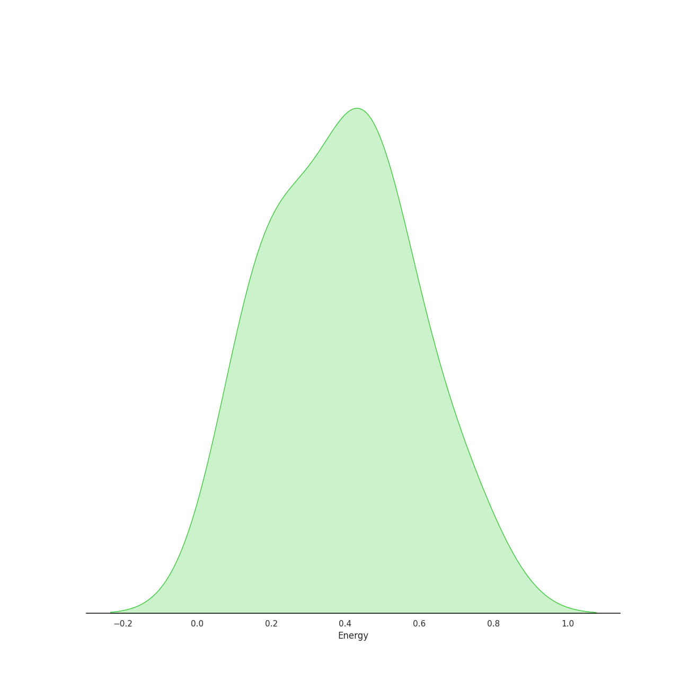
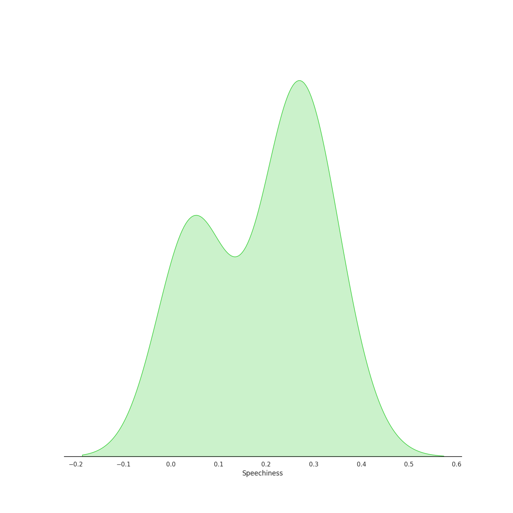
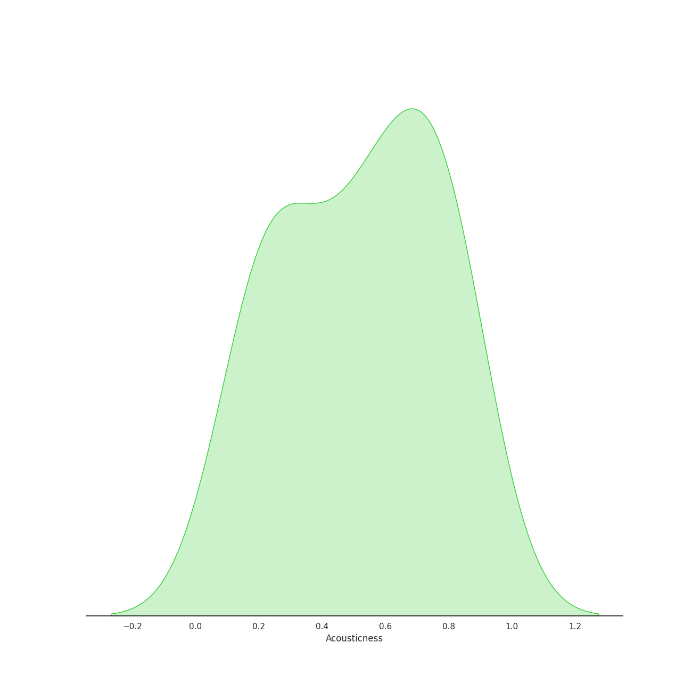
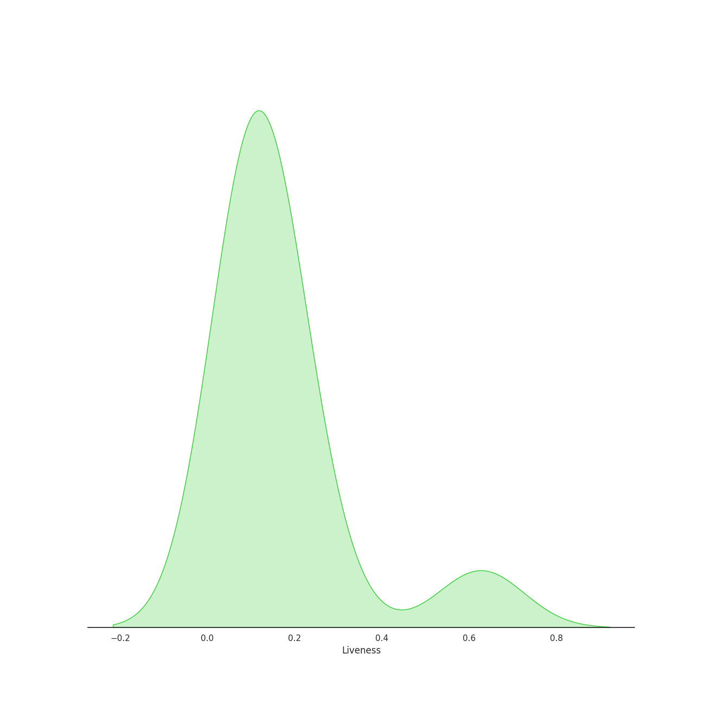
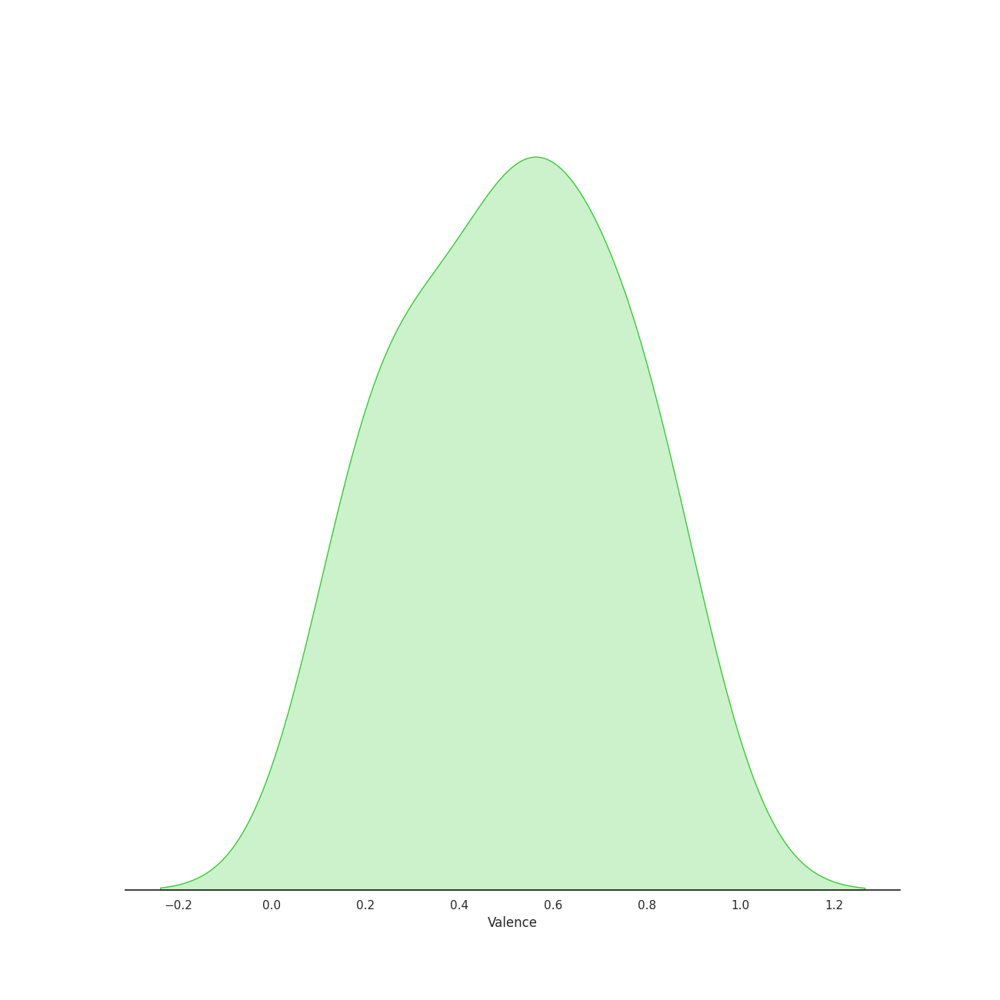
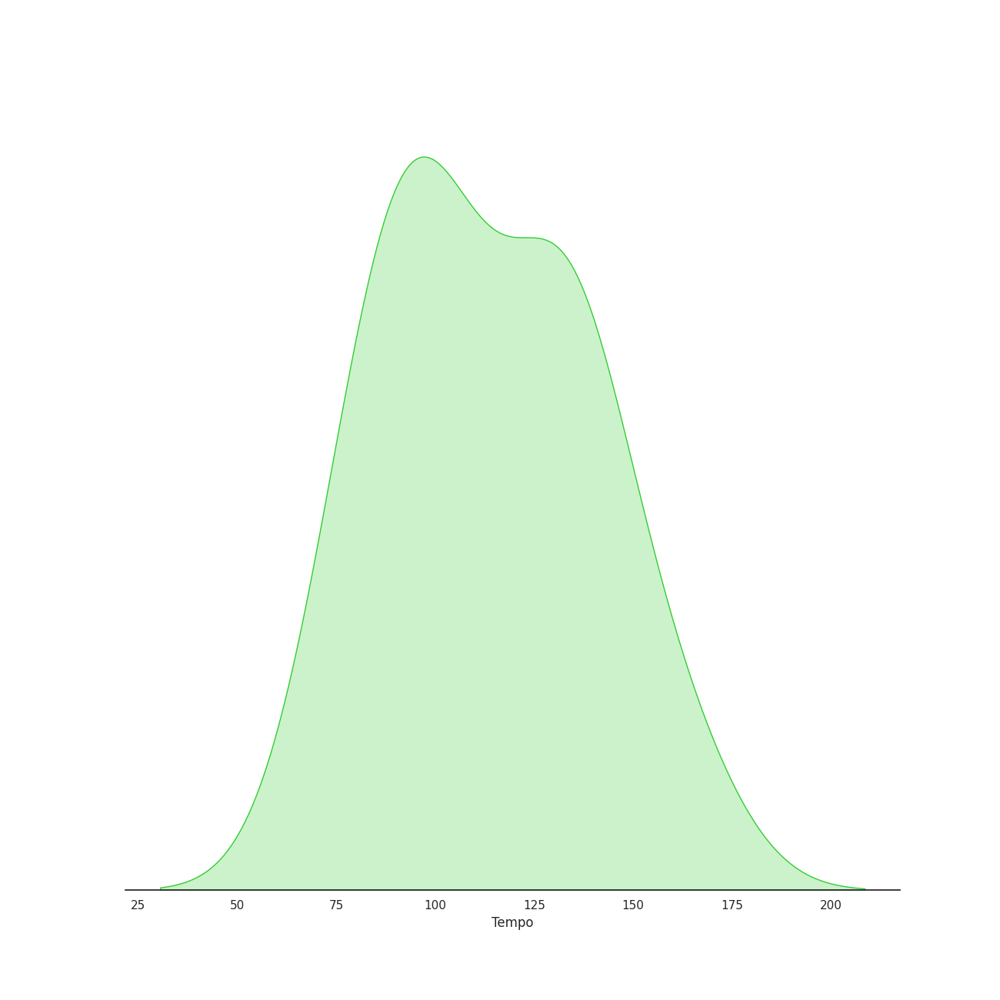

# Audio Features for Phillipa Soo

## Danceability

| 10 most Danceable tracks | 10 least Danceable tracks |
|:---|:---|
| Non-Stop (0.77) | It's Quiet Uptown (0.484) |
| Schuyler Defeated (0.745) | That Would Be Enough (0.499) |
| The Schuyler Sisters (0.74) | Stay Alive - Reprise (0.546) |
| Helpless (0.688) | Take a Break (0.552) |
| Best of Wives and Best of Women (0.647) | Burn (0.582) |
| Alexander Hamilton (0.609) | Alexander Hamilton (0.609) |
| Burn (0.582) | Best of Wives and Best of Women (0.647) |
| Take a Break (0.552) | Helpless (0.688) |
| Stay Alive - Reprise (0.546) | The Schuyler Sisters (0.74) |
| That Would Be Enough (0.499) | Schuyler Defeated (0.745) |

## Energy

| 10 most Energetic tracks | 10 least Energetic tracks |
|:---|:---|
| The Schuyler Sisters (0.727) | Best of Wives and Best of Women (0.115) |
| Schuyler Defeated (0.597) | It's Quiet Uptown (0.187) |
| Helpless (0.491) | That Would Be Enough (0.2) |
| Non-Stop (0.482) | Stay Alive - Reprise (0.246) |
| Alexander Hamilton (0.435) | Take a Break (0.371) |
| Burn (0.428) | Burn (0.428) |
| Take a Break (0.371) | Alexander Hamilton (0.435) |
| Stay Alive - Reprise (0.246) | Non-Stop (0.482) |
| That Would Be Enough (0.2) | Helpless (0.491) |
| It's Quiet Uptown (0.187) | Schuyler Defeated (0.597) |

## Speechiness

| 10 most Speechy tracks | 10 least Speechy tracks |
|:---|:---|
| Non-Stop (0.351) | That Would Be Enough (0.0355) |
| Alexander Hamilton (0.285) | It's Quiet Uptown (0.0423) |
| The Schuyler Sisters (0.278) | Burn (0.0516) |
| Helpless (0.269) | Best of Wives and Best of Women (0.0544) |
| Stay Alive - Reprise (0.26) | Take a Break (0.227) |
| Schuyler Defeated (0.257) | Schuyler Defeated (0.257) |
| Take a Break (0.227) | Stay Alive - Reprise (0.26) |
| Best of Wives and Best of Women (0.0544) | Helpless (0.269) |
| Burn (0.0516) | The Schuyler Sisters (0.278) |
| It's Quiet Uptown (0.0423) | Alexander Hamilton (0.285) |

## Acousticness

| 10 most Acoustic tracks | 10 least Acoustic tracks |
|:---|:---|
| That Would Be Enough (0.819) | The Schuyler Sisters (0.187) |
| It's Quiet Uptown (0.796) | Non-Stop (0.211) |
| Burn (0.752) | Schuyler Defeated (0.236) |
| Best of Wives and Best of Women (0.751) | Helpless (0.334) |
| Take a Break (0.587) | Alexander Hamilton (0.522) |
| Stay Alive - Reprise (0.535) | Stay Alive - Reprise (0.535) |
| Alexander Hamilton (0.522) | Take a Break (0.587) |
| Helpless (0.334) | Best of Wives and Best of Women (0.751) |
| Schuyler Defeated (0.236) | Burn (0.752) |
| Non-Stop (0.211) | It's Quiet Uptown (0.796) |

## Instrumentalness

| 10 most Instrumental tracks | 10 least Instrumental tracks |
|:---|:---|
| Non-Stop (0.0) | Schuyler Defeated (0.0) |
| The Schuyler Sisters (0.0) | Best of Wives and Best of Women (0.0) |
| That Would Be Enough (0.0) | Take a Break (0.0) |
| Helpless (0.0) | Stay Alive - Reprise (0.0) |
| Alexander Hamilton (0.0) | It's Quiet Uptown (0.0) |
| Burn (0.0) | Burn (0.0) |
| It's Quiet Uptown (0.0) | Alexander Hamilton (0.0) |
| Stay Alive - Reprise (0.0) | Helpless (0.0) |
| Take a Break (0.0) | That Would Be Enough (0.0) |
| Best of Wives and Best of Women (0.0) | The Schuyler Sisters (0.0) |

## Liveness

| 10 most Live tracks | 10 least Live tracks |
|:---|:---|
| The Schuyler Sisters (0.627) | It's Quiet Uptown (0.0785) |
| Non-Stop (0.223) | Stay Alive - Reprise (0.0801) |
| Take a Break (0.18) | Best of Wives and Best of Women (0.0858) |
| Schuyler Defeated (0.157) | Helpless (0.0914) |
| Alexander Hamilton (0.118) | Burn (0.102) |
| That Would Be Enough (0.115) | That Would Be Enough (0.115) |
| Burn (0.102) | Alexander Hamilton (0.118) |
| Helpless (0.0914) | Schuyler Defeated (0.157) |
| Best of Wives and Best of Women (0.0858) | Take a Break (0.18) |
| Stay Alive - Reprise (0.0801) | Non-Stop (0.223) |

## Valence

| 10 most Happy tracks | 10 least Happy tracks |
|:---|:---|
| Schuyler Defeated (0.842) | That Would Be Enough (0.185) |
| The Schuyler Sisters (0.792) | It's Quiet Uptown (0.227) |
| Helpless (0.737) | Burn (0.255) |
| Best of Wives and Best of Women (0.597) | Stay Alive - Reprise (0.427) |
| Take a Break (0.587) | Non-Stop (0.441) |
| Alexander Hamilton (0.552) | Alexander Hamilton (0.552) |
| Non-Stop (0.441) | Take a Break (0.587) |
| Stay Alive - Reprise (0.427) | Best of Wives and Best of Women (0.597) |
| Burn (0.255) | Helpless (0.737) |
| It's Quiet Uptown (0.227) | The Schuyler Sisters (0.792) |

## Tempo

| 10 most Fast tracks | 10 least Fast tracks |
|:---|:---|
| Stay Alive - Reprise (160.031) | Helpless (79.009) |
| That Would Be Enough (137.367) | Take a Break (81.548) |
| Alexander Hamilton (131.995) | Non-Stop (91.994) |
| Best of Wives and Best of Women (131.508) | Burn (99.608) |
| It's Quiet Uptown (129.753) | The Schuyler Sisters (101.409) |
| Schuyler Defeated (102.108) | Schuyler Defeated (102.108) |
| The Schuyler Sisters (101.409) | It's Quiet Uptown (129.753) |
| Burn (99.608) | Best of Wives and Best of Women (131.508) |
| Non-Stop (91.994) | Alexander Hamilton (131.995) |
| Take a Break (81.548) | That Would Be Enough (137.367) |
