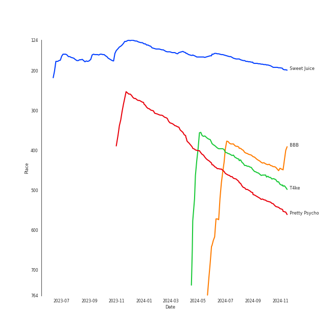
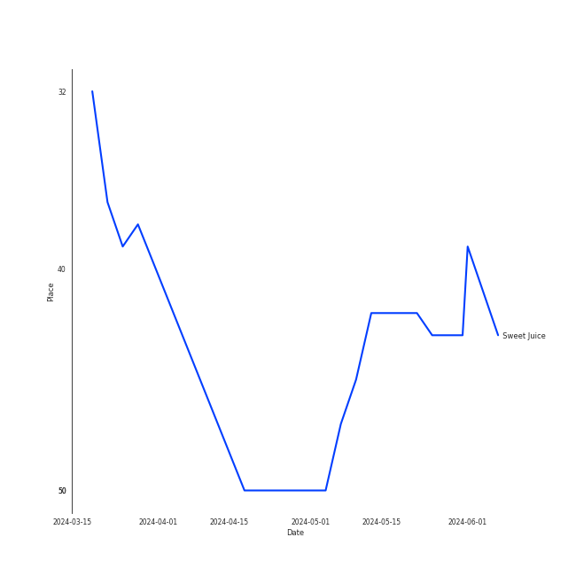

# PURPLE KISS

[See Track Features](audio_features.md)

[See Clusters](clusters/overview.md)

## Relationships

PURPLE KISS:
- has member 채인 (Chaein)
- has member 도시 (Dosie)
- has member 이레 (IREH)
- has member 나고은 (Na, Go-eun)
- has member 박지은 (Park, Jieun)
- has member 수안 (SWAN)
- has member 유키 (Yuki)

## Artist Rank
PURPLE KISS is currently:
- The #10 artist of the last month
- The #40 artist of the last 6 months
- The #40 artist of all time

## Top Tracks

- Sweet Juice is the #40 track of all time

### Top tracks, aggregated

### Top tracks of all time over time

### Top tracks of the last 6 months over time

## Featured on Playlists
| Art | Tracks | Playlist |
|:---|---:|:---|
|  | 11 | [K-Pop](../../playlists/k-pop/overview.md) |
|  | 4 | [Halloween](../../playlists/halloween/overview.md) |
|  | 2 | [K-Pop Favorites](../../playlists/k-pop_favorites/overview.md) |
|  | 2 | [Recent Comebacks](../../playlists/recent_comebacks/overview.md) |
|  | 1 | [Classical Samples](../../playlists/classical_samples/overview.md) |

## Top Albums

| Art | Tracks | 💚 | Album | Release Date | 🔗 |
|:---|---:|---:|:---|:---|:---|
|  | 2 | 2 | INTO VIOLET | 2021-03-15 | [🔗](https://open.spotify.com/album/3CjwKaPAPzaHgivlGFjsp4) |
|  | 2 | 2 | Cabin Fever | 2023-02-15 | [🔗](https://open.spotify.com/album/4uIqXyViDoMKFuuw12kYMO) |
|  | 2 | 2 | BXX | 2024-03-19 | [🔗](https://open.spotify.com/album/3xX7eBfa5HTqDZXepyvjfw) |
|  | 2 | 1 | memeM | 2022-03-29 | [🔗](https://open.spotify.com/album/4nhtnBY8owIQnOsnGQGqW9) |
|  | 1 | 1 | Geekyland | 2022-07-25 | [🔗](https://open.spotify.com/album/7EDCoH5wfSGYdZ7wXCmTF4) |
|  | 1 | 1 | Can We Talk Again | 2021-02-03 | [🔗](https://open.spotify.com/album/7upDgBOqXuwU72JPeBLIzA) |
|  | 1 | 0 | HIDE & SEEK | 2021-09-08 | [🔗](https://open.spotify.com/album/1Oh6STLhW6dxRAkvOUBHl8) |

## Top Record Labels

| Tracks | 💚 | Label |
|---:|---:|:---|
| 11 | 9 | [RBW Inc.](../../labels/rbw_inc_/overview.md) |

## Genres

- [k-pop](../../genres/k-pop/overview.md)

## Credits

### Credits by Type

| Credit Type | Tracks |
|:---|---:|
| Vocal | 2 |

### Member Credits

| | 나고은 (Na, Go-eun) | 수안 (SWAN) | 유키 (Yuki) | 채인 (Chaein) |
|:---|---:|---:|---:|---:|
| Lyricist | 4 | 1 | 7 | 2 |
| Songwriter | 2 | 1 | 0 | 3 |
| Vocal | 1 | 1 | 0 | 1 |
### Production Credits

| Art | Track | Members | Credit Types |
|:---|:---|:---|:---|
|  | Can We Talk Again | 유키 (Yuki), 채인 (Chaein) | Lyricist, Songwriter |
|  | Skip Skip | 유키 (Yuki), 나고은 (Na, Go-eun), 채인 (Chaein) | Lyricist, Songwriter |
|  | Ponzona | 수안 (SWAN), 유키 (Yuki), 나고은 (Na, Go-eun) | Lyricist, Songwriter |
|  | memeM | 유키 (Yuki) | Lyricist |
|  | Pretty Psycho | 유키 (Yuki), 나고은 (Na, Go-eun) | Lyricist |
|  | Sweet Juice | 유키 (Yuki), 나고은 (Na, Go-eun) | Lyricist |
|  | T4ke | 유키 (Yuki), 채인 (Chaein) | Lyricist, Songwriter |

## Top Producers

| Art | Producer | Tracks | Credit Types |
|:---|:---|---:|:---|
| | 유키 (Yuki) | 7 | Lyricist |
| | [강지원 (Kang, Jiwon)](../../producers/강지원_(kang,_jiwon)/overview.md) | 6 | Producer, Arranger, Lyricist, Songwriter |
| | 나고은 (Na, Go-eun) | 4 | Lyricist, Songwriter |
| | 채인 (Chaein) | 3 | Lyricist, Songwriter |
| | [김도훈 (Kim, Do-hoon)](../../producers/김도훈_(kim,_do-hoon)/overview.md) | 3 | Lyricist, Songwriter, Arranger |
| | Davve | 2 | Arranger, Songwriter |
| | 윤영준 (Yun, Yeongjun) | 1 | Arranger |
| | 권석홍 (Kwon, Seok-hong) | 1 | Arranger |
| | LYRE | 1 | Arranger |
| | Annalise Morelli | 1 | Songwriter |

View all

| Art | Producer | Tracks | Credit Types |
|:---|:---|---:|:---|
| | 유상호 (Yoo, Sang-ho) | 1 | Producer |
| | 용배 (Seo, Yong-bae) | 1 | Lyricist, Songwriter |
| | 조씨아저씨 (Mr. Cho) | 1 | Producer |
| | 수안 (SWAN) | 1 | Lyricist, Songwriter |
| | 이후상 (Lee, Hoo-sang) | 1 | Arranger, Lyricist, Songwriter |
| | Maximite | 1 | Producer |
| | Dr.JO | 1 | Lyricist |
| | 이주용 (Lee, Juyong) | 1 | Arranger |
| | Alina Smith | 1 | Arranger, Producer, Songwriter |

## Tracks

| Art | Track | Album | Artists | Label | Score | 💚 | 🔗 |
|:---|:---|:---|:---|:---|---:|:---|:---|
|  | Sweet Juice | Cabin Fever | [PURPLE KISS](overview.md) | [RBW Inc.](../../labels/rbw_inc_) | 2422 | 💚 | [🔗](https://open.spotify.com/track/2th6UWbfVz3hsSDzQAKqy2) |
|  | Pretty Psycho | memeM | [PURPLE KISS](overview.md) | [RBW Inc.](../../labels/rbw_inc_) | 190 | | [🔗](https://open.spotify.com/track/26YMXkyHGrOQQUl2E4upkv) |
|  | Can We Talk Again | Can We Talk Again | [PURPLE KISS](overview.md) | [RBW Inc.](../../labels/rbw_inc_) | 0 | 💚 | [🔗](https://open.spotify.com/track/0zuOKdFHYFIOTyJi0aOIuo) |
|  | Ponzona | INTO VIOLET | [PURPLE KISS](overview.md) | [RBW Inc.](../../labels/rbw_inc_) | 0 | 💚 | [🔗](https://open.spotify.com/track/597wvQ0bqfJgszRg4eDVy1) |
|  | Skip Skip | INTO VIOLET | [PURPLE KISS](overview.md) | [RBW Inc.](../../labels/rbw_inc_) | 0 | 💚 | [🔗](https://open.spotify.com/track/2Zb4ieqfoCB6WP5LO2NmCK) |
|  | Zombie | HIDE & SEEK | [PURPLE KISS](overview.md) | [RBW Inc.](../../labels/rbw_inc_) | 0 | | [🔗](https://open.spotify.com/track/5zTp64MsWOTdAWWXK7zEPK) |
|  | memeM | memeM | [PURPLE KISS](overview.md) | [RBW Inc.](../../labels/rbw_inc_) | 0 | 💚 | [🔗](https://open.spotify.com/track/0qr3qIT7OrhzT33sW1syLI) |
|  | Nerdy | Geekyland | [PURPLE KISS](overview.md) | [RBW Inc.](../../labels/rbw_inc_) | 0 | 💚 | [🔗](https://open.spotify.com/track/6KExHY2Eo0DphK63s2dfYi) |
|  | T4ke | Cabin Fever | [PURPLE KISS](overview.md) | [RBW Inc.](../../labels/rbw_inc_) | 0 | 💚 | [🔗](https://open.spotify.com/track/3hDB8HsTgd3TePDsEulE97) |
|  | BBB | BXX | [PURPLE KISS](overview.md) | [RBW Inc.](../../labels/rbw_inc_) | 0 | 💚 | [🔗](https://open.spotify.com/track/1Xj89xyCM5Edza6AqTpRuB) |

See all tracks

| Art | Track | Album | Artists | Label | Score | 💚 | 🔗 |
|:---|:---|:---|:---|:---|---:|:---|:---|
|  | Heart Attack | BXX | [PURPLE KISS](overview.md) | [RBW Inc.](../../labels/rbw_inc_) | 0 | 💚 | [🔗](https://open.spotify.com/track/2gdZyBJE7aVgwhgh4wPL39) |

