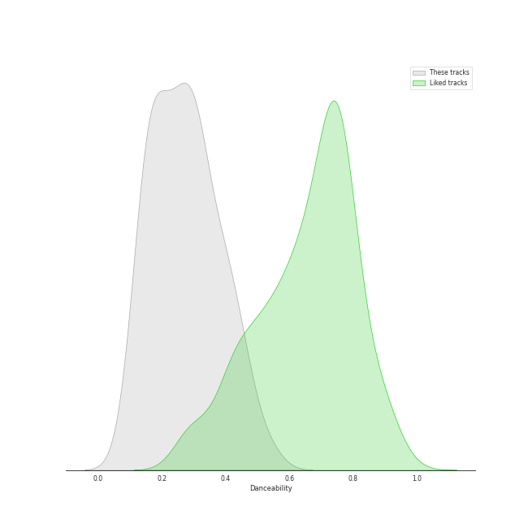
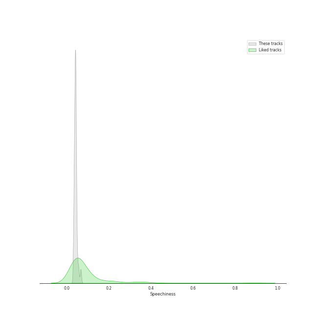
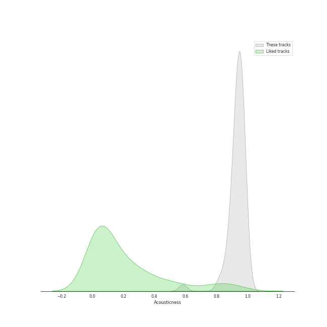
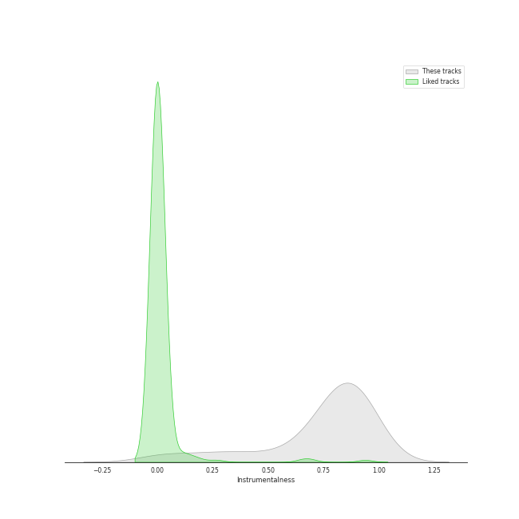
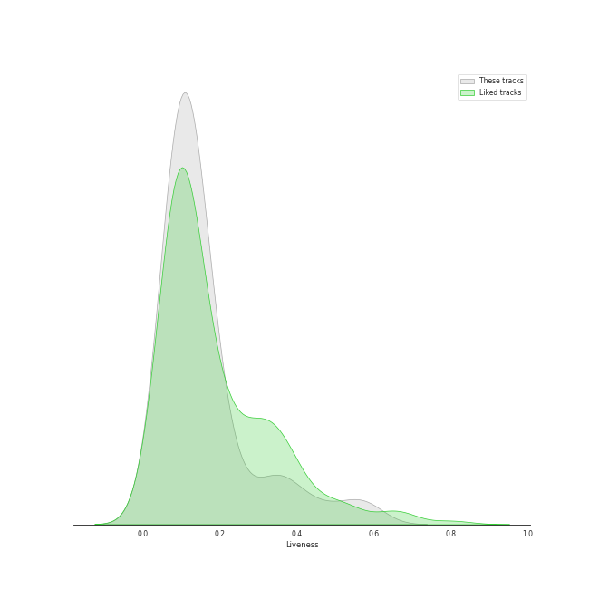
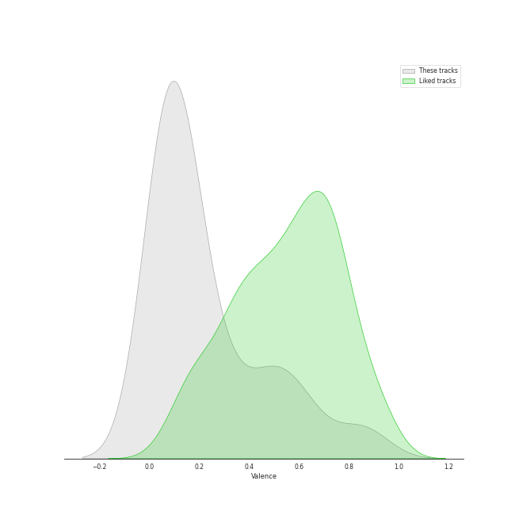
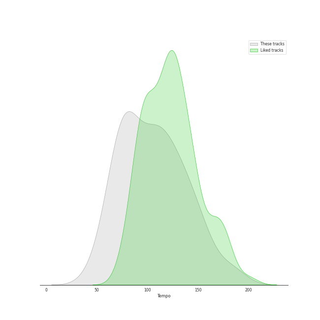

# Track Features for Pyotr Ilyich Tchaikovsky

## Danceability

| ​ | 10 most Danceable tracks | ​​ | 10 least Danceable tracks |
|:---|:---|:---|:---|
|  | Tchaikovsky: Swan Lake, Op. 20, Act I: No. 8, Dance with Goblets (0.534) |  | Tchaikovsky: Swan Lake, Op. 20, Act II: No. 14, Scene. Moderato (0.0958) |
|  | Tchaikovsky: Swan Lake, Op. 20, Act IV: No. 26, Scene. Allegro ma non troppo (0.472) |  | Tchaikovsky: The Nutcracker, Op. 71, Act II: No. 10, The Enchanted Palace of Confiturembourg, the Kingdom of Sweets (0.124) |
|  | Tchaikovsky: The Nutcracker, Op. 71, Act II: No. 12e, Divertissement. Dance of the Reed-Flutes (0.462) |  | Tchaikovsky: The Nutcracker, Op. 71, Act II: No. 12b, Divertissement. Coffee, Arabian Dance (0.13) |
|  | Tchaikovsky: The Nutcracker, Op. 71, Act II: No. 12c, Divertissement. Tea, Chinese Dance (0.451) |  | Tchaikovsky: Swan Lake, Op. 20, Act II: No. 10, Scene. Moderato (0.136) |
|  | Tchaikovsky: The Nutcracker, Op. 71, Act I, Scene 1: No. 2, March (0.444) |  | Tchaikovsky: The Nutcracker, Op. 71, Act II: No. 14a, Pas de deux. Andante maestoso (0.139) |
|  | Tchaikovsky: The Nutcracker, Op. 71: Miniature Overture (0.422) |  | Tchaikovsky: The Nutcracker, Op. 71, Act II: No. 11, Arrival of Clara and the Nutcracker (0.141) |
|  | Tchaikovsky: Swan Lake, Op. 20, Act III: No. 15, Scene. March - Allegro giusto (0.404) |  | Tchaikovsky: Swan Lake, Op. 20, Act II: No. 11, Scene. Allegro moderato - Moderato - Allegro vivo (0.144) |
|  | Tchaikovsky: Swan Lake, Op. 20, Act III: No. 16, Ballabile. Dance of the Guests and the Dwarfs (0.397) |  | Tchaikovsky: The Nutcracker, Op. 71, Act II: No. 13, Waltz of the Flowers (0.149) |
|  | Tchaikovsky: The Nutcracker, Op. 71, Act II: No. 12d, Divertissement. Trepak, Russian Dance (0.395) |  | Tchaikovsky: The Nutcracker, Op. 71, Act I, Scene 1: No. 6, Clara and the Nutcracker (0.164) |
|  | Tchaikovsky: The Nutcracker, Op. 71, Act I, Scene 1: No. 7, The Battle (0.391) |  | Tchaikovsky: Swan Lake, Op. 20, Act IV: No. 28, Scene. Allegro agitato (0.165) |

## Energy

| ​ | 10 most Energetic tracks | ​​ | 10 least Energetic tracks |
|:---|:---|:---|:---|
|  | Tchaikovsky: The Nutcracker, Op. 71, Act II: No. 12d, Divertissement. Trepak, Russian Dance (0.5) |  | Tchaikovsky: The Nutcracker, Op. 71, Act II: No. 12b, Divertissement. Coffee, Arabian Dance (0.00478) |
|  | Tchaikovsky: Swan Lake, Op. 20, Act III: No. 15, Scene. March - Allegro giusto (0.474) |  | Tchaikovsky: Swan Lake, Op. 20, Act IV: No. 25, Entr'acte (0.00606) |
|  | Tchaikovsky: Swan Lake, Op. 20, Act I: No. 8, Dance with Goblets (0.391) |  | Tchaikovsky: Swan Lake, Op. 20, Act I: No. 7, Sujet (0.00979) |
|  | Tchaikovsky: The Nutcracker, Op. 71, Act I, Scene 1: No. 7, The Battle (0.386) |  | Tchaikovsky: Swan Lake, Op. 20, Act IV: No. 27, Dance of the Little Swans (0.0174) |
|  | Tchaikovsky: Swan Lake, Op. 20, Act IV: No. 29, Finale (0.35) |  | Tchaikovsky: The Nutcracker, Op. 71, Act II: No. 14c, Pas de deux. Variation II "Dance of the Sugar Plum Fairy" (0.0205) |
|  | Tchaikovsky: The Nutcracker, Op. 71, Act II: No. 12f, Divertissement. Mother Gigogne and the Clowns (0.348) |  | Tchaikovsky: Swan Lake, Op. 20, Act IV: No. 26, Scene. Allegro ma non troppo (0.0316) |
|  | Tchaikovsky: Swan Lake, Op. 20, Act III: No. 23, Mazurka (0.315) |  | 9 Sacred Pieces, TH 78: No. 1, Cherubic Hymn No. 1 (0.045) |
|  | Tchaikovsky: Swan Lake, Op. 20, Act I: Introduction - No. 1, Scene. Allegro giusto (0.298) |  | Tchaikovsky: The Nutcracker, Op. 71: Miniature Overture (0.0461) |
|  | Tchaikovsky: The Nutcracker, Op. 71, Act II: No. 12a, Divertissement. Chocolate, Spanish Dance (0.294) |  | Tchaikovsky: The Nutcracker, Op. 71, Act II: No. 14b, Pas de deux. Variation I "Tarantella" (0.0473) |
|  | Tchaikovsky: The Nutcracker, Op. 71, Act II: No. 14d, Pas de deux. Coda (0.253) |  | Tchaikovsky: The Nutcracker, Op. 71, Act II: No. 12e, Divertissement. Dance of the Reed-Flutes (0.0508) |

## Speechiness

| ​ | 10 most Speechy tracks | ​​ | 10 least Speechy tracks |
|:---|:---|:---|:---|
|  | Tchaikovsky: Swan Lake, Op. 20, Act III: No. 22, Neapolitan Dance (0.0675) |  | Tchaikovsky: The Nutcracker, Op. 71, Act II: No. 14b, Pas de deux. Variation I "Tarantella" (0.0332) |
|  | Tchaikovsky: The Nutcracker, Op. 71, Act I, Scene 1: No. 7, The Battle (0.0664) |  | Tchaikovsky: The Nutcracker, Op. 71, Act II: No. 12c, Divertissement. Tea, Chinese Dance (0.0338) |
|  | Tchaikovsky: Swan Lake, Op. 20, Act I: No. 3, Scene. Allegro moderato (0.0573) |  | Tchaikovsky: Swan Lake, Op. 20, Act III: No. 18, Scene. Allegro - Allegro giusto (0.034) |
|  | Tchaikovsky: Swan Lake, Op. 20, Act I: No. 5, Pas de deux for Two Merry-Makers (0.0555) |  | Tchaikovsky: Swan Lake, Op. 20, Act I: No. 7, Sujet (0.0343) |
|  | Tchaikovsky: Swan Lake, Op. 20, Act IV: No. 28, Scene. Allegro agitato (0.0523) |  | Tchaikovsky: Swan Lake, Op. 20, Act III: No. 21, Spanish Dance (0.0345) |
|  | Tchaikovsky: The Nutcracker, Op. 71, Act I, Scene 1: No. 3, Children's Galop and Entry of the Parents (0.049) |  | Tchaikovsky: The Nutcracker, Op. 71, Act II: No. 14c, Pas de deux. Variation II "Dance of the Sugar Plum Fairy" (0.0351) |
|  | 9 Sacred Pieces, TH 78: No. 1, Cherubic Hymn No. 1 (0.0486) |  | Tchaikovsky: Swan Lake, Op. 20, Act III: No. 17, Entrance of the Guests and Waltz (0.0352) |
|  | Tchaikovsky: Swan Lake, Op. 20, Act III: No. 16, Ballabile. Dance of the Guests and the Dwarfs (0.0472) |  | Tchaikovsky: Swan Lake, Op. 20, Act I: No. 9, Finale. Andante (0.0353) |
|  | Tchaikovsky: Swan Lake, Op. 20, Act III, Appendix II: No. 20a, Russian Dance (0.0467) |  | Tchaikovsky: Swan Lake, Op. 20, Act II: No. 10, Scene. Moderato (0.0364) |
|  | Tchaikovsky: The Nutcracker, Op. 71, Act II: No. 13, Waltz of the Flowers (0.0462) |  | Tchaikovsky: Swan Lake, Op. 20, Act III: No. 19, Pas de six (0.0374) |

## Acousticness

| ​ | 10 most Acoustic tracks | ​​ | 10 least Acoustic tracks |
|:---|:---|:---|:---|
|  | 9 Sacred Pieces, TH 78: No. 3, Cherubic Hymn No. 3 (0.995) |  | Tchaikovsky: The Nutcracker, Op. 71, Act II: No. 12a, Divertissement. Chocolate, Spanish Dance (0.583) |
|  | 9 Sacred Pieces, TH 78: No. 2, Cherubic Hymn No. 2 (0.993) |  | Tchaikovsky: Swan Lake, Op. 20, Act I: No. 8, Dance with Goblets (0.813) |
|  | 9 Sacred Pieces, TH 78: No. 1, Cherubic Hymn No. 1 (0.992) |  | Tchaikovsky: Swan Lake, Op. 20, Act III: No. 23, Mazurka (0.834) |
|  | Tchaikovsky: Swan Lake, Op. 20, Act IV: No. 27, Dance of the Little Swans (0.987) |  | Tchaikovsky: The Nutcracker, Op. 71, Act II: No. 14d, Pas de deux. Coda (0.864) |
|  | Tchaikovsky: The Nutcracker, Op. 71: Miniature Overture (0.977) |  | Tchaikovsky: The Nutcracker, Op. 71, Act II: No. 12f, Divertissement. Mother Gigogne and the Clowns (0.869) |
|  | Tchaikovsky: The Nutcracker, Op. 71, Act I, Scene 1: No. 2, March (0.977) |  | Tchaikovsky: The Nutcracker, Op. 71, Act II: No. 15, Final Waltz and Apotheosis (0.88) |
|  | Tchaikovsky: Swan Lake, Op. 20, Act I: No. 6, Pas d'action. Andantino, quasi moderato - Allegro (0.974) |  | Tchaikovsky: Swan Lake, Op. 20, Act I: No. 9, Finale. Andante (0.887) |
|  | Tchaikovsky: Swan Lake, Op. 20, Act IV: No. 26, Scene. Allegro ma non troppo (0.973) |  | Tchaikovsky: Swan Lake, Op. 20, Act IV: No. 29, Finale (0.888) |
|  | Tchaikovsky: The Nutcracker, Op. 71, Act I, Scene 1: No. 4, Dancing Scene. Arrival of Drosselmeyer (0.971) |  | Tchaikovsky: Swan Lake, Op. 20, Act III: No. 21, Spanish Dance (0.89) |
|  | Tchaikovsky: Swan Lake, Op. 20, Act III: No. 20, Hungarian Dance "Czárdás" (0.97) |  | Tchaikovsky: The Nutcracker, Op. 71, Act I, Scene 1: No. 3, Children's Galop and Entry of the Parents (0.901) |

## Instrumentalness

| ​ | 10 most Instrumental tracks | ​​ | 10 least Instrumental tracks |
|:---|:---|:---|:---|
|  | Tchaikovsky: Swan Lake, Op. 20, Act IV: No. 26, Scene. Allegro ma non troppo (0.978) |  | 9 Sacred Pieces, TH 78: No. 1, Cherubic Hymn No. 1 (0.00449) |
|  | Tchaikovsky: The Nutcracker, Op. 71, Act II: No. 14a, Pas de deux. Andante maestoso (0.954) |  | 9 Sacred Pieces, TH 78: No. 2, Cherubic Hymn No. 2 (0.00769) |
|  | Tchaikovsky: The Nutcracker, Op. 71, Act II: No. 15, Final Waltz and Apotheosis (0.944) |  | 9 Sacred Pieces, TH 78: No. 3, Cherubic Hymn No. 3 (0.0469) |
|  | Tchaikovsky: The Nutcracker, Op. 71, Act II: No. 12e, Divertissement. Dance of the Reed-Flutes (0.94) |  | Tchaikovsky: The Nutcracker, Op. 71, Act II: No. 12a, Divertissement. Chocolate, Spanish Dance (0.154) |
|  | Tchaikovsky: The Nutcracker, Op. 71, Act I, Scene 1: No. 1, Decoration of the Christmas Tree (0.934) |  | Tchaikovsky: Swan Lake, Op. 20, Act III: No. 21, Spanish Dance (0.213) |
|  | Tchaikovsky: The Nutcracker, Op. 71, Act I, Scene 2: No. 8, The Forest of Fir Trees in Winter. Journey Through the Snow (0.932) |  | Tchaikovsky: Swan Lake, Op. 20, Act III: No. 23, Mazurka (0.282) |
|  | Tchaikovsky: The Nutcracker, Op. 71, Act II: No. 13, Waltz of the Flowers (0.928) |  | Tchaikovsky: The Nutcracker, Op. 71, Act I, Scene 1: No. 3, Children's Galop and Entry of the Parents (0.297) |
|  | Tchaikovsky: Swan Lake, Op. 20, Act III: No. 15, Scene. March - Allegro giusto (0.927) |  | Tchaikovsky: The Nutcracker, Op. 71, Act II: No. 12f, Divertissement. Mother Gigogne and the Clowns (0.376) |
|  | Tchaikovsky: The Nutcracker, Op. 71, Act II: No. 14b, Pas de deux. Variation I "Tarantella" (0.926) |  | Tchaikovsky: The Nutcracker, Op. 71, Act II: No. 12c, Divertissement. Tea, Chinese Dance (0.406) |
|  | Tchaikovsky: The Nutcracker, Op. 71, Act I, Scene 1: No. 7, The Battle (0.924) |  | Tchaikovsky: Swan Lake, Op. 20, Act IV: No. 25, Entr'acte (0.504) |

## Liveness

| ​ | 10 most Live tracks | ​​ | 10 least Live tracks |
|:---|:---|:---|:---|
|  | Tchaikovsky: The Nutcracker, Op. 71, Act I, Scene 1: No. 3, Children's Galop and Entry of the Parents (0.578) |  | Tchaikovsky: The Nutcracker, Op. 71: Miniature Overture (0.0557) |
|  | Tchaikovsky: Swan Lake, Op. 20, Act III: No. 18, Scene. Allegro - Allegro giusto (0.565) |  | 9 Sacred Pieces, TH 78: No. 2, Cherubic Hymn No. 2 (0.0575) |
|  | Tchaikovsky: Swan Lake, Op. 20, Act II: No. 11, Scene. Allegro moderato - Moderato - Allegro vivo (0.486) |  | Tchaikovsky: Swan Lake, Op. 20, Act I: No. 4, Pas de trois (0.0595) |
|  | Tchaikovsky: Swan Lake, Op. 20, Act III, Appendix II: No. 20a, Russian Dance (0.421) |  | 9 Sacred Pieces, TH 78: No. 3, Cherubic Hymn No. 3 (0.0684) |
|  | Tchaikovsky: Swan Lake, Op. 20, Act IV: No. 28, Scene. Allegro agitato (0.373) |  | Tchaikovsky: The Nutcracker, Op. 71, Act II: No. 13, Waltz of the Flowers (0.0703) |
|  | Tchaikovsky: The Nutcracker, Op. 71, Act I, Scene 1: No. 4, Dancing Scene. Arrival of Drosselmeyer (0.353) |  | Tchaikovsky: The Nutcracker, Op. 71, Act I, Scene 1: No. 6, Clara and the Nutcracker (0.0719) |
|  | Tchaikovsky: Swan Lake, Op. 20, Act IV: No. 29, Finale (0.35) |  | Tchaikovsky: Swan Lake, Op. 20, Act II: No. 13, Dances of the Swans (0.0769) |
|  | Tchaikovsky: Swan Lake, Op. 20, Act III: No. 17, Entrance of the Guests and Waltz (0.325) |  | Tchaikovsky: Swan Lake, Op. 20, Act III, Appendix I: Pas de deux (0.077) |
|  | Tchaikovsky: Swan Lake, Op. 20, Act III: No. 24, Scene. Allegro - Valse - Allegro vivo (0.271) |  | Tchaikovsky: Swan Lake, Op. 20, Act III: No. 23, Mazurka (0.0802) |
|  | Tchaikovsky: The Nutcracker, Op. 71, Act I, Scene 1: No. 7, The Battle (0.218) |  | Tchaikovsky: Swan Lake, Op. 20, Act I: No. 9, Finale. Andante (0.0829) |

## Valence

| ​ | 10 most Happy tracks | ​​ | 10 least Happy tracks |
|:---|:---|:---|:---|
|  | Tchaikovsky: The Nutcracker, Op. 71, Act II: No. 12a, Divertissement. Chocolate, Spanish Dance (0.879) |  | Tchaikovsky: The Nutcracker, Op. 71, Act II: No. 12b, Divertissement. Coffee, Arabian Dance (0.037) |
|  | Tchaikovsky: The Nutcracker, Op. 71, Act II: No. 12d, Divertissement. Trepak, Russian Dance (0.851) |  | 9 Sacred Pieces, TH 78: No. 3, Cherubic Hymn No. 3 (0.0372) |
|  | Tchaikovsky: The Nutcracker, Op. 71, Act II: No. 12c, Divertissement. Tea, Chinese Dance (0.832) |  | 9 Sacred Pieces, TH 78: No. 2, Cherubic Hymn No. 2 (0.0373) |
|  | Tchaikovsky: Swan Lake, Op. 20, Act III: No. 22, Neapolitan Dance (0.641) |  | 9 Sacred Pieces, TH 78: No. 1, Cherubic Hymn No. 1 (0.0381) |
|  | Tchaikovsky: The Nutcracker, Op. 71, Act I, Scene 1: No. 3, Children's Galop and Entry of the Parents (0.639) |  | Tchaikovsky: The Nutcracker, Op. 71, Act I, Scene 2: No. 8, The Forest of Fir Trees in Winter. Journey Through the Snow (0.0393) |
|  | Tchaikovsky: The Nutcracker, Op. 71, Act II: No. 12f, Divertissement. Mother Gigogne and the Clowns (0.597) |  | Tchaikovsky: Swan Lake, Op. 20, Act IV: No. 25, Entr'acte (0.0399) |
|  | Tchaikovsky: Swan Lake, Op. 20, Act III: No. 15, Scene. March - Allegro giusto (0.579) |  | Tchaikovsky: Swan Lake, Op. 20, Act IV: No. 26, Scene. Allegro ma non troppo (0.0414) |
|  | Tchaikovsky: The Nutcracker, Op. 71, Act II: No. 14b, Pas de deux. Variation I "Tarantella" (0.524) |  | Tchaikovsky: Swan Lake, Op. 20, Act II: No. 14, Scene. Moderato (0.0416) |
|  | Tchaikovsky: The Nutcracker, Op. 71, Act I, Scene 1: No. 2, March (0.512) |  | Tchaikovsky: The Nutcracker, Op. 71, Act II: No. 14c, Pas de deux. Variation II "Dance of the Sugar Plum Fairy" (0.0463) |
|  | Tchaikovsky: Swan Lake, Op. 20, Act III: No. 21, Spanish Dance (0.498) |  | Tchaikovsky: The Nutcracker, Op. 71, Act I, Scene 1: No. 6, Clara and the Nutcracker (0.0505) |

## Tempo

| ​ | 10 most Fast tracks | ​​ | 10 least Fast tracks |
|:---|:---|:---|:---|
|  | Tchaikovsky: Swan Lake, Op. 20, Act III: No. 23, Mazurka (184.562) |  | Tchaikovsky: The Nutcracker, Op. 71, Act II: No. 13, Waltz of the Flowers (47.362) |
|  | Tchaikovsky: Swan Lake, Op. 20, Act I: No. 7, Sujet (181.794) |  | Tchaikovsky: Swan Lake, Op. 20, Act II: No. 10, Scene. Moderato (58.303) |
|  | Tchaikovsky: Swan Lake, Op. 20, Act III: No. 22, Neapolitan Dance (159.829) |  | Tchaikovsky: The Nutcracker, Op. 71, Act I, Scene 1: No. 3, Children's Galop and Entry of the Parents (62.102) |
|  | Tchaikovsky: The Nutcracker, Op. 71, Act II: No. 12d, Divertissement. Trepak, Russian Dance (157.195) |  | Tchaikovsky: Swan Lake, Op. 20, Act I: No. 6, Pas d'action. Andantino, quasi moderato - Allegro (62.261) |
|  | Tchaikovsky: Swan Lake, Op. 20, Act III, Appendix I: Pas de deux (152.712) |  | Tchaikovsky: Swan Lake, Op. 20, Act I: No. 3, Scene. Allegro moderato (65.136) |
|  | Tchaikovsky: The Nutcracker, Op. 71, Act I, Scene 1: No. 2, March (150.319) |  | Tchaikovsky: Swan Lake, Op. 20, Act II: No. 11, Scene. Allegro moderato - Moderato - Allegro vivo (68.297) |
|  | Tchaikovsky: Swan Lake, Op. 20, Act III: No. 15, Scene. March - Allegro giusto (148.003) |  | Tchaikovsky: Swan Lake, Op. 20, Act III: No. 24, Scene. Allegro - Valse - Allegro vivo (69.454) |
|  | Tchaikovsky: The Nutcracker, Op. 71, Act I, Scene 1: No. 4, Dancing Scene. Arrival of Drosselmeyer (145.487) |  | Tchaikovsky: The Nutcracker, Op. 71, Act I, Scene 1: No. 7, The Battle (72.131) |
|  | Tchaikovsky: The Nutcracker, Op. 71, Act II: No. 14a, Pas de deux. Andante maestoso (142.536) |  | Tchaikovsky: The Nutcracker, Op. 71, Act II: No. 11, Arrival of Clara and the Nutcracker (72.973) |
|  | 9 Sacred Pieces, TH 78: No. 2, Cherubic Hymn No. 2 (135.948) |  | Tchaikovsky: Swan Lake, Op. 20, Act III, Appendix II: No. 20a, Russian Dance (74.356) |
