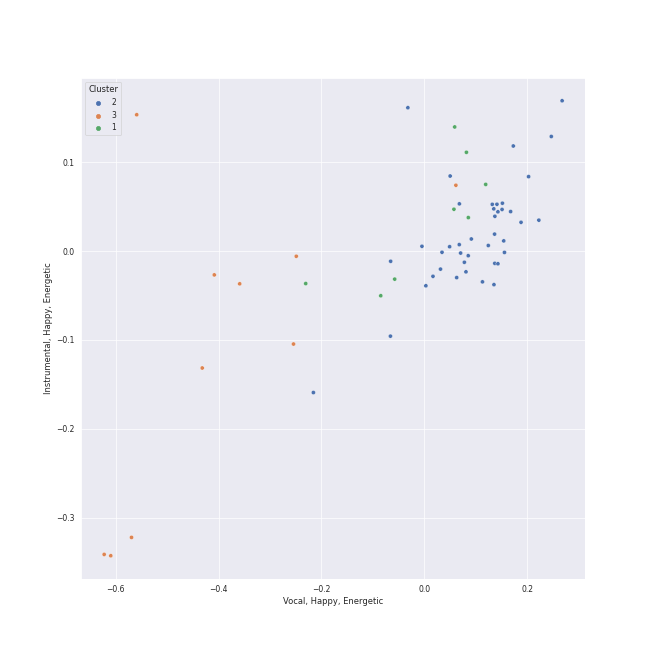

# Clusters in Pyotr Ilyich Tchaikovsky

## Cluster #1

8 tracks

| Art | Track | Album | Artists | Label | Rank | 💚 | 🔗 |
|:---|:---|:---|:---|:---|---:|:---|:---|
|  | Tchaikovsky: The Nutcracker, Op. 71, Act I, Scene 1: No. 4, Dancing Scene. Arrival of Drosselmeyer | Tchaikovsky: The Nutcracker | [Pyotr Ilyich Tchaikovsky](../../overview.md), Sir Simon Rattle, [Berliner Philharmoniker](../../../berliner_philharmoniker/overview.md) | [Warner Classics](../../../../labels/warner_classics) | 954 | | [🔗](https://open.spotify.com/track/2NodH0sMaxRFSWePxkuutP) |
|  | Tchaikovsky: Swan Lake, Op. 20, Act 3, Appendix II: No. 20a, Russian Dance | Tchaikovsky: Swan Lake | [Pyotr Ilyich Tchaikovsky](../../overview.md), André Previn, [London Symphony Orchestra](../../../london_symphony_orchestra/overview.md) | [Warner Classics](../../../../labels/warner_classics) | 954 | | [🔗](https://open.spotify.com/track/0H9IxK78CYvsvIWa3fNpdS) |
|  | Tchaikovsky: Swan Lake, Op. 20, Act 3: No. 17, Entrance of the Guests and Waltz | Tchaikovsky: Swan Lake | [Pyotr Ilyich Tchaikovsky](../../overview.md), André Previn, [London Symphony Orchestra](../../../london_symphony_orchestra/overview.md) | [Warner Classics](../../../../labels/warner_classics) | 954 | | [🔗](https://open.spotify.com/track/1RiQJx6VNLVG2SLbyiN6tK) |
|  | Tchaikovsky: Swan Lake, Op. 20, Act 3: No. 18, Scene. Allegro - Allegro giusto | Tchaikovsky: Swan Lake | [Pyotr Ilyich Tchaikovsky](../../overview.md), André Previn, [London Symphony Orchestra](../../../london_symphony_orchestra/overview.md) | [Warner Classics](../../../../labels/warner_classics) | 954 | | [🔗](https://open.spotify.com/track/2YzKk2NMadveUJ5gSMmo5W) |
|  | Tchaikovsky: Swan Lake, Op. 20, Act 2: No. 11, Scene. Allegro moderato - Moderato - Allegro vivo | Tchaikovsky: Swan Lake | [Pyotr Ilyich Tchaikovsky](../../overview.md), André Previn, [London Symphony Orchestra](../../../london_symphony_orchestra/overview.md) | [Warner Classics](../../../../labels/warner_classics) | 954 | | [🔗](https://open.spotify.com/track/5ItPxeVnRy31PwbheRAZyw) |
|  | Tchaikovsky: Swan Lake, Op. 20, Act 4: No. 28, Scene. Allegro agitato | Tchaikovsky: Swan Lake | [Pyotr Ilyich Tchaikovsky](../../overview.md), André Previn, [London Symphony Orchestra](../../../london_symphony_orchestra/overview.md) | [Warner Classics](../../../../labels/warner_classics) | 954 | | [🔗](https://open.spotify.com/track/5jg3xtvH1ZkLO2XtaefaSF) |
|  | Tchaikovsky: Swan Lake, Op. 20, Act 4: No. 29, Finale | Tchaikovsky: Swan Lake | [Pyotr Ilyich Tchaikovsky](../../overview.md), André Previn, [London Symphony Orchestra](../../../london_symphony_orchestra/overview.md) | [Warner Classics](../../../../labels/warner_classics) | 954 | | [🔗](https://open.spotify.com/track/5nYUMQDawD0zfqMtqXq8Ds) |
|  | Tchaikovsky: Swan Lake, Op. 20, Act 3: No. 24, Scene. Allegro - Valse - Allegro vivo | Tchaikovsky: Swan Lake | [Pyotr Ilyich Tchaikovsky](../../overview.md), André Previn, [London Symphony Orchestra](../../../london_symphony_orchestra/overview.md) | [Warner Classics](../../../../labels/warner_classics) | 954 | | [🔗](https://open.spotify.com/track/6kmeyBsHTsgvNfng8D3r1d) |
## Cluster #2

41 tracks

| Art | Track | Album | Artists | Label | Rank | 💚 | 🔗 |
|:---|:---|:---|:---|:---|---:|:---|:---|
|  | Tchaikovsky: The Nutcracker, Op. 71, Act I, Scene 1: No. 1, Decoration of the Christmas Tree | Tchaikovsky: The Nutcracker | [Pyotr Ilyich Tchaikovsky](../../overview.md), Sir Simon Rattle, [Berliner Philharmoniker](../../../berliner_philharmoniker/overview.md) | [Warner Classics](../../../../labels/warner_classics) | 954 | | [🔗](https://open.spotify.com/track/7hVsNjrvtfXZlzxW5vxsAi) |
|  | Swan Lake Suite, Op. 20a: II. Waltz | Mussorgsky: Pictures At An Exhibition | [Pyotr Ilyich Tchaikovsky](../../overview.md), Wiener Philharmoniker, Gustavo Dudamel | [Deutsche Grammophon (DG)](../../../../labels/deutsche_grammophon_(dg)) | 954 | | [🔗](https://open.spotify.com/track/0NOiSayyUFYnLllkTdFa1k) |
|  | Tchaikovsky: Swan Lake, Op. 20, Act 1: No. 9, Finale. Andante | Tchaikovsky: Swan Lake | [Pyotr Ilyich Tchaikovsky](../../overview.md), André Previn, [London Symphony Orchestra](../../../london_symphony_orchestra/overview.md) | [Warner Classics](../../../../labels/warner_classics) | 954 | | [🔗](https://open.spotify.com/track/30zjefBZWdYaliUSutB6xZ) |
|  | Tchaikovsky: Swan Lake, Op. 20, Act 1: No. 4, Pas de trois | Tchaikovsky: Swan Lake | [Pyotr Ilyich Tchaikovsky](../../overview.md), André Previn, [London Symphony Orchestra](../../../london_symphony_orchestra/overview.md) | [Warner Classics](../../../../labels/warner_classics) | 954 | | [🔗](https://open.spotify.com/track/3lE4dnrzG0FQxg67ZOl9rx) |
|  | Tchaikovsky: Swan Lake, Op. 20, Act 2: No. 12, Scene. Allegro - Moderato assai quasi andante | Tchaikovsky: Swan Lake | [Pyotr Ilyich Tchaikovsky](../../overview.md), André Previn, [London Symphony Orchestra](../../../london_symphony_orchestra/overview.md) | [Warner Classics](../../../../labels/warner_classics) | 954 | | [🔗](https://open.spotify.com/track/4MK0IoF2M5oUMvOrguhyYF) |
|  | Tchaikovsky: Swan Lake, Op. 20, Act 4: No. 27, Dance of the Little Swans | Tchaikovsky: Swan Lake | [Pyotr Ilyich Tchaikovsky](../../overview.md), André Previn, [London Symphony Orchestra](../../../london_symphony_orchestra/overview.md) | [Warner Classics](../../../../labels/warner_classics) | 954 | | [🔗](https://open.spotify.com/track/4Qu4tyMIENrOgUSGGbJhb4) |
|  | Tchaikovsky: Swan Lake, Op. 20, Act 3: No. 19, Pas de six | Tchaikovsky: Swan Lake | [Pyotr Ilyich Tchaikovsky](../../overview.md), André Previn, [London Symphony Orchestra](../../../london_symphony_orchestra/overview.md) | [Warner Classics](../../../../labels/warner_classics) | 954 | | [🔗](https://open.spotify.com/track/5BgU68GB0DoFSxkwuIsLU2) |
|  | Tchaikovsky: Swan Lake, Op. 20, Act 1: No. 6, Pas d'action. Andantino, quasi moderato - Allegro | Tchaikovsky: Swan Lake | [Pyotr Ilyich Tchaikovsky](../../overview.md), André Previn, [London Symphony Orchestra](../../../london_symphony_orchestra/overview.md) | [Warner Classics](../../../../labels/warner_classics) | 954 | | [🔗](https://open.spotify.com/track/6DlYVW2A5tBGwyrVYQnGsO) |
|  | Tchaikovsky: Swan Lake, Op. 20, Act 3: No. 20, Hungarian Dance "Czárdás" | Tchaikovsky: Swan Lake | [Pyotr Ilyich Tchaikovsky](../../overview.md), André Previn, [London Symphony Orchestra](../../../london_symphony_orchestra/overview.md) | [Warner Classics](../../../../labels/warner_classics) | 954 | | [🔗](https://open.spotify.com/track/6YbcqXNj8MEclUKVeicLYU) |
|  | Tchaikovsky: Swan Lake, Op. 20, Act 1: No. 2, Waltz | Tchaikovsky: Swan Lake | [Pyotr Ilyich Tchaikovsky](../../overview.md), André Previn, [London Symphony Orchestra](../../../london_symphony_orchestra/overview.md) | [Warner Classics](../../../../labels/warner_classics) | 954 | | [🔗](https://open.spotify.com/track/7gwqbiFgNU1VddAK2XO5Wr) |
## Cluster #3

10 tracks

| Art | Track | Album | Artists | Label | Rank | 💚 | 🔗 |
|:---|:---|:---|:---|:---|---:|:---|:---|
|  | Tchaikovsky: The Nutcracker, Op. 71, Act II: No. 12a, Divertissement. Chocolate, Spanish Dance | Tchaikovsky: The Nutcracker | [Pyotr Ilyich Tchaikovsky](../../overview.md), Sir Simon Rattle, [Berliner Philharmoniker](../../../berliner_philharmoniker/overview.md) | [Warner Classics](../../../../labels/warner_classics) | 954 | | [🔗](https://open.spotify.com/track/0W5hxw5mvLIVZu1QIw7IpP) |
|  | Tchaikovsky: The Nutcracker, Op. 71, Act II: No. 12f, Divertissement. Mother Gigogne and the Clowns | Tchaikovsky: The Nutcracker | [Pyotr Ilyich Tchaikovsky](../../overview.md), Sir Simon Rattle, [Berliner Philharmoniker](../../../berliner_philharmoniker/overview.md) | [Warner Classics](../../../../labels/warner_classics) | 954 | | [🔗](https://open.spotify.com/track/4L9KpsmAbyhXOZZkSybfaU) |
|  | Tchaikovsky: The Nutcracker, Op. 71, Act II: No. 12d, Divertissement. Trepak, Russian Dance | Tchaikovsky: The Nutcracker | [Pyotr Ilyich Tchaikovsky](../../overview.md), Sir Simon Rattle, [Berliner Philharmoniker](../../../berliner_philharmoniker/overview.md) | [Warner Classics](../../../../labels/warner_classics) | 954 | | [🔗](https://open.spotify.com/track/6kHWawEbq5Vcyp8nSHhGjs) |
|  | Tchaikovsky: The Nutcracker, Op. 71, Act I, Scene 1: No. 3, Children's Galop and Entry of the Parents | Tchaikovsky: The Nutcracker | [Pyotr Ilyich Tchaikovsky](../../overview.md), Sir Simon Rattle, [Berliner Philharmoniker](../../../berliner_philharmoniker/overview.md) | [Warner Classics](../../../../labels/warner_classics) | 954 | | [🔗](https://open.spotify.com/track/6yTPBtEggdlBgGEUL94sn1) |
|  | Tchaikovsky: The Nutcracker, Op. 71, Act II: No. 12c, Divertissement. Tea, Chinese Dance | Tchaikovsky: The Nutcracker | [Pyotr Ilyich Tchaikovsky](../../overview.md), Sir Simon Rattle, [Berliner Philharmoniker](../../../berliner_philharmoniker/overview.md) | [Warner Classics](../../../../labels/warner_classics) | 954 | | [🔗](https://open.spotify.com/track/7o5DCsdl4eIqusst2pVoKX) |
|  | Tchaikovsky: Swan Lake, Op. 20, Act 3: No. 23, Mazurka | Tchaikovsky: Swan Lake | [Pyotr Ilyich Tchaikovsky](../../overview.md), André Previn, [London Symphony Orchestra](../../../london_symphony_orchestra/overview.md) | [Warner Classics](../../../../labels/warner_classics) | 954 | | [🔗](https://open.spotify.com/track/2yf6Hbs6YR3o1iEtOxr91R) |
|  | Tchaikovsky: Swan Lake, Op. 20, Act 3: No. 21, Spanish Dance | Tchaikovsky: Swan Lake | [Pyotr Ilyich Tchaikovsky](../../overview.md), André Previn, [London Symphony Orchestra](../../../london_symphony_orchestra/overview.md) | [Warner Classics](../../../../labels/warner_classics) | 954 | | [🔗](https://open.spotify.com/track/3Vulgn0kOld0a561mg7yt4) |
|  | 9 Sacred Pieces, TH 78: No. 2, Cherubic Hymn No. 2 | Tchaikovsky: Sacred Choral Music | [Pyotr Ilyich Tchaikovsky](../../overview.md), NDR Chor, Philipp Ahmann | Carus | 954 | | [🔗](https://open.spotify.com/track/1uDDH4TncZQxOCYl9TjHKh) |
|  | 9 Sacred Pieces, TH 78: No. 3, Cherubic Hymn No. 3 | Tchaikovsky: Sacred Choral Music | [Pyotr Ilyich Tchaikovsky](../../overview.md), NDR Chor, Philipp Ahmann | Carus | 954 | | [🔗](https://open.spotify.com/track/5cuTdpoXIWieDK848fuNDW) |
|  | 9 Sacred Pieces, TH 78: No. 1, Cherubic Hymn No. 1 | Tchaikovsky: Sacred Choral Music | [Pyotr Ilyich Tchaikovsky](../../overview.md), NDR Chor, Philipp Ahmann | Carus | 954 | | [🔗](https://open.spotify.com/track/7E4KpvGnw4eD55VgmdMdco) |