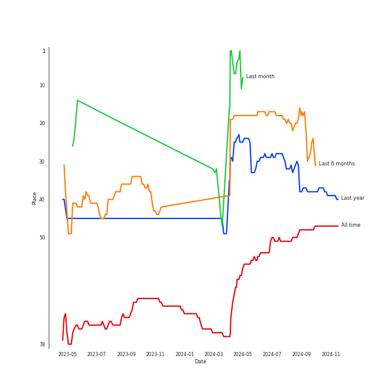

# Queen

[See Track Features](audio_features.md)

[See Clusters](clusters/overview.md)

## Relationships

Queen:
- was formerly known as Smile
- has member Doug Bogie
- has member John Deacon
- has member Mike Grose
- has member Brian May
- has member Freddie Mercury
- has member Barry Mitchell
- has member Roger Taylor

## Artist Rank
Queen is currently:
- The #33 artist of the last 6 months

## Top Tracks

### Top tracks of the last month over time

## Featured on Playlists
| Art | Tracks | Playlist |
|:---|---:|:---|
|  | 15 | [Classic Rock](../../playlists/classic_rock/overview.md) |
|  | 5 | [Summer](../../playlists/summer/overview.md) |
|  | 2 | [Karaoke](../../playlists/karaoke/overview.md) |
|  | 1 | [K-Pop-Adjacent](../../playlists/k_pop_adjacent/overview.md) |
## Top Albums

| Art | Tracks | 💚 | Album | Release Date | 🔗 |
|:---|---:|---:|:---|:---|:---|
|  | 3 | 3 | The Game (Deluxe Remastered Version) | 1980-06-27 | [🔗](https://open.spotify.com/album/6wPXUmYJ9mOWrKlLzZ5cCa) |
|  | 2 | 2 | News Of The World (Deluxe Remastered Version) | 1977-10-28 | [🔗](https://open.spotify.com/album/6Di4m5k1BtMJ0R44bWNutu) |
|  | 2 | 2 | Jazz (Deluxe Remastered Version) | 1978-11-10 | [🔗](https://open.spotify.com/album/21HMAUrbbYSj9NiPPlGumy) |
|  | 2 | 1 | Innuendo | 1991-02-04 | [🔗](https://open.spotify.com/album/5yAM3CcaXF6DPRJW3oL6Ya) |
|  | 2 | 1 | A Night At The Opera | 1975-11-21 | [🔗](https://open.spotify.com/album/3KCJzwKOdBxDu6TKaFPqM9) |
|  | 2 | 1 | A Day At The Races | 1976-12-10 | [🔗](https://open.spotify.com/album/3f45rzbU4dYQBTV9v5RFBB) |
|  | 1 | 1 | Sheer Heart Attack | 1974-11-08 | [🔗](https://open.spotify.com/album/4yO8TpSaJtUKkkjmsA4VXf) |
|  | 1 | 1 | A Night At The Opera (Deluxe Remastered Version) | 1975-11-21 | [🔗](https://open.spotify.com/album/6X9k3hSsvQck2OfKYdBbXr) |
|  | 1 | 0 | The Works | 1984-02-27 | [🔗](https://open.spotify.com/album/0FbnXAGmgmWBmNthZSgm43) |
|  | 1 | 0 | Jazz | 1978-11-10 | [🔗](https://open.spotify.com/album/5X3rA8To5GDOeIWdQyMEcE) |

See all albums

| Art | Tracks | 💚 | Album | Release Date | 🔗 |
|:---|---:|---:|:---|:---|:---|
|  | 1 | 0 | A Kind Of Magic | 1986-06-02 | [🔗](https://open.spotify.com/album/34xBXeJgmQrn1wQvhyVCsw) |

## Top Record Labels

| Tracks | 💚 | Label |
|---:|---:|:---|
| 18 | 12 | [Hollywood Records](../../labels/hollywood_records/overview.md) |

## Genres

- [classic rock](../../genres/classic_rock)
- glam rock
- [rock](../../genres/rock)

## Tracks

| Art | Track | Album | Artists | Label | 💚 | 🔗 |
|:---|:---|:---|:---|:---|:---|:---|
|  | Killer Queen | Sheer Heart Attack | [Queen](overview.md) | [Hollywood Records](../../labels/hollywood_records) | 💚 | [🔗](https://open.spotify.com/track/1KPMTL3BRLBWrNY8fveVy6) |
|  | Bohemian Rhapsody | A Night At The Opera | [Queen](overview.md) | [Hollywood Records](../../labels/hollywood_records) | | [🔗](https://open.spotify.com/track/6fPm2XMi51l5GCEp19HscL) |
|  | You're My Best Friend | A Night At The Opera | [Queen](overview.md) | [Hollywood Records](../../labels/hollywood_records) | 💚 | [🔗](https://open.spotify.com/track/48BA17CGTzcm85ULSTg5AO) |
|  | Bohemian Rhapsody - Remastered 2011 | A Night At The Opera (Deluxe Remastered Version) | [Queen](overview.md) | [Hollywood Records](../../labels/hollywood_records) | 💚 | [🔗](https://open.spotify.com/track/7tFiyTwD0nx5a1eklYtX2J) |
|  | Good Old Fashioned Lover Boy | A Day At The Races | [Queen](overview.md) | [Hollywood Records](../../labels/hollywood_records) | | [🔗](https://open.spotify.com/track/3e9w80AUq0mT9Nrq471kLx) |
|  | Somebody To Love | A Day At The Races | [Queen](overview.md) | [Hollywood Records](../../labels/hollywood_records) | 💚 | [🔗](https://open.spotify.com/track/79M91zIoaIrm073sACpOtr) |
|  | We Are The Champions - Remastered 2011 | News Of The World (Deluxe Remastered Version) | [Queen](overview.md) | [Hollywood Records](../../labels/hollywood_records) | 💚 | [🔗](https://open.spotify.com/track/7ccI9cStQbQdystvc6TvxD) |
|  | We Will Rock You - Remastered 2011 | News Of The World (Deluxe Remastered Version) | [Queen](overview.md) | [Hollywood Records](../../labels/hollywood_records) | 💚 | [🔗](https://open.spotify.com/track/54flyrjcdnQdco7300avMJ) |
|  | Don't Stop Me Now | Jazz | [Queen](overview.md) | [Hollywood Records](../../labels/hollywood_records) | | [🔗](https://open.spotify.com/track/43DHLzDkncpby82Po5jlOZ) |
|  | Don't Stop Me Now - Remastered 2011 | Jazz (Deluxe Remastered Version) | [Queen](overview.md) | [Hollywood Records](../../labels/hollywood_records) | 💚 | [🔗](https://open.spotify.com/track/7hQJA50XrCWABAu5v6QZ4i) |

See all tracks

| Art | Track | Album | Artists | Label | 💚 | 🔗 |
|:---|:---|:---|:---|:---|:---|:---|
|  | Fat Bottomed Girls - Remastered 2011 | Jazz (Deluxe Remastered Version) | [Queen](overview.md) | [Hollywood Records](../../labels/hollywood_records) | 💚 | [🔗](https://open.spotify.com/track/4igIYHF3B5VBxEafHauVo3) |
|  | Another One Bites The Dust - Remastered 2011 | The Game (Deluxe Remastered Version) | [Queen](overview.md) | [Hollywood Records](../../labels/hollywood_records) | 💚 | [🔗](https://open.spotify.com/track/57JVGBtBLCfHw2muk5416J) |
|  | Crazy Little Thing Called Love - Remastered 2011 | The Game (Deluxe Remastered Version) | [Queen](overview.md) | [Hollywood Records](../../labels/hollywood_records) | 💚 | [🔗](https://open.spotify.com/track/35ItUJlMtjOQW3SSiTCrrw) |
|  | Save Me - Remastered 2011 | The Game (Deluxe Remastered Version) | [Queen](overview.md) | [Hollywood Records](../../labels/hollywood_records) | 💚 | [🔗](https://open.spotify.com/track/2mGEqJahn3CSyCG1BTEqMs) |
|  | I Want To Break Free | The Works | [Queen](overview.md) | [Hollywood Records](../../labels/hollywood_records) | | [🔗](https://open.spotify.com/track/1IVZX29ZuEXng3ChRnp3tL) |
|  | A Kind Of Magic | A Kind Of Magic | [Queen](overview.md) | [Hollywood Records](../../labels/hollywood_records) | | [🔗](https://open.spotify.com/track/74QzobuYWH5BHMTrW9X7Yu) |
|  | Innuendo | Innuendo | [Queen](overview.md) | [Hollywood Records](../../labels/hollywood_records) | 💚 | [🔗](https://open.spotify.com/track/1dG4lTOVFu8RkSzybolp7o) |
|  | The Show Must Go On | Innuendo | [Queen](overview.md) | [Hollywood Records](../../labels/hollywood_records) | | [🔗](https://open.spotify.com/track/3m86qx7aIeqFcYcQ1UXUvP) |

