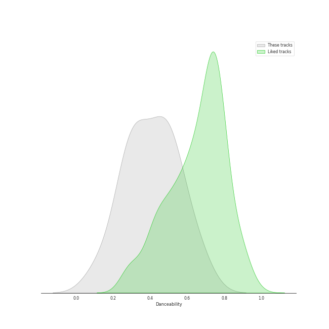
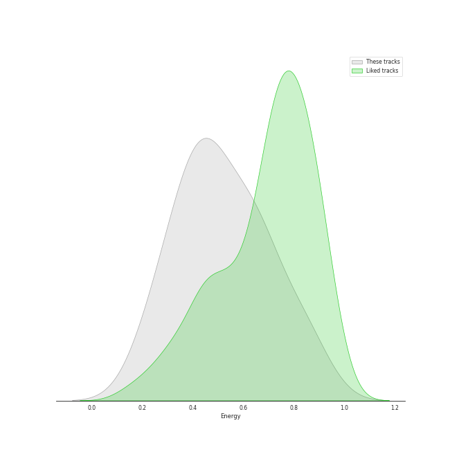
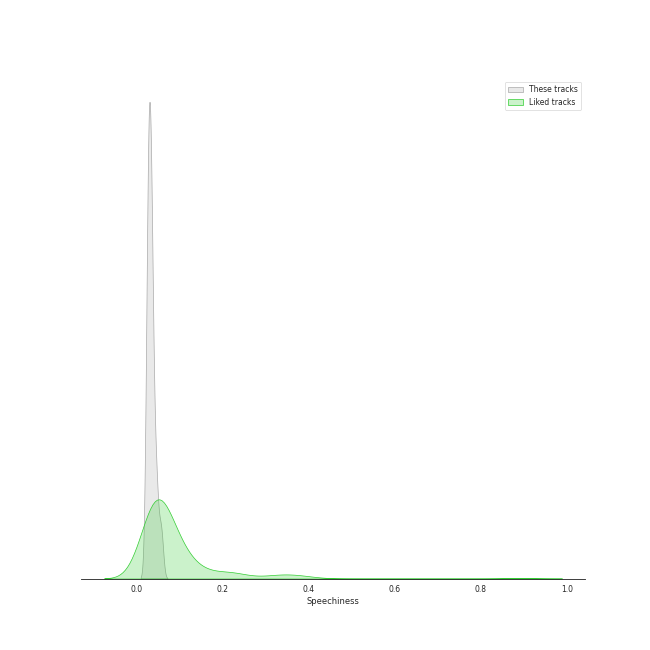
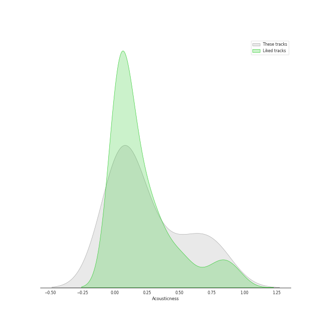
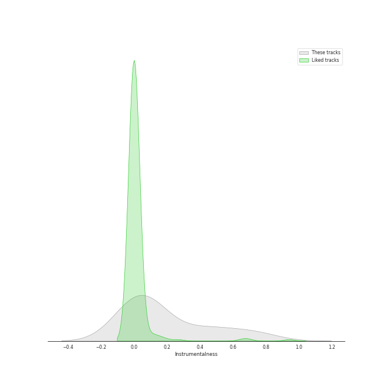
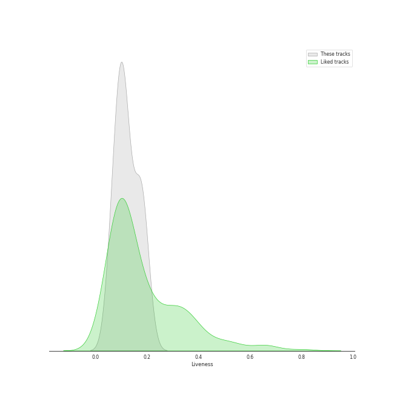
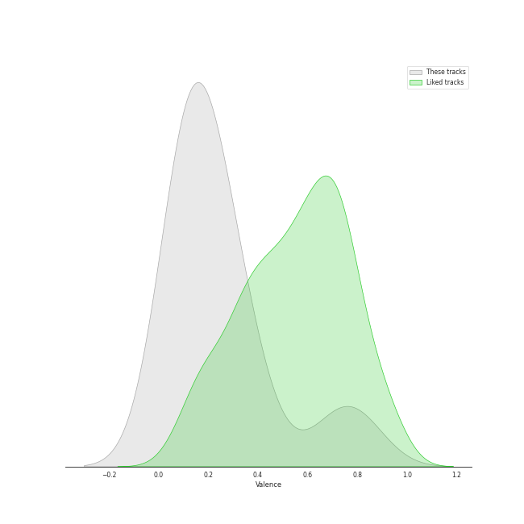
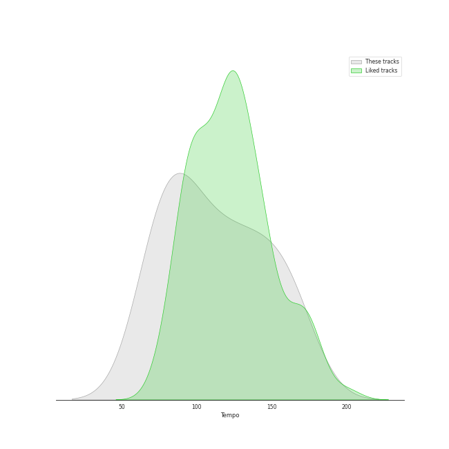

# Track Features for Radiohead

## Danceability

| ​ | 10 most Danceable tracks | ​​ | 10 least Danceable tracks |
|:---|:---|:---|:---|
|  | All I Need (0.67) |  | Pyramid Song (0.127) |
|  | There, There (0.614) |  | Paranoid Android (0.251) |
|  | Weird Fishes/ Arpeggi (0.531) |  | No Surprises (0.255) |
|  | Reckoner (0.523) |  | Exit Music (For A Film) (0.293) |
|  | Creep (0.515) |  | Everything In Its Right Place (0.296) |
|  | Street Spirit (Fade Out) (0.488) |  | Let Down (0.351) |
|  | Fake Plastic Trees (0.463) |  | Karma Police (0.36) |
|  | Jigsaw Falling Into Place (0.462) |  | High and Dry (0.419) |
|  | High and Dry (0.419) |  | Jigsaw Falling Into Place (0.462) |
|  | Karma Police (0.36) |  | Fake Plastic Trees (0.463) |

## Energy

| ​ | 10 most Energetic tracks | ​​ | 10 least Energetic tracks |
|:---|:---|:---|:---|
|  | Paranoid Android (0.848) |  | Fake Plastic Trees (0.229) |
|  | Jigsaw Falling Into Place (0.832) |  | Exit Music (For A Film) (0.276) |
|  | There, There (0.677) |  | Pyramid Song (0.335) |
|  | Let Down (0.676) |  | High and Dry (0.383) |
|  | Reckoner (0.656) |  | No Surprises (0.393) |
|  | Weird Fishes/ Arpeggi (0.61) |  | Creep (0.43) |
|  | Karma Police (0.501) |  | Street Spirit (Fade Out) (0.454) |
|  | All I Need (0.478) |  | Everything In Its Right Place (0.463) |
|  | Everything In Its Right Place (0.463) |  | All I Need (0.478) |
|  | Street Spirit (Fade Out) (0.454) |  | Karma Police (0.501) |

## Speechiness

| ​ | 10 most Speechy tracks | ​​ | 10 least Speechy tracks |
|:---|:---|:---|:---|
|  | Paranoid Android (0.0579) |  | High and Dry (0.0256) |
|  | Jigsaw Falling Into Place (0.0479) |  | Karma Police (0.0258) |
|  | Everything In Its Right Place (0.0449) |  | Reckoner (0.0262) |
|  | Weird Fishes/ Arpeggi (0.0387) |  | No Surprises (0.0278) |
|  | Creep (0.0372) |  | Fake Plastic Trees (0.0297) |
|  | All I Need (0.0355) |  | Street Spirit (Fade Out) (0.0304) |
|  | Exit Music (For A Film) (0.0349) |  | Let Down (0.0313) |
|  | Pyramid Song (0.0329) |  | There, There (0.0323) |
|  | There, There (0.0323) |  | Pyramid Song (0.0329) |
|  | Let Down (0.0313) |  | Exit Music (For A Film) (0.0349) |

## Acousticness

| ​ | 10 most Acoustic tracks | ​​ | 10 least Acoustic tracks |
|:---|:---|:---|:---|
|  | Pyramid Song (0.786) |  | Let Down (0.000121) |
|  | Weird Fishes/ Arpeggi (0.772) |  | Creep (0.0097) |
|  | Everything In Its Right Place (0.705) |  | There, There (0.0193) |
|  | All I Need (0.531) |  | Paranoid Android (0.0377) |
|  | Reckoner (0.511) |  | No Surprises (0.0577) |
|  | Street Spirit (Fade Out) (0.317) |  | Karma Police (0.0638) |
|  | Exit Music (For A Film) (0.224) |  | High and Dry (0.0724) |
|  | Fake Plastic Trees (0.167) |  | Jigsaw Falling Into Place (0.108) |
|  | Jigsaw Falling Into Place (0.108) |  | Fake Plastic Trees (0.167) |
|  | High and Dry (0.0724) |  | Exit Music (For A Film) (0.224) |

## Instrumentalness

| ​ | 10 most Instrumental tracks | ​​ | 10 least Instrumental tracks |
|:---|:---|:---|:---|
|  | Weird Fishes/ Arpeggi (0.756) |  | Karma Police (9.32e-05) |
|  | Street Spirit (Fade Out) (0.694) |  | Creep (0.000133) |
|  | There, There (0.52) |  | No Surprises (0.00361) |
|  | All I Need (0.428) |  | Jigsaw Falling Into Place (0.00416) |
|  | Pyramid Song (0.427) |  | Paranoid Android (0.00591) |
|  | Reckoner (0.16) |  | High and Dry (0.0176) |
|  | Exit Music (For A Film) (0.122) |  | Everything In Its Right Place (0.0482) |
|  | Let Down (0.113) |  | Fake Plastic Trees (0.0997) |
|  | Fake Plastic Trees (0.0997) |  | Let Down (0.113) |
|  | Everything In Its Right Place (0.0482) |  | Exit Music (For A Film) (0.122) |

## Liveness

| ​ | 10 most Live tracks | ​​ | 10 least Live tracks |
|:---|:---|:---|:---|
|  | Fake Plastic Trees (0.202) |  | Paranoid Android (0.0545) |
|  | Let Down (0.18) |  | Reckoner (0.0679) |
|  | Street Spirit (Fade Out) (0.179) |  | Jigsaw Falling Into Place (0.0741) |
|  | Karma Police (0.172) |  | High and Dry (0.0896) |
|  | Exit Music (For A Film) (0.167) |  | Weird Fishes/ Arpeggi (0.0908) |
|  | All I Need (0.138) |  | Everything In Its Right Place (0.0954) |
|  | Creep (0.129) |  | There, There (0.108) |
|  | No Surprises (0.113) |  | Pyramid Song (0.111) |
|  | Pyramid Song (0.111) |  | No Surprises (0.113) |
|  | There, There (0.108) |  | Creep (0.129) |

## Valence

| ​ | 10 most Happy tracks | ​​ | 10 least Happy tracks |
|:---|:---|:---|:---|
|  | Jigsaw Falling Into Place (0.807) |  | Everything In Its Right Place (0.0629) |
|  | There, There (0.716) |  | Pyramid Song (0.0686) |
|  | High and Dry (0.35) |  | All I Need (0.0997) |
|  | Karma Police (0.324) |  | Creep (0.104) |
|  | Reckoner (0.214) |  | No Surprises (0.118) |
|  | Paranoid Android (0.207) |  | Street Spirit (Fade Out) (0.131) |
|  | Weird Fishes/ Arpeggi (0.199) |  | Fake Plastic Trees (0.135) |
|  | Exit Music (For A Film) (0.195) |  | Let Down (0.143) |
|  | Let Down (0.143) |  | Exit Music (For A Film) (0.195) |
|  | Fake Plastic Trees (0.135) |  | Weird Fishes/ Arpeggi (0.199) |

## Tempo

| ​ | 10 most Fast tracks | ​​ | 10 least Fast tracks |
|:---|:---|:---|:---|
|  | Jigsaw Falling Into Place (165.653) |  | Fake Plastic Trees (73.543) |
|  | Paranoid Android (163.709) |  | Karma Police (74.807) |
|  | Weird Fishes/ Arpeggi (152.958) |  | No Surprises (76.426) |
|  | Street Spirit (Fade Out) (138.076) |  | Pyramid Song (77.078) |
|  | There, There (126.482) |  | High and Dry (87.568) |
|  | Everything In Its Right Place (123.943) |  | All I Need (88.014) |
|  | Exit Music (For A Film) (121.603) |  | Creep (91.844) |
|  | Reckoner (104.271) |  | Let Down (102.46) |
|  | Let Down (102.46) |  | Reckoner (104.271) |
|  | Creep (91.844) |  | Exit Music (For A Film) (121.603) |
