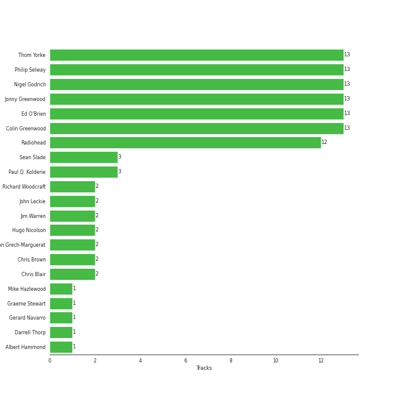

# Radiohead

[See Track Features](audio_features.md)

[See Clusters](clusters/overview.md)

## Relationships

Radiohead:
- was formerly known as On a Friday
- has member Colin Greenwood
- has member Jonny Greenwood
- has member Ed O'Brien
- has member Philip Selway
- has member Thom Yorke

## Artist Rank
Radiohead is currently:
- The #30 artist of the last 6 months
- The #43 artist of all time

## Top Tracks

### Top tracks, aggregated

## Featured on Playlists
| Art | Tracks | Playlist |
|:---|---:|:---|
|  | 17 | [Modern Rock](../../playlists/modern_rock/overview.md) |
|  | 1 | [Beat Drop!](../../playlists/beat_drop!/overview.md) |
|  | 1 | [Karaoke](../../playlists/karaoke/overview.md) |

## Top Albums

| Art | Tracks | 💚 | Album | Release Date | 🔗 |
|:---|---:|---:|:---|:---|:---|
|  | 6 | 6 | OK Computer | 1997-05-28 | [🔗](https://open.spotify.com/album/6dVIqQ8qmQ5GBnJ9shOYGE) |
|  | 4 | 2 | In Rainbows | 2007-12-28 | [🔗](https://open.spotify.com/album/5vkqYmiPBYLaalcmjujWxK) |
|  | 3 | 3 | The Bends | 1995-03-13 | [🔗](https://open.spotify.com/album/35UJLpClj5EDrhpNIi4DFg) |
|  | 1 | 1 | Pablo Honey | 1993-02-22 | [🔗](https://open.spotify.com/album/3gBVdu4a1MMJVMy6vwPEb8) |
|  | 1 | 1 | Kid A | 2000-10-02 | [🔗](https://open.spotify.com/album/6GjwtEZcfenmOf6l18N7T7) |
|  | 1 | 1 | Hail To the Thief | 2003-06-09 | [🔗](https://open.spotify.com/album/5mzoI3VH0ZWk1pLFR6RoYy) |
|  | 1 | 1 | Amnesiac | 2001-03-12 | [🔗](https://open.spotify.com/album/6V9YnBmFjWmXCBaUVRCVXP) |

## Top Record Labels

| Tracks | 💚 | Label |
|---:|---:|:---|
| 17 | 15 | [XL Recordings](../../labels/xl_recordings/overview.md) |

## Genres

- [alternative rock](../../genres/alternative_rock/overview.md)
- [art rock](../../genres/art_rock/overview.md)
- melancholia
- oxford indie
- [permanent wave](../../genres/permanent_wave/overview.md)
- [rock](../../genres/rock/overview.md)

## Credits

### Credits by Type

| Credit Type | Tracks |
|:---|---:|
| Arranger | 6 |
| Lyricist | 2 |
| Producer | 10 |
| Songwriter | 2 |

### Member Credits

| | [Colin Greenwood](../../producers/colin_greenwood/overview.md) | [Ed O'Brien](../../producers/ed_o_brien/overview.md) | [Jonny Greenwood](../../producers/jonny_greenwood/overview.md) | [Philip Selway](../../producers/philip_selway/overview.md) | [Thom Yorke](../../producers/thom_yorke/overview.md) |
|:---|---:|---:|---:|---:|---:|
| Arranger | 0 | 0 | 3 | 0 | 2 |
| Instrument | 12 | 11 | 12 | 12 | 10 |
| Lyricist | 0 | 0 | 0 | 0 | 2 |
| Performer | 2 | 2 | 2 | 2 | 2 |
| Producer | 0 | 0 | 2 | 0 | 7 |
| Songwriter | 13 | 13 | 12 | 13 | 13 |
| Vocal | 0 | 11 | 1 | 0 | 12 |
### Production Credits

| Art | Track | Members | Credit Types |
|:---|:---|:---|:---|
|  | Creep | [Ed O'Brien](../../../producers/ed_o_brien/overview.md), [Philip Selway](../../../producers/philip_selway/overview.md), [Thom Yorke](../../../producers/thom_yorke/overview.md), [Jonny Greenwood](../../../producers/jonny_greenwood/overview.md), [Colin Greenwood](../../../producers/colin_greenwood/overview.md) | Songwriter, Lyricist |
|  | Street Spirit (Fade Out) | [Radiohead](.), [Ed O'Brien](../../../producers/ed_o_brien/overview.md), [Philip Selway](../../../producers/philip_selway/overview.md), [Thom Yorke](../../../producers/thom_yorke/overview.md), [Jonny Greenwood](../../../producers/jonny_greenwood/overview.md), [Colin Greenwood](../../../producers/colin_greenwood/overview.md) | Producer, Songwriter, Arranger |
|  | High and Dry | [Radiohead](.), [Ed O'Brien](../../../producers/ed_o_brien/overview.md), [Philip Selway](../../../producers/philip_selway/overview.md), [Thom Yorke](../../../producers/thom_yorke/overview.md), [Jonny Greenwood](../../../producers/jonny_greenwood/overview.md), [Colin Greenwood](../../../producers/colin_greenwood/overview.md) | Producer, Songwriter, Arranger |
|  | Fake Plastic Trees | [Ed O'Brien](../../../producers/ed_o_brien/overview.md), [Philip Selway](../../../producers/philip_selway/overview.md), [Thom Yorke](../../../producers/thom_yorke/overview.md), [Jonny Greenwood](../../../producers/jonny_greenwood/overview.md), [Colin Greenwood](../../../producers/colin_greenwood/overview.md) | Songwriter |
|  | Exit Music (For A Film) | [Radiohead](.), [Ed O'Brien](../../../producers/ed_o_brien/overview.md), [Philip Selway](../../../producers/philip_selway/overview.md), [Thom Yorke](../../../producers/thom_yorke/overview.md), [Jonny Greenwood](../../../producers/jonny_greenwood/overview.md), [Colin Greenwood](../../../producers/colin_greenwood/overview.md) | Arranger, Producer, Songwriter |
|  | No Surprises | [Radiohead](.), [Ed O'Brien](../../../producers/ed_o_brien/overview.md), [Philip Selway](../../../producers/philip_selway/overview.md), [Thom Yorke](../../../producers/thom_yorke/overview.md), [Jonny Greenwood](../../../producers/jonny_greenwood/overview.md), [Colin Greenwood](../../../producers/colin_greenwood/overview.md) | Arranger, Producer, Songwriter |
|  | Subterranean Homesick Alien | [Radiohead](.), [Ed O'Brien](../../../producers/ed_o_brien/overview.md), [Philip Selway](../../../producers/philip_selway/overview.md), [Thom Yorke](../../../producers/thom_yorke/overview.md), [Jonny Greenwood](../../../producers/jonny_greenwood/overview.md), [Colin Greenwood](../../../producers/colin_greenwood/overview.md) | Arranger, Producer, Songwriter |
|  | Let Down | [Radiohead](.), [Ed O'Brien](../../../producers/ed_o_brien/overview.md), [Philip Selway](../../../producers/philip_selway/overview.md), [Thom Yorke](../../../producers/thom_yorke/overview.md), [Jonny Greenwood](../../../producers/jonny_greenwood/overview.md), [Colin Greenwood](../../../producers/colin_greenwood/overview.md) | Arranger, Producer, Songwriter |
|  | Karma Police | [Radiohead](.), [Ed O'Brien](../../../producers/ed_o_brien/overview.md), [Philip Selway](../../../producers/philip_selway/overview.md), [Thom Yorke](../../../producers/thom_yorke/overview.md), [Jonny Greenwood](../../../producers/jonny_greenwood/overview.md), [Colin Greenwood](../../../producers/colin_greenwood/overview.md) | Arranger, Producer, Songwriter |
|  | Paranoid Android | [Radiohead](.), [Ed O'Brien](../../../producers/ed_o_brien/overview.md), [Philip Selway](../../../producers/philip_selway/overview.md), [Thom Yorke](../../../producers/thom_yorke/overview.md), [Jonny Greenwood](../../../producers/jonny_greenwood/overview.md), [Colin Greenwood](../../../producers/colin_greenwood/overview.md) | Arranger, Producer, Songwriter |

View all

| Art | Track | Members | Credit Types |
|:---|:---|:---|:---|
|  | Everything In Its Right Place | [Radiohead](.), [Ed O'Brien](../../../producers/ed_o_brien/overview.md), [Philip Selway](../../../producers/philip_selway/overview.md), [Thom Yorke](../../../producers/thom_yorke/overview.md), [Jonny Greenwood](../../../producers/jonny_greenwood/overview.md), [Colin Greenwood](../../../producers/colin_greenwood/overview.md) | Producer, Songwriter |
|  | Pyramid Song | [Radiohead](.), [Ed O'Brien](../../../producers/ed_o_brien/overview.md), [Philip Selway](../../../producers/philip_selway/overview.md), [Thom Yorke](../../../producers/thom_yorke/overview.md), [Jonny Greenwood](../../../producers/jonny_greenwood/overview.md), [Colin Greenwood](../../../producers/colin_greenwood/overview.md) | Producer, Songwriter, Arranger |
|  | There, There | [Ed O'Brien](../../../producers/ed_o_brien/overview.md), [Philip Selway](../../../producers/philip_selway/overview.md), [Thom Yorke](../../../producers/thom_yorke/overview.md), [Jonny Greenwood](../../../producers/jonny_greenwood/overview.md), [Colin Greenwood](../../../producers/colin_greenwood/overview.md) | Songwriter, Lyricist, Producer |
|  | Reckoner | [Radiohead](.) | Lyricist, Songwriter |
|  | Jigsaw Falling Into Place | [Radiohead](.) | Lyricist, Songwriter |

## Top Producers

| Art | Producer | Tracks | Credit Types |
|:---|:---|---:|:---|
| | [Colin Greenwood](../../producers/colin_greenwood/overview.md) | 13 | Songwriter |
| | [Ed O'Brien](../../producers/ed_o_brien/overview.md) | 13 | Songwriter |
| | [Jonny Greenwood](../../producers/jonny_greenwood/overview.md) | 13 | Songwriter, Arranger, Producer |
| | [Philip Selway](../../producers/philip_selway/overview.md) | 13 | Songwriter |
| | [Nigel Godrich](../../producers/nigel_godrich/overview.md) | 13 | Producer |
| | [Thom Yorke](../../producers/thom_yorke/overview.md) | 13 | Lyricist, Producer, Songwriter, Arranger |
|  | [Radiohead](overview.md) | 12 | Arranger, Producer, Lyricist, Songwriter |
| | Paul Q. Kolderie | 3 | Producer |
| | Sean Slade | 3 | Producer |
| | Jim Warren | 2 | Producer |

View all

| Art | Producer | Tracks | Credit Types |
|:---|:---|---:|:---|
| | Dan Grech-Marguerat | 2 | Producer |
|  | Chris Brown | 2 | Producer |
| | Hugo Nicolson | 2 | Producer |
| | Chris Blair | 2 | Producer |
| | John Leckie | 2 | Producer |
| | Richard Woodcraft | 2 | Producer |
| | Mike Hazlewood | 1 | Songwriter |
| | Gerard Navarro | 1 | Producer |
| | Albert Hammond | 1 | Songwriter |
| | Graeme Stewart | 1 | Producer |
| | Darrell Thorp | 1 | Producer |

## Tracks

| Art | Track | Album | Artists | Label | Score | 💚 | 🔗 |
|:---|:---|:---|:---|:---|---:|:---|:---|
|  | Exit Music (For A Film) | OK Computer | [Radiohead](overview.md) | [XL Recordings](../../labels/xl_recordings) | 264 | 💚 | [🔗](https://open.spotify.com/track/0z1o5L7HJx562xZSATcIpY) |
|  | Jigsaw Falling Into Place | In Rainbows | [Radiohead](overview.md) | [XL Recordings](../../labels/xl_recordings) | 86 | 💚 | [🔗](https://open.spotify.com/track/0YJ9FWWHn9EfnN0lHwbzvV) |
|  | Street Spirit (Fade Out) | The Bends | [Radiohead](overview.md) | [XL Recordings](../../labels/xl_recordings) | 54 | 💚 | [🔗](https://open.spotify.com/track/2QwObYJWyJTiozvs0RI7CF) |
|  | Creep | Pablo Honey | [Radiohead](overview.md) | [XL Recordings](../../labels/xl_recordings) | 0 | 💚 | [🔗](https://open.spotify.com/track/70LcF31zb1H0PyJoS1Sx1r) |
|  | Fake Plastic Trees | The Bends | [Radiohead](overview.md) | [XL Recordings](../../labels/xl_recordings) | 0 | 💚 | [🔗](https://open.spotify.com/track/73CKjW3vsUXRpy3NnX4H7F) |
|  | High and Dry | The Bends | [Radiohead](overview.md) | [XL Recordings](../../labels/xl_recordings) | 0 | 💚 | [🔗](https://open.spotify.com/track/2a1iMaoWQ5MnvLFBDv4qkf) |
|  | Karma Police | OK Computer | [Radiohead](overview.md) | [XL Recordings](../../labels/xl_recordings) | 0 | 💚 | [🔗](https://open.spotify.com/track/63OQupATfueTdZMWTxW03A) |
|  | Let Down | OK Computer | [Radiohead](overview.md) | [XL Recordings](../../labels/xl_recordings) | 0 | 💚 | [🔗](https://open.spotify.com/track/2fuYa3Lx06QQJAm0MjztKr) |
|  | No Surprises | OK Computer | [Radiohead](overview.md) | [XL Recordings](../../labels/xl_recordings) | 0 | 💚 | [🔗](https://open.spotify.com/track/10nyNJ6zNy2YVYLrcwLccB) |
|  | Paranoid Android | OK Computer | [Radiohead](overview.md) | [XL Recordings](../../labels/xl_recordings) | 0 | 💚 | [🔗](https://open.spotify.com/track/6LgJvl0Xdtc73RJ1mmpotq) |

See all tracks

| Art | Track | Album | Artists | Label | Score | 💚 | 🔗 |
|:---|:---|:---|:---|:---|---:|:---|:---|
|  | Subterranean Homesick Alien | OK Computer | [Radiohead](overview.md) | [XL Recordings](../../labels/xl_recordings) | 0 | 💚 | [🔗](https://open.spotify.com/track/2CVV8PtUYYsux8XOzWkCP0) |
|  | Everything In Its Right Place | Kid A | [Radiohead](overview.md) | [XL Recordings](../../labels/xl_recordings) | 0 | 💚 | [🔗](https://open.spotify.com/track/2kRFrWaLWiKq48YYVdGcm8) |
|  | Pyramid Song | Amnesiac | [Radiohead](overview.md) | [XL Recordings](../../labels/xl_recordings) | 0 | 💚 | [🔗](https://open.spotify.com/track/3A9vIxzGBjEfqmDK7H9exS) |
|  | There, There | Hail To the Thief | [Radiohead](overview.md) | [XL Recordings](../../labels/xl_recordings) | 0 | 💚 | [🔗](https://open.spotify.com/track/5h4y42RUKwYKYWgutNwvKP) |
|  | All I Need | In Rainbows | [Radiohead](overview.md) | [XL Recordings](../../labels/xl_recordings) | 0 | | [🔗](https://open.spotify.com/track/5Qv2Nby1xTr9pQyjkrc94J) |
|  | Reckoner | In Rainbows | [Radiohead](overview.md) | [XL Recordings](../../labels/xl_recordings) | 0 | 💚 | [🔗](https://open.spotify.com/track/02ppMPbg1OtEdHgoPqoqju) |
|  | Weird Fishes/ Arpeggi | In Rainbows | [Radiohead](overview.md) | [XL Recordings](../../labels/xl_recordings) | 0 | | [🔗](https://open.spotify.com/track/4wajJ1o7jWIg62YqpkHC7S) |

