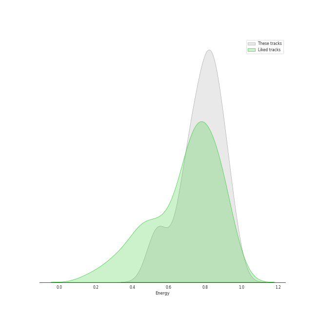
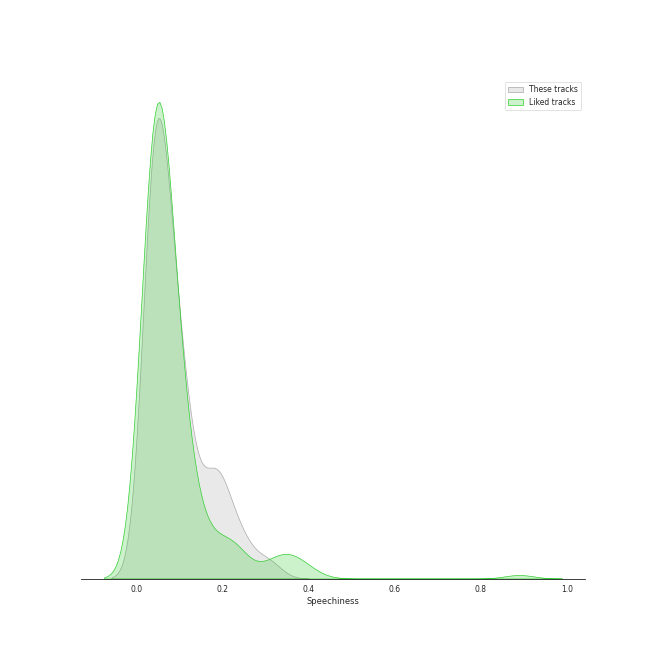
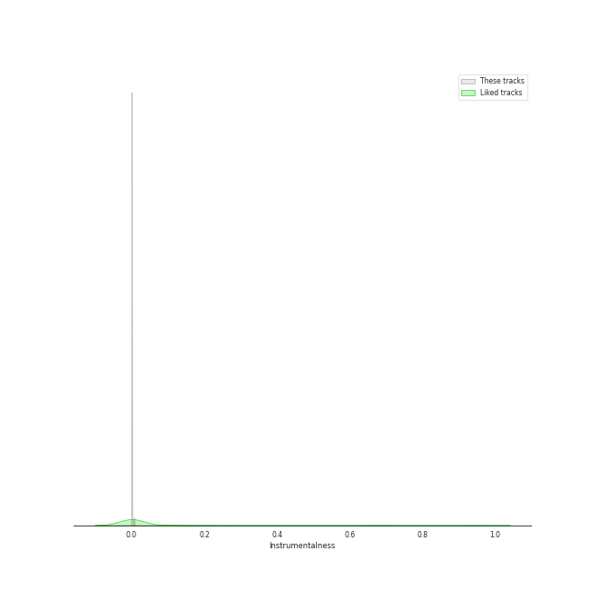

# Audio Features for Red Velvet

## Danceability

| 10 most Danceable tracks | 10 least Danceable tracks |
|:---|:---|
| Time Slip (0.897) | Feel My Rhythm (0.412) |
| Pose (0.841) | 7월 7일 One Of These Nights (0.436) |
| Peek-A-Boo (0.839) | Good, Bad, Ugly (0.486) |
| On A Ride (0.817) | Sayonara (0.496) |
| ZOOM (0.808) | Body Talk (0.526) |
| Dumb Dumb (0.778) | Knock On Wood (0.533) |
| Bing Bing (0.774) | WILDSIDE (0.559) |
| Better Be (0.756) | 세가지 소원 Wish Tree (0.563) |
| Blue Lemonade (0.749) | So Good (0.567) |
| Hello, Sunset (0.737) | In & Out (0.568) |

## Energy

| 10 most Energetic tracks | 10 least Energetic tracks |
|:---|:---|
| Hit That Drum (0.984) | Moonlight Melody (0.482) |
| #Cookie Jar (0.959) | 7월 7일 One Of These Nights (0.509) |
| Feel My Rhythm (0.94) | Hello, Sunset (0.531) |
| Rookie (0.938) | 세가지 소원 Wish Tree (0.534) |
| Ice Cream Cake (0.935) | In My Dreams (0.536) |
| Umpah Umpah (0.935) | Hear The Sea (0.565) |
| Power Up (0.934) | Time Slip (0.58) |
| Bad Dracula (0.931) | Automatic (0.604) |
| Red Flavor (0.917) | Psycho (0.666) |
| 러시안 룰렛 Russian Roulette (0.903) | Better Be (0.667) |

## Speechiness

| 10 most Speechy tracks | 10 least Speechy tracks |
|:---|:---|
| Be Natural (0.316) | Moonlight Melody (0.0269) |
| Rookie (0.288) | 세가지 소원 Wish Tree (0.0273) |
| Automatic (0.252) | In My Dreams (0.0283) |
| Feel My Rhythm (0.215) | Hear The Sea (0.0298) |
| Lucky Girl (0.207) | Beautiful Christmas (0.0311) |
| About Love (0.204) | RBB (Really Bad Boy) (0.0317) |
| Jumpin' (0.193) | RBB (Really Bad Boy) - English Version (0.0319) |
| Red Flavor (0.189) | I Just (0.0322) |
| Ice Cream Cake (0.189) | 7월 7일 One Of These Nights (0.0345) |
| Zimzalabim (0.179) | 러시안 룰렛 Russian Roulette (0.0357) |

## Acousticness

| 10 most Acoustic tracks | 10 least Acoustic tracks |
|:---|:---|
| ZOOM (0.696) | Zimzalabim (0.0028) |
| Moonlight Melody (0.654) | Body Talk (0.00652) |
| 세가지 소원 Wish Tree (0.643) | Jumpin' (0.0106) |
| Eyes Locked, Hands Locked (0.624) | RBB (Really Bad Boy) - English Version (0.0117) |
| I Just (0.586) | RBB (Really Bad Boy) (0.012) |
| Hear The Sea (0.533) | #Cookie Jar (0.0159) |
| Fool (0.527) | Oh Boy (0.0176) |
| 7월 7일 One Of These Nights (0.475) | Umpah Umpah (0.0258) |
| Sayonara (0.432) | BAMBOLEO (0.0296) |
| Milky Way (0.393) | Lucky Girl (0.0299) |

## Instrumentalness

| 10 most Instrumental tracks | 10 least Instrumental tracks |
|:---|:---|
| Power Up (0.00745) | So Good (0.0) |
| In My Dreams (0.0066) | Knock On Wood (0.0) |
| Peek-A-Boo (0.00257) | Good, Bad, Ugly (0.0) |
| Parade (0.00131) | Beautiful Christmas (0.0) |
| RBB (Really Bad Boy) (0.000239) | La Rouge - Special Track (0.0) |
| 러시안 룰렛 Russian Roulette (0.000225) | Moonlight Melody (0.0) |
| Fool (5.99e-05) | Lucky Girl (0.0) |
| RBB (Really Bad Boy) - English Version (5.46e-05) | Milky Way (0.0) |
| ZOOM (5.39e-05) | About Love (0.0) |
| BAMBOLEO (5.3e-05) | In & Out (0.0) |

## Liveness

| 10 most Live tracks | 10 least Live tracks |
|:---|:---|
| 행복 (Happiness) (0.725) | In My Dreams (0.0489) |
| LP (0.714) | Birthday (0.0491) |
| Parade (0.579) | Bad Boy (0.0553) |
| Hit That Drum (0.495) | Time Slip (0.0578) |
| Umpah Umpah (0.437) | Bad Boy - English Version, Bonus Track (0.061) |
| Bing Bing (0.432) | Queendom (0.0626) |
| BYE BYE (0.423) | Fool (0.0673) |
| Automatic (0.387) | La Rouge - Special Track (0.0744) |
| I Just (0.364) | Beg For Me (0.0757) |
| Feel My Rhythm (0.358) | Kingdom Come (0.0761) |

## Valence

| 10 most Happy tracks | 10 least Happy tracks |
|:---|:---|
| 러시안 룰렛 Russian Roulette (0.958) | 7월 7일 One Of These Nights (0.11) |
| I Just (0.906) | Body Talk (0.158) |
| Power Up (0.898) | In My Dreams (0.179) |
| #Cookie Jar (0.893) | Moonlight Melody (0.32) |
| Talk To Me (0.881) | 세가지 소원 Wish Tree (0.344) |
| Hello, Sunset (0.871) | Oh Boy (0.366) |
| Rookie (0.868) | RBB (Really Bad Boy) (0.367) |
| Umpah Umpah (0.844) | RBB (Really Bad Boy) - English Version (0.376) |
| Bad Boy - English Version, Bonus Track (0.839) | You Better Know (0.402) |
| ZOOM (0.823) | Psycho (0.405) |

## Tempo

| 10 most Fast tracks | 10 least Fast tracks |
|:---|:---|
| About Love (191.908) | Hello, Sunset (71.999) |
| Body Talk (185.946) | Eyes Locked, Hands Locked (79.986) |
| Automatic (179.938) | ZOOM (89.937) |
| Be Natural (178.002) | Hear The Sea (90.982) |
| Fool (177.941) | Bad Dracula (93.986) |
| Ice Cream Cake (172.023) | Oh Boy (93.99) |
| Kingdom Come (170.123) | La Rouge - Special Track (94.907) |
| Lucky Girl (169.758) | Parade (94.954) |
| Good, Bad, Ugly (169.507) | Milky Way (98.019) |
| Talk To Me (164.79) | Time Slip (99.982) |
