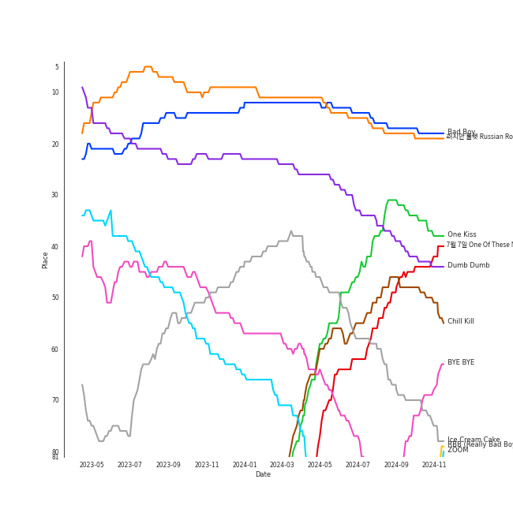
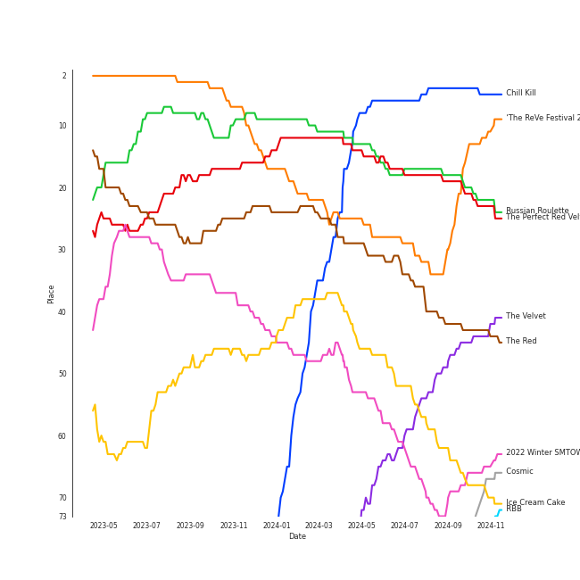
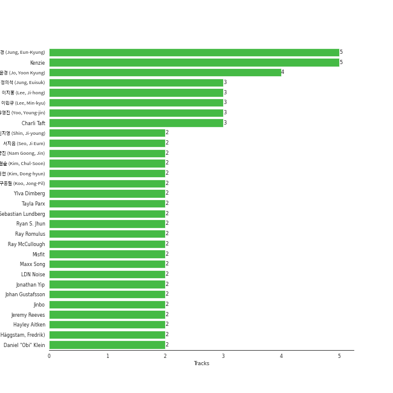

# Red Velvet

[See Track Features](audio_features.md)

[See Clusters](clusters/overview.md)

## Relationships

Red Velvet:
- has member IRENE
- has member JOY
- has member [SEULGI](../seulgi/overview.md)
- has member [WENDY](../wendy/overview.md)
- has member YERI
- has the subgroup Red Velvet - IRENE & SEULGI

## Artist Rank
Red Velvet is currently:
- The #1 artist of the last month
- The #2 artist of the last 6 months
- The #1 artist of the last year
- The #2 artist of all time

## Top Tracks

### Top tracks of all time

Top tracks of the last year over time

Top tracks of the last 6 months over time

## Top Albums

| Art | Rank | Tracks | 💚 | Album | Release Date | 🔗 |
|:---|---:|---:|---:|:---|:---|:---|
|  | 6 | 7 | 6 | Chill Kill - The 3rd Album | 2023-11-13 | [🔗](https://open.spotify.com/album/4UUICitfodUVCNhzmDFbrO) |
|  | 178 | 6 | 6 | Perfect Velvet - The 2nd Album | 2017-11-17 | [🔗](https://open.spotify.com/album/0rvrbZvaDX5S9ZBhwOwFfH) |
|  | 138 | 5 | 5 | ‘The ReVe Festival’ Finale | 2019-12-23 | [🔗](https://open.spotify.com/album/3rVtm00UfbuzWOewdm4iYM) |
|  | 70 | 5 | 5 | ‘The ReVe Festival 2022 - Feel My Rhythm’ | 2022-03-21 | [🔗](https://open.spotify.com/album/3HgoCO9wWuPcNhz8Ip4C46) |
|  | 34 | 5 | 5 | The Red - The 1st Album | 2015-09-09 | [🔗](https://open.spotify.com/album/6YL9J0E6PGtYzkhyMxnmXd) |
|  | 452 | 5 | 4 | Queendom - The 6th Mini Album | 2021-08-16 | [🔗](https://open.spotify.com/album/6Pe5LGQgU3mmvuRjFMsACV) |
|  | 114 | 5 | 3 | ‘The ReVe Festival’ Day 1 | 2019-06-19 | [🔗](https://open.spotify.com/album/2nLEiP268mSFZHW5dajM4R) |
|  | 97 | 5 | 3 | RBB - The 5th Mini Album | 2018-11-30 | [🔗](https://open.spotify.com/album/7rNIvLwIpB2mwOzk20iqIl) |
|  | 29 | 4 | 4 | ‘The ReVe Festival 2022 - Birthday’ | 2022-11-28 | [🔗](https://open.spotify.com/album/58OR7UoaJkJzqeQGClHzh1) |
|  | 18 | 4 | 4 | Russian Roulette - The 3rd Mini Album | 2016-09-07 | [🔗](https://open.spotify.com/album/6MNlcai3skKLKv5syzFwC3) |

See all albums

| Art | Rank | Tracks | 💚 | Album | Release Date | 🔗 |
|:---|---:|---:|---:|:---|:---|:---|
|  | 156 | 4 | 3 | Cosmic | 2024-06-24 | [🔗](https://open.spotify.com/album/5E8apoFsaUFhZxGGSju6aW) |
|  | 586 | 4 | 2 | Summer Magic - Summer Mini Album | 2018-08-06 | [🔗](https://open.spotify.com/album/5zWa1ZEUBctbKqvwXbFawo) |
|  | 326 | 3 | 2 | Bloom | 2022-04-06 | [🔗](https://open.spotify.com/album/4ualu7nMAcmoAqp47YaA95) |
|  | 586 | 3 | 1 | The Red Summer - Summer Mini Album | 2017-07-09 | [🔗](https://open.spotify.com/album/6OXg149IkmbgW7zfzbwgS2) |
|  | 586 | 3 | 1 | Rookie - The 4th Mini Album | 2017-02-01 | [🔗](https://open.spotify.com/album/5Bg49LEfyoZzKpQsEwRCtI) |
|  | 586 | 2 | 2 | ‘The ReVe Festival’ Day 2 | 2019-08-20 | [🔗](https://open.spotify.com/album/3DXz6ItR9DzIw9S0h3Cxfc) |
|  | 51 | 2 | 2 | Ice Cream Cake - The 1st Mini Album | 2015-03-17 | [🔗](https://open.spotify.com/album/27cBQ5FDqv0xLgiJ7qNpZr) |
|  | 485 | 1 | 1 | 행복(Happiness) | 2014-08-01 | [🔗](https://open.spotify.com/album/6MMkaYzyM0aLZmDBce3nL6) |
|  | 58 | 1 | 1 | The Velvet - The 2nd Mini Album | 2016-03-17 | [🔗](https://open.spotify.com/album/2qgl7dAgslqL1w2l2wQhMA) |
|  | 17 | 1 | 1 | The Perfect Red Velvet - The 2nd Album Repackage | 2018-01-29 | [🔗](https://open.spotify.com/album/0OkJThJls8FO1lutMzMDJ0) |
|  | 586 | 1 | 1 | Be Natural - The 2nd Single | 2014-10-13 | [🔗](https://open.spotify.com/album/4OeQ9nilS4Sy3efzt0hVFi) |
|  | 62 | 1 | 1 | 2022 Winter SMTOWN : SMCU PALACE | 2022-12-26 | [🔗](https://open.spotify.com/album/1HwnXJfZx8N8qDfzwUbxcw) |
|  | 586 | 1 | 0 | 세가지 소원 Wish Tree - WINTER GARDEN | 2015-12-18 | [🔗](https://open.spotify.com/album/69a7YNzhApHfLFwHvPkCso) |
|  | 586 | 1 | 0 | Our Beloved BoA #4 - SM STATION | 2020-08-21 | [🔗](https://open.spotify.com/album/0MYodAzFX64jToQpE5jWNW) |
|  | 467 | 1 | 0 | Hotel del Luna (Original Television Soundtrack) Pt.8 | 2019-08-10 | [🔗](https://open.spotify.com/album/2orJu019JvK7H621GwcIhr) |
|  | 586 | 1 | 0 | Close To Me (Red Velvet Remix) | 2019-04-05 | [🔗](https://open.spotify.com/album/7dg5iqyFYqRQH7vtAG9VNf) |
|  | 586 | 1 | 0 | #Cookie Jar | 2018-07-04 | [🔗](https://open.spotify.com/album/4W6K0DP1YlZ48JlvdKCkZh) |

## Featured on Playlists
| Art | Tracks | Playlist |
|:---|---:|:---|
|  | 77 | [K-Pop](../../playlists/k-pop/overview.md) |
|  | 17 | [K-Pop Favorites](../../playlists/k-pop_favorites/overview.md) |
|  | 15 | [Summer](../../playlists/summer/overview.md) |
|  | 12 | [Workout](../../playlists/workout/overview.md) |
|  | 11 | [Chill](../../playlists/chill/overview.md) |
|  | 11 | [Your Top Songs 2023](../../playlists/your_top_songs_2023/overview.md) |
|  | 9 | [Your Top Songs 2022](../../playlists/your_top_songs_2022/overview.md) |
|  | 8 | [Halloween](../../playlists/halloween/overview.md) |
|  | 6 | [Recommendations for Chris](../../playlists/recommendations_for_chris/overview.md) |
|  | 5 | [Classical Samples](../../playlists/classical_samples/overview.md) |
|  | 4 | [Recent Comebacks](../../playlists/recent_comebacks/overview.md) |
|  | 4 | [Recommendations for Jeff](../../playlists/recommendations_for_jeff/overview.md) |
|  | 4 | [Retro Kpop](../../playlists/retro_kpop/overview.md) |
|  | 4 | [On Repeat](../../playlists/on_repeat/overview.md) |
|  | 3 | [Repeat Rewind](../../playlists/repeat_rewind/overview.md) |
|  | 3 | [애교！](../../playlists/애교！/overview.md) |
|  | 3 | [K-Memes](../../playlists/k-memes/overview.md) |
|  | 2 | [Relax](../../playlists/relax/overview.md) |
|  | 2 | [Sharon RPD](../../playlists/sharon_rpd/overview.md) |
|  | 2 | [Cursed English](../../playlists/cursed_english/overview.md) |
|  | 2 | [Christmas](../../playlists/christmas/overview.md) |
|  | 1 | [Not K-Pop](../../playlists/not_k-pop/overview.md) |
|  | 1 | [K-Pop 101](../../playlists/k-pop_101/overview.md) |
|  | 1 | [Beat Drop!](../../playlists/beat_drop!/overview.md) |
|  | 1 | [K-OST](../../playlists/k-ost/overview.md) |

## Top Record Labels

| Tracks | 💚 | Label |
|---:|---:|:---|
| 76 | 61 | [SM Entertainment](../../labels/sm_entertainment/overview.md) |
| 4 | 2 | [avex trax](../../labels/avex_trax/overview.md) |
| 1 | 0 | [Polydor Records](../../labels/polydor_records/overview.md) |
| 1 | 0 | Beyond Music |

## Genres

- [k-pop](../../genres/k-pop/overview.md)
- [k-pop girl group](../../genres/k-pop_girl_group/overview.md)

## Credits

### Credits by Type

| Credit Type | Tracks |
|:---|---:|
| Performer | 16 |
| Vocal | 14 |

### Member Credits

| | IRENE | JOY | YERI | [SEULGI](../seulgi/overview.md) | [WENDY](../wendy/overview.md) |
|:---|---:|---:|---:|---:|---:|
| Vocal | 16 | 16 | 13 | 16 | 16 |
## Top Producers

| Art | Producer | Tracks | Credit Types |
|:---|:---|---:|:---|
| | [Kenzie](../../producers/kenzie/overview.md) | 5 | Songwriter, Arranger, Lyricist |
| | [정은경 (Jung, Eun-Kyung)](../../producers/정은경_(jung,_eun-kyung)/overview.md) | 5 | Producer |
| | [조윤경 (Jo, Yoon Kyung)](../../producers/조윤경_(jo,_yoon_kyung)/overview.md) | 4 | Lyricist |
| | [유영진 (Yoo, Young-jin)](../../producers/유영진_(yoo,_young-jin)/overview.md) | 3 | Arranger, Lyricist, Producer, Songwriter |
| | 이민규 (Lee, Min-kyu) | 3 | Producer |
| | 이지홍 (Lee, Ji-hong) | 3 | Producer |
| | Charli Taft | 3 | Arranger, Songwriter, Lyricist |
| | 정의석 (Jung, Euisuk) | 3 | Producer |
| | [LDN Noise](../../producers/ldn_noise/overview.md) | 2 | Arranger, Producer, Songwriter |
| | Daniel "Obi" Klein | 2 | Arranger, Producer, Songwriter, Lyricist |

View all

| Art | Producer | Tracks | Credit Types |
|:---|:---|---:|:---|
| | Tayla Parx | 2 | Arranger, Songwriter |
| | Misfit | 2 | Lyricist |
| | [구종필 (Koo, Jong-Pil)](../../producers/구종필_(koo,_jong-pil)/overview.md) | 2 | Producer |
| | 신지영 (Shin, Ji-young) | 2 | Producer |
| | Jeremy Reeves | 2 | Lyricist, Songwriter |
| | [서지음 (Seo, Ji Eum)](../../producers/서지음_(seo,_ji_eum)/overview.md) | 2 | Lyricist |
| | Ray McCullough | 2 | Lyricist, Songwriter |
| | Ylva Dimberg | 2 | Lyricist, Songwriter, Arranger |
| | Johan Gustafsson | 2 | Arranger, Songwriter |
| | 김동현 (Kim, Dong-hyun) | 2 | Lyricist |
| | 남궁진 (Nam Goong, Jin) | 2 | Producer |
| | [Ryan S. Jhun](../../producers/ryan_s__jhun/overview.md) | 2 | Arranger, Songwriter |
| | Ray Romulus | 2 | Lyricist, Songwriter |
| | 김철순 (Kim, Chul-Soon) | 2 | Producer |
| | Jonathan Yip | 2 | Lyricist, Songwriter |
| | Hayley Aitken | 2 | Arranger, Songwriter |
| | Maxx Song | 2 | Arranger, Producer, Lyricist, Songwriter |
| | Sebastian Lundberg | 2 | Arranger, Songwriter |
| | Jinbo | 2 | Arranger, Producer, Songwriter, Lyricist |
| | Cazzi Opeia | 2 | Songwriter, Lyricist |
| | Fredrik Häggstam (Häggstam, Fredrik) | 2 | Arranger, Songwriter |
| | Johannes R. Jørgensen (Jørgensen, Johannes R.) | 1 | Arranger, Songwriter |
| | Markus Lindell | 1 | Arranger, Songwriter |
| | 김규영 (Kim, Kyu-young) | 1 | Producer |
| | Tomas Smagesjo | 1 | Songwriter |
| | 황찬희 (Hwang, Chan-Hee) | 1 | Arranger, Producer, Songwriter |
| | Courtney Woolsey | 1 | Songwriter |
| | Dem Jointz | 1 | Arranger, Songwriter |
| | 이주형 (Lee, Juhyeong) | 1 | Arranger, Producer |
| | 이승주 (Lee Sung-joo) | 1 | Arranger |
| | Belle Humble | 1 | Arranger, Songwriter |
| | Jin Choi | 1 | Arranger, Songwriter |
| | Ellen Berg Tollbom | 1 | Lyricist, Songwriter |
| | Will Simms | 1 | Arranger, Producer, Songwriter |
| | 김부민 (Kim, Bu-min) | 1 | Lyricist, Songwriter |
| | Herbie Crichlow | 1 | Arranger, Songwriter |
| | Nermin Harambašić (Harambašić, Nermin) | 1 | Songwriter |
| | Deanna | 1 | Arranger, Songwriter |
| | Anne Judith Wik | 1 | Arranger, Songwriter |
| | John Fulford | 1 | Songwriter |
| | 1월 8일 (1월 8일) | 1 | Lyricist |
| | Chad Hugo | 1 | Arranger, Producer, Songwriter |
| | 박인영 (Park, In-Young) | 1 | Arranger |
| | Andreas Öberg (Öberg, Andreas) | 1 | Songwriter |
| | 전승우 (Jeon, SeungWoo) | 1 | Arranger, Producer |
| | 장우영 (Jang, Wooyoung) | 1 | Producer |
| | Ludvig Carl Evers | 1 | Lyricist, Songwriter |
| | Malin Johansson | 1 | Arranger, Songwriter |
| | 100%서정 (100%Seojung) | 1 | Lyricist |
| | Ollipop | 1 | Arranger, Songwriter |
| | 구태우 (Gutaeu) | 1 | Lyricist |
| | Jeff Gartenbaum | 1 | Producer |
| | Josef Melin | 1 | Arranger, Songwriter |
| | Deez | 1 | Lyricist, Songwriter |
|  | SUMIN | 1 | Lyricist, Songwriter |
| | 김형곤 (Kim, Hyeong-kon) | 1 | Producer |
| | HYUGGIE | 1 | Lyricist |
| | Maria Marcus | 1 | Songwriter |
| | JQ | 1 | Lyricist |
| | Jonatan Gusmark | 1 | Lyricist, Songwriter |
| | 최진석 (Choi, Jin-seok) | 1 | Arranger, Songwriter |
| | Seu Ran Lee | 1 | Lyricist |
| | EJAE | 1 | Songwriter |
| | Hee Yeun Moon | 1 | Lyricist |
| | Druski | 1 | Producer |
| | Lauren Dyson | 1 | Arranger, Songwriter |
| | Daniel Klein | 1 | Arranger, Songwriter |
| | Chris Holsten | 1 | Arranger, Songwriter |
| | Hitchhiker | 1 | Songwriter |
| | 김진환 (Kim, Jin Hwan) | 1 | Arranger |
| | Whitney Phillips | 1 | Lyricist, Songwriter |
| | 황현 (Hwang, Hyeon) | 1 | Arranger, Lyricist, Producer, Songwriter |
| | 최소영 (Choi, Seo-young) | 1 | Lyricist |
| | 구종밀 (Koo, Jong-mil) | 1 | Producer |
| | Albi Albertsson | 1 | Arranger, Songwriter |
| | 홍소진 (Hong So-jin) | 1 | Arranger |

## Tracks

| Art | Track | Album | Artists | Label | Rank | 💚 | 🔗 |
|:---|:---|:---|:---|:---|---:|:---|:---|
|  | Bad Boy | The Perfect Red Velvet - The 2nd Album Repackage | [Red Velvet](overview.md) | [SM Entertainment](../../labels/sm_entertainment) | 14 | 💚 | [🔗](https://open.spotify.com/track/5GKwq4sO5ZHKuWaDmdwMQc) |
|  | 러시안 룰렛 Russian Roulette | Russian Roulette - The 3rd Mini Album | [Red Velvet](overview.md) | [SM Entertainment](../../labels/sm_entertainment) | 15 | 💚 | [🔗](https://open.spotify.com/track/5HiSc2ZCGn8L3cH3qSwzBT) |
|  | Dumb Dumb | The Red - The 1st Album | [Red Velvet](overview.md) | [SM Entertainment](../../labels/sm_entertainment) | 32 | 💚 | [🔗](https://open.spotify.com/track/64iDjAuWDogVhuoWhKklF9) |
|  | One Kiss | Chill Kill - The 3rd Album | [Red Velvet](overview.md) | [SM Entertainment](../../labels/sm_entertainment) | 46 | 💚 | [🔗](https://open.spotify.com/track/4zIPZxvYp32y6ifjm1E30O) |
|  | Chill Kill | Chill Kill - The 3rd Album | [Red Velvet](overview.md) | [SM Entertainment](../../labels/sm_entertainment) | 55 | 💚 | [🔗](https://open.spotify.com/track/68gQG2HpRMxIRom4pCugMq) |
|  | Ice Cream Cake | Ice Cream Cake - The 1st Mini Album | [Red Velvet](overview.md) | [SM Entertainment](../../labels/sm_entertainment) | 57 | 💚 | [🔗](https://open.spotify.com/track/5vCuawHQ8Poch1odz9JDpB) |
|  | 7월 7일 One Of These Nights | The Velvet - The 2nd Mini Album | [Red Velvet](overview.md) | [SM Entertainment](../../labels/sm_entertainment) | 62 | 💚 | [🔗](https://open.spotify.com/track/6koMMQlsRWBwHZXdtWxgUk) |
|  | Feel My Rhythm | ‘The ReVe Festival 2022 - Feel My Rhythm’ | [Red Velvet](overview.md) | [SM Entertainment](../../labels/sm_entertainment) | 72 | 💚 | [🔗](https://open.spotify.com/track/2oBMZYteeO8DyXV9gDx6Za) |
|  | BYE BYE | ‘The ReVe Festival 2022 - Birthday’ | [Red Velvet](overview.md) | [SM Entertainment](../../labels/sm_entertainment) | 74 | 💚 | [🔗](https://open.spotify.com/track/4OSVR8gq2l3ceJiXNR7iiM) |
|  | Nightmare | Chill Kill - The 3rd Album | [Red Velvet](overview.md) | [SM Entertainment](../../labels/sm_entertainment) | 79 | 💚 | [🔗](https://open.spotify.com/track/0jUDrSASok8h2xUIWe4KOG) |

See all tracks

| Art | Track | Album | Artists | Label | Rank | 💚 | 🔗 |
|:---|:---|:---|:---|:---|---:|:---|:---|
|  | Bulldozer | Chill Kill - The 3rd Album | [Red Velvet](overview.md) | [SM Entertainment](../../labels/sm_entertainment) | 99 | 💚 | [🔗](https://open.spotify.com/track/4Pp6Ql9wV7A6VqHrmjMFv4) |
|  | Knock Knock (Who's There?) | Chill Kill - The 3rd Album | [Red Velvet](overview.md) | [SM Entertainment](../../labels/sm_entertainment) | 101 | 💚 | [🔗](https://open.spotify.com/track/5nTemr4PG8L9jQoqxsZu6w) |
|  | Birthday | ‘The ReVe Festival 2022 - Birthday’ | [Red Velvet](overview.md) | [SM Entertainment](../../labels/sm_entertainment) | 102 | 💚 | [🔗](https://open.spotify.com/track/4LJgBT9yo0beHlaBesCFEv) |
|  | ZOOM | ‘The ReVe Festival 2022 - Birthday’ | [Red Velvet](overview.md) | [SM Entertainment](../../labels/sm_entertainment) | 105 | 💚 | [🔗](https://open.spotify.com/track/18OjYSOz2ryc2vLmAeG2de) |
|  | RBB (Really Bad Boy) | RBB - The 5th Mini Album | [Red Velvet](overview.md) | [SM Entertainment](../../labels/sm_entertainment) | 122 | 💚 | [🔗](https://open.spotify.com/track/4xjVP2Vogo0C72o6Nevq0W) |
|  | On A Ride | ‘The ReVe Festival 2022 - Birthday’ | [Red Velvet](overview.md) | [SM Entertainment](../../labels/sm_entertainment) | 123 | 💚 | [🔗](https://open.spotify.com/track/1hYQUY06GbO7YR8QeO7Qdk) |
|  | Sunny Side Up! | ‘The ReVe Festival’ Day 1 | [Red Velvet](overview.md) | [SM Entertainment](../../labels/sm_entertainment) | 149 | 💚 | [🔗](https://open.spotify.com/track/5yGTiC0ypN09P4Nl6tE3FY) |
|  | Will I Ever See You Again? | Chill Kill - The 3rd Album | [Red Velvet](overview.md) | [SM Entertainment](../../labels/sm_entertainment) | 177 | | [🔗](https://open.spotify.com/track/0IVwlMnmT0CS8opHfFZAWp) |
|  | Beautiful Christmas | 2022 Winter SMTOWN : SMCU PALACE | [Red Velvet](overview.md), [aespa](../aespa/overview.md) | [SM Entertainment](../../labels/sm_entertainment) | 188 | 💚 | [🔗](https://open.spotify.com/track/1MsWVb6YW3AknP1EAZaKOQ) |
|  | Psycho | ‘The ReVe Festival’ Finale | [Red Velvet](overview.md) | [SM Entertainment](../../labels/sm_entertainment) | 194 | 💚 | [🔗](https://open.spotify.com/track/3CYH422oy1cZNoo0GTG1TK) |
|  | Underwater | Chill Kill - The 3rd Album | [Red Velvet](overview.md) | [SM Entertainment](../../labels/sm_entertainment) | 228 | 💚 | [🔗](https://open.spotify.com/track/58xqapN458N2VjibN3uVrY) |
|  | Peek-A-Boo | Perfect Velvet - The 2nd Album | [Red Velvet](overview.md) | [SM Entertainment](../../labels/sm_entertainment) | 240 | 💚 | [🔗](https://open.spotify.com/track/42tFTth2jcF7iSo0RBjfJF) |
|  | Sunflower | Cosmic | [Red Velvet](overview.md) | [SM Entertainment](../../labels/sm_entertainment) | 281 | 💚 | [🔗](https://open.spotify.com/track/7y0jebgMdsAEofK2Ye0e6g) |
|  | Cosmic | Cosmic | [Red Velvet](overview.md) | [SM Entertainment](../../labels/sm_entertainment) | 299 | 💚 | [🔗](https://open.spotify.com/track/0kE4TRJ0pWoRKzKdtbx8To) |
|  | Bad Dracula | Russian Roulette - The 3rd Mini Album | [Red Velvet](overview.md) | [SM Entertainment](../../labels/sm_entertainment) | 307 | 💚 | [🔗](https://open.spotify.com/track/4z5aqQOYYsvjXuXjjhKVJ2) |
|  | Zimzalabim | ‘The ReVe Festival’ Day 1 | [Red Velvet](overview.md) | [SM Entertainment](../../labels/sm_entertainment) | 321 | 💚 | [🔗](https://open.spotify.com/track/0GUbhhI5fRx7BlqlqlhjuB) |
|  | Love Arcade | Cosmic | [Red Velvet](overview.md) | [SM Entertainment](../../labels/sm_entertainment) | 351 | 💚 | [🔗](https://open.spotify.com/track/10BVwlzgtLNDE7mE8frtmd) |
|  | Milkshake | ‘The ReVe Festival’ Finale | [Red Velvet](overview.md) | [SM Entertainment](../../labels/sm_entertainment) | 377 | 💚 | [🔗](https://open.spotify.com/track/65ZHlbTuPrZggbmYCVjPL4) |
|  | Fool | Russian Roulette - The 3rd Mini Album | [Red Velvet](overview.md) | [SM Entertainment](../../labels/sm_entertainment) | 398 | 💚 | [🔗](https://open.spotify.com/track/21C7B7PWYDW00czamOjleO) |
|  | BAMBOLEO | ‘The ReVe Festival 2022 - Feel My Rhythm’ | [Red Velvet](overview.md) | [SM Entertainment](../../labels/sm_entertainment) | 399 | 💚 | [🔗](https://open.spotify.com/track/0jXneVxiitQZsbtftH7HHJ) |
|  | Jumpin' | ‘The ReVe Festival’ Finale | [Red Velvet](overview.md) | [SM Entertainment](../../labels/sm_entertainment) | 407 | 💚 | [🔗](https://open.spotify.com/track/3q21kVfUIdkzqYpzBCbojN) |
|  | Marionette | Bloom | [Red Velvet](overview.md) | [avex trax](../../labels/avex_trax) | 462 | 💚 | [🔗](https://open.spotify.com/track/3KvMgB5V1FvQTCvvHz5aiO) |
|  | Last Drop | Cosmic | [Red Velvet](overview.md) | [SM Entertainment](../../labels/sm_entertainment) | 463 | | [🔗](https://open.spotify.com/track/5mSsvlMqeX21U9WovVAJA4) |
|  | Good, Bad, Ugly | ‘The ReVe Festival 2022 - Feel My Rhythm’ | [Red Velvet](overview.md) | [SM Entertainment](../../labels/sm_entertainment) | 468 | 💚 | [🔗](https://open.spotify.com/track/1DX08glq6CBGBA0N6uL3JV) |
|  | Lucky Girl | Russian Roulette - The 3rd Mini Album | [Red Velvet](overview.md) | [SM Entertainment](../../labels/sm_entertainment) | 540 | 💚 | [🔗](https://open.spotify.com/track/22v5j98MRwc6p5KgwHvpBZ) |
|  | Day 1 | The Red - The 1st Album | [Red Velvet](overview.md) | [SM Entertainment](../../labels/sm_entertainment) | 630 | 💚 | [🔗](https://open.spotify.com/track/74muMkVdMYoR65lhmdzy13) |
|  | 어떤 별보다 | Hotel del Luna (Original Television Soundtrack) Pt.8 | [Red Velvet](overview.md) | Beyond Music | 694 | | [🔗](https://open.spotify.com/track/3rjWX5YhfI3Alagrf4poY0) |
|  | Hello, Sunset | Queendom - The 6th Mini Album | [Red Velvet](overview.md) | [SM Entertainment](../../labels/sm_entertainment) | 701 | | [🔗](https://open.spotify.com/track/3zQyl7ko8alM35mvYWmHuu) |
|  | 행복 (Happiness) | 행복(Happiness) | [Red Velvet](overview.md) | [SM Entertainment](../../labels/sm_entertainment) | 718 | 💚 | [🔗](https://open.spotify.com/track/6XP9L7di5JnOc9WaeAW8oe) |
|  | Better Be | Queendom - The 6th Mini Album | [Red Velvet](overview.md) | [SM Entertainment](../../labels/sm_entertainment) | 782 | 💚 | [🔗](https://open.spotify.com/track/5NIjdxrVUW4GGyLIqXUw9K) |
|  | In & Out | ‘The ReVe Festival’ Finale | [Red Velvet](overview.md) | [SM Entertainment](../../labels/sm_entertainment) | 868 | 💚 | [🔗](https://open.spotify.com/track/2iYnEfKsAsE86Yb9mS4b3E) |
|  | Be Natural | Be Natural - The 2nd Single | [Red Velvet](overview.md), TAEYONG | [SM Entertainment](../../labels/sm_entertainment) | 874 | 💚 | [🔗](https://open.spotify.com/track/41qLzxymjkp0R5vl3REb1S) |
|  | Automatic | Ice Cream Cake - The 1st Mini Album | [Red Velvet](overview.md) | [SM Entertainment](../../labels/sm_entertainment) | 874 | 💚 | [🔗](https://open.spotify.com/track/76DhGlPaJ112MHVs1PJMyX) |
|  | Don't U Wait No More | The Red - The 1st Album | [Red Velvet](overview.md) | [SM Entertainment](../../labels/sm_entertainment) | 874 | 💚 | [🔗](https://open.spotify.com/track/6RKpcgjYeiC5crivVGNNrZ) |
|  | Oh Boy | The Red - The 1st Album | [Red Velvet](overview.md) | [SM Entertainment](../../labels/sm_entertainment) | 874 | 💚 | [🔗](https://open.spotify.com/track/3ts0OSZgdjOP0Uu1DvQK4h) |
|  | Time Slip | The Red - The 1st Album | [Red Velvet](overview.md) | [SM Entertainment](../../labels/sm_entertainment) | 874 | 💚 | [🔗](https://open.spotify.com/track/7q2qLI13TejYkBr4A5ZhEJ) |
|  | 세가지 소원 Wish Tree | 세가지 소원 Wish Tree - WINTER GARDEN | [Red Velvet](overview.md) | [SM Entertainment](../../labels/sm_entertainment) | 874 | | [🔗](https://open.spotify.com/track/3wtDVPGUMTHgsVdpr9uYin) |
|  | Body Talk | Rookie - The 4th Mini Album | [Red Velvet](overview.md) | [SM Entertainment](../../labels/sm_entertainment) | 874 | 💚 | [🔗](https://open.spotify.com/track/3CihjB4pu58o2ititZw9Yg) |
|  | Rookie | Rookie - The 4th Mini Album | [Red Velvet](overview.md) | [SM Entertainment](../../labels/sm_entertainment) | 874 | | [🔗](https://open.spotify.com/track/69xdFGM7SJkbDf77s0gJEl) |
|  | Talk To Me | Rookie - The 4th Mini Album | [Red Velvet](overview.md) | [SM Entertainment](../../labels/sm_entertainment) | 874 | | [🔗](https://open.spotify.com/track/32ou07yoda0mO4lw9pPpzC) |
|  | Hear The Sea | The Red Summer - Summer Mini Album | [Red Velvet](overview.md) | [SM Entertainment](../../labels/sm_entertainment) | 874 | | [🔗](https://open.spotify.com/track/5rUWULaKgEK2HozI1wYvZ9) |
|  | Red Flavor | The Red Summer - Summer Mini Album | [Red Velvet](overview.md) | [SM Entertainment](../../labels/sm_entertainment) | 874 | 💚 | [🔗](https://open.spotify.com/track/7nKQ5WAcjnG48knyLuo8gO) |
|  | You Better Know | The Red Summer - Summer Mini Album | [Red Velvet](overview.md) | [SM Entertainment](../../labels/sm_entertainment) | 874 | | [🔗](https://open.spotify.com/track/59fJbRecO16BIw9L1neEug) |
|  | About Love | Perfect Velvet - The 2nd Album | [Red Velvet](overview.md) | [SM Entertainment](../../labels/sm_entertainment) | 874 | 💚 | [🔗](https://open.spotify.com/track/2aSoUIBolhj734OqGn5ave) |
|  | I Just | Perfect Velvet - The 2nd Album | [Red Velvet](overview.md) | [SM Entertainment](../../labels/sm_entertainment) | 874 | 💚 | [🔗](https://open.spotify.com/track/7BuFMtIknd3ewai0zhKhqb) |
|  | Kingdom Come | Perfect Velvet - The 2nd Album | [Red Velvet](overview.md) | [SM Entertainment](../../labels/sm_entertainment) | 874 | 💚 | [🔗](https://open.spotify.com/track/5XJEdVQ5jl3C3dFsV7kCTZ) |
|  | Look | Perfect Velvet - The 2nd Album | [Red Velvet](overview.md) | [SM Entertainment](../../labels/sm_entertainment) | 874 | 💚 | [🔗](https://open.spotify.com/track/48Nd8rdc0WVG4rHTd76Mh6) |
|  | Moonlight Melody | Perfect Velvet - The 2nd Album | [Red Velvet](overview.md) | [SM Entertainment](../../labels/sm_entertainment) | 874 | 💚 | [🔗](https://open.spotify.com/track/1WryFxHMRpm6SOl58n8BYz) |
|  | #Cookie Jar | #Cookie Jar | [Red Velvet](overview.md) | [avex trax](../../labels/avex_trax) | 874 | | [🔗](https://open.spotify.com/track/3UgPJrKvOaTFgZ185X80Dx) |
|  | Bad Boy - English Version, Bonus Track | Summer Magic - Summer Mini Album | [Red Velvet](overview.md) | [SM Entertainment](../../labels/sm_entertainment) | 874 | | [🔗](https://open.spotify.com/track/78HD9IN4cKE1MMHWeVJPWh) |
|  | Blue Lemonade | Summer Magic - Summer Mini Album | [Red Velvet](overview.md) | [SM Entertainment](../../labels/sm_entertainment) | 874 | | [🔗](https://open.spotify.com/track/5XTQXTzEVpYq8wL6DZYgSz) |
|  | Hit That Drum | Summer Magic - Summer Mini Album | [Red Velvet](overview.md) | [SM Entertainment](../../labels/sm_entertainment) | 874 | 💚 | [🔗](https://open.spotify.com/track/7dafpAJczCDB1Pzz7bRSCh) |
|  | Power Up | Summer Magic - Summer Mini Album | [Red Velvet](overview.md) | [SM Entertainment](../../labels/sm_entertainment) | 874 | 💚 | [🔗](https://open.spotify.com/track/381g0b6QZxC13SzA2HRMIc) |
|  | Butterflies | RBB - The 5th Mini Album | [Red Velvet](overview.md) | [SM Entertainment](../../labels/sm_entertainment) | 874 | 💚 | [🔗](https://open.spotify.com/track/0cZMA3EdKJKrKoGQEeMhFJ) |
|  | RBB (Really Bad Boy) - English Version | RBB - The 5th Mini Album | [Red Velvet](overview.md) | [SM Entertainment](../../labels/sm_entertainment) | 874 | | [🔗](https://open.spotify.com/track/1IGMiTUqSpmRxmwL2pNX0n) |
|  | Sassy Me | RBB - The 5th Mini Album | [Red Velvet](overview.md) | [SM Entertainment](../../labels/sm_entertainment) | 874 | 💚 | [🔗](https://open.spotify.com/track/1GpDAcUjhk3luk6ce8pOi1) |
|  | So Good | RBB - The 5th Mini Album | [Red Velvet](overview.md) | [SM Entertainment](../../labels/sm_entertainment) | 874 | | [🔗](https://open.spotify.com/track/0W9HGC75wwxU4YweY045ln) |
|  | Close To Me - Red Velvet Remix | Close To Me (Red Velvet Remix) | Ellie Goulding, Diplo, [Red Velvet](overview.md) | [Polydor Records](../../labels/polydor_records) | 874 | | [🔗](https://open.spotify.com/track/696Y3Jx3k4Rjsw8gm2q4l4) |
|  | Bing Bing | ‘The ReVe Festival’ Day 1 | [Red Velvet](overview.md) | [SM Entertainment](../../labels/sm_entertainment) | 874 | 💚 | [🔗](https://open.spotify.com/track/6u78votmpGuKAE4BOeJtRC) |
|  | LP | ‘The ReVe Festival’ Day 1 | [Red Velvet](overview.md) | [SM Entertainment](../../labels/sm_entertainment) | 874 | | [🔗](https://open.spotify.com/track/7AetvQATDEQxoFDsH2gRnr) |
|  | Parade | ‘The ReVe Festival’ Day 1 | [Red Velvet](overview.md) | [SM Entertainment](../../labels/sm_entertainment) | 874 | | [🔗](https://open.spotify.com/track/5K8cgjL8hGTXpi5Z6uJFwe) |
|  | Eyes Locked, Hands Locked | ‘The ReVe Festival’ Day 2 | [Red Velvet](overview.md) | [SM Entertainment](../../labels/sm_entertainment) | 874 | 💚 | [🔗](https://open.spotify.com/track/4o6LdaI3q5QFjs0sziszsD) |
|  | Umpah Umpah | ‘The ReVe Festival’ Day 2 | [Red Velvet](overview.md) | [SM Entertainment](../../labels/sm_entertainment) | 874 | 💚 | [🔗](https://open.spotify.com/track/5qSoW3ewNlhRN3FNZPmVns) |
|  | La Rouge - Special Track | ‘The ReVe Festival’ Finale | [Red Velvet](overview.md) | [SM Entertainment](../../labels/sm_entertainment) | 874 | 💚 | [🔗](https://open.spotify.com/track/1O7qPyMtudzP3APaOT2OTH) |
|  | Milky Way | Our Beloved BoA #4 - SM STATION | [Red Velvet](overview.md) | [SM Entertainment](../../labels/sm_entertainment) | 874 | | [🔗](https://open.spotify.com/track/2Oj5hRhkJH00VGzjBdQNq3) |
|  | Knock On Wood | Queendom - The 6th Mini Album | [Red Velvet](overview.md) | [SM Entertainment](../../labels/sm_entertainment) | 874 | 💚 | [🔗](https://open.spotify.com/track/0c2wKRwXpqSCBrAImEFCNf) |
|  | Pose | Queendom - The 6th Mini Album | [Red Velvet](overview.md) | [SM Entertainment](../../labels/sm_entertainment) | 874 | 💚 | [🔗](https://open.spotify.com/track/6RTF5urAOB5C52nLxeRK5h) |
|  | Queendom | Queendom - The 6th Mini Album | [Red Velvet](overview.md) | [SM Entertainment](../../labels/sm_entertainment) | 874 | 💚 | [🔗](https://open.spotify.com/track/6SpPr7K4YQ2wp8jU6uOTmQ) |
|  | Beg For Me | ‘The ReVe Festival 2022 - Feel My Rhythm’ | [Red Velvet](overview.md) | [SM Entertainment](../../labels/sm_entertainment) | 874 | 💚 | [🔗](https://open.spotify.com/track/6Zr6W8j3jJ3z50XsBCvm3e) |
|  | In My Dreams | ‘The ReVe Festival 2022 - Feel My Rhythm’ | [Red Velvet](overview.md) | [SM Entertainment](../../labels/sm_entertainment) | 874 | 💚 | [🔗](https://open.spotify.com/track/4ubg38wkWizzLsQwLuE6rM) |
|  | Sayonara | Bloom | [Red Velvet](overview.md) | [avex trax](../../labels/avex_trax) | 874 | | [🔗](https://open.spotify.com/track/382Mbj7rOJuqLQnsiV8fdp) |
|  | WILDSIDE | Bloom | [Red Velvet](overview.md) | [avex trax](../../labels/avex_trax) | 874 | 💚 | [🔗](https://open.spotify.com/track/4RmEqYXrb89Mlwzm2p6Wyd) |

