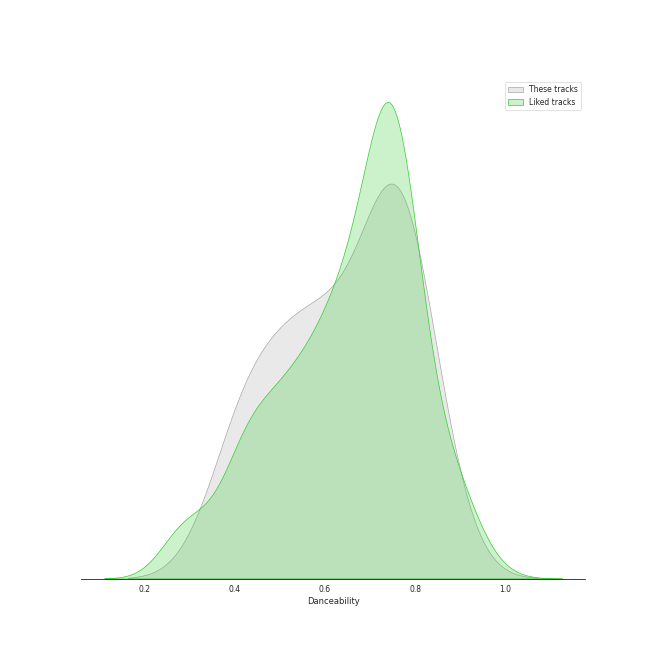
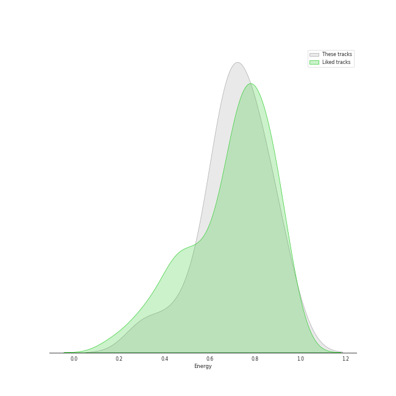
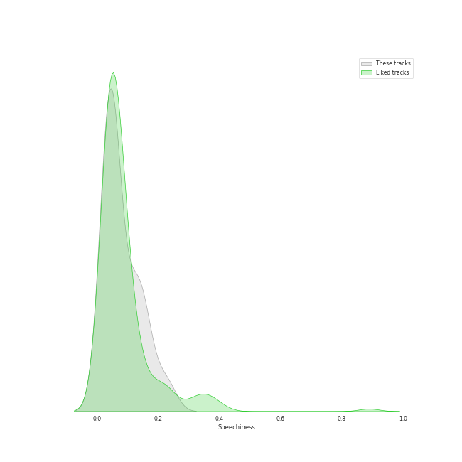
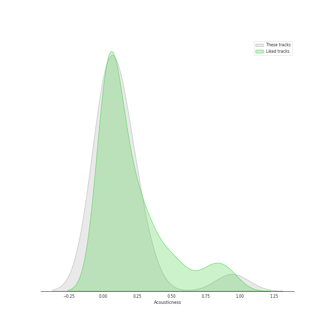
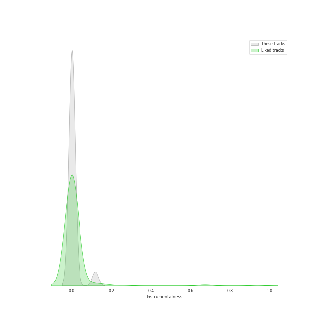
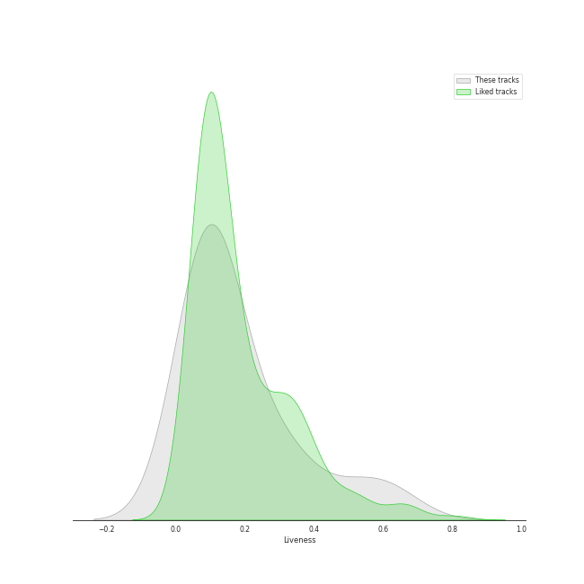
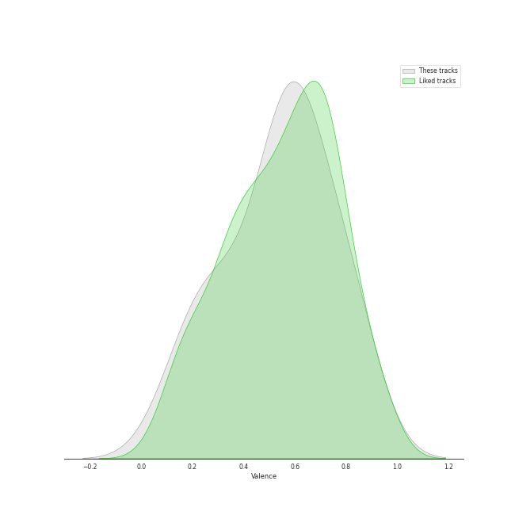

# Audio Features for Rihanna

## Danceability

| ​ | 10 most Danceable tracks | ​​ | 10 least Danceable tracks |
|:---|:---|:---|:---|
|  | Don't Stop The Music (0.835) |  | Half Of Me (0.391) |
|  | Only Girl (In The World) (0.788) |  | What Now (0.402) |
|  | The Monster (0.781) |  | Princess of China (0.42) |
|  | Pon de Replay (0.779) |  | Love On The Brain (0.509) |
|  | S&M (0.766) |  | Rude Boy (0.563) |
|  | Love The Way You Lie (0.749) |  | Umbrella (0.583) |
|  | Watch n' Learn (0.741) |  | Stay (0.621) |
|  | We Found Love (0.735) |  | This Is What You Came For (0.631) |
|  | Disturbia (0.707) |  | Take A Bow (0.697) |
|  | Take A Bow (0.697) |  | Disturbia (0.707) |

## Energy

| ​ | 10 most Energetic tracks | ​​ | 10 least Energetic tracks |
|:---|:---|:---|:---|
|  | This Is What You Came For (0.927) |  | Stay (0.31) |
|  | Love The Way You Lie (0.925) |  | Take A Bow (0.467) |
|  | The Monster (0.853) |  | Half Of Me (0.574) |
|  | Umbrella (0.829) |  | Love On The Brain (0.637) |
|  | Disturbia (0.813) |  | Pon de Replay (0.64) |
|  | Watch n' Learn (0.798) |  | Don't Stop The Music (0.669) |
|  | We Found Love (0.766) |  | S&M (0.682) |
|  | Rude Boy (0.75) |  | Princess of China (0.69) |
|  | Only Girl (In The World) (0.71) |  | What Now (0.696) |
|  | What Now (0.696) |  | Only Girl (In The World) (0.71) |

## Speechiness

| ​ | 10 most Speechy tracks | ​​ | 10 least Speechy tracks |
|:---|:---|:---|:---|
|  | Love The Way You Lie (0.227) |  | Stay (0.0283) |
|  | Pon de Replay (0.159) |  | This Is What You Came For (0.0332) |
|  | Umbrella (0.134) |  | Princess of China (0.0347) |
|  | Rude Boy (0.127) |  | We Found Love (0.0383) |
|  | Watch n' Learn (0.122) |  | Half Of Me (0.0397) |
|  | The Monster (0.0715) |  | S&M (0.0419) |
|  | Take A Bow (0.0715) |  | Only Girl (In The World) (0.0426) |
|  | Don't Stop The Music (0.0643) |  | What Now (0.0448) |
|  | Disturbia (0.0571) |  | Love On The Brain (0.0471) |
|  | Love On The Brain (0.0471) |  | Disturbia (0.0571) |

## Acousticness

| ​ | 10 most Acoustic tracks | ​​ | 10 least Acoustic tracks |
|:---|:---|:---|:---|
|  | Stay (0.945) |  | Pon de Replay (0.000155) |
|  | Take A Bow (0.248) |  | Watch n' Learn (0.00304) |
|  | Love The Way You Lie (0.241) |  | Princess of China (0.00385) |
|  | Half Of Me (0.214) |  | Umbrella (0.00864) |
|  | This Is What You Came For (0.199) |  | S&M (0.0113) |
|  | Rude Boy (0.113) |  | We Found Love (0.025) |
|  | Only Girl (In The World) (0.113) |  | Don't Stop The Music (0.0336) |
|  | Disturbia (0.0863) |  | What Now (0.0476) |
|  | Love On The Brain (0.0717) |  | The Monster (0.0525) |
|  | The Monster (0.0525) |  | Love On The Brain (0.0717) |

## Instrumentalness

| ​ | 10 most Instrumental tracks | ​​ | 10 least Instrumental tracks |
|:---|:---|:---|:---|
|  | This Is What You Came For (0.119) |  | What Now (0.0) |
|  | Princess of China (0.015) |  | Love The Way You Lie (0.0) |
|  | We Found Love (0.00138) |  | Disturbia (0.0) |
|  | Pon de Replay (0.00077) |  | Take A Bow (0.0) |
|  | S&M (0.00016) |  | The Monster (0.0) |
|  | Watch n' Learn (0.000134) |  | Umbrella (0.0) |
|  | Don't Stop The Music (6.92e-05) |  | Half Of Me (0.0) |
|  | Stay (6.12e-05) |  | Rude Boy (0.0) |
|  | Only Girl (In The World) (1.22e-05) |  | Love On The Brain (1.08e-05) |
|  | Love On The Brain (1.08e-05) |  | Only Girl (In The World) (1.22e-05) |

## Liveness

| ​ | 10 most Live tracks | ​​ | 10 least Live tracks |
|:---|:---|:---|:---|
|  | What Now (0.628) |  | Umbrella (0.0426) |
|  | Love The Way You Lie (0.52) |  | Don't Stop The Music (0.0535) |
|  | Half Of Me (0.36) |  | Only Girl (In The World) (0.0638) |
|  | Princess of China (0.287) |  | Rude Boy (0.0788) |
|  | Watch n' Learn (0.282) |  | Love On The Brain (0.0789) |
|  | Disturbia (0.168) |  | Take A Bow (0.0941) |
|  | This Is What You Came For (0.148) |  | Pon de Replay (0.101) |
|  | The Monster (0.12) |  | S&M (0.104) |
|  | Stay (0.117) |  | We Found Love (0.108) |
|  | We Found Love (0.108) |  | Stay (0.117) |

## Valence

| ​ | 10 most Happy tracks | ​​ | 10 least Happy tracks |
|:---|:---|:---|:---|
|  | S&M (0.833) |  | Stay (0.125) |
|  | Watch n' Learn (0.823) |  | What Now (0.227) |
|  | Rude Boy (0.812) |  | Princess of China (0.237) |
|  | Disturbia (0.722) |  | Half Of Me (0.308) |
|  | Love The Way You Lie (0.641) |  | Love On The Brain (0.378) |
|  | Only Girl (In The World) (0.632) |  | This Is What You Came For (0.465) |
|  | The Monster (0.624) |  | Pon de Replay (0.498) |
|  | We Found Love (0.6) |  | Don't Stop The Music (0.542) |
|  | Umbrella (0.575) |  | Take A Bow (0.572) |
|  | Take A Bow (0.572) |  | Umbrella (0.575) |

## Tempo

| ​ | 10 most Fast tracks | ​​ | 10 least Fast tracks |
|:---|:---|:---|:---|
|  | What Now (180.158) |  | Take A Bow (82.082) |
|  | Umbrella (174.028) |  | Princess of China (85.014) |
|  | Rude Boy (173.906) |  | Love The Way You Lie (86.989) |
|  | Love On The Brain (172.006) |  | Pon de Replay (99.019) |
|  | Watch n' Learn (168.01) |  | The Monster (110.049) |
|  | Half Of Me (147.435) |  | Stay (111.893) |
|  | We Found Love (127.985) |  | Don't Stop The Music (122.668) |
|  | S&M (127.966) |  | This Is What You Came For (123.962) |
|  | Only Girl (In The World) (125.919) |  | Disturbia (124.921) |
|  | Disturbia (124.921) |  | Only Girl (In The World) (125.919) |
