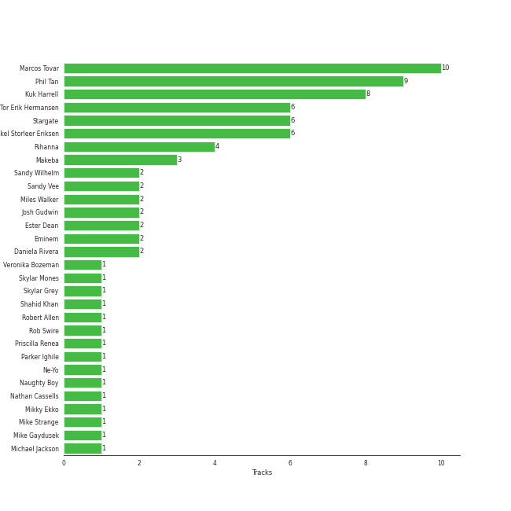

# Rihanna

[See Track Features](audio_features.md)

[See Clusters](clusters/overview.md)

## Artist Rank

## Featured on Playlists
| Art | Tracks | Playlist |
|:---|---:|:---|
|  | 15 | [Pop](../../playlists/pop/overview.md) |
|  | 11 | [R&B](../../playlists/r_b/overview.md) |
|  | 4 | [Workout](../../playlists/workout/overview.md) |
|  | 2 | [Halloween](../../playlists/halloween/overview.md) |
|  | 2 | [Tarps](../../playlists/tarps/overview.md) |
|  | 2 | [Hip Hop](../../playlists/hip_hop/overview.md) |
|  | 1 | [Modern Rock](../../playlists/modern_rock/overview.md) |
|  | 1 | [Karaoke](../../playlists/karaoke/overview.md) |

## Top Albums

| Art | Tracks | 💚 | Album | Release Date | 🔗 |
|:---|---:|---:|:---|:---|:---|
|  | 4 | 3 | Good Girl Gone Bad: Reloaded | 2008-06-02 | [🔗](https://open.spotify.com/album/3JSWZWeTHF4HDGt5Eozdy7) |
|  | 3 | 3 | Unapologetic (Deluxe) | 2012-12-11 | [🔗](https://open.spotify.com/album/4eddbruVtOqw8khwxSH6H2) |
|  | 2 | 2 | Talk That Talk | 2011-11-19 | [🔗](https://open.spotify.com/album/1Kw1bVd07oRqcjrcjQKC8T) |
|  | 2 | 2 | Loud | 2010-11-16 | [🔗](https://open.spotify.com/album/6UHhmTLl9T1scRYLmpHcDX) |
|  | 1 | 1 | The Marshall Mathers LP2 | 2013-11-05 | [🔗](https://open.spotify.com/album/3vOgbDjgsZBAPwV2M3bNOj) |
|  | 1 | 1 | Recovery | 2010-06-18 | [🔗](https://open.spotify.com/album/47BiFcV59TQi2s9SkBo2pb) |
|  | 1 | 1 | Rated R | 2009-11-20 | [🔗](https://open.spotify.com/album/7uGmyYwDFJbSc1xs4hkEs2) |
|  | 1 | 1 | ANTI (Deluxe) | 2016-01-28 | [🔗](https://open.spotify.com/album/4UlGauD7ROb3YbVOFMgW5u) |
|  | 1 | 0 | This Is What You Came For | 2016-04-29 | [🔗](https://open.spotify.com/album/3pEgGUv379EDinvg1TN7Kt) |
|  | 1 | 0 | Mylo Xyloto | 2011-10-24 | [🔗](https://open.spotify.com/album/2R7iJz5uaHjLEVnMkloO18) |

See all albums

| Art | Tracks | 💚 | Album | Release Date | 🔗 |
|:---|---:|---:|:---|:---|:---|
|  | 1 | 0 | Music Of The Sun | 2005-08-29 | [🔗](https://open.spotify.com/album/4FyGpObwABjn0o8Tdp7AZz) |

## Top Record Labels

| Tracks | 💚 | Label |
|---:|---:|:---|
| 13 | 11 | [Def Jam Recordings](../../labels/def_jam_recordings/overview.md) |
| 2 | 2 | Aftermath |
| 1 | 1 | Roc Nation |
| 1 | 1 | Rihanna |
| 1 | 0 | [Parlophone UK](../../labels/parlophone_uk/overview.md) |
| 1 | 0 | [Columbia](../../labels/columbia/overview.md) |

## Genres

- barbadian pop
- [pop](../../genres/pop/overview.md)
- urban contemporary

## Credits

### Credits by Type

| Credit Type | Tracks |
|:---|---:|
| Songwriter | 4 |
| Vocal | 5 |

### Production Credits

| Art | Track | Credit Types |
|:---|:---|:---|
|  | Rude Boy | Songwriter |
|  | Watch n' Learn | Songwriter |
|  | The Monster | Songwriter |
|  | Love On The Brain | Songwriter |

## Top Producers

| Art | Producer | Tracks | Credit Types |
|:---|:---|---:|:---|
| | Marcos Tovar | 10 | Producer |
| | Phil Tan | 9 | Producer |
| | Kuk Harrell | 8 | Producer |
| | Mikkel Storleer Eriksen | 6 | Songwriter, Producer |
| | Tor Erik Hermansen | 6 | Songwriter |
| | Stargate | 6 | Producer |
|  | [Rihanna](overview.md) | 4 | Songwriter |
| | Makeba | 3 | Producer, Songwriter |
|  | Eminem | 2 | Producer, Songwriter |
| | Sandy Wilhelm | 2 | Songwriter |

View all

| Art | Producer | Tracks | Credit Types |
|:---|:---|---:|:---|
| | Sandy Vee | 2 | Producer |
| | Miles Walker | 2 | Producer |
| | Josh Gudwin | 2 | Producer |
| | Daniela Rivera | 2 | Producer |
| | Ester Dean | 2 | Songwriter |
| | Parker Ighile | 1 | Producer, Songwriter |
|  | [Michael Jackson](../michael_jackson/overview.md) | 1 | Songwriter |
| | Kevin Davis | 1 | Producer |
| | Frankie Storm | 1 | Songwriter |
| | Skylar Grey | 1 | Songwriter |
| | Hit-Boy | 1 | Producer, Songwriter |
| | Frequency | 1 | Producer, Songwriter |
|  | Chris Brown | 1 | Songwriter |
| | Shahid Khan | 1 | Songwriter |
| | Crystal Nicole | 1 | Songwriter |
| | Al Hemberger | 1 | Producer |
| | Mike Gaydusek | 1 | Producer |
| | Rob Swire | 1 | Producer, Songwriter |
| | Elof Loelv | 1 | Producer, Songwriter |
| | Justin Parker | 1 | Arranger, Producer, Songwriter |
|  | Bebe Rexha | 1 | Songwriter |
| | Veronika Bozeman | 1 | Producer |
| | Robert Allen | 1 | Songwriter |
|  | Ne-Yo | 1 | Producer, Songwriter |
| | Andre Merritt | 1 | Songwriter |
| | Andrew Vastola | 1 | Producer |
| | Nathan Cassells | 1 | Producer, Songwriter |
| | Alex da Kid | 1 | Producer, Songwriter |
| | Fred Ball | 1 | Producer, Songwriter |
| | Naughty Boy | 1 | Producer |
| | Jon Bellion | 1 | Songwriter |
| | Skylar Mones | 1 | Producer |
| | Livvi Franc | 1 | Songwriter |
| | Brian Kennedy | 1 | Producer, Songwriter |
| | Mike Strange | 1 | Producer |
| | Manny Marroquin | 1 | Producer |
| | Josh Houghkirk | 1 | Producer |
| | Aalias | 1 | Songwriter |
| | Alju Jackson | 1 | Songwriter |
| | Maki Athanasiou | 1 | Songwriter |
| | Emeli Sandé (Sandé, Emeli) | 1 | Songwriter |
| | Joseph Angel | 1 | Arranger, Songwriter |
| | Priscilla Renea | 1 | Songwriter |
|  | Calvin Harris | 1 | Producer, Songwriter |
|  | Mikky Ekko | 1 | Arranger, Producer, Songwriter |

## Tracks

| Art | Track | Album | Artists | Label | 💚 | 🔗 |
|:---|:---|:---|:---|:---|:---|:---|
|  | This Is What You Came For | This Is What You Came For | Calvin Harris, [Rihanna](overview.md) | [Columbia](../../labels/columbia) | | [🔗](https://open.spotify.com/track/0azC730Exh71aQlOt9Zj3y) |
|  | Princess of China | Mylo Xyloto | [Coldplay](../coldplay/overview.md), [Rihanna](overview.md) | [Parlophone UK](../../labels/parlophone_uk) | | [🔗](https://open.spotify.com/track/4HXOBjwv2RnLpGG4xWOO6N) |
|  | Love The Way You Lie | Recovery | Eminem, [Rihanna](overview.md) | Aftermath | 💚 | [🔗](https://open.spotify.com/track/15JINEqzVMv3SvJTAXAKED) |
|  | The Monster | The Marshall Mathers LP2 | Eminem, [Rihanna](overview.md) | Aftermath | 💚 | [🔗](https://open.spotify.com/track/48RrDBpOSSl1aLVCalGl5C) |
|  | Pon de Replay | Music Of The Sun | [Rihanna](overview.md) | [Def Jam Recordings](../../labels/def_jam_recordings) | | [🔗](https://open.spotify.com/track/4TsmezEQVSZNNPv5RJ65Ov) |
|  | Disturbia | Good Girl Gone Bad: Reloaded | [Rihanna](overview.md) | [Def Jam Recordings](../../labels/def_jam_recordings) | 💚 | [🔗](https://open.spotify.com/track/2VOomzT6VavJOGBeySqaMc) |
|  | Don't Stop The Music | Good Girl Gone Bad: Reloaded | [Rihanna](overview.md) | [Def Jam Recordings](../../labels/def_jam_recordings) | 💚 | [🔗](https://open.spotify.com/track/0ByMNEPAPpOR5H69DVrTNy) |
|  | Take A Bow | Good Girl Gone Bad: Reloaded | [Rihanna](overview.md) | [Def Jam Recordings](../../labels/def_jam_recordings) | 💚 | [🔗](https://open.spotify.com/track/3goSVuTt3fDYDP6kRnFwuL) |
|  | Umbrella | Good Girl Gone Bad: Reloaded | [Rihanna](overview.md), JAY-Z | [Def Jam Recordings](../../labels/def_jam_recordings) | | [🔗](https://open.spotify.com/track/49FYlytm3dAAraYgpoJZux) |
|  | Rude Boy | Rated R | [Rihanna](overview.md) | [Def Jam Recordings](../../labels/def_jam_recordings) | 💚 | [🔗](https://open.spotify.com/track/60jzFy6Nn4M0iD1d94oteF) |

See all tracks

| Art | Track | Album | Artists | Label | 💚 | 🔗 |
|:---|:---|:---|:---|:---|:---|:---|
|  | Only Girl (In The World) | Loud | [Rihanna](overview.md) | [Def Jam Recordings](../../labels/def_jam_recordings) | 💚 | [🔗](https://open.spotify.com/track/1VDXQhu7YGdbM6UeEIfsaX) |
|  | S&M | Loud | [Rihanna](overview.md) | [Def Jam Recordings](../../labels/def_jam_recordings) | 💚 | [🔗](https://open.spotify.com/track/08Bfk5Y2S5fCxgxk371Eel) |
|  | Watch n' Learn | Talk That Talk | [Rihanna](overview.md) | [Def Jam Recordings](../../labels/def_jam_recordings) | 💚 | [🔗](https://open.spotify.com/track/1ROCX1nquOZ5i05YfGysu0) |
|  | We Found Love | Talk That Talk | [Rihanna](overview.md), Calvin Harris | [Def Jam Recordings](../../labels/def_jam_recordings) | 💚 | [🔗](https://open.spotify.com/track/0U10zFw4GlBacOy9VDGfGL) |
|  | Half Of Me | Unapologetic (Deluxe) | [Rihanna](overview.md) | [Def Jam Recordings](../../labels/def_jam_recordings) | 💚 | [🔗](https://open.spotify.com/track/4bXImuY3OhNXhbQbVLFHKp) |
|  | Stay | Unapologetic (Deluxe) | [Rihanna](overview.md), Mikky Ekko | [Def Jam Recordings](../../labels/def_jam_recordings) | 💚 | [🔗](https://open.spotify.com/track/1dEy9Pl81QopSxNsPxXQxv) |
|  | What Now | Unapologetic (Deluxe) | [Rihanna](overview.md) | [Def Jam Recordings](../../labels/def_jam_recordings) | 💚 | [🔗](https://open.spotify.com/track/0aUWfpD3PlSv3FTTKcT2rN) |
|  | Love On The Brain | ANTI (Deluxe) | [Rihanna](overview.md) | Roc Nation / Rihanna | 💚 | [🔗](https://open.spotify.com/track/5oO3drDxtziYU2H1X23ZIp) |

