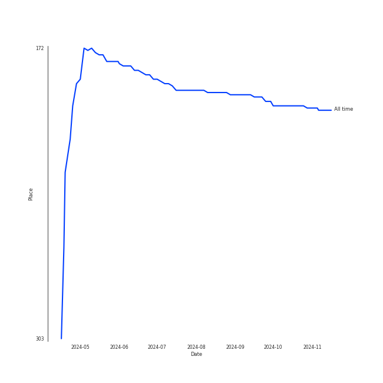
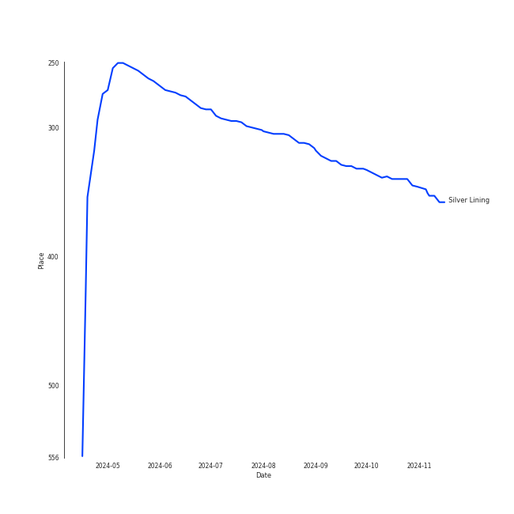
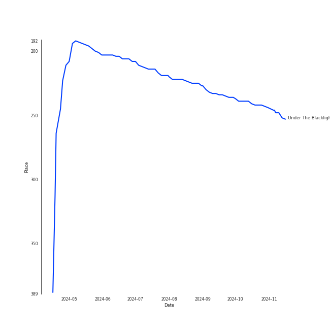

# Rilo Kiley

## Relationships

Rilo Kiley:
- has member Mike Bloom
- has member Jason Boesel
- has member Jenny Lewis
- has member Pierre de Reeder
- has member Blake Sennett

## Artist Rank
- The #190 artist of all time

## Top Tracks

### Top tracks of all time

## Top Albums

| Art | Rank | Tracks | 💚 | Album | Release Date | 🔗 |
|:---|---:|---:|---:|:---|:---|:---|
|  | 581 | 3 | 3 | More Adventurous (U.S. Release) | 2004-07-27 | [🔗](https://open.spotify.com/album/4n36X2GMJ84BKh9D9zMRVI) |
|  | 581 | 2 | 1 | The Execution Of All Things | 2002-10-01 | [🔗](https://open.spotify.com/album/1aFyAtSRxLNzSTGwHMRvWj) |
|  | 212 | 1 | 1 | Under The Blacklight (Standard Version) | 2007-08-20 | [🔗](https://open.spotify.com/album/2f9RsTZpsYMLRVZBtW7En8) |

## Featured on Playlists
| Art | Tracks | Playlist |
|:---|---:|:---|
|  | 6 | [Modern Rock](../../playlists/modern_rock/overview.md) |
|  | 2 | [A-Pop Favorites](../../playlists/a-pop_favorites/overview.md) |
|  | 1 | [Repeat Rewind](../../playlists/repeat_rewind/overview.md) |
|  | 1 | [Karaoke](../../playlists/karaoke/overview.md) |
|  | 1 | [Chill](../../playlists/chill/overview.md) |

## Top Record Labels

| Tracks | 💚 | Label |
|---:|---:|:---|
| 4 | 4 | [Warner Records](../../labels/warner_records/overview.md) |
| 3 | 3 | Brute |
| 3 | 3 | Beaute |
| 2 | 1 | Saddle Creek |

## Genres

- chamber pop
- funktronica
- indie pop
- indie rock
- la indie
- [lilith](../../genres/lilith/overview.md)

## Credits

### Credits by Type

| Credit Type | Tracks |
|:---|---:|
| Producer | 1 |

### Member Credits

| | Blake Sennett | Jason Boesel | Jenny Lewis | Pierre de Reeder |
|:---|---:|---:|---:|---:|
| Instrument | 3 | 3 | 2 | 2 |
| Lyricist | 0 | 0 | 3 | 0 |
| Songwriter | 4 | 0 | 6 | 0 |
| Vocal | 1 | 0 | 3 | 0 |
### Production Credits

| Art | Track | Members | Credit Types |
|:---|:---|:---|:---|
|  | The Execution Of All Things | Jenny Lewis, Blake Sennett | Songwriter |
|  | Portions for Foxes | Jenny Lewis, Blake Sennett | Lyricist, Songwriter |
|  | Does He Love You? | Jenny Lewis, Blake Sennett | Lyricist, Songwriter |
|  | Accidntel Deth | Jenny Lewis | Lyricist, Songwriter |
|  | Silver Lining | [Rilo Kiley](.), Jenny Lewis | Producer, Songwriter |

## Top Producers

| Art | Producer | Tracks | Credit Types |
|:---|:---|---:|:---|
| | Jenny Lewis | 5 | Lyricist, Songwriter |
| | Mike Mogis | 3 | Producer |
| | Blake Sennett | 3 | Songwriter |
| | Mark Trombino | 1 | Producer |
| | Jimmy Tamborello | 1 | Producer |
| | Jason Lader | 1 | Producer |
| | Ben Boyer | 1 | Songwriter |
|  | [Rilo Kiley](overview.md) | 1 | Producer |
| | Nate Walcott | 1 | Arranger |

## Tracks

| Art | Track | Album | Artists | Label | Rank | 💚 | 🔗 |
|:---|:---|:---|:---|:---|---:|:---|:---|
|  | Silver Lining | Under The Blacklight (Standard Version) | [Rilo Kiley](overview.md) | [Warner Records](../../labels/warner_records) | 290 | 💚 | [🔗](https://open.spotify.com/track/0ieqq1wbtso2UjJWPqJ5Xc) |
|  | A Better Son/Daughter | The Execution Of All Things | [Rilo Kiley](overview.md) | Saddle Creek | 868 | | [🔗](https://open.spotify.com/track/1OrBPFs8yLkT02aLiloHQs) |
|  | The Execution Of All Things | The Execution Of All Things | [Rilo Kiley](overview.md) | Saddle Creek | 868 | 💚 | [🔗](https://open.spotify.com/track/3POpqoO9i1UB6WzYZ0MvOC) |
|  | Accidntel Deth | More Adventurous (U.S. Release) | [Rilo Kiley](overview.md) | [Brute/Beaute/Warner Records](../../labels/warner_records) | 868 | 💚 | [🔗](https://open.spotify.com/track/7KJymi3dZGLPvxmOYyWwxz) |
|  | Does He Love You? | More Adventurous (U.S. Release) | [Rilo Kiley](overview.md) | [Brute/Beaute/Warner Records](../../labels/warner_records) | 868 | 💚 | [🔗](https://open.spotify.com/track/56J7o1BuXpJH2UXqElmsEF) |
|  | Portions for Foxes | More Adventurous (U.S. Release) | [Rilo Kiley](overview.md) | [Brute/Beaute/Warner Records](../../labels/warner_records) | 868 | 💚 | [🔗](https://open.spotify.com/track/4yY8JqTOQyi7K4O1QcQtBG) |
