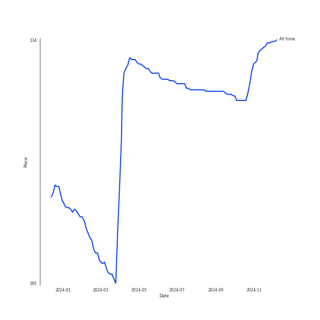
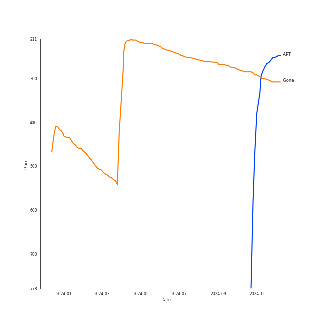
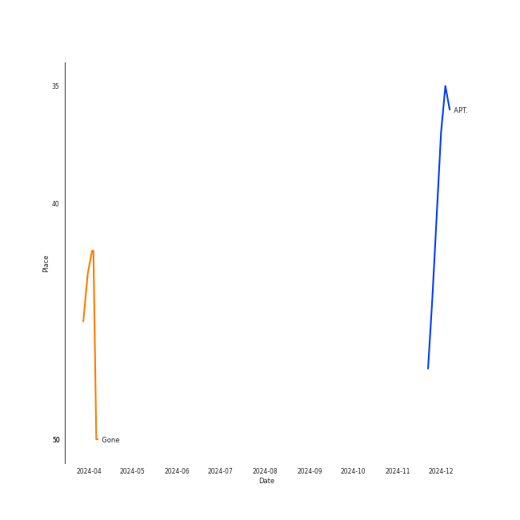
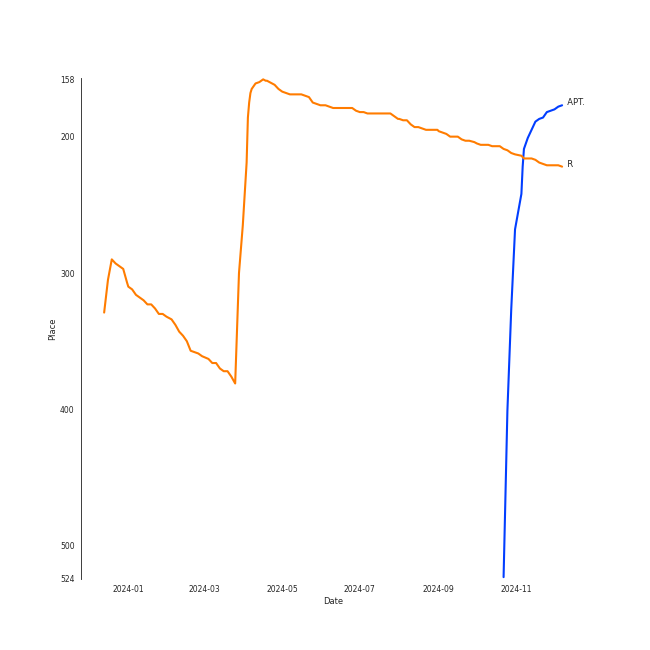
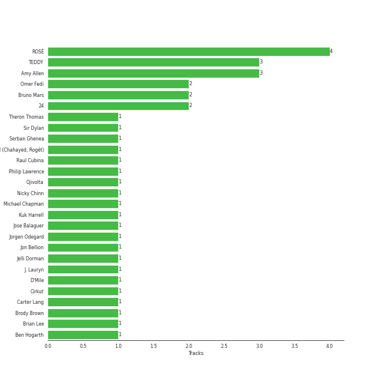

# ROSÉ

## Relationships

ROSÉ:
- is a member of [BLACKPINK](../blackpink/overview.md)

## Artist Rank
ROSÉ is currently:
- The #13 artist of the last month
- The #134 artist of all time

## Top Tracks

### Top tracks of all time

Top tracks of the last 6 months over time

## Top Albums

| Art | Rank | Tracks | 💚 | Album | Release Date | 🔗 |
|:---|---:|---:|---:|:---|:---|:---|
|  | 690 | 9 | 2 | rosie | 2024-12-06 | [🔗](https://open.spotify.com/album/7kFyd5oyJdVX2pIi6P4iHE) |
|  | 222 | 2 | 2 | R | 2021-03-12 | [🔗](https://open.spotify.com/album/5BQcoDfcZ8aBcikYX9B7Ob) |
|  | 177 | 1 | 1 | APT. | 2024-10-18 | [🔗](https://open.spotify.com/album/2IYQwwgxgOIn7t3iF6ufFD) |

## Featured on Playlists
| Art | Tracks | Playlist |
|:---|---:|:---|
|  | 7 | [K-Pop](../../playlists/k-pop/overview.md) |
|  | 5 | [Check Out Later](../../playlists/check_out_later/overview.md) |
|  | 5 | [Recent Comebacks](../../playlists/recent_comebacks/overview.md) |
|  | 2 | [Singer-Songwriter](../../playlists/singer-songwriter/overview.md) |
|  | 1 | [My Top Songs 2024](../../playlists/my_top_songs_2024/overview.md) |
|  | 1 | [K-Pop Favorites](../../playlists/k-pop_favorites/overview.md) |
|  | 1 | [My Top Songs 2022](../../playlists/my_top_songs_2022/overview.md) |
|  | 1 | [Chill](../../playlists/chill/overview.md) |

## Top Record Labels

| Tracks | 💚 | Label |
|---:|---:|:---|
| 10 | 3 | [Atlantic Records](../../labels/atlantic_records/overview.md) |
| 2 | 2 | [YG Entertainment](../../labels/yg_entertainment/overview.md) |
| 2 | 2 | [Interscope Records](../../labels/interscope_records/overview.md) |

## Genres

- [k-pop](../../genres/k-pop/overview.md)

## Credits

### Credits by Type

| Credit Type | Tracks |
|:---|---:|
| Lyricist | 1 |
| Performer | 1 |
| Producer | 2 |
| Songwriter | 5 |
| Vocal | 20 |

### Production Credits

| Art | Track | Credit Types |
|:---|:---|:---|
|  | Gone | Songwriter |
|  | On The Ground | Songwriter |
|  | Yeah Yeah Yeah | Lyricist |
|  | APT. | Songwriter |
| | nan | Producer, Songwriter |

## Top Producers

| Art | Producer | Tracks | Credit Types |
|:---|:---|---:|:---|
|  | [ROSÉ](overview.md) | 4 | Songwriter, Producer |
| | Amy Allen | 3 | Songwriter |
| | [TEDDY](../../producers/teddy/overview.md) | 3 | Songwriter, Producer |
| | Omer Fedi | 2 | Songwriter, Producer |
|  | [Bruno Mars](../bruno_mars/overview.md) | 2 | Songwriter, Producer |
| | [24](../../producers/24/overview.md) | 2 | Producer |
| | Carter Lang | 1 | Producer, Songwriter |
| | Jon Bellion | 1 | Producer, Songwriter |
| | [Serban Ghenea](../../producers/serban_ghenea/overview.md) | 1 | Producer |
| | Ben Hogarth | 1 | Producer |

View all

| Art | Producer | Tracks | Credit Types |
|:---|:---|---:|:---|
| | Rogét Chahayed (Chahayed, Rogét) | 1 | Songwriter |
| | Sir Dylan | 1 | Producer, Songwriter |
| | Jelli Dorman | 1 | Producer |
| | [Kuk Harrell](../../producers/kuk_harrell/overview.md) | 1 | Producer |
| | Michael Chapman | 1 | Songwriter |
| | J. Lauryn | 1 | Songwriter |
| | Theron Thomas | 1 | Songwriter |
| | [Cirkut](../../producers/cirkut/overview.md) | 1 | Songwriter |
| | Brian Lee | 1 | Producer, Songwriter |
| | Jorgen Odegard | 1 | Producer, Songwriter |
| | Ojivolta | 1 | Producer |
| | D'Mile | 1 | Producer, Songwriter |
| | Brody Brown | 1 | Songwriter |
| | Raul Cubina | 1 | Songwriter |
| | Philip Lawrence | 1 | Songwriter |
| | Nicky Chinn | 1 | Songwriter |
| | Jose Balaguer | 1 | Producer |

## Tracks

| Art | Track | Album | Artists | Label | Rank | 💚 | 🔗 |
|:---|:---|:---|:---|:---|---:|:---|:---|
|  | APT. | APT. | [ROSÉ](overview.md), [Bruno Mars](../bruno_mars/overview.md) | [Atlantic Records](../../labels/atlantic_records) | 248 | 💚 | [🔗](https://open.spotify.com/track/5vNRhkKd0yEAg8suGBpjeY) |
|  | Gone | R | [ROSÉ](overview.md) | [Interscope Records](../../labels/interscope_records), [YG Entertainment](../../labels/yg_entertainment) | 308 | 💚 | [🔗](https://open.spotify.com/track/2dHoVW9AxJVSRebPRyV2aA) |
|  | On The Ground | R | [ROSÉ](overview.md) | [Interscope Records](../../labels/interscope_records), [YG Entertainment](../../labels/yg_entertainment) | 1046 | 💚 | [🔗](https://open.spotify.com/track/2pn8dNVSpYnAtlKFC8Q0DJ) |
|  | 3am | rosie | [ROSÉ](overview.md) | [Atlantic Records](../../labels/atlantic_records) | 1046 | | [🔗](https://open.spotify.com/track/3y4q6bBdbXsTIaPiwiiUfy) |
|  | call it the end | rosie | [ROSÉ](overview.md) | [Atlantic Records](../../labels/atlantic_records) | 1046 | | [🔗](https://open.spotify.com/track/5a3tLTGA0HIDtrvnszXXBN) |
|  | dance all night | rosie | [ROSÉ](overview.md) | [Atlantic Records](../../labels/atlantic_records) | 1046 | | [🔗](https://open.spotify.com/track/50aQbgfdydBXABx2gATQHn) |
|  | drinks or coffee | rosie | [ROSÉ](overview.md) | [Atlantic Records](../../labels/atlantic_records) | 1046 | | [🔗](https://open.spotify.com/track/3fpWkbEZMP1BgOOfymwoaS) |
|  | gameboy | rosie | [ROSÉ](overview.md) | [Atlantic Records](../../labels/atlantic_records) | 1046 | | [🔗](https://open.spotify.com/track/77n3jFGqPPxYrEGwrWylNv) |
|  | number one girl | rosie | [ROSÉ](overview.md) | [Atlantic Records](../../labels/atlantic_records) | 1046 | 💚 | [🔗](https://open.spotify.com/track/1lcBt7LoEikqYmhUoa2cez) |
|  | stay a little longer | rosie | [ROSÉ](overview.md) | [Atlantic Records](../../labels/atlantic_records) | 1046 | 💚 | [🔗](https://open.spotify.com/track/5OdI6v2L7Aez4cclpbojiZ) |

See all tracks

| Art | Track | Album | Artists | Label | Rank | 💚 | 🔗 |
|:---|:---|:---|:---|:---|---:|:---|:---|
|  | too bad for us | rosie | [ROSÉ](overview.md) | [Atlantic Records](../../labels/atlantic_records) | 1046 | | [🔗](https://open.spotify.com/track/3tDF6qjNrabjnb23RB2rpa) |
|  | toxic till the end | rosie | [ROSÉ](overview.md) | [Atlantic Records](../../labels/atlantic_records) | 1046 | | [🔗](https://open.spotify.com/track/1z5ebC9238uGoBgzYyvGpQ) |

