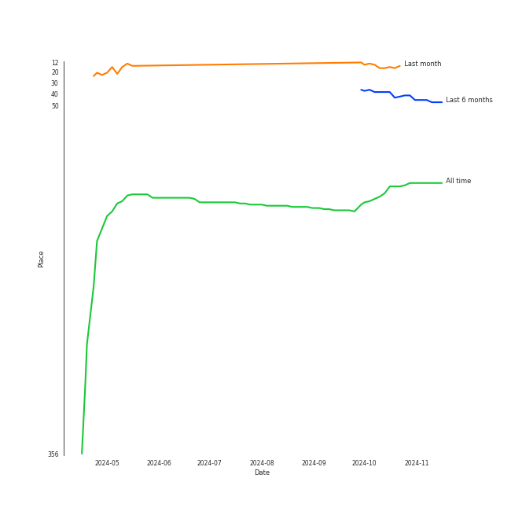
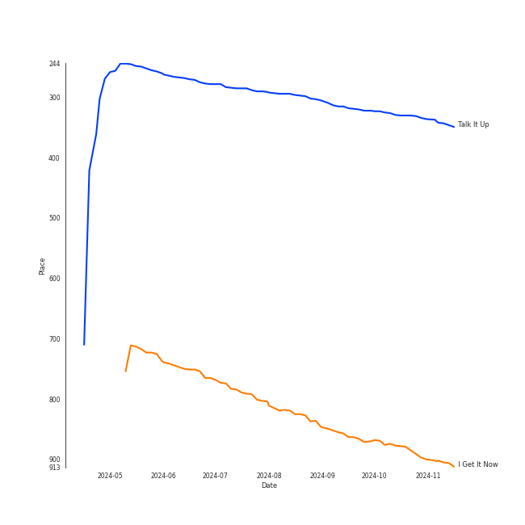

# Sammy Rae & The Friends

[See Track Features](audio_features.md)

[See Clusters](clusters/overview.md)

## Artist Rank
Sammy Rae & The Friends is currently:
- The #45 artist of the last 6 months
- The #118 artist of all time

## Top Tracks

### Top tracks of all time

## Top Albums

| Art | Rank | Tracks | 💚 | Album | Release Date | 🔗 |
|:---|---:|---:|---:|:---|:---|:---|
|  | 665 | 4 | 2 | Something for Everybody | 2024-09-20 | [🔗](https://open.spotify.com/album/0t0hNxHpqtvn7dT3YO18ma) |
|  | 243 | 3 | 2 | The Good Life | 2018-07-10 | [🔗](https://open.spotify.com/album/4s1igjt5YJe7s7BdCeX3DX) |
|  | 599 | 3 | 2 | I Get It Now | 2024-04-12 | [🔗](https://open.spotify.com/album/5zZHAGHasjwkR9B1xX3Xq6) |
|  | 665 | 1 | 0 | Whatever We Feel | 2020-04-03 | [🔗](https://open.spotify.com/album/4Qcemk272gcxq9D6ca40Xz) |
|  | 665 | 1 | 0 | Saw It Coming | 2019-05-10 | [🔗](https://open.spotify.com/album/1rMlFYPvk8FFDQYIJ8pudV) |
|  | 665 | 1 | 0 | Jackie Onassis | 2020-06-05 | [🔗](https://open.spotify.com/album/0E8rl16O1VgYyRMRzff3r6) |

## Featured on Playlists
| Art | Tracks | Playlist |
|:---|---:|:---|
|  | 13 | [Alt-Pop](../../playlists/alt-pop/overview.md) |
|  | 8 | [Singer-Songwriter](../../playlists/singer-songwriter/overview.md) |
|  | 1 | [Summer](../../playlists/summer/overview.md) |
|  | 1 | [Recommendations for Jeff](../../playlists/recommendations_for_jeff/overview.md) |
|  | 1 | [A-Pop Favorites](../../playlists/a-pop_favorites/overview.md) |

## Top Record Labels

| Tracks | 💚 | Label |
|---:|---:|:---|
| 13 | 6 | [Nettwerk Music Group](../../labels/nettwerk_music_group/overview.md) |

## Genres

- nyc pop

## Tracks

| Art | Track | Album | Artists | Label | Rank | 💚 | 🔗 |
|:---|:---|:---|:---|:---|---:|:---|:---|
|  | Talk It Up | The Good Life | [Sammy Rae & The Friends](overview.md) | [Nettwerk Music Group](../../labels/nettwerk_music_group) | 340 | 💚 | [🔗](https://open.spotify.com/track/7FQCZ5i5bmQ76LoGHyVcX0) |
|  | I Get It Now | I Get It Now | [Sammy Rae & The Friends](overview.md) | [Nettwerk Music Group](../../labels/nettwerk_music_group) | 909 | 💚 | [🔗](https://open.spotify.com/track/03ECDyILFfQ98k106zwcIt) |
|  | Kick It to Me | The Good Life | [Sammy Rae & The Friends](overview.md) | [Nettwerk Music Group](../../labels/nettwerk_music_group) | 1015 | 💚 | [🔗](https://open.spotify.com/track/6QZbDUZEgkwaVWROtWzjQ0) |
|  | The Feeling | The Good Life | [Sammy Rae & The Friends](overview.md) | [Nettwerk Music Group](../../labels/nettwerk_music_group) | 1015 | | [🔗](https://open.spotify.com/track/0dmCos7GHCr5PRKp5LNGH7) |
|  | Saw It Coming | Saw It Coming | [Sammy Rae & The Friends](overview.md) | [Nettwerk Music Group](../../labels/nettwerk_music_group) | 1015 | | [🔗](https://open.spotify.com/track/0hU26xDCONlEnAtcMGw4NC) |
|  | Whatever We Feel | Whatever We Feel | [Sammy Rae & The Friends](overview.md) | [Nettwerk Music Group](../../labels/nettwerk_music_group) | 1015 | | [🔗](https://open.spotify.com/track/4H9jGVkfJkjc6pWFfn2KSN) |
|  | Jackie Onassis | Jackie Onassis | [Sammy Rae & The Friends](overview.md) | [Nettwerk Music Group](../../labels/nettwerk_music_group) | 1015 | | [🔗](https://open.spotify.com/track/7GPBA8xjMJyN6SjoKd4O9E) |
|  | Coming Home Song | I Get It Now | [Sammy Rae & The Friends](overview.md) | [Nettwerk Music Group](../../labels/nettwerk_music_group) | 1015 | | [🔗](https://open.spotify.com/track/3RhLH5ROodko8Se1kRpjJ1) |
|  | Thieves | I Get It Now | [Sammy Rae & The Friends](overview.md) | [Nettwerk Music Group](../../labels/nettwerk_music_group) | 1015 | 💚 | [🔗](https://open.spotify.com/track/5v4JBxzAfArnWg3n3MhRRl) |
|  | Coming Home Song | Something for Everybody | [Sammy Rae & The Friends](overview.md) | [Nettwerk Music Group](../../labels/nettwerk_music_group) | 1015 | 💚 | [🔗](https://open.spotify.com/track/4XeCHgZ6vhNwFFaV1zR8oS) |

See all tracks

| Art | Track | Album | Artists | Label | Rank | 💚 | 🔗 |
|:---|:---|:---|:---|:---|---:|:---|:---|
|  | Good Time Tavern | Something for Everybody | [Sammy Rae & The Friends](overview.md) | [Nettwerk Music Group](../../labels/nettwerk_music_group) | 1015 | | [🔗](https://open.spotify.com/track/5ETuNqDyD25GQ6ygYHaDcd) |
|  | No Rulebook | Something for Everybody | [Sammy Rae & The Friends](overview.md) | [Nettwerk Music Group](../../labels/nettwerk_music_group) | 1015 | | [🔗](https://open.spotify.com/track/0E9uXoHs9JLyl6pjTVc8Qe) |
|  | Thieves | Something for Everybody | [Sammy Rae & The Friends](overview.md) | [Nettwerk Music Group](../../labels/nettwerk_music_group) | 1015 | 💚 | [🔗](https://open.spotify.com/track/1w74CVsaIhyxbW3LvYdB9s) |

