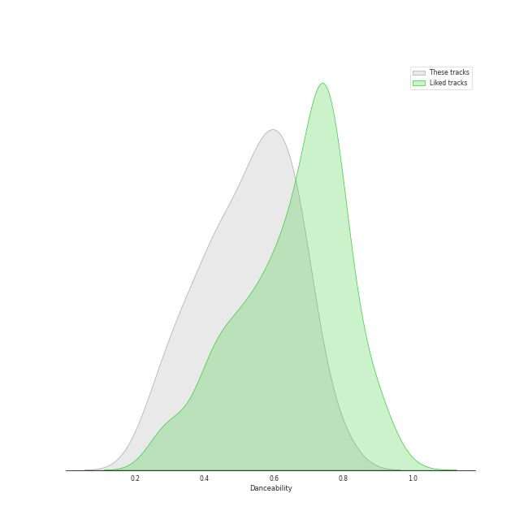
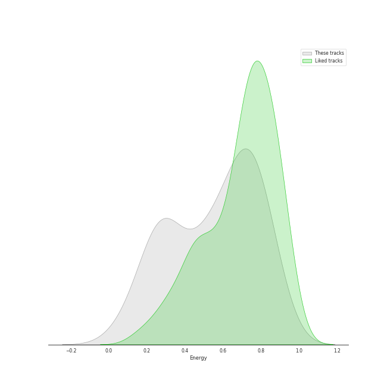
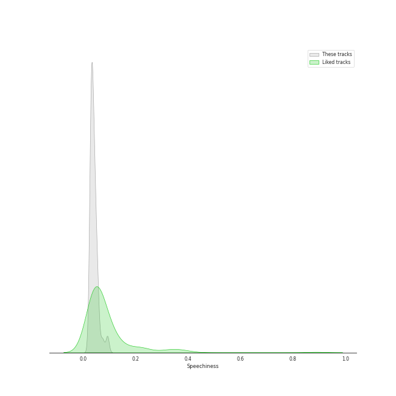
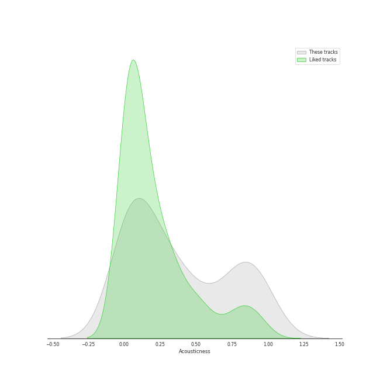
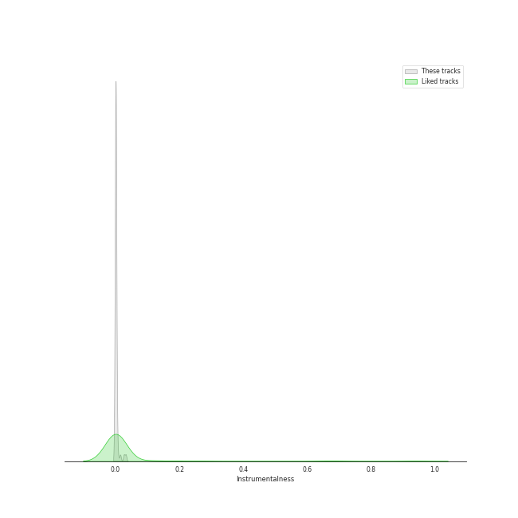
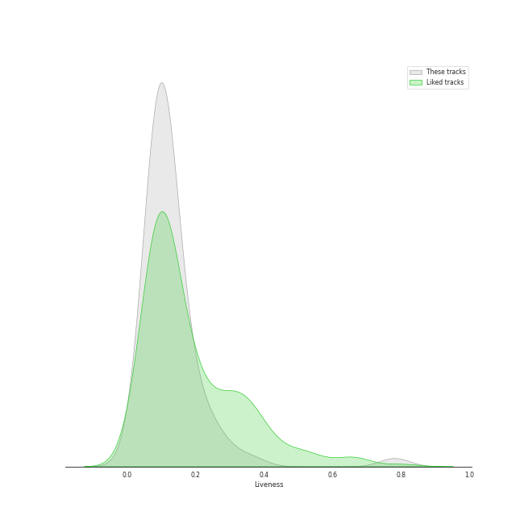
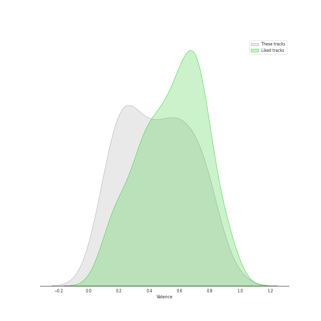
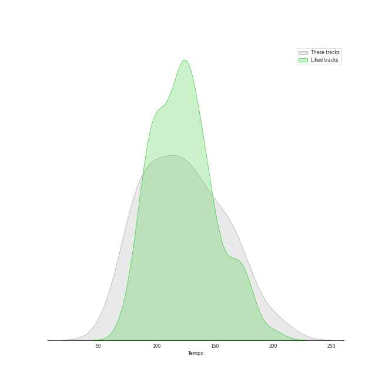

# Audio Features for Sara Bareilles

## Danceability

| 10 most Danceable tracks | 10 least Danceable tracks |
|:---|:---|
| Little Black Dress (0.787) | Gravity (0.231) |
| Eden (0.776) | Stay (0.262) |
| I Choose You (0.731) | Gravity (0.27) |
| I Didn't Plan It (0.695) | Once Upon Another Time (0.275) |
| Let The Rain (0.694) | City (0.319) |
| Lie To Me (0.683) | Come Round Soon (0.338) |
| No Such Thing (0.677) | Bluebird (0.34) |
| King of Anything (0.676) | Bright Lights and Cityscapes (0.343) |
| Miss Simone (0.674) | Everything Changes (0.348) |
| Not Alone (0.673) | Breathe Again (0.366) |

## Energy

| 10 most Energetic tracks | 10 least Energetic tracks |
|:---|:---|
| Bad Idea (feat. Jason Mraz) (0.889) | Kaleidoscope Heart (0.0516) |
| Morningside (0.88) | Goodbye Yellow Brick Road - Live at the Variety Playhouse, Atlanta, GA - May 2013 (0.114) |
| Let The Rain (0.873) | Manhattan (0.168) |
| Fairytale (0.857) | Bright Lights and Cityscapes (0.184) |
| Brave (0.836) | Bluebird (0.203) |
| Love On the Rocks (0.819) | Once Upon Another Time (0.216) |
| Come Round Soon (0.819) | What's Inside (0.242) |
| One Sweet Love (0.812) | Gravity (0.243) |
| Gonna Get Over You (0.799) | Basket Case (0.273) |
| Chasing The Sun (0.794) | Gravity (0.275) |

## Speechiness

| 10 most Speechy tracks | 10 least Speechy tracks |
|:---|:---|
| I Want You Back (feat. Sara Bareilles) (0.113) | Satellite Call (0.0241) |
| Opening Up (0.0936) | Machine Gun (0.0268) |
| Kaleidoscope Heart (0.0927) | Orpheus (0.0269) |
| Come Round Soon (0.0776) | Sweet As Whole (0.0275) |
| Bad Idea (feat. Jason Mraz) (0.0704) | Breathe Again (0.0278) |
| Love Won't Let You Get Away (0.0584) | Islands (0.0284) |
| Fire (0.057) | If I Can't Have You (0.0297) |
| Eden (0.0562) | The Light (0.0297) |
| Little Black Dress (0.0554) | Gonna Get Over You (0.0301) |
| Poetry by Dead Men (0.0535) | Love Song (0.0301) |

## Acousticness

| 10 most Acoustic tracks | 10 least Acoustic tracks |
|:---|:---|
| Bright Lights and Cityscapes (0.977) | Brave (0.00502) |
| Manhattan (0.972) | Many the Miles (0.00796) |
| Goodbye Yellow Brick Road - Live at the Variety Playhouse, Atlanta, GA - May 2013 (0.959) | Vegas (0.00881) |
| Bluebird (0.933) | Bad Idea (feat. Jason Mraz) (0.0168) |
| What's Inside (0.919) | Wicked Love (0.0178) |
| Gravity (0.918) | Gonna Get Over You (0.0199) |
| Teach You - Acoustic (0.899) | Love Song (0.0208) |
| Once Upon Another Time (0.896) | Let The Rain (0.023) |
| Miss Simone (0.859) | Say You're Sorry (0.0253) |
| Gravity (0.834) | Eden (0.0257) |

## Instrumentalness

| 10 most Instrumental tracks | 10 least Instrumental tracks |
|:---|:---|
| Satellite Call (0.0318) | Say You're Sorry (0.0) |
| Islands (0.0261) | Sweet As Whole (0.0) |
| Armor (0.0145) | Gravity (0.0) |
| Breathe Again (0.00655) | Come Round Soon (0.0) |
| Miss Simone (0.00407) | Kaleidoscope Heart (0.0) |
| The Light (0.00375) | Everything Changes (0.0) |
| No Such Thing (0.00175) | Vegas (0.0) |
| Fire (0.00165) | Hercules (0.0) |
| Stay (0.00154) | Fairytale (0.0) |
| December (0.00117) | Bad Idea (feat. Jason Mraz) (0.0) |

## Liveness

| 10 most Live tracks | 10 least Live tracks |
|:---|:---|
| Goodbye Yellow Brick Road - Live at the Variety Playhouse, Atlanta, GA - May 2013 (0.781) | Uncharted (0.0343) |
| Fire (0.363) | Brave (0.0425) |
| Let The Rain (0.297) | Eden (0.0456) |
| Not Alone (0.256) | Chasing The Sun (0.0497) |
| If I Can't Have You (0.254) | King of Anything (0.0574) |
| Once Upon Another Time (0.231) | The Light (0.0691) |
| Say You're Sorry (0.212) | Islands (0.0699) |
| Armor (0.193) | Little Black Dress (0.0743) |
| Poetry by Dead Men (0.192) | Cassiopeia (0.075) |
| Love Song (0.188) | Opening Up (0.0762) |

## Valence

| 10 most Happy tracks | 10 least Happy tracks |
|:---|:---|
| I Choose You (0.947) | Once Upon Another Time (0.0551) |
| Say You're Sorry (0.846) | Gravity (0.0845) |
| King of Anything (0.81) | Islands (0.0863) |
| Lie To Me (0.795) | Everything Changes (0.0983) |
| I Didn't Plan It (0.787) | Bluebird (0.161) |
| Bad Idea (feat. Jason Mraz) (0.787) | What's Inside (0.162) |
| Morningside (0.785) | Goodbye Yellow Brick Road - Live at the Variety Playhouse, Atlanta, GA - May 2013 (0.168) |
| Brave (0.758) | She Used To Be Mine (0.172) |
| Wicked Love (0.754) | Stay (0.181) |
| Uncharted (0.724) | City (0.192) |

## Tempo

| 10 most Fast tracks | 10 least Fast tracks |
|:---|:---|
| Uncharted (203.962) | What's Inside (63.218) |
| Brave (185.063) | Bright Lights and Cityscapes (66.509) |
| Wicked Love (179.894) | Come Round Soon (74.751) |
| Say You're Sorry (170.016) | Basket Case (76.196) |
| Breathe Again (169.677) | Armor (78.784) |
| Gravity (168.964) | Vegas (79.999) |
| Bad Idea (feat. Jason Mraz) (167.936) | Islands (80.023) |
| Gravity (167.19) | Orpheus (80.365) |
| Eyes on You (165.97) | She Used To Be Mine (81.05) |
| Chasing The Sun (164.989) | Poetry by Dead Men (81.971) |
