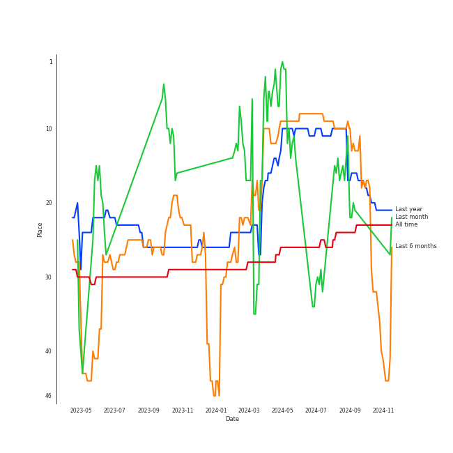
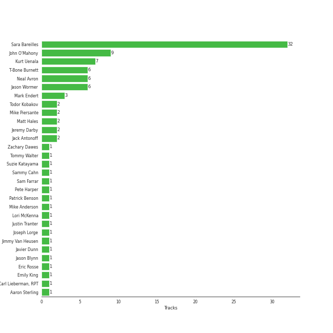

# Sara Bareilles

[See Track Features](audio_features.md)

[See Clusters](clusters/overview.md)

## Artist Rank
Sara Bareilles is currently:
- The #7 artist of the last month
- The #22 artist of the last 6 months
- The #24 artist of all time

## Top Tracks

- Machine Gun is:
    - the #26 track of the last month
- Between the Lines is:
    - the #28 track of the last month
## Featured on Playlists
| Art | Tracks | Playlist |
|:---|---:|:---|
|  | 61 | [Singer-Songwriter](../../playlists/singer-songwriter/overview.md) |
|  | 7 | [Musicals](../../playlists/musicals/overview.md) |
|  | 6 | [Karaoke](../../playlists/karaoke/overview.md) |
|  | 5 | [Summer](../../playlists/summer/overview.md) |
|  | 4 | [Pop](../../playlists/pop/overview.md) |
|  | 3 | [Chill](../../playlists/chill/overview.md) |
|  | 1 | [Jazz](../../playlists/jazz/overview.md) |
|  | 1 | [A Cappella](../../playlists/a_cappella/overview.md) |
|  | 1 | [Christmas](../../playlists/christmas/overview.md) |
|  | 1 | [Tarps](../../playlists/tarps/overview.md) |

## Top Albums

| Art | Tracks | 💚 | Album | Release Date | 🔗 |
|:---|---:|---:|:---|:---|:---|
|  | 13 | 10 | Kaleidoscope Heart | 2010-09-07 | [🔗](https://open.spotify.com/album/627ukPRwYxyBREHxBq0vGJ) |
|  | 12 | 11 | The Blessed Unrest | 2013-07-16 | [🔗](https://open.spotify.com/album/7lpbyGc4fHsQkBTsfWVBhp) |
|  | 12 | 8 | Little Voice | 2007-07-03 | [🔗](https://open.spotify.com/album/2Z9WUERfMjOgQ6ze9TcGbF) |
|  | 10 | 5 | Amidst the Chaos (Bonus Version) | 2019-05-10 | [🔗](https://open.spotify.com/album/5x2sDapUIdq0qk1ezff3gm) |
|  | 6 | 1 | What's Inside: Songs from Waitress | 2015-11-06 | [🔗](https://open.spotify.com/album/1s6codM2ZAB008t9GTyaEk) |
|  | 5 | 4 | Once Upon Another Time | 2012-05-22 | [🔗](https://open.spotify.com/album/1PrqYZJRzGNf8AsSOraxnZ) |
|  | 1 | 1 | Under the Influence (Ultimate Edition) | 2013-05-07 | [🔗](https://open.spotify.com/album/2jeIoe6RbirPCprvXQnqqn) |
|  | 1 | 1 | Music Is Better Than Words | 2011-01-01 | [🔗](https://open.spotify.com/album/6VojJdbXviFkMuemAQ2Ivo) |
|  | 1 | 0 | Sides | 2020-01-17 | [🔗](https://open.spotify.com/album/5alIr9JGPvOQwPLphm0beJ) |
|  | 1 | 0 | More Love - Songs from Little Voice Season One | 2020-09-04 | [🔗](https://open.spotify.com/album/52fzvqGSm991mT6pBgAS6g) |

See all albums

| Art | Tracks | 💚 | Album | Release Date | 🔗 |
|:---|---:|---:|:---|:---|:---|
|  | 1 | 0 | Into The Woods (2022 Broadway Cast Recording) | 2022-09-30 | [🔗](https://open.spotify.com/album/5z6BFXI711HbSAXDjgOAHE) |
|  | 1 | 0 | Holiday For Swing! | 2014-09-30 | [🔗](https://open.spotify.com/album/1oPkmzcGvZT9Q32eLLjIS4) |
|  | 1 | 0 | Brave Enough: Live at the Variety Playhouse | 2013-10-22 | [🔗](https://open.spotify.com/album/7L4ZgnQqEhCEsV9GnMeXtE) |
|  | 1 | 0 | BOCA 2004: Best Of College A Cappella | 2004-01-01 | [🔗](https://open.spotify.com/album/5qrIP0zXoDQUSZ9l1ZaECQ) |

## Top Record Labels

| Tracks | 💚 | Label |
|---:|---:|:---|
| 60 | 39 | [Epic](../../labels/epic/overview.md) |
| 1 | 1 | [Universal Music LLC](../../labels/universal_music_llc/overview.md) |
| 1 | 1 | Fuzzy Door Productions |
| 1 | 1 | [Atlantic Records](../../labels/atlantic_records/overview.md) |
| 1 | 0 | [Varsity Vocals](../../labels/varsity_vocals/overview.md) |
| 1 | 0 | Seth Macfarlane Christmas Album |
| 1 | 0 | Craft Recordings |
| 1 | 0 | ATO Records |

## Genres

- [acoustic pop](../../genres/acoustic_pop/overview.md)
- [ectofolk](../../genres/ectofolk/overview.md)
- [lilith](../../genres/lilith/overview.md)
- [neo mellow](../../genres/neo_mellow/overview.md)
- [pop rock](../../genres/pop_rock/overview.md)
- [post-teen pop](../../genres/post-teen_pop/overview.md)
- [viral pop](../../genres/viral_pop/overview.md)

## Credits

### Credits by Type

| Credit Type | Tracks |
|:---|---:|
| Instrument | 22 |
| Lyricist | 20 |
| Producer | 11 |
| Songwriter | 30 |
| Vocal | 30 |

### Production Credits

| Art | Track | Credit Types |
|:---|:---|:---|
|  | Come Round Soon | Lyricist, Songwriter |
|  | Bottle It Up | Lyricist, Songwriter |
|  | Love On the Rocks | Songwriter |
|  | Breathe Again | Lyricist, Songwriter |
|  | Kaleidoscope Heart | Lyricist, Songwriter |
|  | Machine Gun | Lyricist, Songwriter |
|  | King of Anything | Lyricist, Songwriter |
|  | Gonna Get Over You | Songwriter |
|  | Let The Rain | Lyricist, Songwriter |
|  | Bluebird | Lyricist, Songwriter |

View all

| Art | Track | Credit Types |
|:---|:---|:---|
|  | The Light | Lyricist, Songwriter |
|  | Not Alone | Lyricist, Songwriter |
|  | Uncharted | Lyricist, Songwriter |
|  | Satellite Call | Lyricist, Producer, Songwriter |
|  | Manhattan | Lyricist, Producer, Songwriter |
|  | Eden | Producer, Songwriter |
|  | Hercules | Lyricist, Producer, Songwriter |
|  | Little Black Dress | Lyricist, Producer, Songwriter |
|  | Cassiopeia | Lyricist, Producer, Songwriter |
|  | 1000 Times | Lyricist, Producer, Songwriter |
|  | Islands | Producer, Songwriter |
|  | Brave | Songwriter |
|  | Chasing The Sun | Songwriter |
|  | I Choose You | Songwriter |
|  | She Used To Be Mine | Lyricist, Songwriter |
|  | Fire | Lyricist, Producer, Songwriter |
|  | If I Can't Have You | Songwriter |
|  | Armor | Lyricist, Producer, Songwriter |
|  | Miss Simone | Songwriter |
|  | No Such Thing | Producer, Songwriter |

## Top Producers

| Art | Producer | Tracks | Credit Types |
|:---|:---|---:|:---|
|  | [Sara Bareilles](overview.md) | 30 | Lyricist, Songwriter, Producer |
| | John O'Mahony | 8 | Producer |
| | Kurt Uenala | 6 | Producer |
| | Neal Avron | 6 | Arranger, Producer |
| | T-Bone Burnett | 5 | Producer |
| | Jason Wormer | 5 | Producer |
| | Mark Endert | 3 | Producer |
| | Matt Hales | 2 | Songwriter |
| | Jeremy Darby | 2 | Producer |
| | Jack Antonoff | 2 | Songwriter |

View all

| Art | Producer | Tracks | Credit Types |
|:---|:---|---:|:---|
| | Todor Kobakov | 2 | Arranger |
| | Mike Piersante | 2 | Producer |
| | Pete Harper | 1 | Songwriter |
| | Tommy Walter | 1 | Producer |
| | Javier Dunn | 1 | Songwriter |
| | Jason Blynn | 1 | Songwriter |
| | Patrick Benson | 1 | Producer |
| | Aaron Sterling | 1 | Songwriter |
| | Zachary Dawes | 1 | Producer |
| | Suzie Katayama | 1 | Arranger |
|  | Emily King | 1 | Songwriter |
| | Jimmy Van Heusen | 1 | Songwriter |
| | Lori McKenna | 1 | Songwriter |
| | Carl Lieberman, RPT | 1 | Producer |
| | Sammy Cahn | 1 | Lyricist |
| | Joseph Lorge | 1 | Producer |
| | Justin Tranter | 1 | Songwriter |
| | Mike Anderson | 1 | Songwriter |
| | Eric Rosse | 1 | Producer |
| | Sam Farrar | 1 | Songwriter |

## Tracks

| Art | Track | Album | Artists | Label | 💚 | 🔗 |
|:---|:---|:---|:---|:---|:---|:---|
|  | Gravity | BOCA 2004: Best Of College A Cappella | Awaken A Cappella, [Sara Bareilles](overview.md), Don Gooding, Bill Hare, Gabe Hendifar, Deke Sharon | [Varsity Vocals](../../labels/varsity_vocals) | | [🔗](https://open.spotify.com/track/0W94b6tM78Miftv7W5tOX2) |
|  | Teach You - Acoustic | Sides | Emily King, [Sara Bareilles](overview.md) | ATO Records | | [🔗](https://open.spotify.com/track/6Esc0Q4YRbnlJHb3dy6MdS) |
|  | Between the Lines | Little Voice | [Sara Bareilles](overview.md) | [Epic](../../labels/epic) | 💚 | [🔗](https://open.spotify.com/track/2t3b5MZMzsArvQflOUo804) |
|  | Bottle It Up | Little Voice | [Sara Bareilles](overview.md) | [Epic](../../labels/epic) | 💚 | [🔗](https://open.spotify.com/track/3kfHdr2sYF2EeWEmBHquVj) |
|  | City | Little Voice | [Sara Bareilles](overview.md) | [Epic](../../labels/epic) | | [🔗](https://open.spotify.com/track/7HZOCMa0XEXNFklxUG5kKb) |
|  | Come Round Soon | Little Voice | [Sara Bareilles](overview.md) | [Epic](../../labels/epic) | 💚 | [🔗](https://open.spotify.com/track/0jkVXytWSisMUtrBEej9mi) |
|  | Fairytale | Little Voice | [Sara Bareilles](overview.md) | [Epic](../../labels/epic) | 💚 | [🔗](https://open.spotify.com/track/1q8eyTNRSGEAqSvTATTgIG) |
|  | Gravity | Little Voice | [Sara Bareilles](overview.md) | [Epic](../../labels/epic) | 💚 | [🔗](https://open.spotify.com/track/4oa14QBfWRDfJy2agySy0L) |
|  | Love On the Rocks | Little Voice | [Sara Bareilles](overview.md) | [Epic](../../labels/epic) | 💚 | [🔗](https://open.spotify.com/track/45bHK5dR8PeWcuMJqmpsP1) |
|  | Love Song | Little Voice | [Sara Bareilles](overview.md) | [Epic](../../labels/epic) | 💚 | [🔗](https://open.spotify.com/track/4E6cwWJWZw2zWf7VFbH7wf) |

See all tracks

| Art | Track | Album | Artists | Label | 💚 | 🔗 |
|:---|:---|:---|:---|:---|:---|:---|
|  | Many the Miles | Little Voice | [Sara Bareilles](overview.md) | [Epic](../../labels/epic) | 💚 | [🔗](https://open.spotify.com/track/03kCR9HZpX5muU7D8xYPOL) |
|  | Morningside | Little Voice | [Sara Bareilles](overview.md) | [Epic](../../labels/epic) | | [🔗](https://open.spotify.com/track/3cqJzS1U23zElTJyXcacm6) |
|  | One Sweet Love | Little Voice | [Sara Bareilles](overview.md) | [Epic](../../labels/epic) | | [🔗](https://open.spotify.com/track/2TXZTIEk67pURmzvQVu84I) |
|  | Vegas | Little Voice | [Sara Bareilles](overview.md) | [Epic](../../labels/epic) | | [🔗](https://open.spotify.com/track/1NcGrbn2dbx6VQOPQeKhjl) |
|  | Basket Case | Kaleidoscope Heart | [Sara Bareilles](overview.md) | [Epic](../../labels/epic) | | [🔗](https://open.spotify.com/track/7AXUdQmZMA5u221iv6gB0m) |
|  | Bluebird | Kaleidoscope Heart | [Sara Bareilles](overview.md) | [Epic](../../labels/epic) | 💚 | [🔗](https://open.spotify.com/track/4LIFyLAf6BCfgLi5Xq62mh) |
|  | Breathe Again | Kaleidoscope Heart | [Sara Bareilles](overview.md) | [Epic](../../labels/epic) | 💚 | [🔗](https://open.spotify.com/track/0UgmLwOrTeOCUNwV07a5AD) |
|  | Gonna Get Over You | Kaleidoscope Heart | [Sara Bareilles](overview.md) | [Epic](../../labels/epic) | 💚 | [🔗](https://open.spotify.com/track/45ou2UBThJA4WtFGIiYLI3) |
|  | Hold My Heart | Kaleidoscope Heart | [Sara Bareilles](overview.md) | [Epic](../../labels/epic) | | [🔗](https://open.spotify.com/track/46QrTPAuu0iJHnECJKIWWH) |
|  | Kaleidoscope Heart | Kaleidoscope Heart | [Sara Bareilles](overview.md) | [Epic](../../labels/epic) | 💚 | [🔗](https://open.spotify.com/track/0uwm2EOditziKCWSRRLN0A) |
|  | King of Anything | Kaleidoscope Heart | [Sara Bareilles](overview.md) | [Epic](../../labels/epic) | 💚 | [🔗](https://open.spotify.com/track/3VA8T3rNy5V24AXxNK5u9E) |
|  | Let The Rain | Kaleidoscope Heart | [Sara Bareilles](overview.md) | [Epic](../../labels/epic) | 💚 | [🔗](https://open.spotify.com/track/4J6hxKlPDsfIonA9pILsLJ) |
|  | Machine Gun | Kaleidoscope Heart | [Sara Bareilles](overview.md) | [Epic](../../labels/epic) | 💚 | [🔗](https://open.spotify.com/track/2ZfnsQ81jNuY4MHAshnxyp) |
|  | Not Alone | Kaleidoscope Heart | [Sara Bareilles](overview.md) | [Epic](../../labels/epic) | 💚 | [🔗](https://open.spotify.com/track/5ksNgN3RWCBbq2sUB1KoNv) |
|  | Say You're Sorry | Kaleidoscope Heart | [Sara Bareilles](overview.md) | [Epic](../../labels/epic) | | [🔗](https://open.spotify.com/track/011Dg8Hkelamb0hAuaijWd) |
|  | The Light | Kaleidoscope Heart | [Sara Bareilles](overview.md) | [Epic](../../labels/epic) | 💚 | [🔗](https://open.spotify.com/track/54byd42gABS9onpYHipyoP) |
|  | Uncharted | Kaleidoscope Heart | [Sara Bareilles](overview.md) | [Epic](../../labels/epic) | 💚 | [🔗](https://open.spotify.com/track/7hEbLvHSHpmMZXuuw2nmmH) |
|  | Bright Lights and Cityscapes | Once Upon Another Time | [Sara Bareilles](overview.md) | [Epic](../../labels/epic) | | [🔗](https://open.spotify.com/track/7CEWZ0h4rez5BqMQwx4QXf) |
|  | Lie To Me | Once Upon Another Time | [Sara Bareilles](overview.md) | [Epic](../../labels/epic) | 💚 | [🔗](https://open.spotify.com/track/15zarGPJkaG3btC3Co7Luo) |
|  | Once Upon Another Time | Once Upon Another Time | [Sara Bareilles](overview.md) | [Epic](../../labels/epic) | 💚 | [🔗](https://open.spotify.com/track/7KG9zriC6iP8F1CNihtR8Y) |
|  | Stay | Once Upon Another Time | [Sara Bareilles](overview.md) | [Epic](../../labels/epic) | 💚 | [🔗](https://open.spotify.com/track/24xqELXbmKDFLKkR3271jb) |
|  | Sweet As Whole | Once Upon Another Time | [Sara Bareilles](overview.md) | [Epic](../../labels/epic) | 💚 | [🔗](https://open.spotify.com/track/04BcODyhCDTV7SBFeJHOXe) |
|  | 1000 Times | The Blessed Unrest | [Sara Bareilles](overview.md) | [Epic](../../labels/epic) | 💚 | [🔗](https://open.spotify.com/track/5sulMp8BnWKlR9PqEH5G9M) |
|  | Brave | The Blessed Unrest | [Sara Bareilles](overview.md) | [Epic](../../labels/epic) | 💚 | [🔗](https://open.spotify.com/track/6Uy6K3KdmUdAfelUp0SeXn) |
|  | Cassiopeia | The Blessed Unrest | [Sara Bareilles](overview.md) | [Epic](../../labels/epic) | 💚 | [🔗](https://open.spotify.com/track/4XGet6CWBb9QoZSHGGT0NM) |
|  | Chasing The Sun | The Blessed Unrest | [Sara Bareilles](overview.md) | [Epic](../../labels/epic) | 💚 | [🔗](https://open.spotify.com/track/6lzlRAp5VqLLF78PwnfHjq) |
|  | December | The Blessed Unrest | [Sara Bareilles](overview.md) | [Epic](../../labels/epic) | | [🔗](https://open.spotify.com/track/5I6exXg95LKzq9Eb0hCFXM) |
|  | Eden | The Blessed Unrest | [Sara Bareilles](overview.md) | [Epic](../../labels/epic) | 💚 | [🔗](https://open.spotify.com/track/0oihjTriCn7793AJwKBTrJ) |
|  | Hercules | The Blessed Unrest | [Sara Bareilles](overview.md) | [Epic](../../labels/epic) | 💚 | [🔗](https://open.spotify.com/track/1Ng4tk8lYfiwXbw4t8gdA2) |
|  | I Choose You | The Blessed Unrest | [Sara Bareilles](overview.md) | [Epic](../../labels/epic) | 💚 | [🔗](https://open.spotify.com/track/7jJH8F3PHlNvxfqEAAfFDl) |
|  | Islands | The Blessed Unrest | [Sara Bareilles](overview.md) | [Epic](../../labels/epic) | 💚 | [🔗](https://open.spotify.com/track/661ZfXbuoFYd3NkgnqaQ3v) |
|  | Little Black Dress | The Blessed Unrest | [Sara Bareilles](overview.md) | [Epic](../../labels/epic) | 💚 | [🔗](https://open.spotify.com/track/3MOUUE92JOO8UdVTszYaJ0) |
|  | Manhattan | The Blessed Unrest | [Sara Bareilles](overview.md) | [Epic](../../labels/epic) | 💚 | [🔗](https://open.spotify.com/track/0aSgzAUObtmSSwh1yO6shv) |
|  | Satellite Call | The Blessed Unrest | [Sara Bareilles](overview.md) | [Epic](../../labels/epic) | 💚 | [🔗](https://open.spotify.com/track/0Jab895fPkyyQdNkMl6nYi) |
|  | Goodbye Yellow Brick Road - Live at the Variety Playhouse, Atlanta, GA - May 2013 | Brave Enough: Live at the Variety Playhouse | [Sara Bareilles](overview.md) | [Epic](../../labels/epic) | | [🔗](https://open.spotify.com/track/5Qt6ireK9HgLNTQHQswq6H) |
|  | Bad Idea (feat. Jason Mraz) | What's Inside: Songs from Waitress | [Sara Bareilles](overview.md), Jason Mraz | [Epic](../../labels/epic) | | [🔗](https://open.spotify.com/track/1xi7L6YU6TRzXgh2rogz1h) |
|  | Everything Changes | What's Inside: Songs from Waitress | [Sara Bareilles](overview.md) | [Epic](../../labels/epic) | | [🔗](https://open.spotify.com/track/11R6SmSuzXE8ftk1vlPEKP) |
|  | I Didn't Plan It | What's Inside: Songs from Waitress | [Sara Bareilles](overview.md) | [Epic](../../labels/epic) | | [🔗](https://open.spotify.com/track/5EPytk5jah5T1EqOmu1QfP) |
|  | Opening Up | What's Inside: Songs from Waitress | [Sara Bareilles](overview.md) | [Epic](../../labels/epic) | | [🔗](https://open.spotify.com/track/24VwpFC93affqIkztFIIic) |
|  | She Used To Be Mine | What's Inside: Songs from Waitress | [Sara Bareilles](overview.md) | [Epic](../../labels/epic) | 💚 | [🔗](https://open.spotify.com/track/2D4BSm5Z8Hq5zYbSgJwEOh) |
|  | What's Inside | What's Inside: Songs from Waitress | [Sara Bareilles](overview.md) | [Epic](../../labels/epic) | | [🔗](https://open.spotify.com/track/2t0P8YsXXHVLs7e95rwZbt) |
|  | Armor | Amidst the Chaos (Bonus Version) | [Sara Bareilles](overview.md) | [Epic](../../labels/epic) | 💚 | [🔗](https://open.spotify.com/track/4kO1W2nNKj6C9h5vm31sdX) |
|  | Eyes on You | Amidst the Chaos (Bonus Version) | [Sara Bareilles](overview.md) | [Epic](../../labels/epic) | | [🔗](https://open.spotify.com/track/0sVwoHE5wRp9x6vZtCAXlq) |
|  | Fire | Amidst the Chaos (Bonus Version) | [Sara Bareilles](overview.md) | [Epic](../../labels/epic) | 💚 | [🔗](https://open.spotify.com/track/3Zx5ylimOCecAT0yai8sPK) |
|  | If I Can't Have You | Amidst the Chaos (Bonus Version) | [Sara Bareilles](overview.md) | [Epic](../../labels/epic) | 💚 | [🔗](https://open.spotify.com/track/3n5MOB82LKPL14eBEmodTd) |
|  | Miss Simone | Amidst the Chaos (Bonus Version) | [Sara Bareilles](overview.md) | [Epic](../../labels/epic) | 💚 | [🔗](https://open.spotify.com/track/5NePPsk8jsSgEc4GDbzuxX) |
|  | No Such Thing | Amidst the Chaos (Bonus Version) | [Sara Bareilles](overview.md) | [Epic](../../labels/epic) | 💚 | [🔗](https://open.spotify.com/track/6UpCNcYmYBrkqbNQAR9U3H) |
|  | Orpheus | Amidst the Chaos (Bonus Version) | [Sara Bareilles](overview.md) | [Epic](../../labels/epic) | | [🔗](https://open.spotify.com/track/3sC62j1Cjeea5tAhcyGcs8) |
|  | Poetry by Dead Men | Amidst the Chaos (Bonus Version) | [Sara Bareilles](overview.md) | [Epic](../../labels/epic) | | [🔗](https://open.spotify.com/track/1rY7zvbYYWaj1OVa3YlwLv) |
|  | Someone Who Loves Me | Amidst the Chaos (Bonus Version) | [Sara Bareilles](overview.md) | [Epic](../../labels/epic) | | [🔗](https://open.spotify.com/track/5d9bKlSjNIf9hTnRDXeN0F) |
|  | Wicked Love | Amidst the Chaos (Bonus Version) | [Sara Bareilles](overview.md) | [Epic](../../labels/epic) | | [🔗](https://open.spotify.com/track/6ZLTqJo17uCkBKjokcwbds) |
|  | Little Voice | More Love - Songs from Little Voice Season One | [Sara Bareilles](overview.md) | [Epic](../../labels/epic) | | [🔗](https://open.spotify.com/track/6bbmyaEU6k26teJfCsIKNb) |
|  | Maybe They're Magic | Into The Woods (2022 Broadway Cast Recording) | [Sara Bareilles](overview.md), Brian D'Arcy James | Craft Recordings | | [🔗](https://open.spotify.com/track/6Aj19aOQntdfSpHDl9DxOw) |
|  | Love Won't Let You Get Away | Music Is Better Than Words | Seth MacFarlane, [Sara Bareilles](overview.md) | [Fuzzy Door Productions/Universal](../../labels/universal_music_llc) | 💚 | [🔗](https://open.spotify.com/track/5xNdKpcKqES50j78ac9woY) |
|  | Baby, It's Cold Outside | Holiday For Swing! | Seth MacFarlane, [Sara Bareilles](overview.md) | Seth Macfarlane Christmas Album | | [🔗](https://open.spotify.com/track/5BYz6McvNTXD60vRFLkIMw) |
|  | I Want You Back (feat. Sara Bareilles) | Under the Influence (Ultimate Edition) | Straight No Chaser, [Sara Bareilles](overview.md) | [Atlantic Records](../../labels/atlantic_records) | 💚 | [🔗](https://open.spotify.com/track/5teF3el9gP5j2cf7Dvkbm0) |

